# Gravity that streams

*One proposed law for spinning galaxies, bending light, galaxy clusters and colliding clusters: a few stated
assumptions, worked out step by step and tested on public data, with no dark matter and no expanding universe.*

24 September 2026. This is a fresh write-up of where the project stands. The full working notebook, with every
step, revision and correction along the way, is archived in
[research_work/blog-archive/BLOG-notebook-rev26.md](research_work/blog-archive/BLOG-notebook-rev26.md), and the
technical record is in [research_work/results/hot-companion/README.md](research_work/results/hot-companion/README.md).
Every number below is computed from public data by a script in this repository (§10).

**Contents**
1. [The puzzle](#1-the-puzzle)
2. [How we work](#2-how-we-work)
3. [The idea, step by step](#3-the-idea-step-by-step)
4. [How the physics works inside matter](#4-how-the-physics-works-inside-matter)
5. [The data](#5-the-data)
6. [Why stars and light lens the way we see](#6-why-stars-and-light-lens-the-way-we-see)
7. [How it compares](#7-how-it-compares)
8. [Predictions anyone can check](#8-predictions-anyone-can-check)
9. [What is still open, and why we are optimistic](#9-what-is-still-open-and-why-we-are-optimistic)
10. [Reproduce it](#10-reproduce-it)

---

## In one minute

**The puzzle.** Galaxies and clusters of galaxies pull harder than the matter we can see should allow. Stars at a
galaxy's edge orbit too fast, light passing a galaxy bends too much, and clusters hold their hot gas with 4 to 27
times the pull their visible matter provides. When two clusters collide, the extra pull follows the galaxies, not the
gas, even though the gas outweighs the galaxies ten to fifty times. The usual answer is invisible "dark matter".

**Our answer.** Every piece of ordinary matter feeds a faint companion to its gravity, which streams outward at
169 km/s and pulls in proportion to its strength. Five plain facts about how that companion behaves explain the four
puzzles together:

1. **Orderly matter feeds it in step,** so opposite contributions cancel the way Newton's pulls do. What survives falls
   off slowly enough to keep a galaxy's outer stars orbiting fast.
2. **Matter whose parts move randomly and freely** (stars in elliptical galaxies, galaxies in clusters) **feeds it much
   harder.** That is why clusters need so much extra pull, and why ellipticals bend light more than spirals.
3. **Gas doesn't count as moving randomly,** because its particles collide far too often. So in a collision the extra
   pull stays with the galaxies and leaves the gas behind.
4. **Strong gravity holds the companion back,** so the Solar System feels nothing.
5. **The companion is slow and keeps moving the way its source moved,** so after two clusters collide, each is still
   wrapped in the companion it had before.

**The scoreboard,** with four constants shared by everything (three fitted to galaxies and clusters, one set by the
Solar System):

| Test | Our law | MOND | Dark matter |
|---|---|---|---|
| 149 galaxies' rotation speeds (typical miss) | **15.9 km/s** | 16.1 km/s | 7.5 km/s, with 298 adjustable numbers |
| 12 galaxy clusters' masses (typical miss) | **25%** | ×2.9 | 11%, with 24 adjustable numbers |
| Colliding clusters: lensing sits on the galaxies, not the gas | **yes** (Bullet Cluster, 72-collision stack, three more) | no | yes |
| Ellipticals bend light more than spirals (measured 0.15 ± 0.04 dex) | **yes: 0.13–0.16**, from their stars' random motion | no difference | yes, with tuned haloes |
| Light and matter feel the same pull (six strong lenses) | **yes** (−0.03 ± 0.02 dex), with light's response assumed as in Einstein's theory | | yes |
| Milky Way rotation from 15 to 27 kpc | **within 1–6%** | within 3% | 6–11% too fast |
| Solar System, planets, pulsars | **no measurable extra pull** (switched off where gravity is strong) | small effects | Einstein's |
| Cassini's limit on the Galaxy's distortion of the Sun's field (2026 re-analysis) | **1.5σ above**; within 1σ with a 0.19 pc release length | common form about 20× too big | Einstein's |

These are typical misses and simple checks, not a full statistical comparison: each model here uses its own treatment
of the uncertain inputs every model needs (star masses, gas, distances), and "four constants" does not count those
inputs. A proper comparison, with shared inputs, their uncertainties and fair baselines, is still to be done (§9).

---

## 1. The puzzle

Four measurements have to be explained together.

1. **Rotation.** In a spiral galaxy, stars far from the centre should orbit slowly, the way Neptune orbits the Sun
   more slowly than Mercury. They don't: the speeds stay flat. Across 149 well-measured galaxies (the SPARC catalogue,
   3,150 measured speeds), Newton's law applied to the visible stars and gas misses by 45.6 km/s on average.
2. **Light bending (lensing).** Galaxies and clusters bend the light of objects behind them more than their visible
   matter can.
3. **Clusters.** In 12 well-measured galaxy clusters (the X-COP sample), the pull needed to hold the hot gas in place is
   up to 27 times what the visible matter supplies near the centre, and 4 times at the edge.
4. **Collisions.** In the Bullet Cluster, two clusters passed through each other about 150 million years ago. Their
   galaxies sailed through; their gas, which outweighs the galaxies ten to fifty times, collided and was left behind in
   the middle. The lensing, which traces the pull, sits on the galaxies. A stack of 72 such collisions says the same.

The three standard responses each fail somewhere:
* **Dark matter** adds invisible mass, tuned object by object until the sums work. It fits well, but needs about two
  adjustable numbers per galaxy or cluster, and the particle has never been found.
* **MOND** changes the law of gravity at low accelerations. It predicts galaxy rotation well with one constant, but
  it misses cluster masses by a factor of about 3 and cannot put a collision's lensing on the galaxies.
* **Newton with visible matter only** fails everywhere outside the Solar System.

## 2. How we work

The project runs under four rules ([RULES.md](RULES.md)): no dark matter; no MOND or anything derived from it as an
input; no plain Newtonian gravity as the answer; and no expanding universe. Distances are the project's own, from a
static universe in which light loses energy slowly as it travels (its rate is fitted to 1,365 supernovae).

Every candidate formula goes through an automatic check,
[research_work/tools/formula_guard.py](research_work/tools/formula_guard.py), that asks whether it is secretly MOND
(a function of the Newtonian pull alone), secretly Newton (a constant boost) or secretly dark matter (extra, adjustable,
invisible mass).

The order of work is always the same: first principles, then a small model that can be solved exactly, then real
data. A regression suite reruns every test the law has faced (77 graded checks) in one command, so any change shows at
once what it fixes and what it breaks. It is an engineering tool: a "pass" means within two standard deviations of one
measurement, the checks are not all independent, and the tally is not a measure of how likely the law is to be right.

## 3. The idea, step by step

### 3.1 Matter feeds a companion to its gravity

Suppose every kilogram of ordinary matter steadily feeds a tiny amount of energy, ℓ watts per kilogram, into a
companion to its gravity, and that this energy streams outward at a speed u. That is the one new ingredient. The value
that fits the data is ℓ = 5.3 × 10⁻⁶ watts per kilogram: over 13 billion years a kilogram gives off two and a half
thousandths of one percent of its rest energy this way. For the Sun it is 2.8% of its light, a mass loss of
2 parts in 10¹⁵ a year, too little to notice.

### 3.2 Orderly matter adds up the way Newton does

Energy flowing away from a source spreads over ever-larger spheres, so its flux falls as 1/distance², the same
geometry as Newton's pull. Add up the flows from many sources that feed in step, arrow by arrow, and the total points
exactly along Newton's pull g_N of all the visible matter (this is Gauss's geometry; our script checks it to 2 parts in
10¹⁵). Opposite contributions cancel. We also derived this from energy conservation, and a small working model shows
that a companion guided along gravity's field lines keeps every watt and forms no whirlpools.

### 3.3 The companion pulls with its strength

Give the companion an energy density A²/8πG, the familiar form of the energy stored in a gravitational field, and let
its pull equal its strength A. Energy balance through a sphere around a mass M says that what streams out equals what
is fed in:

```
4πr² · u · A²/8πG = ℓ M    ⟹    A = √(G M a) / r = √(a · g_N),    a = 2ℓ/u
```

This pull falls as 1/r, not 1/r². A star orbiting at distance r then has v² = r·A = √(G M a), **the same at every
radius: a flat rotation curve.** It also gives the observed rule v⁴ = G M a, linking a galaxy's visible mass to its
rotation speed. The constant a = 6.30 × 10⁻¹¹ m/s² is not new: it is twice the power per kilogram divided by the
companion's speed. §4 shows where "the pull equals the strength" comes from inside matter.

### 3.4 Strong gravity holds the companion back

Near the Sun the pull is billions of times stronger than in a galaxy's outskirts, and planetary orbits show no
companion at all. So the companion must be held back where ordinary gravity is strong and released where it is weak:

```
released share = exp( −|g_N| / g_d ),    g_d = 2.03 × 10⁻¹⁰ m/s²
```

At the Earth the pull is 28 million times g_d, so the released share is exactly zero. In a galaxy's centre about 1% is
released; in its outskirts and in clusters, most of it. Breaking free also takes time: the companion must travel about
0.15 parsec (about 900 years at its speed) from its source before it is released, which Cassini's radio tracking of
Saturn requires.

### 3.5 Random motion makes more companion

The companion streams out of all matter at u = 169 km/s. A piece of matter sitting still therefore still feels its
companion rushing past at 169 km/s, and that relative motion is what opens its internal store: it is the ordinary
("cold") glow. A piece moving at random with speed spread σ feels the stream go by faster, on average by
u² + 3σ² instead of u², the 3 coming from the three directions it can move in. So its glow grows by the **heat
weight**

```
k = 3σ²/u²
```

and the extra adds up as a plain total S, because the random parts don't cancel as arrows do. Inside a big,
spread-out cloud, Newton's pulls from all sides largely cancel toward the centre, but S does not. In a cluster that is
exactly the extra pull needed: large near the centre, smaller toward the edge. With one speed, u:

| System | Random speed of its stars or galaxies, σ | Heat weight k |
|---|---:|---:|
| Disk of a spiral galaxy | 10–30 km/s | 0.01–0.09 (cold) |
| Elliptical galaxy | 150–250 km/s | 2.4–6.5 (warm) |
| Galaxies in a cluster | 500–1,200 km/s | 26–150 (hot) |

A spinning disk does not count as hot, because the companion moves along with the matter that made it (§3.8).

### 3.6 Collisions switch the heat off

Laboratory physics has a well-known exception to motion's effects on emission: if an emitter changes direction many
times before its internal response can follow, the effect averages away (Dicke narrowing, 1953; its cousin, the
Mössbauer effect, is why atoms locked in a crystal emit perfectly sharp lines). Gas particles collide constantly, and in
clusters they also spiral around magnetic fields. Stars never collide; galaxies pass through each other. So:

| | Moves freely? | Companion |
|---|---|---|
| Stars in an elliptical galaxy; galaxies in a cluster | yes | **hot**: extra glow |
| Gas and plasma, including the Sun's interior | no, constant collisions | **cold**: no extra glow |

Gas still counts in full as ordinary mass.

### 3.7 The companion pulls along its net flow

The extra pull points along the net flow of companion energy: Newton's direction plus the flow from the hot matter,

```
direction = (g_N + g_hot) / (|g_N| + |g_hot|),    g_hot = the Newtonian pull of the free-moving matter, weighted by k
```

In a round, settled galaxy or cluster both point to the centre and nothing changes. In a collision the cold gas
dominates Newton's pull but the hot galaxies dominate the companion's flow, so the pull, and the lensing, bend toward
the galaxies.

### 3.8 The companion carries momentum, is slow, and remembers

A streaming field carries momentum, as light does: a lamp does not recoil when its light later pushes on something far
away. So gas and galaxies feel the same pull, as observed, and the stream takes up any recoil.

At 169 km/s the companion takes about 580 million years to cross 100 kpc, so most of the companion around a galaxy
today was given off long ago. And it keeps moving the way its source moved, like a ball thrown from a moving train.
It has to: galaxies move through space at hundreds of km/s, and a galaxy's gravity cannot depend on how fast it
happens to be moving. For settled systems this changes nothing. After a collision it matters a lot: the galaxies sail
through and keep their motion, so the old companion travels on with them, while around the stopped gas a fresh
companion has had time to grow only about 30 kpc.

### 3.9 The whole law

```
g_N   = Newton's pull of all ordinary matter (stars, gas, everything)
S     = G ∫ k ρ_free / d²                    the plain total from the free-moving matter
g_hot = G ∫ k ρ_free (x′ − x) / |x′ − x|³    its heat-weighted flow
k     = 3σ²/u²  for stars and galaxies,   0 for gas and plasma

extra pull = exp(−|g_N|/g_d) · √( a (|g_N| + S) )   along   (g_N + g_hot) / (|g_N| + |g_hot|)
h = g_N + extra pull;    ∇²Φ = −∇·h;    the pull on matter and on light is  g = −∇Φ
```

For round, settled systems it is simply **g = g_N + exp(−|g_N|/g_d) · √(a (|g_N| + S))**. The field equation in the
last line turns the rule into one landscape Φ that everything rolls on, light included (§6).

| Constant | Value | Measured on |
|---|---|---|
| a = 2ℓ/u | 6.30 × 10⁻¹¹ m/s² | 149 galaxies |
| g_d, the release level | 2.03 × 10⁻¹⁰ m/s² | 149 galaxies |
| u, the companion's speed | 169 km/s | 12 clusters |
| L, the release length | 0.15 pc | Cassini, in the Solar System |

None is set object by object. Each piece of the law is a switch set by something measurable about the matter itself:

| Switch | Set by | Separates |
|---|---|---|
| Release factor | how strong the pull is | the Solar System from galaxies |
| Heat weight | how randomly the matter moves | disks, ellipticals and clusters |
| Collision rule | whether its particles collide | gas from stars |
| Direction | which way the companion's energy flows | round systems from collisions |
| Memory | how recently the matter changed its motion | settled systems from collisions |

**MOND comes out as a special case.** Switch the heat off (cold disk galaxies) and the law becomes
g = g_N · ν(g_N/a) with ν(y) = 1 + e^(−y/3.22)/√y, a MOND-type formula. But here MOND's constant is 2ℓ/u rather than
a new constant of nature, its switch between Newton and the flat regime comes from the release factor, and the law says
why disks obey it (they are cold) and why clusters and collisions don't (their galaxies are hot, their gas is not).
Everything we claim as ours lies where the law is not MOND.

### 3.10 What is assumed, what is derived, and what is still open

The law rests on a few assumptions. Some consequences follow from them exactly, some have been derived in small
working models (§4), and some pieces are still assumptions. Keeping them apart:

| Piece of the law | Status |
|---|---|
| Matter feeds a companion at ℓ watts per kilogram, which streams outward at u | **assumed** (ℓ and u fitted to galaxies and clusters) |
| Its energy density is A²/8πG and it pulls with its strength A | **assumed**; §4.1 shows a kind of matter (inverted, self-sustained) that a wave pulls in proportion to its height |
| Flat rotation curves, v⁴ = G M a, and contributions adding up along Newton's direction | **derived** from the two lines above (energy balance and Gauss's geometry) |
| Strong gravity holds the companion back, exp(−\|g_N\|/g_d), released over L = 0.15 pc | **assumed** (g_d fitted to galaxies, L set by Cassini); not yet derived |
| The heat weight k = 3σ²/u², with the same u | **derived** in a working model (§4.2), given a quiet store inside matter that the flowing companion opens; the store itself is assumed |
| Collisions switch the heat off | **derived** in the same working model; the physics is borrowed (Dicke narrowing) |
| The pull points along the companion's net flow; the companion remembers its source's motion | **assumed** (motivated, not derived) |
| The field equation ∇²Φ = −∇·h | **borrowed** form (Milgrom's QUMOND) |
| Light responds to Φ as in Einstein's theory | **assumed**; to be derived in a relativistic version |
| Warm matter pulls harder, by the square root of its extra glow | **shown in a full simulation** with the companion's wave made one-way by hand; with a derived, push-free medium (a stream that absorbs counter-moving waves), 73–84% of it (§4.4) |
| What a piece's inertia is, and why all matter falls alike | **open**: the working models do not yet say |
| MOND as the cold limit | **derived** from the law |

So "from first principles" means here: a few stated assumptions, followed exactly wherever we can, and tested at each
step. Several links are still assumptions, and the working models that support others are simplified.

## 4. How the physics works inside matter

Section 3 is the law. This section is about the machinery underneath it: what kind of matter, and what kind of wave,
make a companion that pulls with its strength, glows more when it moves, and holds its beat. Here we work with small
models solved exactly, with every watt of energy accounted for, and we say plainly what is derived and what is still
assumed.

### 4.1 Matter that holds energy ready to give is pulled by a passing wave

Picture each piece of matter as holding a quiet internal oscillation, like the atoms of a laser that hold energy ready
to give. Such a piece is "inverted": it sustains itself, and when a companion wave passes, it falls into step with it
by itself. The question is how.

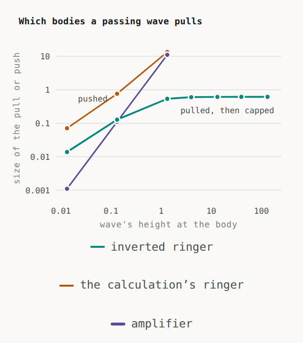

*One body in a steady wave, from its own equations. An ordinary self-sustained oscillator falls a quarter beat behind
the wave, takes energy from it, and is pushed. An inverted one falls a quarter beat ahead, feeds energy into the wave,
and is pulled, in proportion to the wave's height. Script `code/receivers_v15.py`.*

* **The sign comes from the body's own oscillation.** An inverted self-sustained body locks a quarter beat ahead of a
  passing wave by itself, feeds energy into it, and is pulled toward its source. The pull equals the power it feeds
  divided by the wave's speed, to four decimal places.
* **It is pulled in proportion to the wave's height, not its energy**: ten times the height gives 9.3 times the pull
  in weak waves. The height of the companion is the square root of its power, so this is where the law's square root
  comes from.
* A body that only amplifies, below its own threshold, is pulled in proportion to the wave's energy instead, which
  falls as 1/r² like Newton's pull. The law's flat rotation curves need self-sustained, inverted matter.

### 4.2 Where the heat comes from: the companion streaming past

Each piece of matter holds a quiet store that the companion flowing past opens a little, and random motion opens more.

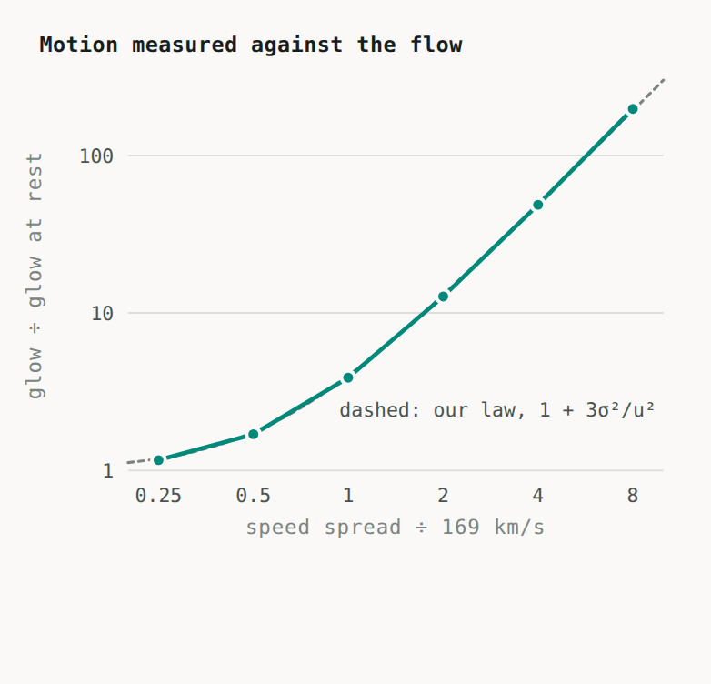

*Pieces whose quiet store opens to their speed relative to the companion streaming past. The glow relative to rest lies
on the law's 1 + 3σ²/u² (dashed): 1.70, 3.88, 12.7, 48.6 and 198 at σ/u = 0.5, 1, 2, 4, 8, against 1.75, 4, 13, 49
and 193. Script `code/stream_store_v16.py`.*

* The heat weight comes out exactly, factor 3 and all, with the **same** 169 km/s that sets how fast the companion
  travels. Our law has always used one speed for both jobs; here that is automatic.
* **Collisions hold it back** as the law needs: at collision rates of 1, 3, 10 and 30 (in units of the store's
  response rate) the extra glow is 5.90, 2.96, 1.07 and 0.38, against 6, 3, 1.09 and 0.39 expected.
* A new prediction falls out: matter falling inward, against the outflow, glows more.

### 4.3 One kind of matter, every piece both sender and receiver

The real test is to build sources and receivers out of the same matter, let every piece talk to every other through
the complete wave (near field and far field), and account for every watt. A ball of 48 pieces is the source; more
pieces of exactly the same matter sit farther out as receivers. Nothing sets anyone's timing, and nothing converts
power into force by hand.

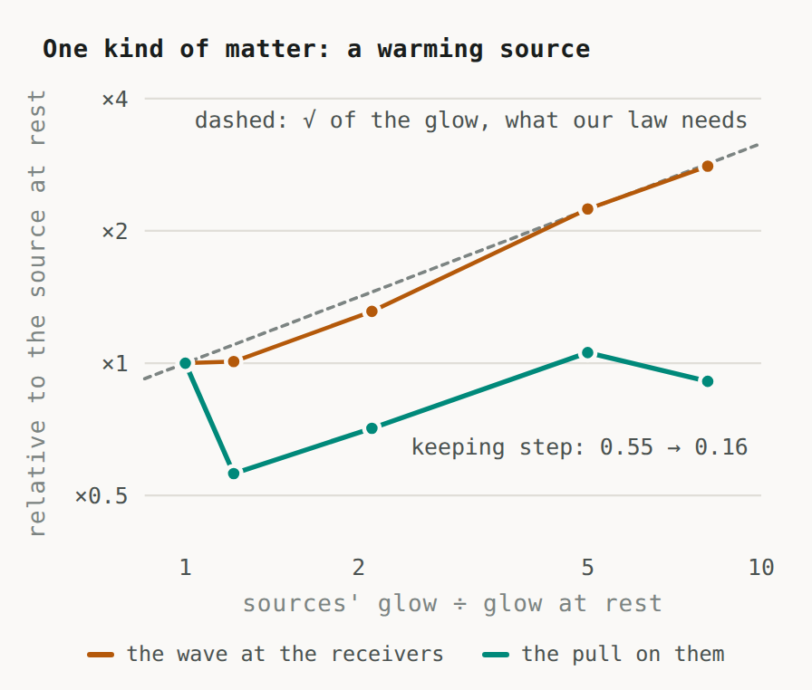

*As the source warms, the wave reaching distant receivers grows as the square root of the source's glow (dashed), as
the law needs. With the wave travelling both ways, though, the pull on the receivers does not follow (§4.4). Script
`code/one_matter_v16.py`.*

* **The books balance:** energy to about 1 part in a trillion, and momentum as far as it can be measured.
* **A cold source pulls** distant pieces of the same matter: they settle a quarter beat ahead of its wave and are
  pulled, reaching 0.92 on a scale where 1 is perfect step.
* **A warming source glows more, but by less than the heat rule's 1 + k:** ×1.2, 2.1, 5.0 and 8.1 of its cold glow at
  heat weights 0.5, 2, 8 and 16, where 1 + k gives 1.5, 3, 9 and 17. Two things hold it back. Each piece's extra glow
  draws on its own supply: pieces far apart reach only 76–87% of 1 + k (×2.6, 7.0 and 11.8 at k = 2, 8 and 16), as
  their inner reserve falls by up to a quarter. And in a dense source, whose pieces sit closer than a wavelength, the
  shared wave holds back part of the rest (45–60% of 1 + k). In the law this would read as a larger effective u for
  densely packed matter; whether that is the same for all real systems is an open question (§9). The wave reaching
  distant matter grows as the square root of whatever glow there is (×1.01, 1.31, 2.24, 2.81): the square root the law
  needs is physically there in the wave.
* **An exact rule about matter:** a piece's own loud inner vibrations, stirred by the same wave, kick back and take a
  share 2f of its pull, where f is the share of their energy they send into the companion. So matter's loud vibrations
  must mostly ring inside and only whisper into the companion.

### 4.4 Keeping warm matter in tune

In the version of §4.3, a warm source's pieces fall out of tune with each other, distant matter can't follow its wave,
and the pull doesn't grow with the heat. We found exactly why, and a way out.

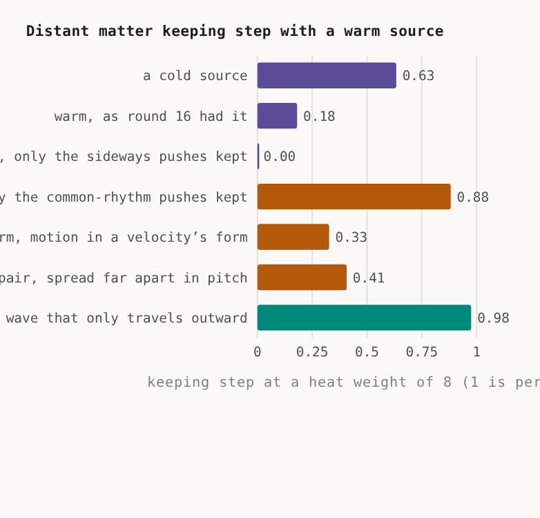

*Distant matter keeping step with a source at a heat weight of 8. Script `code/rhythm_protect_v17.py`,
`code/one_way_v17.py`.*

* **What does the damage.** Warm pieces push on each other's beats in two ways: one that always lets a group settle
  into a common rhythm, and a sideways one that can keep it churning forever. Switch off only the sideways half and
  distant matter keeps step at 0.88 with a warm source, better than the 0.63 of a cold one, because the warm source's
  wave is stronger.
* **None of the twelve inner structures we tried removes it.** At equal glow the pushes came out the same size in all
  of them, within 4%. A basic rule of waves (reciprocity) suggests why, for any structure that sends and receives
  through the same channel: whatever lets a piece send its glow into the wave lets it receive its neighbours' glow just
  as strongly. What does help: motion must enter the equations the way a velocity does (it flips sign when time runs
  backwards, like the Coriolis force), which is a correction from first principles.
* **A wave that only travels outward removes the damage completely.** The companion streams outward from the matter
  that makes it. If its crests are carried outward by that stream faster than they can move against it, a piece hears
  only matter nearer the centre, and never its own echo.

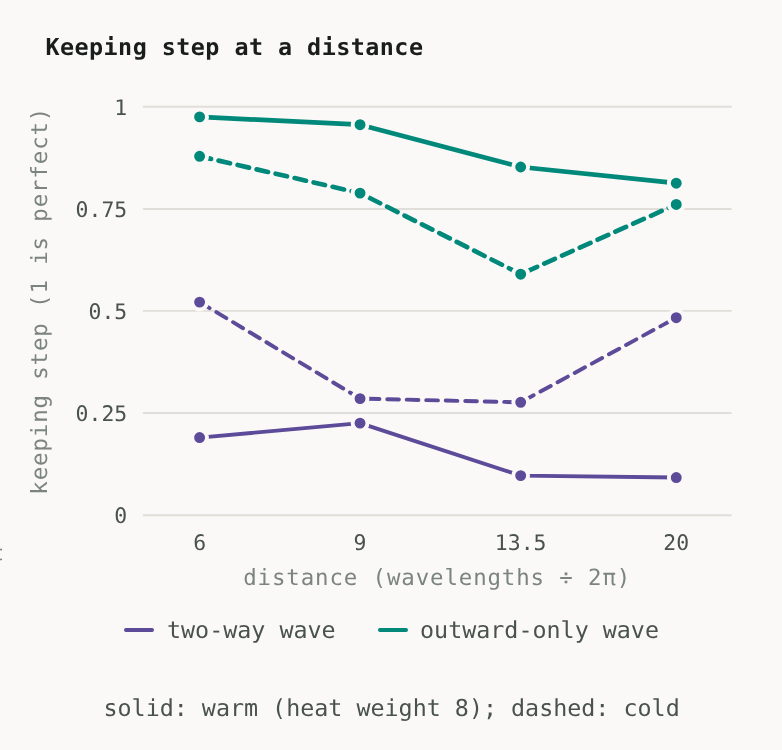

*With a two-way wave (purple) distant matter loses a warm source; with a wave that only travels outward (green) it keeps
step at every distance, better than with a cold source (dashed). Script `code/one_way_v17.py`.*

* With the outward-only wave, a warm source keeps one beat (70 times tighter than with the two-way wave) and distant
  matter keeps step at 0.98, 0.96, 0.85 and 0.81 at four distances. What matters is that the wave has no way back: any
  one-way order works, and an outflow supplies the natural one, from the centre outward.
* **In the full simulation, warm matter then pulls distant matter harder than cold matter**, as the law needs. The net
  pull on receivers of the same matter at four distances (units of 10⁻⁴; a minus sign is a push):

  | Source | r = 6 | 9 | 13.5 | 20 |
  |---|---:|---:|---:|---:|
  | Cold, outward-only wave | +1.61 | +1.14 | +0.41 | +0.53 |
  | **Warm (heat weight 8), outward-only wave** | **+2.36** | **+2.12** | **+1.75** | **+1.07** |
  | Warm but colliding, outward-only wave | +1.53 | +0.99 | +0.38 | +0.50 |
  | Warm, wave travelling both ways | −0.89 | −0.55 | −0.03 | −0.09 |
  | Cold, stream that absorbs inward waves (round 18, κ = 5) | +1.36 | +0.76 | +0.56 | +0.47 |
  | Warm, stream that absorbs inward waves (round 18, κ = 5) | +1.72 | +1.38 | +1.23 | +0.60 |

  Measured against the square root of the wave's extra strength, the warm source's extra pull comes out 1.06 on
  average, close to the 1 the law's square root requires; distance by distance it ranges from 0.6 to 1.8, because the
  cold source that serves as the reference keeps step unevenly. Colliding sources pull like cold ones, and a warm source brought
  to rest goes back to about the cold pull. With the wave travelling both ways, the same warm source pushes the nearest
  matter away instead: the outward-only wave is what turns the push into a pull.
* **The glow stays in proportion to mass, and the pull grows about as its square root, as the law needs.** In the full
  simulation the glow per piece is the same within 8% for sources of 24, 48 and 96 pieces, and four times the mass
  gives ×1.7 the pull for a cold source and ×2.1 for a warm one, where the law's √(G M a)/r gives ×2 (two arrangements
  each; a proper fit of the exponent, with its uncertainty, over a wider range is still to be done). With the rule
  imposed in these tests every piece hears every piece nearer the centre, which for a round source is Newton's rule
  that only the mass inside a radius pulls there; round 18 found that the physical one-way media hear less (below).
* **Status, and what round 18 found.** The one-way wave was imposed in these tests, by deleting every inward coupling
  by hand. Round 18 gave the wave its own local equations, first in one dimension, solved exactly and checked against a
  direct simulation of the medium (forces and powers agree within 1–4%):
  * **Waves carried by the companion's own stream are one-way whenever the stream outruns them** (the stream's speed u
    above the waves' speed c relative to it). This is now derived, not imposed, and for a stream that moves at u
    everywhere, as ours does, it holds right into the centre of a source. With both of the stream's waves included, the
    pull's energy bill fits the galaxies' limit (§4.5) when c is at least 71% of u.
  * **But a stream flowing past a body pushes on anything that emits into it,** like wind on a sail: each piece is
    pushed downstream by about its emitted power divided by the stream's speed. For the companion that push is as
    large as the law's own pull in the outskirts of galaxies, so this version fails as it stands.
  * **A version with no push:** waves that travel at their own speed through matter's frame, with the stream absorbing
    the part that moves against it. Emission is then symmetric (no push), the coupling is one-way (a wave loses a
    factor e^(−κ) for every unit of distance it travels inward), and the energy bill is the static one (crests at most
    u/2). In the full three-dimensional simulation (table above) it removes the push, colliding sources pull like cold
    ones, and a warm source pulls distant matter harder than a cold one at every distance: 73–84% of the square-root
    growth the law needs, with every watt booked (the stream absorbs 33–48% of what the pieces give the wave) and the
    medium passive, unlike the rule imposed by hand, which could in principle create energy.
  * **What it does not yet do** is keep a warm source on one beat. In it a piece hears only the inner matter on its
    own side of the source, because a wave that must cross the centre is absorbed; for strong absorption a distant
    receiver hears mainly the near half of a source. The imposed rule let every piece hear everything nearer the
    centre, which is what gave one beat and Newton's rule. So those two results belonged to the rule, not to the
    physical media found so far, and the law's counting of all matter (its |g_N| and S) now has to be reconciled
    with a medium that hears less: the review's hot-shell benchmark, in general form.

### 4.5 What being pulled costs

A body pulled by feeding a wave pays for it: the price is the force times the speed of the wave's crests. The energy it
feeds flows on outward and strengthens the companion further out. The 149 galaxies allow that as long as the crests
move at no more than about half the companion's travel speed (85 km/s). Being pulled then costs a kilogram at most
what it gives off when cold: 2 parts in 10¹⁵ of its mass a year. Light-speed crests are ruled out twice over, by the
planets and by the galaxies.

## 5. The data

### 5.1 Galaxies: 3,150 measured speeds, three constants

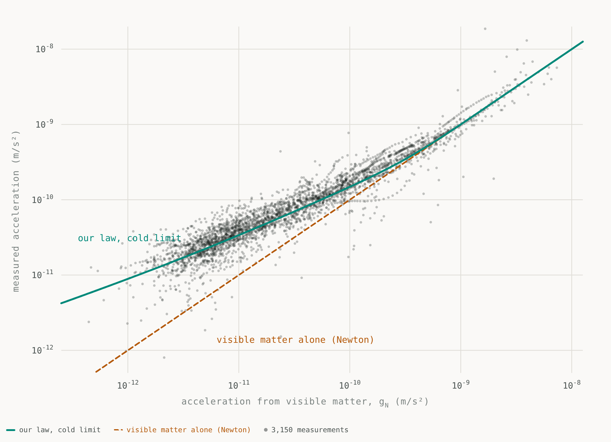

*Every point is a measured orbit in one of 149 galaxies (SPARC), turned into an acceleration and plotted against what
the visible matter alone would give. Newton would put every point on the dashed line. The green curve is our law for
cold disks; hot bulges add to it. Script `code/run_v3.py`.*

| Typical miss per galaxy (km/s) | All 149 | Held-back test galaxies | Adjustable numbers |
|---|---:|---:|---|
| **Our law** | **15.9** | **12.5** | 3 in total |
| MOND | 16.1 | 13.5 | 1 |
| Newton, visible matter only | 45.6 | 41.7 | 0 |
| A dark-matter halo fitted to each galaxy | 7.5 | | 298 |

* The measured pull tracks the visible matter's pull point by point, and a galaxy's visible mass fixes its rotation
  speed. Dark matter has to be tuned galaxy by galaxy to reproduce that tightness; here it is automatic, because the
  companion and ordinary gravity share one source, mass.
* The 25 galaxies with big, hot bulges were the risk, because hot stars count much more. They came out better than
  MOND (29.7 against 30.4 km/s).

### 5.2 Galaxy clusters: the stars sit where the pull is needed

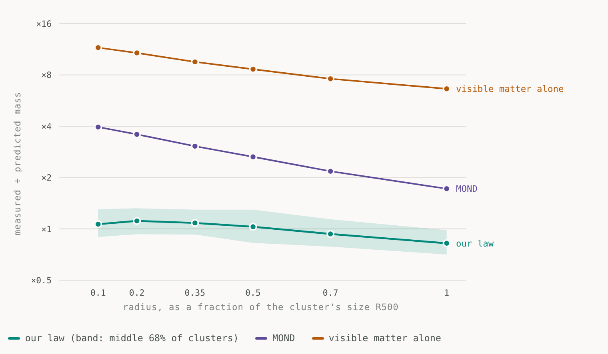

*Twelve clusters with measured gas, temperatures and stars (X-COP). At six radii, the mass needed to hold the gas over
the mass each law predicts; a perfect law sits on ×1. Chart from `code/run_v3.py`, drawn with an earlier fit of
the constants; the current fit, in the project's own distances (`code/xcop_static_v11.py`), moves our points by at most
4%.*

| | Typical miss | Adjustable numbers |
|---|---:|---|
| **Our law** | **25%** | the same 3 constants |
| Our law, clusters held out of the fit | 27% | |
| MOND | ×2.9 | 1 |
| Newton | ×9.1 | 0 |
| Dark matter (a halo fitted to each cluster) | 11% | 24 |

Why the stars can do it: they are concentrated in the middle, exactly where clusters need the most extra pull (near the
very centre there is 1.4 to 7.5 times more mass in stars than in gas), and their random speeds of 300 to 1,200 km/s
make each kilogram count dozens of times over.

### 5.3 Colliding clusters: the pull follows the galaxies

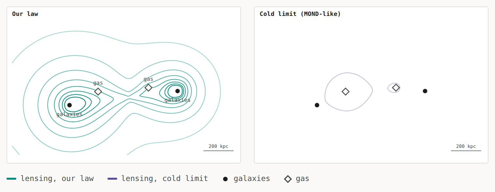

*The Bullet Cluster, solved in 3D and projected exactly as a lensing map is made. Left: our law puts both lensing peaks
on the galaxies (dots) and little on the gas (diamonds), as measured. Right: the same law with the heat switched off
(MOND-like) puts the lensing on the gas. Chart from `code/bullet_main_v5.py` and `code/bullet_v3.py`; the current
constants in the project's own distances (`code/bullet_static_v11.py`) keep the same pattern.*

* **The pattern usually called impossible without dark matter is reproduced:** both lensing peaks sit on the galaxies,
  and the gas regions carry little extra lensing. It takes both ideas of §3.6–3.7: drop either and the lensing lands
  on the gas.
* **The main cluster matches** its measured galaxy speed (1,249 km/s), its star count (a Legacy Survey count of 1,652
  galaxies confirms its outskirts) and its lensing mass (3.1–3.2 against 3.09–3.46 × 10¹⁴ suns inside 250 kpc,
  including the heat its galaxies picked up crossing the other cluster).
* **72 collisions stacked** (Harvey et al. 2015): the lensing sits a fraction −0.04 ± 0.07 of the way from the galaxies
  to the gas; ours, 0.03. The fresh companion around stopped gas grows at 169 km/s, so it never catches up with gas
  moving away at about 1,000 km/s.

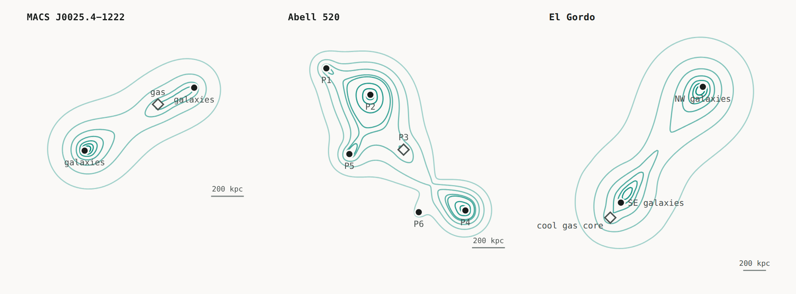

*Three more collisions, with published inputs only (lines: our lensing; circles: galaxies; diamonds: gas). Script
`code/collisions_v10.py`.*

* **MACS J0025.4−1222**, a second Bullet: both lensing peaks sit on their galaxies at the age its shock fronts give
  (0.1–0.36 billion years since the crossing), and its lensing masses agree within their large errors.
* **Abell 520**, a "train wreck" whose middle clump has lensing but few galaxies, long called a dark core: ours gives
  3.7 × 10¹³ suns there from its gas and the surrounding galaxies' heat, against 3.3–3.9 measured, and five of its six
  clumps agree.
* **El Gordo**, seen 7 billion years ago: its lensing inside 1 Mpc comes out 21.4 against 24.3 × 10¹⁴ suns with its
  published stars.

### 5.4 Our own galaxy

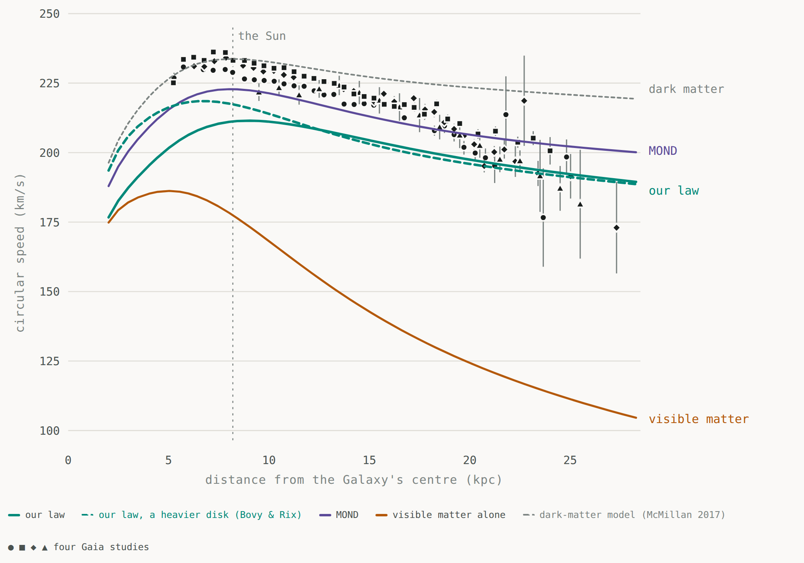

*The Milky Way's circular speed from 2 to 28 kpc, against four Gaia measurements. Script `code/milky_way_v7.py`, drawn
with an earlier fit of the constants; the current fit lowers our curve by about 2 km/s at the Sun.*

* **Agrees:** the rotation from 15 to 27 kpc (within 1–6%), the pull above the disk (73 against 68–74 in the usual
  units), the Galaxy's mass inside 100 and 200 kpc (6.5 and 12.4 against 6.1–7.3 and 11.0 × 10¹¹ suns), and the
  escape speed at the Sun (509–525 against 445–580 km/s).
* **Falls short:** the Sun's own orbital speed (209 against 229–234 km/s). The Sun sits right in the switch-over where
  about half the companion is released, and a more compact disk (Bovy & Rix's) already gives 217 km/s: the disk's shape
  is the lever to test.

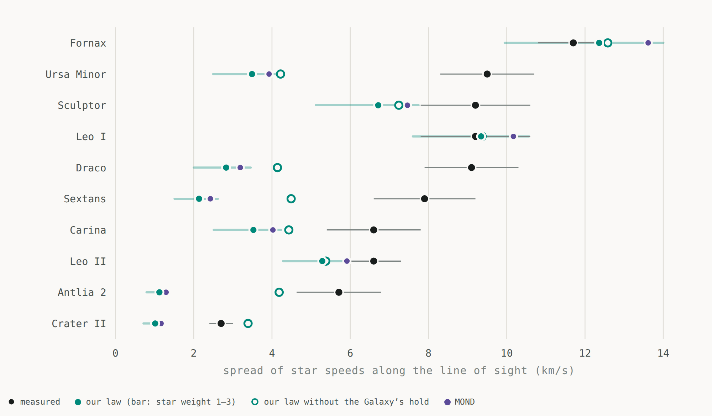

*Measured speed spreads of the stars in ten small galaxies around the Milky Way, against predictions. Script
`code/mw_dwarfs_v7.py`.*

* Four agree (Fornax, Leo I, Leo II, Sculptor). Six faint or spread-out ones come out 1.5 to 5 times too slow, because
  the Milky Way's own strong pull holds their companion back. Without that hold, six of the ten agree; the reason the
  hold would be weaker is still being sought.

### 5.5 The Solar System and wide binary stars

* **Planets, the star S2 around the Galaxy's central black hole, and binary pulsars:** the release factor switches the
  law's extra pull off where gravity is strong (at the Earth it is e to the power −28 million), so these orbits are as
  in Einstein's theory, which we assume holds in strong fields. The companion's other possible effects there are
  computed only in part (its emission changes the Double Pulsar's orbit by 1% of the measurement error).
* **Cassini's radio tracking** of Saturn limits the Galaxy's distortion of the Sun's field. The 2026 re-analysis (Park,
  Hees, Famaey, Desmond & Durakovic) gives (1.6 ± 1.8) × 10⁻²⁷ s⁻²; ours is 4.4 × 10⁻²⁷, 1.5 standard deviations
  above, allowed but not comfortable. It depends on the release length: 0.19 pc instead of 0.15 would bring it within
  one standard deviation, and would lower the wide-binary forecast below from 8% to 6% at 20,000 AU. MOND in its
  widely used "simple" form gives 3 × 10⁻²⁶, about twenty times the measured value (forms that switch faster between
  its two regimes can pass).
* **Wide binary stars** (pairs 5,000–30,000 AU apart, where the mutual pull is weak): our law predicts 3% more pull than
  Newton at 7,000 AU and 8% at 20,000 AU, against MOND's 43%. The Gaia data are disputed; the forecast is locked in the
  repository ahead of Gaia's next release.

## 6. Why stars and light lens the way we see

Lensing is the bending of light by gravity: a galaxy or cluster in front magnifies and distorts the galaxies behind it,
and the distortion measures the pull. Four observations about it, and how the law explains each.

**1. Light and matter feel the same pull.** In our law the companion reshapes the same landscape Φ that ordinary
gravity shapes (∇²Φ = −∇·h), and everything that feels gravity rolls on it, light included. Where the companion's
flow converges, the landscape dips as if extra mass were there. That "as if" mass is what lensing maps show, and what
dark-matter analyses call dark matter. So the mass needed to bend light and the mass needed to move stars must agree,
and in six strong lenses (SLACS), with measured ring sizes and star speeds, they do: to −0.03 ± 0.02 dex in the
project's own distances. We take light to respond to the landscape the way it does in Einstein's theory, twice as
strongly as a slow particle; deriving that factor from the companion itself is part of the relativistic version still
to be built.

**2. Galaxies bend light far beyond their stars, and the bending stays strong far out.** The companion's pull falls as
1/r instead of 1/r², so around an isolated galaxy the lensing signal stays flat far beyond the visible galaxy. In our
law it stays flat to about 2 Mpc, the distance the companion has travelled in the age of the oldest stars, and then
falls: a prediction for the next lensing surveys.

**3. Ellipticals bend light more than spirals with the same stars.** This is the observation that most clearly
separates our law from MOND.

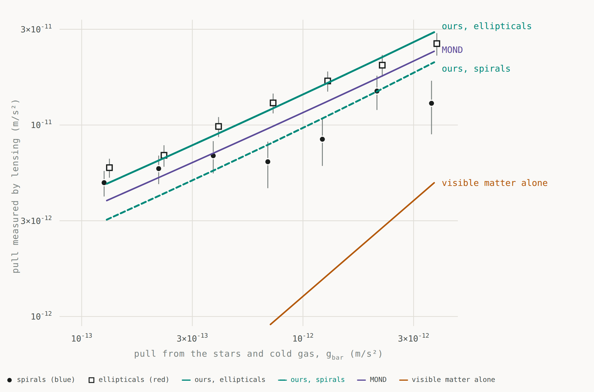

*Weak lensing around about 259,000 isolated galaxies (KiDS-1000). For each acceleration from visible matter, the
observed one, separately for spirals (cold) and ellipticals (hot). Chart from `code/lensing_census_v7.py`; the numbers
below, with the lenses' star speeds measured and in the project's own distances, from `code/kids_heat_v12.py`.*

* An elliptical's stars move randomly at 150–250 km/s and never collide, so in our law they are warm (heat weight
  2.4–6.5) and feed the companion harder. A spiral's stars circle in step and are cold.
* With the lenses' star speeds measured, the ellipticals' extra lensing comes out 0.13–0.16 dex, against the measured
  0.15 ± 0.04. MOND, which treats all matter alike, gives no difference; dark matter has to tune separate haloes.
* All the lenses together sit 16% above our law in the project's own distances. Gas around them weighing about as much
  as their stars, the survey team's own middle estimate, would close that; X-ray and ultraviolet measurements can weigh
  it.

**4. In strong lenses the stars must be somewhat heavy.** Inside a strong lens's ring the stars dominate, and our law
needs them 1.4–1.9 times heavier than the standard "Salpeter" assumption (in the project's own distances). Spectra of
giant ellipticals already suggest star populations this heavy, and measuring these six lenses' stars directly is a
clean test. Compact lenses like the Einstein Cross need only their stars, as observed.

**And in collisions, the lensing follows the companion's flow** (§5.3). Soon after a crossing the hot galaxies carry
their old companion with them, while the colliding gas is cold and its fresh companion has barely begun to grow, so the
light bends around the galaxies rather than the gas, as the Bullet Cluster and 72 other collisions show. The rule is
conditional, not "always on the galaxies": where dense gas sits among hot galaxies whose flow converges on it, as in
Abell 520's galaxy-poor clump, the lensing can sit on the gas, and around gas that has stopped for long enough the
fresh companion grows back.

## 7. How it compares

| | Our law | MOND | Dark matter |
|---|---|---|---|
| Rotation speeds, 149 galaxies | **15.9 km/s** | 16.1 km/s | 7.5 km/s (298 numbers) |
| Cluster masses, 12 clusters | **25%** | ×2.9 | 11% (24 numbers) |
| Collisions: lensing stays with the galaxies | **yes** | no | yes |
| Abell 520's galaxy-poor lensing clump | **from its gas and the galaxies' heat** | no | a puzzle |
| Ellipticals lens more than spirals | **yes, from their stars** | no | yes, via tuned haloes |
| Strong lenses: light and stars agree | **yes**, with light's response assumed | | yes |
| Milky Way rotation 15–27 kpc | **within 1–6%** | within 3% | 6–11% fast |
| Milky Way rotation at the Sun | 9% slow | 3% slow | right |
| Milky Way mass inside 100 / 200 kpc | **agrees** | 30–40% high | agrees |
| Ten Milky Way dwarfs | 4 agree, 6 too slow | the same | fitted |
| Solar System, pulsars | **no extra pull** | small effects | Einstein's |
| Cassini, 2026 re-analysis | **1.5σ above** | common form about 20× too big | passes |
| Wide binary stars (data disputed) | **3% / 8% extra pull at 7,000 / 20,000 AU** | 43% | none |
| Fitted constants (not counting the uncertain inputs every model needs) | **4** | 1 | about 320 (two per halo) |

Dark matter fits individual objects more tightly because it is tuned object by object; our law uses four shared
constants and ties the differences between systems to things measured about their matter (how randomly it moves,
whether it collides). But this table is not a statistical comparison: the three columns do not treat the uncertain
inputs (star masses, gas, distances, inclinations) the same way, the misses are not independent, and some data helped
choose the law's form. On the regression suite's 77 graded checks the law scores 59 pass, 11 close and 7 fail,
everything in the project's own distances; that tally tracks regressions, not probability. A likelihood comparison
with shared inputs and a frozen law is on the list (§9).

## 8. Predictions anyone can check

1. **Heavy stars in the six SLACS lenses:** 1.4–1.9 times Salpeter (project distances), measurable from their spectra.
   Dark-matter models expect about 1.
2. **The elliptical/spiral lensing gap stays flat beyond 100 kpc.** A hot-gas-halo explanation makes it grow with
   radius.
3. **Lensing around isolated galaxies stays flat to about 2 Mpc and then falls,** where the companion has not yet
   reached.
4. **Wide binary stars:** 3% more pull than Newton at 7,000 AU and 8% at 20,000 AU (6% if the release length is
   lengthened to 0.19 pc to fit the 2026 Cassini value), locked ahead of Gaia's next release.
5. **After a collision, lensing stays with the galaxies while the gas moves away from them faster than a fresh companion
   grows around it** (169 km/s). Around stopped gas it comes back only inside a sphere growing at 169 km/s, about
   170 kpc per billion years, so in old collisions whose gas has long stopped, some lensing should return to the gas.
6. **Older collisions show extra lensing around the smaller clump,** as the heat from crossing and tidal shaking builds
   up.
7. **At equal visible mass, systems whose stars move randomly and freely pull harder** than those whose stars circle in
   step.
8. **Matter falling inward against the companion's outflow glows more;** matter flowing outward with it glows less.
9. **The Milky Way keeps slowing down beyond 25 kpc:** about 189 km/s at 30 kpc and 179 at 50 kpc, not flat.
10. **Isolated galaxies are wrapped in gas weighing about as much as their stars within 100 kpc,** more around
    ellipticals than spirals.
11. **Abell 520's galaxy-poor clump carries about 3 × 10¹³ suns inside 150 kpc,** a quarter of it visible gas.
12. **The Sun loses 2 parts in 10¹⁵ of its mass a year** to its companion.

## 9. What is still open, and why we are optimistic

An independent review (25 September 2026) set out what a paper would need. In order:

1. **The companion as a flowing medium.** Derive the one-way wave from the companion's own local equations (its flow,
   its waves, what happens at a source's centre and where streams meet), with the flow's energy and momentum followed,
   and repeat the warm-source tests with that wave instead of one made one-way by hand. This is the main step now under
   way: waves carried by the stream turn out one-way but push every emitter downstream; waves the stream absorbs when
   they move against it are one-way with no push, and in the full simulation make the pull grow with heat at 73–84% of
   the square root the law needs, though a warm source keeps no single beat (§4.4). Next: strong absorption as a full
   wave problem, and what sets the absorption.
2. **The law's numbers from the working models,** not only its trends: the exponent of the square root with its
   uncertainty over a wide range of mass, the full dependence on heat (why the model's glow grows more slowly than
   1 + k, §4.3), and a clean benchmark: a small system inside a shell of hot matter. The law's plain total S counts the
   shell; a strictly outward-only wave would not carry the shell's influence inward. The completed medium must say
   which.
3. **Inertia, and why all matter falls alike.** The working models do not yet define a piece's inertia, so equal
   acceleration for different kinds of matter is a requirement, not yet a result.
4. **The release factor and light's response,** derived rather than assumed, and one prescription for the Solar
   System, wide binaries and dwarf galaxies (Cassini's 2026 value now prefers a release length of at least 0.19 pc).
5. **Collisions as a calculation from before the crossing,** with the companion's emission, transport and the heat of
   crossing followed in time. The Bullet Cluster's smaller half still has only about 60% of its measured lensing mass.
6. **A proper statistical comparison:** a frozen law, a full list of fitted and measured inputs with their
   uncertainties, likelihoods, fair baselines for MOND and dark matter, and at least one test chosen in advance, such as
   lensing against independently measured star speeds at fixed visible mass.
7. **The remaining misses,** each explained or stated as a limit: six faint dwarf galaxies too slow, all galaxy lenses
   16% above the law (the gas around them to be weighed), strong lenses needing heavy stars (to be measured), and the
   Sun's orbital speed 9% slow (the disk's measured structure to be used).
8. **A full literature search** before any claim of priority, and a paper with one bounded claim; the review suggests
   "motion-enhanced attraction in an active streaming medium" first, with the astronomy as motivation.
9. **A frozen, reproducible release:** every figure regenerated with one version of the law, with inputs, seeds and
   commands archived.

Why optimistic: the four constants have held across galaxies, clusters, collisions, lenses and the Solar System, and
every piece of the law is tied to something measured about matter. Several links that began as assumptions now come
out of explicit, energy-balanced models: the square root, the heat weight with its one speed, the collision rule and
the pull's energy bill. The one link that resisted, keeping warm matter in tune, now has a precise diagnosis and a
mechanism that works in the full simulation when imposed by hand, and a first physical medium, a stream that absorbs
waves moving against it, already delivers most of it with no push and every watt booked. What remains (strong
absorption as a full wave problem, what sets the absorption, and a law that counts only what the medium hears) is
well posed. Each open item is a concrete calculation or measurement.

**What is borrowed and what is ours.** Borrowed and credited: Newton's and Einstein's gravity in strong fields; Gauss's
flux geometry; Dicke narrowing and the Mössbauer effect as known physics; the Bloch equations of inverted, self-sustained
emitters (as in the "superradiant laser"); the mathematical form of Milgrom's QUMOND field equation; and the data (SPARC,
X-COP, Clowe et al. 2006, Barrena et al. 2002, Harvey et al. 2015, KiDS-1000, SLACS, Gaia-based Milky Way studies,
dwarf-galaxy catalogues, and the precision tests of gravity; full list in the archived notebook). Ours, as far as we
have found: the companion mechanism, heat as extra glow opened by motion against the companion's flow, collisions
switching it off, the pull along the companion's net flow, its memory after collisions, its release length, MOND's
constant and switch derived from it, and the one-way companion as what keeps warm matter in tune. A full literature
search is still owed before any claim of priority.

## 10. Reproduce it

All scripts are in `research_work/results/hot-companion/code/`, and each writes to a fresh output folder. The main
ones:

```
python run_v3.py            --output-dir ../run-v3                 # galaxies, clusters, the constants, the guard
python xcop_static_v11.py   --output-dir ../run-xcop-static-v11    # clusters in the project's own distances
python bullet_static_v11.py --output-dir ../run-bullet-static-v11  # the Bullet Cluster
python collisions_v10.py    --output-dir ../run-collisions-v10     # MACS J0025, Abell 520, El Gordo
python milky_way_v7.py      --output-dir ../run-milky-way-v7       # the Milky Way against Gaia
python mw_dwarfs_v7.py      --output-dir ../run-mw-dwarfs-v7       # ten dwarf galaxies
python strong_field_v7.py   --output-dir ../run-strong-field-v7    # planets, S2, pulsars, Cassini
python kids_heat_v12.py     --output-dir ../run-kids-heat-v12      # galaxy lensing with the measured heat
python derive_mond.py       --output-dir ../run-derive             # MOND as the cold limit
python receivers_v15.py     --output ../run-reservoir-force-v15/receivers_v15.json      # which bodies a wave pulls
python stream_store_v16.py  --output ../run-stream-store-v16/stream_store_v16.json        # heat from the flowing companion
python one_matter_v17.py    --set oneway_distance --output ../run-one-matter-v17/oneway_distance.json  # one kind of matter
```

The regression suite runs everything at once and compares with the saved baseline:

```
cd research_work/results/hot-companion/regression
python run_suite.py                  # the adopted law, quick tier, about a minute
python run_suite.py --tier full      # everything, about 20 minutes
```

The complete list of scripts and run folders is in the archived notebook's §12 and in the technical record.
