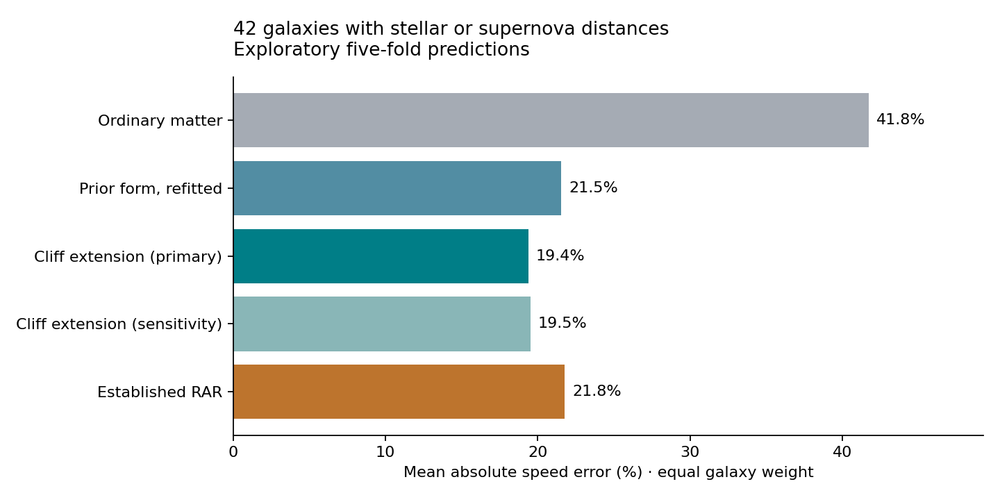

# Gravity-cliff follow-up: results and field consistency

Completed 8 September 2026. This report tests a fictional time-gradient prescription against real galaxy rotation data and checks the mathematical requirements for interpreting it as a clock field.

The cliff extension improves exploratory out-of-fold predictions on 42 galaxies with stellar or supernova distance estimates. Mean absolute speed error falls from 21.5% for the refitted prior form to 19.4%; outer-region error falls from 16.0% to 13.6%. The improvement is useful but does not identify time as the cause. All five training fits hit the predeclared maximum cliff strength, so this run does not determine its unconstrained optimum. Separate consistency checks show that the naive three-dimensional extension of the previous radial formula is not a scalar clock field, and that stationary metric clocks cannot themselves generate path-length redshift between equal-clock endpoints.

## Sample and prediction procedure

The original SPARC loader and quality cuts are unchanged. This run uses only catalog distance methods 2 (tip of the red giant branch), 3 (Cepheids) and 5 (supernovae), leaving 42 galaxies and 957 radial measurements. Neither training nor evaluation includes Hubble-flow or cluster-assigned distances. Stellar calibration assumptions, adopted inclinations, and fixed stellar mass-to-light ratios remain; this is not a rederivation of all catalog quantities under the fictional cosmology. Rotation measurements principally trace gas.

The previous SPARC holdout has already been disclosed. This is exploratory five-fold cross-validation on a familiar catalog, not a second independent discovery test. Names were sorted by SHA256('option3-cliff-v1:'+name), then assigned by index modulo five. Fold sizes are 9, 9, 8, 8 and 8. Each galaxy is predicted only by a fit that excluded that galaxy, with no per-galaxy adjustment. Shared training samples, common distance calibrations and previous catalog exposure limit independence.

The protocol was saved before fitting. All fold coefficients and out-of-fold predictions were saved before aggregate scoring. Both slope-estimation methods and all parameter bounds were specified in advance. The earlier run and its frozen coefficients are unchanged. The primary objective is galaxy-balanced mean squared log10 speed residual. Percentage errors and km/s RMSE are secondary metrics; no claim of agreement within measurement uncertainty follows from them.

## A precise definition of the cliff

Here the cliff means a decline in the strength of ordinary acceleration, not the slope of the potential itself. Define

s(r) = max[0, -d ln(gbar)/d ln(r)],     C(r) = s/(1+s).

A region with nondeclining ordinary acceleration has C=0; a point-mass inverse-square decline has s=2 and C=2/3. The definition is dimensionless and uses the baryonic mass model only. It contains no observed orbital velocity. The derivative is estimated from a quadratic fit to five adjacent samples in log radius and log acceleration, with shifted boundary windows. A predeclared sensitivity uses three samples instead. Derivatives amplify baryonic-model noise and shared systematics; this test does not propagate those errors.

The candidate equation is

a_extra = A aK (gbar/aK)^p exp(beta C),

v_pred = sqrt[r (gbar + a_extra)],     d ln(T)/dr = a_extra/c²,

where aK = c²k = 7.3448088227e-10 m/s² and k is the user-supplied 0.000077315 per million light-years. Fit bounds were log10(A) in [-5,1], p in [0,1], and beta in [-ln(2),ln(2)]. The cliff multiplier is restricted to between one half and two at fixed A,p. A and p are refitted in every training fold, so this multiplier is not the total speed change relative to the earlier model.

Comparators are ordinary matter alone, the same power model with beta=0, and the established RAR with one fitted acceleration scale. RAR means g_total = gbar/[1-exp(-sqrt(gbar/a0))]. Distances, inclinations, disk mass-to-light ratio 0.5 and bulge ratio 0.7 stay fixed for all methods. This does not compare against a full per-galaxy dark matter halo fit or optimized RAR nuisance parameters.

## Results

| Model | Log-speed RMSE (dex) | Mean absolute speed error | RMSE (km/s) | Outer-region mean absolute error |
|---|---:|---:|---:|---:|
| Ordinary matter | 0.28622 | 41.76% | 46.10 | 49.99% |
| Prior power form, refitted | 0.11985 | 21.54% | 19.20 | 15.98% |
| Cliff extension: primary | 0.11080 | 19.38% | 18.10 | 13.63% |
| Cliff extension: sensitivity | 0.11122 | 19.52% | 18.14 | 13.86% |
| Established RAR | 0.12066 | 21.78% | 20.01 | 15.59% |

The cliff extension improves the per-galaxy primary score in 29 of 42 galaxies. Outer-region results use the outer third of each measured radial range, 267 points total. The primary paired galaxy-bootstrap improvement over the prior power form is 0.00905 dex, with conditional 95% interval [0.00515, 0.01283]. The difference from RAR is 0.00986 dex, interval [0.00389, 0.01578]. These are exploratory intervals conditional on the fitted out-of-fold predictions; folds share training sets, coefficients are not refit in the bootstrap, and the catalog informed prior work. They are not a formal discovery significance.

The 19.4% here is not directly comparable to the previous 14.2%: the population, distance-method restriction, and evaluation design differ. On this run's common sample and procedure, the cliff form does better than the prior form and the one-parameter benchmark.

Every primary and sensitivity fit selected beta=ln(2)=0.693147, the permitted upper bound. This supports a positive cliff correction within the tested range, not a measured universal value of beta. At an inverse-square decline C=2/3, this bound means a 2^(2/3)=1.5874 multiplier on extra acceleration at fixed A,p. The bound was not widened after scoring. A positive factor could absorb mass-profile or distance/modeling errors; it is not evidence that an actual clock behaves this way.

Primary fold coefficients:

| Fold | A | p | beta |
|---|---:|---:|---:|
| 0 | 0.190660 | 0.496589 | 0.693147 |
| 1 | 0.205563 | 0.536195 | 0.693147 |
| 2 | 0.210889 | 0.524473 | 0.693147 |
| 3 | 0.171375 | 0.470834 | 0.693147 |
| 4 | 0.171389 | 0.471878 | 0.693147 |

The free coupling still prevents a derivation of the redshift-to-rotation normalization. Since a_extra=A aK^(1-p) gbar^p exp(beta C), multiplying aK by a factor h can be canceled by A -> A h^(p-1). The cliff feature is unchanged because multiplying acceleration by a constant does not change its logarithmic radial slope. This is an exact identifiability limitation, not a lack of enough fitted digits.

## Can the fitted radial rule define clocks in three dimensions?

Write chi=ln(T_extra), with extra acceleration vector -c² grad(chi). Any single-valued differentiable scalar clock field must have curl-free gradient, and its integral between two points must not depend on the chosen spatial route. This is about clock rates at fixed locations, not the proper time of a moving clock along a trajectory.

A tempting extension of the radial prescription is

c² grad(chi) = B grad(Phi_N),     B=A (|grad(Phi_N)|/aK)^(p-1).

But curl[B grad(Phi_N)] = grad(B) cross grad(Phi_N), generally nonzero in a flattened galaxy. Thus the earlier successful one-dimensional rotation fit does not automatically define a clock field off the galactic plane. This is a limitation of that naive extension, not a proof against all possible time-field models.

We checked a toy ordinary-matter disk with Phi_N=-GM/sqrt[R²+(a+sqrt(z²+b²))²], M=5e10 solar masses, a=3 kpc and b=0.3 kpc, using the previous frozen A=0.24060286 and p=0.46245880. The endpoints were (R,z)=(3,0.3) and (15,3) kpc. Integrating the proposed extra gradient gave:

| Route | Implied change in ln(T_extra) |
|---|---:|
| Radially outward, then vertically | 2.6346411842e-7 |
| Vertically, then radially outward | 2.5700739469e-7 |
| Difference around the closed loop | 6.4567237286e-9 |

The disagreement is 2.48% of the mean inferred change. Tightening numerical quadrature tolerance from 1e-12 to 1e-15 leaves it unchanged. The ordinary Newtonian potential control has a closed-loop residual of -1.59e-22, consistent with numerical roundoff. This is a mathematical toy consistency test, not an observational vertical-acceleration test.

A possible scalar-field completion is

laplacian(chi) = (1/c²) divergence[B grad(Phi_N)],

a_total = -grad(Phi_N) - c² grad(chi).

For B depending only on ordinary acceleration magnitude, this follows the known QUMOND potential-construction approach. It produces a genuine potential after appropriate boundary conditions, but in flattened systems the result is not generally the original algebraic acceleration. The rotation fit must therefore be recomputed before claiming it survives. Adding the cliff requires a well-defined three-dimensional environmental scalar and a check of the resulting field theory; simply inserting the radial C does not establish a general covariant or action-based law. A local high-derivative dependence does not automatically inherit QUMOND's conservation properties. The outer power law also cannot be extrapolated to infinity with a finite zero potential without considering boundary/environmental completion.

## Can that same stationary clock field generate accumulated redshift?

Assume a stationary metric with clocks at rest and standard metric photon propagation. Let N(x) be the total local clock lapse, so d tau=N dt. The conserved photon energy associated with time translation gives

1+z = N(observer)/N(emitter).

Intermediate clocks cancel: (N2/N1)(N3/N2)...(Nend/Nprevious)=Nend/Nstart. Passing through more cliffs does not avoid this cancellation. A numerical chain of unequal intermediate clocks with equal endpoints gives 1+z=1, while the supplied distance rule at 100 million light-years requires 1.0077614652. That chain is a simple demonstration of the exact endpoint identity, not a simulated cosmological sightline.

Thus stationary clock gradients can contribute to orbital gravity and endpoint gravitational redshift, but do not by themselves supply the desired path-distance redshift between similar endpoint environments. This conclusion is conditional on the stated stationary metric propagation rules. A fictional theory can change them, but the extra mechanism must be specified.

One explicit phenomenological extension would be

ln(1+z) = ln[N(observer)/N(emitter)] + integral k F(environment,time,direction) d ell.

F=1 recovers the supplied accumulated factor on paths with equal endpoint lapse. This adds a photon-transport postulate; it is not derived from the successful rotation fit and does not resolve the free coupling. It also needs an energy-exchange mechanism and a prediction for complete signal durations. Loss of photon energy alone does not automatically stretch the arrival-time separation of pulses from a transient. A time-evolving field or non-metric light interaction could be investigated, but neither has been constructed or tested here.

## Lensing prediction requires another specification

In a weak-field metric, write ds²=-(1+2 Phi/c²)c²dt²+(1-2 Psi/c²)dx², with Phi=Phi_N+c²chi. Slow orbital motion probes grad(Phi), whereas light deflection probes (1/c²) integral grad_perp(Phi+Psi) d ell. The rotation law therefore does not determine lensing until Psi is specified.

If only the time potential changes and Psi remains Phi_N, the extra lensing contribution is half of the contribution obtained if Psi also gains c²chi, for the same added time potential and geometry. This is a sharp theoretical distinction, not a lensing-data result. Neither option is selected by this rotation test. Real lensing comparison also needs distance geometry consistent with the fictional cosmology.

## Status and next discriminating work

The cliff term is worth retaining as a candidate: it improved this prespecified exploratory rotation comparison and survived the slope-estimation sensitivity. Its strength is unresolved because of the bound, and the result needs a genuinely fresh sample with ordinary-matter uncertainties propagated. The next physical model should solve for a scalar potential first, then derive radial and vertical motion from that same solution. Photon propagation and the spatial metric potential must be specified before a common redshift/lensing test is meaningful. No observational vertical or lensing test was completed in this run because the radial prescription alone does not provide those predictions.

## Reproduction and sources

The archive includes this report, protocol, source code, model coefficients, fold membership, target-free out-of-fold predictions, per-galaxy errors, numerical consistency outputs, chart, and the previous data/code directory needed by the loader. Run `python option3_cliff/run_cliff.py` from the extracted directory using Python with numpy, scipy and matplotlib. The computation is deterministic; optimizer/library differences may slightly alter final digits. The follow-up script regenerates its outputs, while the prior frozen run is untouched.

- SPARC database and original baryonic models: https://astroweb.cwru.edu/SPARC/
- McGaugh, Lelli & Schombert, radial acceleration relation: https://arxiv.org/abs/1609.05917
- Milgrom, Quasi-linear formulation of MOND: https://arxiv.org/abs/0911.5464 (explicitly discusses why a naive algebraic vector field generally lacks a potential).
- David Tong, Geodesics in Spacetime: https://www.davidtong.org/teaching/general-relativity/grhtml/S1 (gravitational time dilation/redshift and photon propagation).
- Pizzuti et al., CLASH-VLT: Testing the Nature of Gravity with Galaxy Cluster Mass Profiles: https://arxiv.org/abs/1602.03385 (orbital and lensing dependence on the two metric potentials).
