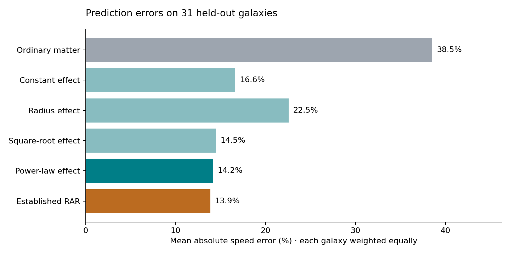
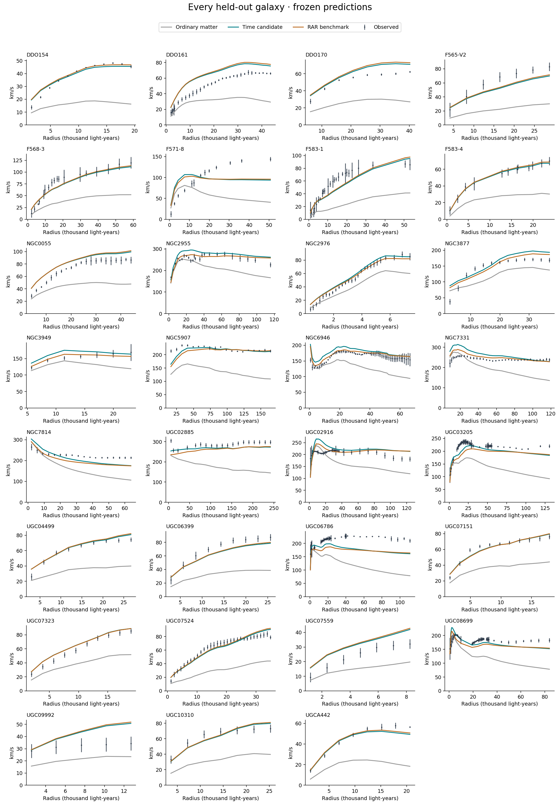

# Option 3: galaxy rotation test

Completed 8 September 2026. Exploratory fictional-universe model tested against real SPARC rotation data.

The selected time-gradient candidate reduces mean absolute speed error from 38.5% to 14.2% on 31 held-out galaxies. The established radial acceleration relation (RAR) scores 13.9%; the difference is inconclusive. This supports an empirical rotation prescription, not a demonstrated time mechanism or a confirmed connection to the supplied redshift fit.

## Data and experimental design

The original SPARC archive contains 175 galaxies. The run retained 149 after requiring quality 1 or 2, inclination at least 30 degrees, positive photometric disk scale length, and at least five valid measurements with positive baryonic radial acceleration. It excluded 26 galaxies and two rows within retained galaxies. The 3,150 retained measurements were split by entire galaxy: 89 training galaxies (1,987 points), 29 validation galaxies (521 points), and 31 test galaxies (642 points). The tracers are principally gas rotation, not individually measured stellar orbits.

Galaxy names were ordered by a fixed SHA256 rule. The protocol was written before fitting; model selection used validation scores only. Test predictions and parameters were saved before scoring. No per-galaxy fitting and no refitting after validation were performed. These are public data familiar to earlier research and to this user’s prior SPARC work; this is an internal computational holdout, not historically unseen observations or an externally blinded experiment. Galaxy membership is in frozen.json.

Published distances, inclinations and baryonic mass profiles were held fixed. Stellar mass-to-light ratios were fixed at 0.5 for disks and 0.7 for bulges in solar units. Signed component contributions V*abs(V) were preserved, including negative gas contributions. No observed flat rotation speed was used as a predictor. Shared distance or calibration errors can still correlate different galaxies.

## Fixed coefficient and candidate law

The user supplied k = 0.000077315 per million light-years from an earlier redshift fit; this run did not reproduce that redshift fit. Converting this coefficient gives aK = c²k = 7.3448088227 × 10⁻¹⁰ m/s². Define x = gbar/aK, with gbar the ordinary-matter acceleration inferred from the published mass model.

The postulate is gtotal = gbar + aK f(x,r), vpred = sqrt(r gtotal), and d ln(T)/dr = aK f/c². T is a dimensionless local clock-rate factor; a positive outward gradient is defined to supply inward acceleration. This is a chosen phenomenological prescription, not a derived field equation.

Four candidates were frozen: constant f=A; radial f=A/(1+r/Rdisk); square root f=A sqrt(x); and power f=A x^p. Each has one global fitted coefficient except the power law, which also fits p in [0,1]. The RAR benchmark uses gtotal=gbar/[1-exp(-sqrt(gbar/a0))], with a0=alpha aK, fitted only on the same training galaxies. The benchmark was excluded from selection among the four candidate functions.

The selected law is **f = 0.24060286 x^0.46245880**. Therefore **a_time = 0.24060286 aK (gbar/aK)^0.46245880** and **vpred = sqrt(r [gbar+a_time])**. All accelerations and radii in that equation must use consistent SI units.

The absolute extra acceleration decreases as ordinary gravity weakens, but it decreases more slowly: a_time/gbar scales as gbar^(-0.53754120). Thus its relative importance grows in weak-gravity regions. In the outer point-mass limit, gbar scales as r⁻²; if the added term dominates, v scales as r^0.03754120, nearly flat. The fixed square-root model would be exactly flat in that limit and reproduces the familiar deep-MOND scaling. Neither the fitted exponent nor its proximity to 0.5 establishes a new law.

## Prediction scores

The primary score is the square root of the average, across galaxies, of each galaxy’s mean squared log10 speed residual. Each galaxy has equal weight regardless of measurement count. Mean absolute fractional error and velocity RMSE below also weight galaxies equally. Parameters were fitted to the primary log score, not to the displayed percentage metric. These scores describe predictive scatter; they are not a chi-squared likelihood or a claim of agreement within measurement uncertainties.

| Model | Train log RMSE (dex) | Validation log RMSE (dex) | Test log RMSE (dex) | Test mean absolute speed error | Test RMSE (km/s) |
|---|---:|---:|---:|---:|---:|
| Ordinary matter only | 0.29042 | 0.27036 | 0.25608 | 38.52% | 47.77 |
| Constant added acceleration | 0.12716 | 0.11039 | 0.08922 | 16.64% | 24.88 |
| Radius-dependent effect | 0.16553 | 0.14919 | 0.11976 | 22.55% | 29.94 |
| Square-root gravity dependence | 0.10954 | 0.09858 | 0.08025 | 14.50% | 17.84 |
| Fitted power gravity dependence (selected) | 0.10935 | 0.09743 | 0.07914 | 14.19% | 17.20 |
| Established RAR benchmark | 0.10922 | 0.09505 | 0.07840 | 13.86% | 16.40 |

The selected candidate reduces mean absolute fractional error by 63.2% relative to ordinary matter only. A paired bootstrap of 2,000 whole-galaxy resamples gives a primary-score improvement of 0.17694 dex, with conditional 95% interval [0.14070, 0.21258]. The RAR-minus-candidate difference is -0.000740 dex, with interval [-0.003896, 0.002631]. The latter includes zero. These intervals condition on the fitted parameters and this split; they do not include model-search history, training uncertainty or catalog systematic errors.

In the outer third of each galaxy’s measured radial range (155 points total), candidate mean absolute speed error is 11.98%, versus 45.83% for ordinary matter alone and 12.09% for RAR. This does not make the candidate an outer-region winner: its log score and percentage score differ only slightly from RAR, and RAR has a slightly lower outer velocity RMSE.

## Distance assumptions

Of the test galaxies, 17 have Hubble-flow distances, 10 have red-giant-branch distances, one has a Cepheid distance, and three use an Ursa Major cluster distance. On the 11 with red-giant-branch or Cepheid distances, candidate mean absolute speed error is 12.02%, ordinary matter is 37.51%, and RAR is 11.50%. This subgroup was specified before scoring. However, training and validation still used the full eligible sample, including Hubble-flow distances; this subgroup result is not a wholly expansion-independent calibration. In a no-expansion universe, a fully consistent reanalysis must reconstruct distance-dependent inputs under its own distance model.

## What the implied clocks do

Numerically integrating the selected added acceleration divided by c² over each held-out galaxy’s measured radial span gives a median outward clock-rate increase of **0.08071 parts per million**, about **81 nanoseconds per second**. This is the model’s extra clock component only, between the innermost and outermost sampled radii; it is not a measured clock difference, not the full central-to-edge value, and not accumulated travel-time stretching. The range across the 31 galaxies is 0.01362 to 1.21795 ppm.

Under the fictional prescription, clocks run slightly faster farther out and the gradient supplies extra inward acceleration, allowing faster stable circular motion. The reference normalization of T is arbitrary; rotation constrains its radial derivative, not its absolute value. The observed radii across the held-out sample span approximately 359 to 241,584 light-years. See test_clock_gradients.csv for individual radial spans and integrated factors.

## What this establishes and leaves open

This demonstrates that a shared ordinary-matter-dependent acceleration rule can substantially improve predictions on held-out galaxies without a dark matter component in the calculation. It does not establish that time causes the acceleration: the strongest candidates are closely related to the familiar radial acceleration relation. All held-out curves are shown below; several retain coherent mismatches larger than the plotted formal errors. No per-galaxy distances, inclinations or stellar masses were tuned to remove them.

The fitted coupling makes the redshift coefficient unidentifiable in this rotation test. In the power model a_time = A aK^(1-p) gbar^p; replacing aK by s aK can be canceled by A→A s^(p-1). Consequently, holding k fixed is not an independent numerical validation of the redshift-to-rotation connection. The coupling and exponent need a separate physical derivation or a new independently calibrated constraint.

A static local clock field ordinarily gives endpoint gravitational clock shifts, not automatically a redshift proportional to total photon travel distance. A common theory still needs photon transport and field dynamics that recover both rules consistently. This run does not test void density, lensing, vertical disk motions, clusters, solar-system constraints, conservation laws or time evolution. The baseline is ordinary matter alone; the RAR comparison is a phenomenological benchmark, not a full fitted dark matter halo comparison.

The next decisive step is a distinct prediction beyond circular rotation that follows from a specified field and photon law. Derive the coupling rather than fit it, reconstruct a training/test sample with independent distances, and test vertical accelerations or lensing with the same parameters. Adding flexible functions on this already-scored holdout would make it development data rather than a new test.

## Every held-out galaxy

## Reproducibility and sources

The accompanying archive includes the exact downloaded source files, protocol, code, exclusion and row audits, coefficients, galaxy split, frozen target-free predictions, scored predictions, per-galaxy errors, clock integrations and figures. To reproduce, copy raw/, protocol.md and run_test.py into a fresh directory; install numpy, scipy and matplotlib; run `python run_test.py freeze` followed by `python run_test.py score`. The code refuses to overwrite an existing freeze and checks input/code/prediction hashes before scoring. Small optimizer differences can occur across library versions.

Protocol SHA256: 4878fd87f94730733a8608757424fe14ff89587ec2dad03919b2ec6cfd27f5a3

Frozen model SHA256: 42bb17aab5f03ce02bbd6dc0e85656873c5c6e431c5504513796ffc24b9d4015

- SPARC official database: https://astroweb.cwru.edu/SPARC/
- Lelli, McGaugh & Schombert (2016), SPARC mass models: https://arxiv.org/abs/1606.09251
- McGaugh, Lelli & Schombert (2016), radial acceleration relation: https://arxiv.org/abs/1609.05917
- Li et al. (2018), individual-galaxy RAR fitting and nuisance parameters: https://arxiv.org/abs/1803.00022

The source archive was downloaded from https://astroweb.case.edu/SPARC/Rotmod_LTG.zip and the metadata from https://astroweb.case.edu/SPARC/SPARC_Lelli2016c.mrt. The metadata table’s whitespace-delimited rows do not follow its advertised byte widths exactly, so the parser uses validated column positions after whitespace splitting.
