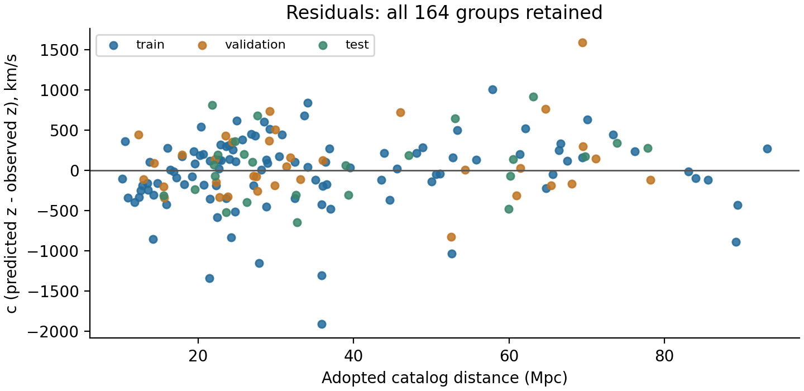
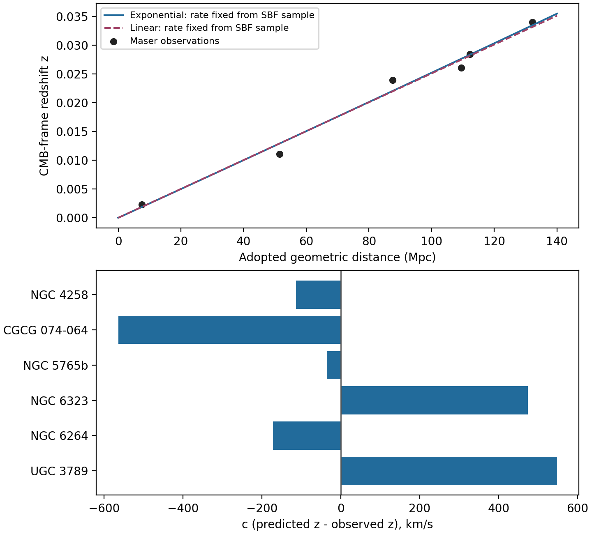

# Environmental Time Stretching and Companion-Energy Deposition

## A phenomenological framework for redshift, galaxy dynamics and gravitational lensing

Working academic draft v0.3 | 9 September 2026 | Authorship and affiliations to be supplied before submission

### Abstract

We investigate a hypothetical, nonexpanding universe in which a new environmental property of time changes light propagation cumulatively, especially in regions of limited gravity. Photon energy lost through the associated redshift is transferred entirely into a companion field or wave sector. Companions may propagate independently, enter gravitational wells and, if a physical retention mechanism exists, contribute to an extended gravitational source. We formulate the proposal as a sequence of explicit postulates and conditional derivations. A whole-signal propagation map can relate spectral redshift to transient-duration stretching, while energy conservation fixes the energy transferred to companions. Existing one-dimensional Hamiltonian calculations demonstrate energy and momentum exchange with a dynamical field; separate environmental calculations demonstrate suppression of slow field variation without necessarily excluding rapid waves. These results do not establish a complete microscopic theory, permanent capture or a sufficient gravitational response. An idealized source-and-deposition calculation produces an inverse-square energy-density profile and hence a flat circular-speed contribution under ordinary cold-source gravity, but leaves its normalization and stability unresolved. We identify the joint clock, spectrum, timing, source-budget, rotation and lensing tests needed to develop or reject the framework. A reproduced constant-rate calibration on 164 previously exposed galaxy groups gives alpha = 0.000248899 per Mpc. The inherited test subset has redshift-residual RMS equivalent to 415.4 km/s, versus 414.7 km/s for a linear control. Thus the nearby distance trend is reproduced without demonstrated preference for exponential curvature or validation of its proposed microscopic cause. Graviton identity remains an open hypothesis.

### Formula provenance convention

Each numbered equation states its provenance. Established forms, proposed assumptions, internal derivations and calibrated numbers are distinguished. "Derived here" does not establish uniqueness in the literature. No equation or interaction in this draft is certified as original; a dedicated prior-art review remains required before such a claim.

### 1. Motivation and scope

The proposed causal chain is environmental time evolution, cumulative stretching of light, photon-to-companion energy transfer, companion transport, retention near gravitational wells, and an additional gravitational response. The intended targets include outer-galaxy orbital speeds and galaxy and cluster lensing. A useful theory must calculate spatial profiles: an enhancement relative to the visible-matter prediction need not be an absolute increase of acceleration with radius, and neither galaxies nor clusters have a universal sharp gravitational edge.

We adopt an alternate-universe research contract. Published galaxy distances are fixed facts of the model, including distances originally obtained using an expansion-based reduction. Their provenance remains documented. The active explanation introduces no independent dark-matter population, cosmic expansion or Big-Bang origin. These restrictions specify the model under investigation; they do not establish that competing descriptions of our actual universe are false. Measurements are retained while theory-dependent interpretations are audited.

SPARC provides photometry and rotation curves for 175 disk galaxies and is a useful observational starting point [1]. Its mass-to-light assumptions and inclination uncertainties remain relevant even when distances are stipulated. Transient timing provides a separate constraint: the DES supernova analysis reports duration scaling consistent with the spectral stretch factor [2]. A replacement propagation mechanism must address that observation instead of assuming that a lower photon frequency automatically lengthens an entire event. Cluster mergers additionally require predictions of the spatial relation among light bending, galaxies and gas; the Bullet Cluster observations illustrate this requirement [3].

This paper is a framework and research report, not a completed cosmological fit. We distinguish postulates, consequences derived from those postulates, numerical checks of selected realizations, and observational validation. No single candidate currently satisfies the entire chain.

### 2. Operational meaning of environmental time

The proposed effect is a new physical property of propagation that accumulates along the path. It is not ordinary gravitational time dilation determined solely by source and observer conditions. A signal may leave a low-gravity region with a lasting spectral and temporal change even when its source and detector occupy comparable environments. Calling this property "time" becomes scientifically meaningful only when it predicts ratios of physical frequencies, arrival intervals and lengths measured by specified instruments. A coordinate relabeling by itself supplies no new observable.

Let a field chi characterize the proposed property, and let its coupling determine an effective optical factor n greater than zero. The relation between chi and the environment must be specified dynamically. Low matter density, small acceleration, shallow potential and small curvature are different conditions. In particular, symmetry can make acceleration small inside a dense system. A density-controlled candidate is therefore one possible approximation, not a derivation of the phrase "limited gravity." A covariant completion would need physical environmental variables and an explicit matter coupling.

Our working postulates are: (i) affected propagation produces a cumulative signal stretch; (ii) every unit of photon energy lost through this process enters the companion sector at conversion; (iii) companions and deposits obey a complete energy and momentum budget; and (iv) the same completed theory must predict the motion of matter and the bending of light. Companion propagation without further loss and deposits without decay are optional limiting cases. Gravitational focusing, physical capture and long-lived support are separate questions.

The equations below derive consequences from these postulates. They are not yet a derivation of the postulates from fundamental principles. An effective action is one route to such a derivation because it ties propagation, forces and conservation together rather than assigning each independently.

### 3. Cumulative redshift and whole-signal stretching

#### 3.1 Energy transfer along a path

Let s be path length and alpha be a fractional energy-transfer rate per unit length, evaluated in a declared common energy standard. Our root phenomenological equation says that light gives up the same fraction of its remaining energy per unit distance when alpha is constant. Integrating d ln E = -alpha ds yields the exponential law below. This is a consequence of the assumed transfer rule, not a first-principles derivation of the rate. A deterministic model is

Provenance: Established mathematics: fractional-loss differential equation and its exponential solution; not a novelty claim.

$$
\frac{dE_\gamma}{ds}=-\alpha E_\gamma,\qquad S=\exp\left(\int\alpha\,ds\right)=1+z_{\mathrm{conv}}. \tag{1}
$$

Alpha may depend on position, field state and time; frequency dependence must be tested. If it depends on energy, the integral is along the actual solution. Retaining the Planck energy-frequency relation and matching endpoint standards, photon energy and frequency decrease by the same factor. The agreed conversion rule then gives

Provenance: Established energy-frequency accounting, applied to the stipulated complete companion transfer.

$$
E_{\gamma,o}=\frac{E_{\gamma,e}}{S},\qquad \Delta E_c=E_{\gamma,e}\left(1-\frac{1}{S}\right). \tag{2}
$$

Thus S = 2 transfers half the original photon energy. There is no unknown energy exchange multiplier at this step: the model fixes the total transferred energy. What remains unknown is the number and spectrum of companion excitations, their subsequent motion and the gravitational response per unit stored energy. A unit of lost photon energy is a unit of companion energy; it is not automatically a specified amount of extra stellar acceleration.

Measured redshift also contains source motion and ordinary endpoint effects, which must be separated consistently. Equation (1) is not permission to attribute every observed shift to the proposed process. Fitting a different alpha to every object would describe the data without predicting them.

#### 3.2 Event timing is a further physical requirement

An energy-loss equation alone supplies no event-duration prediction. Consider instead a local affine arrival map, with the same stretch applied to the carrier phase and its envelope:

Provenance: Proposed whole-signal condition using established affine-map mathematics; not derived from energy loss alone.

$$
t_o=T+S t_e,\qquad \frac{\nu_o}{\nu_e}=\frac{1}{S},\qquad \frac{\Delta t_o}{\Delta t_e}=S. \tag{3}
$$

T is an arrival-time offset. Equation (3) is a whole-signal condition, not an inference from energy bookkeeping. If S changes during an event, the map is nonaffine and can distort the light curve. These distortions are additional predictions that a physical field solution must quantify.

A conditional ray realization uses angular frequency omega = c k/n(t,x). Hamilton's equations imply

Provenance: Established Hamiltonian-ray identities applied to the candidate optical dispersion; cosmic interpretation and originality unverified.

$$
\frac{dt}{dx}=\frac{n}{c},\qquad \frac{d\ln\omega}{dx}=-\frac{\partial_t n}{c},\qquad \frac{d\ln J}{dx}=\frac{\partial_t n}{c},\quad J=\frac{\partial t_o}{\partial t_e}. \tag{4}
$$

Identifying equations (1) and (4) gives alpha = (partial n / partial t) / c, evaluated along the ray. Here c is the reference constant c0, and n is an effective propagation factor relative to declared clock standards. Positive temporal evolution of n gives redshift. This is the precise link to the environmental-time hypothesis; a dependence on weak gravity alone does not determine the temporal derivative.

Consequently the local carrier-frequency ratio is 1/J, while adjacent arrival times stretch by J. Spatial gradients change momentum along the ray, but the accumulated frequency change in this illustrative law depends on temporal evolution. A purely stationary n(x) does not generate this cumulative frequency shift. This observation identifies a requirement of this candidate: the proposed environmental property must evolve or interact dynamically, rather than merely label a static region as having different time.

The repository has verified prescribed finite-region examples with equal endpoint optical factors and a lasting stretch [5, cumulative-time]. Dynamical-field probe calculations also recover the carrier/event relation, including event-dependent distortions [5, weak-signal-timing]. Neither result completes the emitter and detector physics. If q denotes atomic clock cycles per reference-time unit, the measured duration factor is J times q_o/q_e. Computing q from the same matter action prevents an apparent coordinate effect from being mistaken for a physical signal.

#### 3.3 Brightness and spectra

For a static Euclidean, isotropic, unlensed illustration, assume photon number is preserved and endpoint standards agree. The same affine map yields

Provenance: Derived here from standard photon-energy and arrival-rate accounting under the stated geometry; originality unverified.

$$
F_{\mathrm{bol}}=\frac{L}{4\pi R^2 S^2},\qquad F_{\nu,o}(\nu)=\frac{L_{\nu,e}(S\nu)}{4\pi R^2 S}. \tag{5}
$$

One bolometric factor arises from reduced photon energy and the other from the slower arrival rate. Event fluence, integrated over arrival time, has only one energy-loss factor. These expressions must be replaced by actual ray-bundle, filter and clock calculations if geometry, extinction, absorption or nonaffine propagation matters. Smooth spectral shifting must also preserve sufficiently sharp images, lines and polarization. A wavelength shift that creates excessive scattering or broadening would fail those tests.

### 4. A candidate dynamical interaction

Frequency exchange in time-dependent electromagnetic media provides a physical analogy for why changing propagation properties can exchange wave energy [4]. It does not identify a cosmic time field. The present research explores a positive-energy classical companion field coupled to photons through n. In one spatial dimension, a schematic closed Hamiltonian is

Provenance: Proposed effective coupling using standard Hamiltonian ingredients; originality and microscopic validity unverified.

$$
H=\int\frac{K}{2}\left[(\partial_t\phi)^2+v^2(\partial_x\phi)^2\right]dx+\frac{cP}{\bar n(X)}. \tag{6}
$$

Here n = 1 + g(x) phi, with a specified coupling g and n kept positive; the field kinetic energy belongs to phi, not to n when g varies spatially. Here K is a positive field normalization, v is the field-wave speed, X and P are the packet's canonical position and momentum, and the overbar denotes a smooth local sampling of n. The canonical field momentum is K times its time derivative. The final term is packet energy for a positive-momentum branch. The expression is an effective classical model; it is not a quantized spin-2 theory.

The packet's loss can raise field energy, and spatial disturbances can carry energy away from its path. Existing periodic Fourier calculations test conservation of the total Hamiltonian and translational momentum [5, companion-backreaction]. In a representative dimensionless run with initial packet energy 0.01, the packet loses about 14.38 percent by time 3. The result depends on chosen field stiffness, initial rolling state, smoothing and packet energy; it is not an astronomical conversion-rate measurement. The initial field energy is separately counted, rather than credited to the photon.

Backreaction matters because the signal can alter the field that stretches it. A weak probe traveling through a field established by other radiation can have a well-defined limiting response, whereas brighter finite packets need not have identical fractional losses. The next physical requirement is to derive the actual background and its radiation dependence. Otherwise a fitted distance law could quietly change with source luminosity.

Earlier matched-wave calculations also show why matter must be included. One minimal atomic coupling changes reference transition frequencies in a way that spoils the desired measured redshift [5, matched-wave]. That failure applies to that coupling, not to every cumulative-time hypothesis. A successful completion must protect or correctly predict atomic and cavity comparisons while retaining the intergalactic effect.

### 5. Environmental suppression and access to wells

A possible environmental interaction gives the companion/time field a restoring term inside a region. For chi = n - 1, a toy Lagrangian density is

Provenance: Established scalar-field Lagrangian form with proposed environmental mass dependence; no novelty claim for the form.

$$
\mathcal{L}_c=\frac{K}{2}\left[(\partial_t\chi)^2-v^2(\partial_x\chi)^2-m^2(\rho)\chi^2\right]. \tag{7}
$$

Here m has units of inverse time, and its dependence on matter density rho is postulated. It is not a measured graviton mass or a complete coupling to dynamical matter. In a uniform slab of half-width a, static or linearly varying equal boundary values have center-to-boundary response sech(B), where B = ma/v. Slow variation can therefore be suppressed in the slab.

Suppression of slow variation does not imply exclusion of every wave. The lossless interface calculation transmits sufficiently high-frequency disturbances while reflecting subthreshold waves. At angular frequency twice m the transmission is at least 48/49 for the tested ideal slab law, irrespective of its thickness; low-frequency transmission can instead be extremely small [5, environmental-screening]. This offers a conditional way for source and detector regions to resist slow field changes while admitting rapid companion waves.

However, the model absorbs no energy: reflection plus transmission equals unity. Subsequent generated-wave calculations propagate the actual source spectrum and find that much of its slow power reflects from the restoring region [5, generated-wave-access and source-timescale]. A favorable transmission coefficient at a chosen high frequency therefore does not solve the supply problem. Matter reaction forces, realistic geometry and quantitative clock bounds also remain uncalculated. The screening and source models cannot yet be combined as though a single completed galaxy solution exists.

### 6. Transport, capture and complete conservation

Companions may accompany light or follow independent paths. A kinetic description can use a phase-space distribution f_c and a Hamiltonian H_c that determines their trajectories. For canonical phase-space flow,

Provenance: Established kinetic transport structure with unspecified proposed interaction terms.

$$
\partial_t f_c+\dot{\mathbf{x}}\cdot\nabla_x f_c+\dot{\mathbf{p}}\cdot\nabla_p f_c=Q_{\gamma c}-\Gamma_{\mathrm{cap}}f_c+Q_{\mathrm{return}}. \tag{8}
$$

The position and momentum velocities follow Hamilton's equations. A tendency to steer toward wells must arise from H_c or a specified interaction. An arbitrary inward force added to a fit is not a derivation. Capture requires a channel that removes escape energy or transfers the excitation into a bound state. Permanent storage further requires stability and a mechanism that keeps the stored source extended instead of letting it escape or fall inward.

In a restricted volume model with no pressure work and explicitly included energy fluxes, the bookkeeping can be written

Provenance: Established local energy-balance structure applied to the proposed sectors.

$$
\dot u_\gamma+\nabla\cdot\mathbf{F}_\gamma=j_\star-Q. \tag{9}
$$

Provenance: Established local energy-balance structure applied to capture and return; permanence remains an assumption.

$$
\dot u_c+\nabla\cdot\mathbf{F}_c=Q-C+L_{\mathrm{return}},\qquad \dot u_d+\nabla\cdot\mathbf{F}_d=C-L_{\mathrm{return}}. \tag{10}
$$

Q is photon energy transferred per volume per time, C is captured companion power density, and L_return is released energy returned to traveling companions. Any release into heat or other radiation needs its own term and receiving sector. In the no-flux, no-return limit, summing gives total reservoir growth equal to stellar photon supply j_star. This is the specified no-loss-travel/permanent-deposit limiting case.

Stellar supply is itself withdrawn from fuel. Forces, recoil, pressure work and an evolving gravitational or environmental field require a broader treatment. A covariant completion should satisfy local conservation of the combined matter, photon and companion stress-energy tensor, with deposits counted once. A separate local gravitational-energy density need not exist; a global conserved energy additionally depends on the background and boundary symmetries. Equations (9)-(10) therefore establish a restricted ledger, not a proof of conservation for an unspecified cosmology.

This accounting explains the distinction between conversion efficiency and gravity. If stored energy behaves as ordinary slowly moving matter, its mass equivalent is energy divided by c squared. If a new field modifies the response, the field equations, energy and stability must establish that response. A freely chosen gravity multiplier cannot be used as evidence that the available photon supply is sufficient.

### 7. Conditional outer profiles and joint lensing predictions

#### 7.1 An instructive radial limit

Consider a steady central photon luminosity L, a constant small alpha, negligible attenuation over the radii considered, and rapid local capture of all newly generated companion energy. Assume deposits remain supported where produced for time T. The deposition power density and stored energy density are then

Provenance: Conditional radial-source derivation using standard flux geometry; derived here, originality unverified.

$$
q_d(r)\simeq\frac{\alpha L}{4\pi r^2},\qquad u_d(r)\simeq\frac{\alpha L T}{4\pi r^2}. \tag{11}
$$

For the additional, optional benchmark that this reservoir gravitates as ordinary cold matter, rho_d = u_d/c squared. Outside an inner cutoff, and where its contribution dominates, this yields

Provenance: Conditional consequence using established Newtonian gravity and mass-energy equivalence; not a new gravity law.

$$
M_d(<r)\simeq\frac{\alpha L T}{c^2}r,\qquad v_d^2\simeq\frac{G\alpha L T}{c^2}. \tag{12}
$$

The flat-speed shape follows because equal radial increments receive equal deposited power in this idealization. It does not establish the needed amplitude. The assumptions exclude extended source geometry, finite transport lengths, escape, pressure, time-dependent luminosity and self-consistent formation. At sufficiently large alpha times r, photon attenuation invalidates the approximation. A finite inner boundary also modifies the enclosed-mass expression.

Recovered supply calculations find severe shortfalls under a present-luminosity, ten-billion-year, ordinary mass-energy benchmark [5, energy and companion_causal_test]. These are conditional constraints, not a theorem against every age or gravity coupling. A longer history must carry its fuel, stellar-population and accumulated-radiation consequences. An alternative gravitational response must satisfy independent tests. Neither step is a free normalization adjustment.

#### 7.2 Matter and light must share a completed theory

In a weak, static metric description, circular speeds probe a potential Phi, while metric light deflection probes Phi plus a spatial potential Psi:

Provenance: Established weak-field metric relations; applicability requires the stated matter and optical completion.

$$
v_{\mathrm{circ}}^2=r\frac{d\Phi}{dr},\qquad \boldsymbol{\alpha}_{\mathrm{lens}}=\frac{1}{c^2}\int\nabla_\perp(\Phi+\Psi)\,d\ell. \tag{13}
$$

The displayed deflection uses the usual lens-equation convention; ray-direction change carries the corresponding sign convention. The formula assumes light follows the metric null rays. Because this proposal also changes photon propagation, its completed optical action may add or modify deflection. Both effects must be derived together to avoid omitting or double-counting bending.

Increasing stellar acceleration alone is insufficient. Existing scalar-response comparisons show how extra matter forces can fail to provide the required lensing [5, gravity-response]. A successful deposit solution must predict rotation curves, shear profiles, strong-lensing geometry and merger offsets with shared parameters. "Seeking wells" also creates a formation feedback problem: the growing companion distribution changes the wells that determine subsequent transport.

### 8. Evidence status and decisive tests

The present evidence supports limited mathematical statements. Cumulative ray examples relate carrier and event stretching. A closed classical field model transfers energy and momentum. A separate restoring-field model distinguishes slow environmental response from rapid transmission. None establishes a supported galaxy or a joint observational fit [5]. The retained offline suite contains 45 diagnostic jobs; successful checks validate the specified calculations and preservation of saved evidence, including calculations that expose failed candidates.

#### 8.1 Observed versus predicted redshift

We reproduce the frozen conversion-first benchmark from the recovered catalog of 164 unique galaxy groups. The inputs are its published/adopted distances and CMB-frame redshifts; they are not new raw spectroscopic measurements. Distances span 10.2047 to 93.1966 Mpc. Archived expansion predictions and archived per-object time predictions are not inputs. Distance errors remain provenance information but are not fitted because the alternate-universe contract stipulates these distances.

For this benchmark only, replace the path-dependent rate by one universal constant:

Provenance: Established exponential form; numerical coefficient empirically calibrated here on previously exposed data.

$$
z_{\mathrm{pred}}(D)=\exp(\alpha D)-1,\qquad \alpha=2.488993286\times10^{-4}\ \mathrm{Mpc}^{-1}. \tag{14}
$$

This equals 7.631288108 times 10 to the minus 5 per million light-years. Equivalently c alpha = 74.61814 km/s/Mpc; that unit conversion is not an assumption of cosmic expansion. The rate is fitted, not yet calculated from the time field or companion coupling. The fit uses only the inherited 104 training rows and minimizes the sum of squared c times redshift residuals, with c = 299792.458 km/s and c alpha constrained to [0,150] km/s/Mpc. There is no intercept, distance reassignment, clipping or object-specific parameter. The other inherited subsets contain 35 validation and 25 test rows. All subsets were previously exposed during research: these names do not make them fresh independent holdouts.

Provenance: Established definitions of signed residual and root-mean-square error.

$$
r_i=c\left[z_{\mathrm{pred}}(D_i)-z_{\mathrm{obs},i}\right],\qquad \mathrm{RMSE}=\sqrt{\frac{1}{N}\sum_i r_i^2}. \tag{15}
$$

The km/s residual is a convenient scale for a redshift difference, not an exact interpretation as a galaxy's peculiar velocity. Observed shifts can include motions, calibration and endpoint effects not modeled by the conversion mean. Figures 1 and 2 show every group; the accompanying CSV supplies identifiers, distances, observations, predictions and signed residuals.

| Subset | Groups | Exponential RMS (km/s) | Linear RMS (km/s) | Mean residual (km/s) |
| --- | --- | --- | --- | --- |
| Train | 104 | 457.6 | 457.2 | -28.3 |
| Validation | 35 | 437.1 | 437.2 | +98.0 |
| Test | 25 | 415.4 | 414.7 | +74.1 |

Table 1. Reproduction of the frozen fit and its inherited partitions. The linear control z = alpha_linear D is fitted separately on the same training rows, with c alpha_linear = 75.17651 km/s/Mpc. It is a mathematical small-distance control, not an imported expansion theory.

The inherited test RMS corresponds to a dimensionless redshift difference of approximately 0.00139. The exponential improves neither the training nor test RMS relative to the linear control; its tiny validation improvement is insufficient to establish preference. The earlier paired test sky-tile bootstrap places the exponential-minus-linear RMS difference within approximately [-2.22, 3.83] km/s at 95 percent. The earlier training sky-tile bootstrap gives c alpha in [72.42, 76.89] km/s/Mpc. Those are conditional resampling summaries, not a complete treatment of selection, calibration, correlated motions or theory uncertainty, and not individual prediction intervals.

A previously used illustrative 300 km/s Gaussian residual scale covers only 80 percent of test rows within its nominal 95 percent interval. It has not supplied a calibrated noise model. Consequently this manuscript reports descriptive residuals rather than an unsupported goodness-of-fit probability. At the sampled distances, the formula assigns approximately 0.25 to 2.29 percent of each emitted photon's energy to companions if full transfer is assumed.

The distance-only exponential is shared by a conversion-only model and the environmental-time candidate. This fit does not distinguish them. In the time candidate, equations (3)-(5) additionally require carrier shift, event stretching and the corresponding brightness change. Agreement with the distance trend alone does not validate those predictions, establish the gravitons' identity, explain extra gravity, or justify extrapolation to billions of light-years.

#### 8.2 Testing additional rate flexibility

A protocol written before the comparison fixed three candidates: the linear mathematical control, the constant exponential, and a smooth rate changing linearly with distance along the path. The last candidate is an empirical two-parameter diagnostic, not a derived environmental law. Its endpoint rates at zero and 100 Mpc are constrained to be nonnegative. None uses a redshift-derived void proxy or an object-specific correction.

Each of the 65 existing sky tiles was excluded once, and every fit used only the other tiles. All 164 out-of-fold predictions are published. No model or regularization selection was performed inside this fixed comparison. Existing exposure, neighboring-tile correlations and common calibration prevent a claim of blind independence.

| Candidate | RMS (km/s) | MAE (km/s) | Bias (km/s) |
| --- | --- | --- | --- |
| Linear | 448.1 | 326.8 | -20.0 |
| Constant exponential | 448.4 | 326.7 | -23.6 |
| Smooth rate | 452.5 | 330.9 | -14.1 |

Table 2. Leave-one-sky-tile-out errors. These use a different evaluation partition from Table 1 and cannot be compared as improvements over its test RMS. The smooth-minus-constant RMS difference has a descriptive paired sky-tile bootstrap interval of approximately [-0.72, 9.26] km/s. No improvement from added flexibility is demonstrated. Source scripts and the frozen protocol are in redshift-priority [5].

Frozen baseline residuals correlate descriptively with distance (0.139) and equatorial Cartesian sky components (0.256, 0.093, 0.164). Those correlations are not independent significance tests or evidence for a particular void mechanism. The input catalog contains no independently measured line-of-sight environment. Environmental tuning remains deferred pending valid inputs.

#### 8.3 Fixed-rate external maser diagnostic

The six geometric maser distances in Pesce et al. [6] offer a different measurement method. Table 1 of that source supplies disk-model angular-size distances and optical CMB-frame redshifts. Under our stipulated-distance contract we adopt those distances directly as path distances. We do not import the source's expansion-based distance equation, fitted cosmological parameters or flow corrections. Maser disk and clock assumptions still require a physical audit for a completed alternative theory.

Both rates from section 8.1 were held fixed; all six targets were retained. Distances span 7.58-132.1 Mpc. The exponential RMS is 384.3 km/s versus 390.8 for the linear control; exponential MAE is 317.6 km/s and bias is +22.9 km/s. Two targets are within the prior SBF distance range, with exponential RMS 555.8 km/s. Four are outside, with RMS 258.9 km/s; one of those is closer rather than more distant. Small heterogeneous subsets cannot establish all-distance performance or statistically supported preference.

The source's aggregate result was viewed before the protocol, and individual labels were visible during table extraction before prediction-file sealing. The seal proves artifact integrity, not blinding. Exact-name overlap scanning is incomplete for alternate identifiers and groups, and NGC 4258 can share calibration links with standard-candle distances. These six targets therefore constitute an external diagnostic, not a genuinely unexposed validation sample. Published distance uncertainties are retained in the accompanying CSV; they are not used to move targets toward the curve. No calibrated individual prediction intervals have been established.

#### 8.4 Dynamical progress and unresolved causes

Later diagnostics sharpen the physical gap. A driven one-dimensional field can sustain rolling and nearly steady stretch, whereas the tested localized three-dimensional spherical source settles: its lasting travel delay does not maintain new redshift [5, sustained-illumination and spherical-propagation]. Thus a steady source is not by itself a demonstrated cosmic origin of positive partial-time n.

A massive complex-scalar proxy admits conditional self-bound configurations, but it is not evidence for ordinary massless gravitons bonding like atoms [5, companion-self-binding]. Fixed-population cloud exchange transfers energy without creating new particles. An optional neutral pair interaction can create excitations but also permits inverse conversion and radiative loss [5, bound-cloud-exchange, bound-pair-production and pair-production-balance]. The tested illuminated mode has a finite stationary mean population, not indefinitely accumulating permanent deposits. Its overlap strengths, spatial capture, stable galaxy distribution and coherent optical response remain unjoined to the time model. These calculations constrain candidate mechanisms; they do not yet derive alpha.

A later homogeneous finite-radiation calculation supplies an exact special sector of the same scalar-photon model in a finite periodic three-dimensional volume [5, distributed-zero-mode]. Radiation drives a field initially at rest; photon energy lost becomes field kinetic energy. The limiting rate is proportional to the coupling times the square root of initial radiation density divided by field inertia. This conditional relation was derived here from the proposed Hamiltonian; its originality is unverified. Numerical energy and independently evaluated carrier/event checks agree with the analytic solution.

The result does not resolve the localized-source failure: its spatially uniform zero mode, periodic boundaries and zero restoring potential are material assumptions. The optical factor grows without bound. In this homogeneous sector spatial wavelength stays fixed while reference frequency and propagation speed fall. Matter clock response must be derived before calling that effect an observed spectral redshift. Nonuniform sources, boundaries, stability, astronomical normalization and joint gravity remain open.

The current transient pipeline has used artificial signals on real DES cadence and uncertainty patterns. It has not established a real-flux measurement for this model. The population-likelihood pilot still fails a predeclared numerical convergence gate [5, timing-population]. This limitation concerns our estimator and does not negate the published DES finding [2]. It must be resolved before a fitted duration exponent is used as evidence.

Priority tests should freeze a common finite parameter set and predict: (a) redshift residuals against independently described line-of-sight environments; (b) carrier shift, event duration, brightness and line fidelity together; (c) source-luminosity dependence from backreaction; (d) clock and cavity responses inside and outside screened regions; (e) companion production spectra and well-entry fractions; and (f) rotation and lensing from the same source-funded reservoir. Merger evolution and low-luminosity systems are especially useful because retention history and current stellar luminosity can differ substantially.

Inferring a cause from observations is possible as model selection: propose a small number of dynamical laws, derive their linked consequences, estimate parameters on declared training data, then predict independent cases. A flexible rule adjusted separately for every galaxy is not equivalent. Even broad agreement can leave several microscopic causes observationally indistinguishable; discrimination requires predictions on which they differ.

### 9. Computational objectives and completion criteria

The next redshift objective is a spatial field solution that predicts the line-of-sight integral of partial-time n from stated environmental and source inputs, with a common finite parameter set. Its deliverable is an object-by-object redshift calculation and an uncertainty budget. Without it, equation (14) remains a fitted descriptive law. A new untouched sample should be selected only after the rate and selection rules are frozen; the 164-group benchmark cannot be made blind retrospectively.

The next microscopic objective is to join physically normalized receiving modes, forward optical response and reversible companion production to the same energy-conserving dynamics. Generated-wave entry and pair-production balance have now been calculated in limited models. The deliverables are the optical drift, scattering, capture and release implied by a single interaction, rather than independently chosen coefficients. Without this connection, successful pieces may belong to incompatible mechanisms.

A subsequent interaction calculation must introduce a physical capture and release channel. Its deliverables are capture probability, residence-time distribution, capacity and destination of released energy. Without it, temporary wave energy can be mistaken for a permanent gravity source. A coupled spatial evolution should then calculate support, redistribution and feedback in a finite galaxy, including source history and fuel. Without support, an assumed extended deposit profile may collapse or disperse.

The gravity objective is a single action or consistent field-equation system for matter, light and companions, calibrated against local constraints. Its output must include both motion and lensing, together with the energy and stability conditions. Independently fitting their strengths would not complete this objective. Observational validation should follow numerical convergence and injection recovery, retain unsuccessful cases, and test fresh objects with parameters held fixed.

These objectives preserve the broader 32-area program in Appendix A. Completing a numerical subproblem does not close the theory. A candidate should be rejected or revised when it cannot meet its declared accuracy, stability, supply or observational requirements without adding unconstrained object-specific adjustments.

### 10. Discussion

The central proposal can be made precise enough to calculate: an evolving environmental propagation field can stretch a whole signal and exchange its lost energy with companions. The present work supplies conditional realizations of parts of that mechanism. It does not yet explain from fundamental principles why low-gravity regions establish the required field, why local instruments remain compatible, how companions become a stable extended source, or whether their predicted gravity is sufficient.

The immediate scientific value is the linked set of requirements. Redshift fixes an energy transfer once the conversion law and standards are declared. Timing constrains the propagation map. Source history limits available energy. Capture and support determine its location. Motion and lensing constrain its gravitational effect. Solving these together is the route from a proposed time property to a predictive theory.

### Appendix A. Full observational and theoretical coverage

Each item names an output still required of the completed theory. A partial calculation is not full completion.

- R01 Operational definitions: observable clock, length and energy standards.
- R02 Microscopic conversion: interaction-derived rate and environmental dependence.
- R03 Conservation: energy, momentum, fuel, forces and boundary budgets.
- R04 Quantum/classical consistency: stable degrees of freedom and a valid approximation regime.
- R05 Companion identity: spin, dispersion and coupling; demonstrate any graviton claim.
- R06 Source production: luminosity and fuel histories with companion spectra.
- R07 Redshift: fixed-distance predictions including other shift components.
- R08 Time dilation: transient duration and distortion from the same propagation law.
- R09 Brightness and counts: spectra, flux, fluence and photon survival.
- R10 Angular distance and surface brightness: rulers and ray-bundle propagation.
- R11 Spectral and image fidelity: line width, blur and polarization.
- R12 Atomic clocks and cavities: common matter/field predictions and local comparisons.
- R13 Local gravity: laboratory, Solar System and binary constraints.
- R14 Capture and retention: arrival, binding, release and capacity.
- R15 Extended profiles: finite formation, support and long-term stability.
- R16 Galaxy rotation and scaling: radial speeds and population relations.
- R17 Other galaxy dynamics: dispersions, dwarfs, satellites and noncircular motion.
- R18 Lensing: deflection, shear, magnification and delays.
- R19 Clusters: joint gas, galaxy and lensing distributions.
- R20 Mergers: time-dependent separation of gas, stars and gravitational response.
- R21 Environment: voids, filaments and dense-region transitions.
- R22 Stellar and thermal physics: heating, cooling and source evolution.
- R23 Gravitational waves: speed, dispersion, damping and multimessenger timing.
- R24 Compact objects: strong gravity, accretion and boundary behavior.
- R25 Microwave background spectrum: origin, thermal shape and distortions.
- R26 Microwave background angular structure: correlations and polarization.
- R27 Large-scale structure: growth, clustering and measured BAO features.
- R28 Abundances and chronology: element production and consistent ages.
- R29 Nonexpanding background and topology: dynamical existence and stability.
- R30 Global radiation and entropy: finite supply, accumulated backgrounds and disposal channels.
- R31 Statistical identifiability: uncertainty, selection, degeneracy and fresh validation.
- R32 Distinguishing predictions: predeclared observations separating candidate causes.

### Data and code availability

The research repository is public [5]. This draft summarizes evidence present at commit 7b0b296. Its cited result directories contain assumptions, scripts and saved outputs. The companion evidence map identifies exact local reports. Version 0.3 retains the reproduced 164-group calibration and adds sky-tile and six-maser comparison tables, formula provenance labels and updated field results; it introduces no new astronomical observations or fresh validation sample. The source catalog SHA-256 is 8a2044337ecfe108e56c9592d03d053d48169a1ef0c34405437a34f69a2844a0. The paper analysis script verifies the source hash and reproduces every saved prediction. Equation (12) remains an idealized conditional derivation. Historical papers are retained separately rather than overwritten. Current manuscript source and build instructions reside in papers/cumulative-time-companions.

### References

[1] Lelli, F., McGaugh, S. S., and Schombert, J. M. (2016). SPARC: Mass Models for 175 Disk Galaxies with Spitzer Photometry and Accurate Rotation Curves. Astronomical Journal, 152, 157. [Paper](https://arxiv.org/abs/1606.09251). [Public data](https://astroweb.case.edu/SPARC/).

[2] White, R. M. T., et al. (2024). The Dark Energy Survey Supernova Program: Slow supernovae show cosmological time dilation out to z approximately 1. Monthly Notices of the Royal Astronomical Society, 533, 3365-3378. [Paper](https://arxiv.org/abs/2406.05050). DOI: 10.1093/mnras/stae2008. The observational timing constraint is retained; the paper's cosmological interpretation is not a premise of this framework.

[3] Clowe, D., et al. (2006). A direct empirical proof of the existence of dark matter. Astrophysical Journal Letters, 648, L109-L113. [Paper](https://arxiv.org/abs/astro-ph/0608407). DOI: 10.1086/508162. The published title is retained; this framework uses the lensing and gas/galaxy comparison as a constraint without importing its dark-matter explanation.

[4] Qu, K., Jia, Q., Edwards, M. R., and Fisch, N. J. (2018). Theory of electromagnetic wave frequency upconversion in dynamic media. Physical Review E, 98, 023202. [Paper](https://arxiv.org/abs/1804.07358). DOI: 10.1103/PhysRevE.98.023202. This is an analogy for energy exchange in evolving media, not evidence for cosmic companion production.

[5] Photon-Companion Research repository (2026). Conditional derivations, diagnostics and research reports. [Evidence snapshot](https://github.com/lrspeiser/photon-graviton/tree/7b0b296). Relevant report identifiers are supplied in the accompanying evidence map. Repository results are internal working evidence, not peer-reviewed validation.

[6] Pesce, D. W., et al. (2020). The Megamaser Cosmology Project. XIII. Combined Hubble constant constraints. Astrophysical Journal Letters, 891, L1. [Paper](https://arxiv.org/abs/2001.09213). DOI: 10.3847/2041-8213/ab75f0. This work uses its Table 1 geometric distances and measured optical CMB-frame velocities, not its cosmological fit or inferred flow corrections.
