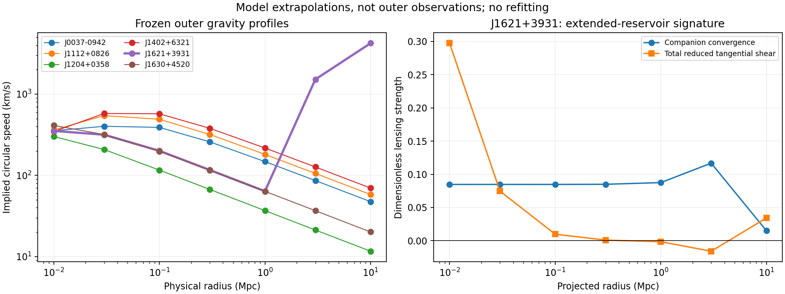

# Photon-Energy Transfer and Companion Deposition

## A phenomenological framework for redshift, additional gravity and reservoir emission in a nonexpanding universe

Working paper v1.4 | 13 September 2026 | Evidence through revision 0756dec

### Abstract

We assess a hypothetical nonexpanding universe in which photons transfer energy to traveling companions that can enter gravitationally active reservoirs. The shared exact-third prescription improves galaxy rotation over ordinary matter alone, but the tested MOND prescription performs better. Freely fitted companion profiles describe six lens galaxies more closely than matched free NFW profiles; their free normalization no longer tests the one-third law or radiation supply. Six Coma shear bins do not distinguish the fitted companion and NFW shapes. A nearby distance-redshift fit gives a conversion gradient c alpha=74.62 km/s/Mpc, versus H0=74.92 for the specified expansion comparator on the same inputs, with indistinguishable residuals at the precision of this diagnostic. A conditional supernova-brightness calibration instead favors 70.48 and retains redshift-dependent residuals. Recent calculations show that an extreme reservoir is not required by the inner data and that circular particle orbits can support the tested profiles in a frozen potential; formation and collective stability remain unresolved. These are useful partial results, not a common derived explanation of redshift, timing, lensing, supply and persistence. Known mathematics, project postulates and fitted rules are labeled separately.

### 1. Motivation and scientific scope

The objective is to ask whether energy originating in radiation can account for some phenomena conventionally attributed to additional gravitating matter, while a related propagation process accounts for redshift without metric expansion. The nonexpanding universe is a stipulated setting of the model, not an observational conclusion of this paper. Observed spectra, stellar motions, lensing images and radiation remain constraints to explain. No particular universe age or total size is imposed.

The absence of an identified dark-matter particle motivates alternatives but is not evidence for this specific mechanism. For example, the LZ collaboration's December 2025 analysis reported no WIMP signal in its stated search range [1]. That result constrains particle properties rather than erasing gravitational evidence. Our companions are likewise unobserved. Calling them radiation-derived rather than primordial does not exempt them from the evidential burden placed on an additional gravitating component.

We distinguish three comparisons: ordinary-matter Newtonian dynamics as a control; specified MOND and dark-halo models as gravitational competitors; and expanding cosmology as a separate propagation and large-scale benchmark. A successful galaxy fit alone cannot establish superiority over all three. Published distances may be adopted as scenario inputs, but their calibration and any dependence on the competing model must be recorded. A distance inferred from the same redshift law under test cannot serve as independent validation of that law.

### 2. Core postulates and unresolved choices

- P1. Photons progressively transfer energy into a companion sector. A surviving photon can have lower energy; simple removal of whole photons is insufficient.
- P2. Traveling companions are taken to propagate at light speed and retain their energy until an interaction. Their microscopic identity, polarization and relation to gravitons remain unspecified.
- P3. Capture transfers energy and momentum into a bound reservoir. The reservoir adds gravity under the reference effective-density prescription. Ordinary matter continues to gravitate.
- P4. The calibrated retention fraction has an exponent fixed to one-third. It is an empirical organizing rule, not a derived fundamental constant.
- P5. A captured reservoir may redistribute internally. Movement to deeper binding releases energy that must be accounted for together with support, heat and outgoing flux.
- P6. Companion-powered emission in black-hole environments is an optional branch. Evaporation of stored rest energy and release of settling energy are distinct mechanisms and must not be counted together as the same available budget.

An environmental time field remains a possible cause of P1, but no unique environmental clock law is established. Low gravity, absolute potential, density, curvature and tidal field are different candidate environmental variables. Substituting one for another changes predictions and requires an explicit choice. A freely chosen time coordinate by itself is not an observable interaction.

### 3. Minimal equations and provenance

#### 3.1 Photon energy and redshift

Assume a local fractional energy-loss coefficient alpha per unit path length. With the standard photon energy-frequency relation, the deterministic reference law is

$$
\frac{dE_\gamma}{d\ell}=-\alpha E_\gamma,\qquad 1+z=\frac{E_{\rm emit}}{E_{\rm obs}}=\exp\left(\int\alpha\,d\ell\right).\tag{1}
$$

Provenance: the exponential solution is known mathematics and appears in other redshift models. Our proposed novelty would be an independently predictive physical equation for alpha, not equation (1). The archived illustrative constant is 0.0002488993 per Mpc; it does not establish broad-spectrum or independent distance-redshift agreement. At 100 million light-years it gives z approximately 0.00766 for the propagation component alone. Source/observer motions and ordinary endpoint gravitational effects must be treated separately.

An arrival-time map is also required:

$$
t_o=F(t_e,\mathrm{path}),\qquad \frac{\Delta t_o}{\Delta t_e}\simeq\frac{\partial F}{\partial t_e}.\tag{2}
$$

Provenance: a general timing identity. Equation (1) does not determine equation (2). A static delay common to both ends of an event does not stretch its duration. The observed supernova width-redshift relationship [2] must be reproduced without using it merely to assign a new arbitrary factor. Different responses of electromagnetic and gravitational signals must also meet the GW170817 timing constraint [3], including source emission-delay uncertainty.

#### 3.2 Transport and capture

For energy densities u and energy fluxes F, a minimal conversion/capture ledger is

$$
\partial_t u_\gamma+\nabla\cdot\mathbf{F}_\gamma=j_\star-Q_{\gamma c},\qquad \partial_t u_c+\nabla\cdot\mathbf{F}_c=Q_{\gamma c}-C.\tag{3}
$$

$$
\partial_t u_d+\nabla\cdot\mathbf{F}_d=C-S_d.\tag{4}
$$

Provenance: standard continuity equations; identifying the exchange terms with companions is proposed. S_d represents an actual energy transfer out of the deposited component and must enter another component or a boundary flux. If settling does gravitational work, kinetic and field-energy terms must be included; these three equations alone are not the full ledger. In a relativistic completion the total stress-energy exchanges must balance. This is not a claim that general relativity has a unique local gravitational energy density.

#### 3.3 Retention and the reference deposited profile

$$
X=\frac{L_{3.6}/(10^9L_\odot)}{(R_d/\mathrm{kpc})^2},\qquad \eta(X)=\frac{X^{1/3}}{1+X^{1/3}}.\tag{5}
$$

Provenance: the Hill-function form is established. Its radiation-density proxy, exponent choice and capture interpretation are project hypotheses. Here L refers to the adopted 3.6-micron luminosity proxy, not a measured total historical incident energy.

$$
a=q_aR_d,\qquad \kappa(r)=\frac{k_0}{[1+(r/a)^2]^2},\qquad J(r)=\frac{1}{2}\int_{-1}^{1}e^{-\tau(r,\mu)}d\mu.\tag{6}
$$

The optical depth tau is the integral of kappa along the incoming ray. The effective stored density is

$$
\rho_d(r)=\frac{2C_0\eta(X)J(r)}{[1+(r/a)^2]^2},\qquad M_d(<r)=4\pi\int_0^r\rho_d(x)x^2dx.\tag{7}
$$

Provenance: ray attenuation, angular averaging and spherical integration are known. The opacity shape and its stored-density interpretation are proposed. The current fitted constants are C0=4.72858924e7 solar masses/kpc cubed, k0=0.2039029004/kpc and qa=2.770766589. C0 is accumulated effective normalization, not a measured companion supply or universe age. The capture radius factor qa differs from the contraction factor s below.

$$
v_c^2(r)=v_b^2(r)+\frac{GM_d(<r)}{r}.\tag{8}
$$

Provenance: standard Newtonian spherical-source gravity with the proposed effective mass inserted. Equating a deposited energy density to mass density via energy divided by c squared is only a nonrelativistic reference closure. Traveling radiation, pressure and field stress require a more complete treatment. No adjustable energy-to-gravity amplification is derived here.

### 4. Optional physical branches retained for investigation

#### 4.1 Phase-dependent settling and its energy outlet

The earlier phase-selector pilot uses an ideal homogeneous Bose-gas criterion:

$$
T=\frac{m\sigma^2}{k_B},\quad T_c=\frac{2\pi\hbar^2}{mk_B}\left[\frac{\rho_d/m}{\zeta(3/2)}\right]^{2/3},\quad f=\max[0,1-(T/T_c)^{3/2}].\tag{9}
$$

Provenance: known ideal-gas statistics, proposed companion application. The adopted kinetic scale is G times enclosed monopole mass divided by 3r; it is not a measured temperature. Fraction f of each original shell is moved to sr and the rest stays. A shared inner-bin fit gives m=17.78 eV/c squared and s=0.8032. These values are effective fit parameters. Massive bound states would have to differ from the original light-speed traveling excitations; thermalization and particle-number behavior are unresolved. Published superfluid models motivate investigating phases [4] but do not derive this recipe.

With companion self-energy Ud, external-potential energy Ub and necessary global support energy K, the cooling requirement is

$$
E_{\rm mech}=K+U_b+U_d,\qquad Q_{\rm settle}=E_{\rm mech,i}-E_{\rm mech,f}.\tag{10}
$$

Provenance: standard energy accounting. Ud includes the self-energy factor one-half; Ub does not. K is assigned from the scalar force virial, a necessary global condition rather than a local equilibrium or stability proof. The tested shared model releases about 4.5e50 J, or about 1.2e-8 of deposited rest energy. A fully cooled solution requires this energy to leave the bound subsystem. Positive energy release alone does not determine the fitted stopping radius. Later coupled circular-endpoint calculations include redistribution of angular momentum to a 30-60 kpc receiving region. Their all-bin RMS changes from 6.34/10.91 to 6.28/8.10 km/s under the two baselines, with release 4.47e50/4.43e50 J. These are endpoint constructions, not evolutionary or collective-stability proofs. Local pressure and saturation alternatives have not supplied a demonstrated joint solution.

#### 4.2 Refraction and relativistic completion

$$
\nabla\cdot[\epsilon(\rho)\nabla\Phi]=4\pi G(\rho_b+\rho_d).\tag{11}
$$

Provenance: density-dependent gravitational permittivity is an existing refracted-gravity approach [5]. Our companion-density driver and retained deposition profile are adaptations. Tested variants do not improve reserved outer Milky Way predictions, so refraction remains a secondary experimental branch. A nonrelativistic Phi does not alone determine light bending: a conventional weak-field metric involves a second potential Psi, and lensing probes their sum. No independent lensing multiplier is adopted.

#### 4.3 Microscopic conversion and environmental time

Photon-graviton mixing in an external magnetic field is an established theoretical process [6], but its ordinary coupling is weak and stationary whole-photon conversion does not redshift surviving photons. A proposed inelastic interaction or time-dependent field must calculate frequency change, photon-number change, momentum transfer, angular scattering and timing together. QED-like and scalar/axion effective-field descriptions remain candidates; string-inspired fields are a source of possible interactions, not numerical predictions without specified couplings [7]. None currently derives equations (1), (5) and (7) together.

For an illustrative Poisson process removing fraction delta per event, mean event count Lambda gives mean energy E0 exp(-Lambda delta) and relative energy variance exp(Lambda delta squared)-1. These are known Poisson identities applied to a hypothesis. At the archived alpha and a 100-million-light-year path, an illustrative added relative linewidth of 1e-5 requires per-event loss below 1.31e-8 and at least roughly 582,000 events. This is a design example, not an observed exclusion limit.

#### 4.4 Companion-powered nuclear emission

$$
L_\gamma=f_\gamma P_{\rm release},\qquad \dot E_{\rm res}=P_{\rm capture}-P_{\rm release}.\tag{12}
$$

Provenance: ordinary reservoir bookkeeping; attributing nuclear power to companions is our optional hypothesis. All released channels must be included. The radiated fraction f-gamma is not the retention fraction eta. Binding-energy release preserves constituent rest mass at Newtonian order; rest-energy evaporation changes the permanence postulate unless replenished. Observed black-hole-environment light is not established Hawking radiation, and no escape from inside a conventional horizon is assumed.

At a Sagittarius A* reference luminosity of 1e29 W or less [8], pure photon output corresponds to about 1.77e-11 solar masses/year of energy. The representative M87 core luminosity 2.7e35 W [9] corresponds to 4.77e-5 solar masses/year; its jet beaming, aperture and excluded mechanical power limit that comparison. These values reconstruct required throughput from observed brightness, rather than predicting brightness. Routing the whole Galactic settling budget through the faint Sgr A* reference channel would take about 1.43e14 years. This ratio imposes no universe age: it instead demands an explicit routing, efficiency and activity-history model.

#### 4.5 Transfer, angular scattering and rate consistency

Subsequent fixed-gap calculations separate the energy removed per interaction from the number of interactions. For independent small steps of energy Delta, the conditional relative energy variance is approximately Delta z/E_emit in the no-removal ladder. Maintaining an illustrative relative linewidth of 1e-5 at z=1 for 2 eV input therefore requires Delta no larger than about 2e-10 eV. Added photon-removal channels impose separate brightness constraints. These are design requirements under the stipulated stochastic process, not measured universal limits. The fractional-loss example above and the fixed-gap ladder are distinct mechanisms.

Finite spatial overlap can narrow scattering but also suppress its total rate. In the tested Gaussian heavy-store approximation, matching a scattering angle that decreases with apparent source size produces a rate proportional to inverse source-distance squared times exp[-(distance/cutoff)^2]. At fixed coupling and target density, the effect then saturates near the source. The favorable angular prescription cannot be combined with an unchanged long-path loss coefficient. A positive continuum of gaps alone also fails to flatten the earlier point-interaction color dependence; inverse-designed spectral responses remain hypotheses.

Source-observer geometry further distinguishes accumulated direction change from apparent image width. One fixed-angle optical example over 30.66 Mpc gives about 0.520 arcseconds apparent directional RMS and 5025 seconds mean geometric delay. A prescribed source-size-tracking kernel gives much smaller moments, but lacks a derived local cause and fails the unchanged-rate Gaussian closure. These are conditional moments, not image fits or gamma-ray timing predictions. A stationary delay distribution does not by itself provide redshift-proportional event dilation.

#### 4.6 Reciprocal loading and finite protected storage

A candidate paired-mode interaction raises a store by Delta while transferring a quantum from energy E_H to E_L=E_H-Delta. Its Hermitian conjugate permits reversal. In an incoherent, equally weighted mode-pair approximation, known bosonic factors give

$$
A=\Gamma n_H(1+n_L),\quad B=\Gamma n_L(1+n_H),\quad r=\frac{B}{A}.\tag{13}
$$

Provenance: standard ladder-operator factors applied to our proposed effective interaction. Forward preference requires n_H>n_L; smooth same-direction thermal occupations do not supply it. Maintained source and escape fields can sustain loading in the tested open-system closure, but their geometry, absolute coupling, recoil and connection to traveling companions are not derived. For a one-step optical route, a 2 eV input contributing 1e-8 eV processes 2e8 times its net assembly power, with most energy remaining in outgoing light rather than heat.

Normalized collective states do not provide a free N-squared first-excitation rate from an empty domain: the factor is N. Partly excited symmetric states can have stronger enhancement, but require preparation energy and enhance reverse transitions too. These are known collective-spin results [12], not new graviton physics. Repeated assembly can succeed despite a small probability per attempt, while requiring large recycled energy traffic; the representative unbiased ladder circulates about 200,000 times its net assembly energy.

Adding one finite protected level and a relaxation mode with occupation n gives, in the zero-protected-decay equilibrium of the tested model,

$$
P_{\rm protected}=\frac{n+1}{n+1+rn}.\tag{14}
$$

Provenance: a derived stationary result of our specified finite-state model. Collective size cancels from this occupancy, although it affects replenishment rates. Fifty-four stationary cases include reverse export and conserve energy. Nonzero leakage requires replenishment; zero leakage is a stipulated lifetime, not an explanation of permanence. One finite level also cannot accumulate unlimited energy.

When the full fitted Milky Way energy inventory is assigned to tiny single-excitation sites, the illustrative site/mode ratios become extremely large. A particular homogeneous escape closure requires protected lifetimes above roughly 1e32-1e41 years for its 120 kpc, 90%-protected examples. These are conditional required lifetimes, not cosmic-age constraints. Larger collective release quanta can ease mode crowding, but require a consistent assembly, reverse-transfer and protection mechanism. Thermal and nonthermal outgoing channels remain separate alternatives; energy in transit is not deposited energy.

#### 4.7 A threshold interpretation of the one-third reference

The reference response has an exact representation as a capacity-weighted mixture of ordinary saturation laws. With positive threshold t and exponent q,

$$
\rho_q(t)=\frac{\sin(\pi q)}{\pi}\frac{t^{q-1}}{1+2t^q\cos(\pi q)+t^{2q}}.\tag{15}
$$

$$
\int_0^\infty\frac{X}{X+t}\rho_q(t)\,dt=\frac{X^q}{1+X^q},\qquad q=\frac{1}{3}.\tag{16}
$$

Provenance: known positive fractional-response mixture mathematics [13]. Selecting this distribution from the desired curve is inverse design, not a first-principles derivation of one-third. Equilibrium occupied capacity is not automatically permanent capture efficiency. A physical model must derive the threshold weighting and connect it to the incident field and stored mass.

Truncating and renormalizing this distribution to thresholds from 1e-6 to 1e6 changes predicted rotation speeds by at most 0.640 km/s across the existing 149 galaxies without refitting. A narrower 1e-3 to 1e3 range changes some speeds by 7.03 km/s and worsens aggregate validation/test velocity RMSE. Broad cutoffs preserve the reference by construction; they neither establish the distribution's existence nor improve its main residuals.

#### 4.8 Formation history and retention after fading

One explicit local kinetics is df_t/dtime=lambda[X(1-f_t)-t f_t]. From empty storage under constant X, its standard solution is

$$
f_t(u)=\frac{X}{X+t}[1-e^{-(X+t)u}],\qquad u=\lambda\,\Delta t.\tag{17}
$$

Provenance: known linear rate-equation solution; applying a shared lambda and the selected threshold distribution to companions is hypothetical. The overall time scale is undetermined. Across the catalogue inputs, reaching 90% equilibrium takes dimensionless durations from 0.08478 to 102.462. Shared-duration scans produce mixed score changes and do not select a new preferred law.

After individually stopping the source at that target, losing the first 10% of formed storage takes 4.92%-41.79% of the formation time. This ratio is independent of lambda and uses no universe age. A slower residual tail persists, but does not make the whole reservoir permanent. These controlled histories are not observations of the named galaxies and do not model continued distant illumination. Equilibrium requires balancing capture and release; a successful amplitude fit does not establish the required energy throughput.

#### 4.9 Local capacity, external illumination and recycling

Write A=2 C0=9.45717848e7 solar masses/kpc cubed for the unadjusted reference source amplitude, and g(r)=[1+(r/a)^2]^-2. An audit corrected earlier capacity and recycling inventories that had used C0 where A was required. Equation (7) and the original lens calculations already contained the factor two. The correction doubles affected absolute mass inventories; the previously reported mass-ratio-based velocity predictions and scores are unchanged.

The tested alternative profiles are

$$
\rho_{\rm ref}=A\eta(X)Jg,\quad \rho_{\rm local}=A\eta(XJ)g,\quad \rho_{\rm recycle}=A\eta(X)g.\tag{18}
$$

Provenance: the exact-third Hill response and attenuation operations are known forms; placing local incident intensity inside the response and specifying companion recycling are project hypotheses. The branches are alternatives, not terms to add together. Local filling uses the prescribed full-opacity field. A separate occupancy-dependent-opacity calculation uses kappa=k0 g[1-eta(XJ)] and solves its stationary incident field self-consistently with escaping release. It does not establish formation or support.

For isotropic same-channel return with unit return fraction, a constant normalized intensity i=J=1 exactly balances capture and release in the stationary transport equation. This gives the recycling profile in (18). It is an energy-conserving stationary bath with no net bath sink, not a derivation of how an initially empty reservoir forms or persists after illumination stops. Its total spherical stored mass is pi squared times A eta(X) a cubed. Momentum transfer and gravitational support still require their own equations.

With kappa=k0 g and isotropic illumination, the effective capture cross section follows from integrating 1-exp(-optical depth) over impact parameter. If available capacity is A Jg, the total capacity mass equals (A/k0) times that cross section. Thus increasing collection area also increases capacity: area alone does not establish a greater energy supply per unit required stored mass. Source luminosities and histories remain needed.

A residual external floor can prolong storage without fixing a universe age. In the selected threshold kinetics, retaining at least 90% of the initial equilibrium occupancy indefinitely requires a remaining intensity between approximately 34% and 69% of the initial intensity across the catalogue. An additive common background large enough to meet that target does not improve the matched galaxy comparison. No observed external companion field has been measured by this inversion.

#### 4.10 Joint lensing and stellar motions

The lens comparison freezes capture amplitudes from galaxy training and then fits stellar mass and constant orbital anisotropy to inner stellar-motion bins. The same mass profile determines bending. Under the two stellar-population proxies, the refined adjusted reference gives lens-angle fractional RMS 13.068%/13.187%; full recycling gives 13.045%/13.161%. The tiny gain occurs in only three of six objects under each proxy and does not repair the rotation or outer-motion discrepancies. The adopted lens angles are catalogue SIE summaries rather than fits to raw lens images; the nonexpanding optical geometry is conditional.

At these fixed motion-fitted stellar masses, stars alone overpredict the required bending in J0037-0942, J1204+0358 and J1402+6321. In the adjusted-reference Chabrier calculation, even removing every companion would require stellar masses lower by at least 12.98%, 12.58% and 15.00%, respectively. This rules out merely subtracting positive companion bending at those fixed stellar fits. It does not rule out a joint change of stellar mass, orbital structure or geometry.

A subsequent diagnostic consumes the lens angle to determine stellar mass, then fits the motions at that mass. Exact lens agreement in this experiment is calibration, not a successful lens prediction. Two distinct nuisance-model extensions were tested separately. One uses a radially varying stellar mass-to-light ratio; the other uses a known smooth anisotropy family [14]:

$$
\Upsilon(r)=\Upsilon_{\rm out}\left[1+\frac{h}{1+(r/R_e)^2}\right].\tag{19}
$$

$$
\beta(r)=\beta_0+(\beta_\infty-\beta_0)\frac{r^2}{r^2+R_e^2}.\tag{20}
$$

Provenance: (19) is a chosen phenomenological gradient, not a derived companion law or a claim of a unique new mathematical form. Equation (20) is a specialization of established orbital-anisotropy models [14]. Beta measures radial versus tangential velocity dispersion; it does not change the deposited density. Re is fixed to the projected half-light radius. These initially separate extensions are combined in the later diagnostics below; neither changes the shared companion reference law.

The gradient allows h from -0.8 to 9, keeps density positive, and only modestly reduces the large inner-motion cost of the lens-required masses. Increasing the permitted gradient to much larger values in boundary cases still leaves large residuals. For radial anisotropy, initially both endpoints lie between -2 and 0.45. The same three difficult galaxies hit the outer bound. An adaptive follow-up allows their outer endpoint to reach 0.95; all three hit that new bound. Remaining systems retain their earlier interior fits. The improved combined result is therefore a tested configuration, not a demonstrated global optimum.

#### 4.11 Necessary orbital consistency, not established stability

For a spherical separable augmented-density construction with central anisotropy beta0<=1/2, a nonnegative distribution function must satisfy [15]

$$
\gamma(r)=-\frac{d\ln\nu}{d\ln r}\ \geq\ 2\beta(r).\tag{21}
$$

Provenance: established stellar-dynamical inequality [15], not a companion prediction. Nu is stellar tracer density, not total gravitating density. Separability is a candidate completion of the fitted moments, not something those fits established; the criterion is not universal for arbitrary orbital distributions and is not sufficient for positivity.

Using the same multi-component Sersic light profiles, all 12 original-bound configurations and six expanded-bound configurations show no violation on 4097 logarithmically spaced radii from 1e-6 to 100 Re. Minimum margins gamma-2 beta are 0.32422 and 0.32546, respectively. Doubling deprojection quadrature changes gamma by at most 2.14e-14; an independent numerical log-density derivative differs by less than 7.27e-5 away from grid edges. This finite-grid check includes extrapolated light profiles and is not an all-radii proof. It leaves the orbital candidates open but does not construct their distribution functions in the actual potential, demonstrate stability, or alter their remaining motion residuals.

### 5. Executed results and limits of the evidence

The project record contains both successes and failures. Parameter selection and previously inspected observations must not be described as blind tests. Reported RMS values are descriptive, not likelihood-based evidence for the entire theory.

| Test | Current result | What it establishes |
|---|---|---|
| SPARC rotation, 149 galaxies | Companion validation/test RMS 32.49/23.59 km/s; MOND 26.88/16.40 | Companions improve the ordinary-only control, but tested MOND is better |
| Six Coma shear bins | Companion/NFW omitted-bin sums 6.86/6.82 | Comparable freely fitted shapes; no transferred supply normalization |
| Six lens galaxies, updated transfer | Adjusted reference 13.07%-13.19%; recycling 13.05%-13.16% lens-angle RMS | Small change, with a material unresolved motion/lensing discrepancy |
| Earlier imposed Milky Way settling | Inner RMS 3.68/11.83 becomes 2.74/6.70 km/s | A shared conditional inner-fit improvement under two matter baselines |
| Earlier pilot outer bins | RMS remains 8.36/9.78 km/s | No outer improvement from the selected central rearrangement |
| Refraction sweep | No selected outer improvement | No reason to promote the tested refraction family |
| Coupled Milky Way endpoints, 30-60 kpc receiver | All-bin RMS 6.28/8.10 km/s | Conditional angular-momentum and energy accounting, not stability |
| Finite thresholds, 149 galaxies | 12-decade range shifts speeds at most 0.640 km/s | Preserves reference approximately; no improved main residuals |
| Threshold histories, 149 intensity inputs | First 10% loss takes 4.92%-41.79% of formation time | Conditional kinetics, not observed galaxy ages |
| Reciprocal protected reservoir | 54 stationary cases; balanced energy flows | Replenishment can improve; permanence remains assumed |
| Nuclear release | Energy-throughput estimates only | A possible diagnostic channel, not a predicted spectrum or luminosity |

SPARC inputs [10] have 89 training, 29 validation and 31 test galaxies in the project split; all have been exposed during development. Companions have three shared fitted constants versus one for the tested MOND law. Restricted shared NFW mappings and per-galaxy NFW fits use different information budgets and cannot be pooled into one ranking. The Milky Way phase pilot uses a spherical gas monopole and two archived stellar baselines, with 20 inner bins for selection and 18 outer bins for comparison. It is not a comparison of two independent galaxies or individual bulge-star orbital predictions [11].

Earlier wave/particle support, saturation, inward migration and coupled exchange tracks remain in the research record. None supplies a demonstrated joint solution for stability, absolute supply and lensing. Numerical mass/energy checks and refinement protect against implementation errors; they do not verify the physical assumptions. The accompanying cross-scale-performance.md and linked executable reports contain the detailed audit trail.

#### 5.1 Matched galaxy comparisons

Each new row below refits only the shared amplitude on the same 89 training galaxies using equal-galaxy velocity mean-square error. Other shared reference parameters remain fixed. This objective differs from the original calibration, so the adjusted reference is the relevant matched control. All partitions have already been inspected. Scores are equal-galaxy RMSE in km/s, not pooled point errors.

| Profile or closure | Training | Validation | Test |
|---|---:|---:|---:|
| Adjusted reference | 26.87 | 30.82 | 21.41 |
| Local filling, prescribed field | 28.75 | 28.63 | 25.19 |
| Occupancy-dependent transport | 29.44 | 28.64 | 26.70 |
| Full same-channel recycling | 30.77 | 28.82 | 30.88 |
| Local finite formation, selected duration | 28.55 | 29.41 | 25.93 |

Better validation scores accompanied by worse test scores do not establish a preferred replacement. The finite-formation row selects dimensionless duration 10 from the training scan; it is not a measured galaxy age. None of these rows derives the absolute companion supply.

#### 5.2 Cost of imposing the lens angles

Each entry below gives Chabrier/Salpeter population-proxy results summed across the same six systems. Inner chi-squared uses the measured covariance; outer scores sum squared covariance-conditioned standardized residuals. These are separately reported diagnostics from the earlier inner-bin fits. With the stated full covariance, their sum equals the all-motion chi-squared; this identity is used in the subsequent all-bin analysis. Gradient and anisotropy extensions in this historical table are separate experiments.

| Stellar prescription | Inner chi-squared | Outer residual-square sum |
|---|---:|---:|
| Free mass, constant anisotropy | 45.81 / 45.27 | 55.01 / 53.42 |
| Lens-required mass, constant anisotropy | 611.48 / 613.61 | 136.23 / 134.17 |
| Lens-required mass, stellar gradient | 471.64 / 476.53 | 129.03 / 127.53 |
| Lens-required mass, radial anisotropy | 447.76 / 453.84 | 103.09 / 101.47 |
| Expanded outer-anisotropy follow-up | 106.88 / 105.62 | 115.71 / 114.32 |

The expanded-orbit fit is a substantial inner improvement, but its outer score remains worse than the free-mass control and the previous radial-bound fit. For J1204+0358 and J1402+6321, Chabrier outer standardized residuals remain about 6.98 and 6.54. These conditional residuals are not model-independent exclusion significances. Passing (21) does not remove this discrepancy.

#### 5.3 Combined stellar freedoms and matched controls

Combining equations (19)-(20) initially reduces inner chi-squared to 82.40/81.67, but six of twelve configurations violate (21) near their extrapolated centers. Refitting with the necessary condition enforced gives 87.58/86.79. The adopted light profiles have central tracer slope 0.75, imposing beta0<=0.375 for the specified completion. This repairs that necessary-condition failure; it does not construct physical orbital distribution functions.

Subsequent fits consume all forty motion bins with their covariance. Releasing the orbital transition radius replaces Re in (20) by ra, while the stellar gradient scale in (19) remains Re. This is the same established anisotropy family [14], with one more fitted stellar parameter. The imposed ranges are h in [-0.8,9], beta0 in [-2,0.375] subject also to the sampled slope condition, beta_infinity in [-2,0.95], and ra/Re in [0.1,10]. Central and 8193-point final slope checks pass; positivity and stability remain unproved.

| Model | Local fitted parameters per galaxy | Total motion chi-squared |
|---|---:|---:|
| Transferred companion, fixed ra=Re | 3 | 159.83-161.81 |
| Transferred companion, free ra | 4 | 111.27-113.56 |
| Matched stellar-only, free ra | 4 | 175.09 |
| NFW with free scale and strength | 6 | 49.71 |
| Companion with free scale and strength | 6 | 26.49 |

The population-proxy ranges describe the same six galaxies, not independent repetitions. Stellar normalization is additionally determined using each catalogue lens angle in every row; the count lists parameters optimized against motions. The stellar-only control omits separate gas and central-black-hole components, as do its matched companion comparisons. The transferred profile improves aggregate chi-squared by 35%-36%, but only J0037-0942 and J1402+6321 improve; the other four slightly prefer the stellar-only control. J1402+6321 still contributes approximately 57% of the transferred profile's residual.

Restricted NFW shapes with radius fixed to 0.3, 1 or 3 times the reference capture scale and normalization fixed to the companion bending give 162.62-194.57. Releasing NFW scale and strength reduces this to 49.71. The restricted comparison therefore cannot establish general superiority over dark halos. The NFW density rho_s/[x(1+x)^2], x=r/rs, is established literature [16], used here as a gravitational comparator without adopting its cosmological formation assumptions. Its ideal untruncated total mass diverges logarithmically and is not treated as a finite source inventory.

#### 5.4 What the freely fitted companion profile establishes

The matched free-companion diagnostic keeps the shared opacity coefficient k0 fixed, recalculates attenuation for each capture scale ac, and fits a positive stored-density amplitude D:

$$
\rho_d(r)=D\,J(r;a_c,k_0)\left[1+(r/a_c)^2\right]^{-2}.\tag{22}
$$

Provenance: attenuation and integration are established operations; the opacity shape and its interpretation as deposited companion density are project hypotheses. Equation (22) is a diagnostic relaxation of the reference profile, not a newly derived interaction. The fitted ranges are ac/Re in [0.1,100] and companion fraction of required lens bending f in [0,0.95]. For unit-density bending d_unit, D=f alpha_required/d_unit; remaining bending calibrates stellar mass. This is a calibration identity, not an energy-source calculation. A free D absorbs the factor eta(X), so these fits cannot validate the exponent one-third.

| Galaxy | Free NFW chi-squared | Free companion chi-squared | Fitted ac/Re |
|---|---:|---:|---:|
| J0037-0942 | 9.265 | 4.615 | 1.963 |
| J1112+0826 | 17.641 | 9.060 | 2.532 |
| J1204+0358 | 13.945 | 8.169 | 0.100 |
| J1402+6321 | 4.494 | 0.420 | 2.078 |
| J1621+3931 | 2.820 | 2.762 | 100.000 |
| J1630+4520 | 1.548 | 1.468 | 0.100 |

Both free families use 36 local motion-fitted parameters across forty motion measurements, plus consumed lens calibration. Active bounds, shared inherited assumptions and prior inspection of every target prevent interpreting the lower raw chi-squared as independent validation or a complexity-adjusted verdict. Numerical direct-profile polishing and refinement support the score precision, not physical correctness or a global optimum.

The compact J1204+0358 and J1630+4520 fits require density amplitudes approximately 2352-2445 and 493-514 times their respective reference values. These are density ratios, not total-mass multipliers. J1621+3931 instead reaches ac about 877 kpc and implies 8.42e16 solar masses within the numerical grid. Since J<=1, its positive exterior tail obeys

$$
M_d(>R)\leq\frac{4\pi D a_c^4}{R},\qquad E_d=M_d c^2.\tag{23}
$$

Provenance: the bound is ordinary integration of rho_d<=D ac^4/r^4. The energy relation is the reference effective-mass closure using established mass-energy equivalence, not a unique local gravitational-field energy definition. The tail adds at most about 1.30% for J1621+3931. Its interior energy equivalent is about 1.51e64 J; no source history supplies this in the current calculation. No universe age or size is imposed to close that deficit.

Crucially, the same galaxy's stellar-only chi-squared is 3.09385, compared with 2.76199 for the enormous free reservoir: a raw improvement of only 0.33186 with added freedom. This endpoint comparison does not show that the data require the enormous mass. The now-executed fixed-scale scan quantifies this tradeoff in Section 5.6. The extreme reservoir is one nearly degenerate fitted branch, not a measured inventory. No free-fit parameters replace the shared exact-third reference.

#### 5.5 Frozen outer predictions and the extended-envelope degeneracy

Without further fitting, the six selected companion profiles have been projected to physical radii from 10 kpc to 10 Mpc. Standard spherical circular dynamics and thin-lens relations [17] give

$$
v_c^2(r)=\frac{G M(<r)}{r},\quad \kappa=\frac{\Sigma}{\Sigma_{\rm crit}},\quad g_t=\frac{\bar\kappa-\kappa}{1-\kappa}.\tag{24}
$$

Provenance: these are established gravitational relations. Their application assumes the reference effective-density response and the recorded conditional source geometry; it is not a new conversion law. Here Sigma_crit=c^2/[4 pi G Dl(Dls/Ds)] and bar kappa=M_2d/(pi R^2 Sigma_crit). Circular speed is an ideal orbit diagnostic, not the velocity of every observed star or satellite.

J1621+3931 has negligible extra enclosed mass through the inner few hundred kpc, but almost constant companion convergence near 0.0847 there. Spherical exterior shells exert no interior Newtonian acceleration while contributing to projected lensing. Thus a distant envelope can change bending without comparably changing inner stellar motions. This geometrical degeneracy explains how the large reservoir survives the inner fit; it does not explain how the reservoir forms.

| J1621+3931 radius | Implied circular speed (km/s) | Total reduced tangential shear |
|---|---:|---:|
| 100 kpc | 200.72 | 0.009849 |
| 1 Mpc | 63.76 | -0.001454 |
| 3 Mpc | 1520.51 | -0.015756 |
| 10 Mpc | 4236.46 | 0.034307 |

The scanned circular-speed maximum is approximately 4246 km/s near 9.17 Mpc. At the adopted lens distance, 3 and 10 Mpc correspond to about 13.7 and 45.6 arcmin. Negative tangential shear denotes radial image stretching, not repulsive gravity. These are extrapolated model predictions without new observed outer velocities or shear. Comparisons must include source distances, foreground structure, environmental mass and nonspherical geometry; a nearly constant convergence is not directly measured by shear alone.

No additional critical curves are found over the finite 0.01-10000 kpc scan beyond the inner radial/tangential pair. J1621+3931 has maximum sampled compactness 2GM/(rc^2) about 4.01e-4 and near-central potential magnitude about 4.79e-4 c^2. The large mass is diffuse, so its size alone is not an automatic horizon or extra-ring argument. These diagnostics do not establish stability, relativistic completion or the accuracy of isolated thin-lens geometry over this environment.

An initial unsplit angular projection failed a central critical-curve refinement check; splitting at capture-scale crossings resolved the distant-envelope contribution. Final catalogue mean-convergence normalization agrees within 1.55e-6, projected-mass derivative consistency within 3.07e-7 in convergence, and refined critical eigenvalue residuals within 1.22e-8. These are numerical checks rather than measurement uncertainties.

#### 5.6 Updated reservoir assessment: degeneracy and support

Refitting five other local parameters at seven fixed J1621 capture scales changes the interpretation of its extreme mass. The ac/Re=10 branch has 1.73e14 solar masses, about 486 times less than the ac/Re=100 branch, while motion chi-squared changes only from 2.76199 to 2.76284. The stellar-only value is 3.09385. Inner observations therefore do not select a large inventory. These are profile scans of previously fitted data, not confidence limits from a full nuisance-parameter analysis.

Less mass is not simply a weaker version of the same outer field. At 300 kpc the ac/Re=10 branch predicts circular speed 842.67 km/s and reduced tangential shear 0.03823, versus 116.39 km/s and 0.000984 for ac/Re=100. The mass has moved inward. Compact and stellar-only branches instead give nearly identical outer predictions. These are frozen extrapolations without new outer observations; environment and source geometry must be included before comparison.

A necessary support test excludes spherical bound collisionless isotropic particles for four of the six free profiles and five of six transferred Chabrier profiles: their deposited density rises outward in an attractive potential. For a nonnegative isotropic distribution f(relative energy), established phase-space integration requires density to increase with relative potential, which decreases outward. This objection concerns deposited particles, not the separately fitted stellar orbits. Passing the condition is not sufficient for a physical distribution function.

An explicit alternative uses randomly oriented circular particle orbits, with no mean rotation but nonzero tangential stress. In the frozen spherical potential,

$$
v_c^2=GM/r,\qquad p_r=0,\qquad p_\theta=p_\phi=\rho_d v_c^2/2,\qquad \omega_r^2=G(M+rM')/r^3>0.\tag{25}
$$

Provenance: established circular dynamics, Jeans balance and an Einstein-cluster-type construction [24], not a new companion interaction. The calculation supports all six free profiles and four nonzero J1621 branches in this singular, fully tangential idealization. Positive omega_r squared establishes individual radial stability in the frozen field, not collective stability or a formation history. The extreme branch has orbital kinetic energy about 1.05e60 J, or 6.97e-5 of its effective mass-energy. Binding release may supply this kinetic energy, so it must not automatically be counted as a second external budget. Incoming light-speed companions still need a momentum-exchanging interaction to populate slow bound orbits. Net zero angular momentum does not eliminate individual orbital angular momentum.

#### 5.7 Newtonian, MOND and dark-halo rotation comparisons

The common 149-galaxy SPARC sample includes gas and uses fixed published distances, inclinations and disk/bulge mass-to-light ratios 0.5/0.7. The original fits minimize equal-galaxy mean squared log10 speed. The following equal-galaxy speed RMSE values are descriptive summaries of those fits, not the fitting objective. There are 89 training, 29 validation and 31 test galaxies, all exposed during development.

| Prescription | Shared fitted parameters | Validation RMSE (km/s) | Test RMSE (km/s) |
|---|---:|---:|---:|
| Ordinary-matter Newtonian | 0 | 58.22 | 47.77 |
| Exact-third companion | 3 | 32.49 | 23.59 |
| Simple MOND, fitted a0 | 1 | 26.88 | 16.40 |
| Simple MOND, fixed a0 | 0 | 26.24 | 16.49 |
| NFW, imposed shared scaling | 3 | 35.18 | 40.54 |

The tested MOND rule [22] and the spherical Newtonian acceleration relation are

$$
g_N=GM_b(<r)/r^2,\qquad g_{\rm MOND}=g_b/2+\sqrt{g_b^2/4+a_0g_b}.\tag{26}
$$

Provenance: established Newtonian gravity and the known simple MOND interpolation, not our formulas. In the actual disk comparison g_b comes from the supplied gas, disk and bulge rotation contributions rather than a spherical enclosed-mass approximation. Fitted a0=8.5633e-11 m/s squared; the fixed control uses 1.2e-10. This algebraic MOND comparison is not a full nonspherical field solution with external-field effects or a relativistic lensing theory.

The NFW row imposes rs=s Rdisk and rho_s=rho0 X raised to a shared fitted power. Its fitted s reaches the upper bound 100. This restrictive galaxy-to-halo mapping is a project choice, not a general prediction of dark matter. A separate outer-radius experiment fits two halo parameters to each target's inner 60% of radial points:

| Model on outer 40% only | Uses target inner motions? | Validation RMSE | Test RMSE |
|---|---|---:|---:|
| Ordinary matter | No | 68.77 | 61.53 |
| Shared exact-third | No | 33.23 | 29.20 |
| Shared fitted MOND | No | 22.14 | 16.79 |
| Per-target NFW | Yes | 16.14 | 20.07 |

Units are km/s. These scores use the same 60 comparison galaxies but different radial subsets from the first table. NFW consumes more target information; 41 of 60 fits meet a parameter bound. Outer points were excluded from those local fits but were previously inspected. Neither table supports general superiority over dark matter. Section 5.1 uses a different velocity-space objective and must not be mixed into this ranking.

#### 5.8 Cluster comparison and missing gravitational controls

The Coma diagnostic reconstructs six shear points from Kubo et al. [23], retains the negative outer point and uses the plotted diagonal errors. Its NFW all-bin chi-squared 3.85 approximately reproduces the publication's 3.87, correcting the impression that NFW inherently fits this cluster poorly. No independent source inventory is supplied to the companion normalization.

| Fitted shape | All-six chi-squared | Omitted-bin residual-square sum |
|---|---:|---:|
| Transparent companion | 3.68 | 6.86 |
| Strong-interception companion | 3.72 | 10.79 |
| NFW | 3.85 | 6.82 |
| Compact-baryon MOND approximation | 4.46 | 19.62 |
| Point-mass control | 7.36 | 32.17 |

Each omitted-bin score refits the remaining five bins. This is a small, already exposed shape diagnostic without the original full covariance. Free amplitude absorbs the retention factor and external radiation supply, so it does not test one-third retention. NFW represents a total fitted shape here, rather than a separately measured gas-plus-halo decomposition. The MOND row assumes compact baryons and an imposed equal-potential lensing response, with freely adjusted amplitude and scale; it is not transfer of the galaxy a0 into a realistic extended cluster. The point mass is a numerical control, not a viable ordinary-matter cluster model.

A matched extended-baryon Newtonian/GR and MOND cluster calculation remains absent. A matched MOND analysis of the six lens galaxies is also absent. Their stellar-only lens control uses ordinary stellar gravity with GR weak-field light bending; it does not apply a Newtonian particle-deflection formula to photons. Those missing comparisons prevent claiming that success on galaxies and clusters makes the theory better than MOND. The six lens galaxies, Coma and the Milky Way pilot have different data, fitted freedoms and score definitions; their raw residuals cannot be added into a global evidence score.

#### 5.9 Conversion rate versus the Hubble constant

Our constant-alpha law has a low-redshift gradient with familiar Hubble units:

$$
H_{\rm conv}\equiv c\alpha=c\left.\frac{dz}{dD}\right|_{D=0},\qquad z=\exp(H_{\rm conv}D/c)-1.\tag{27}
$$

Provenance: a definition and the known exponential solution of (1), not a novel expansion equation. H_conv measures fractional photon-energy transfer per distance. The actual expansion rate is zero in the stipulated static background; H_conv is not that rate and its inverse is not an inferred universe age. No physical theory yet derives its fitted value.

For a specified expansion comparator we use the established flat FLRW distance relations [18], with Omega_m=0.3, Omega_Lambda=0.7 and radiation neglected:

$$
D_C(z)=\frac{c}{H_0}\int_0^z\frac{dz'}{\sqrt{0.3(1+z')^3+0.7}},\qquad D_L=(1+z)D_C.\tag{28}
$$

Provenance: known cosmological relations, used only as a competing explanation. Present-day comoving distance is not the distance a photon physically traveled. The nearby comparison holds the supplied published distances fixed and interprets them alternatively as static path distance or comoving distance; it is a conditional curve comparison, not a reanalysis of the distance measurements under both theories.

| Same nearby inputs | Fitted scale (km/s/Mpc) | Eight-region omitted-region RMS (km/s) |
|---|---:|---:|
| Conversion, path | 74.618 | 450.716 |
| FLRW, comoving | 74.922 | 450.502 |
| Conversion, luminosity sensitivity | 75.176 | 450.358 |
| FLRW, luminosity sensitivity | 76.038 | 450.074 |
| Linear distance-redshift control | 75.177 | 450.358 |

There are 164 recovered galaxy groups at 10.20-93.20 Mpc. Scales use 104 training groups; each eight-region score instead refits on the other seven regions and aggregates predictions across all 164. The old 25-group test RMS is 415.41 versus 414.99 km/s for the first two rows. Paired sky bootstrap 95% intervals for the conversion-minus-expansion RMS difference span zero: approximately [-0.95,1.39] km/s for the first pair and [-2.98,3.58] for the luminosity pair. These diagnostics do not resolve a difference, but they do not establish statistical equivalence or parity on other cosmological observations. Peculiar motions, distance calibration and frame uncertainties remain material.

The luminosity sensitivity row uses stationary photon-number-conserving conversion, D_L=r sqrt(1+z). It is an alternative interpretation of the supplied distances, not a physical recalibration of surface-brightness-fluctuation measurements. It also differs from the event-stretched brightness branch below. These alternatives must not be combined as one tested model.

For scale, a 100-million-light-year static path gives z=0.00766048: a 500 nm photon becomes 503.830 nm and transfers 0.7602% of its energy. Those are predictions of the fitted rule, not a measurement of a particular galaxy. The wavelength change does not by itself stretch an event's duration.

| Rate determination | Value (km/s/Mpc) | Meaning and uncertainty |
|---|---:|---|
| Our nearby H_conv | 74.62 | Training sky-bootstrap 95% range 72.42-76.89; incomplete systematics |
| Our supernova-brightness H_conv | 70.48 | Formal delta-chi-squared-one range 69.47-71.49; conditional propagation law |
| Our same-input FLRW H0 | 74.92 | Fixed 0.3/0.7 comparator above; not a precision external result |
| Planck base flat LCDM [19] | 67.4 +/- 0.5 | CMB-inferred H0 conditional on that cosmology |
| SH0ES 2022 [20] | 73.04 +/- 1.04 | Cepheid-supernova distance ladder, reported uncertainty |
| Local Distance Network 2026 [21] | 73.50 +/- 0.81 | Covariance-aware combined local distance indicators |

The last three rows are published context, not fits to our sample. Their calibrations and assumptions differ, and the local estimates are not independent of each other. Our bootstrap range and formal likelihood interval are not interchangeable one-sigma errors. Numerical proximity to a published H0 is not evidence for photon conversion. We do not resolve the Hubble tension by renaming or retuning the slope.

The brightness branch assumes event stretching by 1+z and a static beam, giving F=L/[4 pi D squared (1+z) squared]. With 77 calibrator rows, 466 training rows at 0.1<=z<0.3 and 494 higher-redshift comparison rows, refitting alpha yields H_conv=70.475 and reduces comparison chi-squared from 424.48 to 391.84. Residual means still rise from about 0.062 mag at z=0.3-0.6 to 0.225 mag at z=1-3. A constant alpha changes only the magnitude normalization in this branch; it cannot remove that trend. A separately fitted regular beam-area branch reduces the higher-redshift score to 389.18 while retaining a roughly 0.116 mag highest-bin residual. These are exposed-data alternatives, not a common completed law. A matched full FLRW supernova likelihood with identical calibration, covariance and nuisance choices has not been executed here.

#### 5.10 Propagation tests beyond a redshift curve

The following diagnostics test different parts of the proposed propagation mechanism. Each must eventually follow from the same physical law.

| Observable | Executed result | Consequence for the common model |
|---|---|---|
| Supernova spectral aging, 35 rows | Stationary-duration chi-squared 150.57; 1+z stretch 26.95 | Energy loss alone leaves the event-duration problem |
| Brightness repaired by timing alone | Required exponent 1.481; aging chi-squared 47.06 | More delay cannot freely substitute for missing dimming |
| GW170817 timing | Photon-only affine-time branch predicts about 674646 years extra flight time | That differential-delay branch fails the observed near-coincidence |
| Limited radio comparisons | Two independent centroid groups, three methanol lines | Common fractional shift is not excluded there; not all-spectrum validation |
| Microwave spectrum, 43 FIRAS channels | Tested number-retaining thermal history fails | A blackbody origin and transfer law remain to be supplied |

The observed GW/gamma arrival separation is 1.74 +/- 0.05 seconds [3], with source emission delay uncertainty. The huge calculated delay belongs to a specific photon-only time law at 40.7 Mpc; it is not a generic consequence of redshift or a measured lag. Equal GW and electromagnetic propagation can cancel their common delay, but that response has not been derived from the energy-transfer mechanism. Constant-speed energy transfer avoids that particular differential-delay calculation while leaving event stretching unexplained. DES reports duration scaling (1+z) raised to b, with b=1.003 +/- 0.005 statistical +/- 0.010 systematic [2]. Source-population assumptions matter, but the duration data remain constraints in the fictional universe. The standard expansion benchmark links wavelength and duration stretching; our proposed mechanism must supply its own common derivation.

There is no executed joint likelihood covering CMB angular structure, baryon acoustic patterns, abundances and all the foregoing tests for our model. Synthetic multiband predictions are not observations. Newtonian gravity alone and a halo density profile alone are not competing cosmological redshift theories, so assigning either a standalone H0 score would misstate the comparison.

### 6. Evidence that would materially strengthen the theory

The following outcomes are the main work program. Each explains what is needed and why failure matters. They are not claims already achieved.

1. A common mechanism with fewer adjustable choices. Specify an interaction and local state equations that yield conversion, capture and support with shared constants. Derive the one-third exponent or replace it with a better justified prediction. Otherwise independent fitting rules can conceal incompatible physics.

2. Absolute supply from independently constrained radiation. Integrate source luminosities, travel, capture, retention and release, keeping age/history as explicit inferred parameters rather than choosing unlimited history to rescue a deficit. Predict effective stored gravity without fitting C0 separately to the needed mass. Otherwise we have renamed a missing-mass profile rather than explained its origin.

3. Redshift and time stretching from the same propagation law. Use distances independent of redshift, control velocities, predict the same fractional spectral shift across tested bands, and reproduce event durations, sharp images and brightness. Include GW/EM timing. Otherwise matching a distance-redshift curve alone does not explain the observed propagation phenomena.

4. Joint motion and lensing prediction. Use one relativistic response and one deposition profile to predict circular speeds, stellar velocity distributions and strong/weak lensing in the same objects. Include distances, gas, mass-to-light and orbit uncertainty. Otherwise a rotation success cannot repair a lensing failure through an unrelated correction.

5. Genuine transfer to untouched systems. Freeze parameters and analysis choices, then predict additional galaxies and clusters spanning surface brightness, gas content, morphology and environment. Compare residuals, scatter and parameter burden against properly specified MOND and dark-halo models with identical inputs. Otherwise in-sample improvement may reflect flexibility or selection.

6. Formation, stopping and persistence. Solve evolving density, pressure or orbital support, angular momentum and cooling, including feedback from the companion field. Check Solar System and binary constraints in the appropriate limits. Otherwise a useful profile may never form, may collapse, or may disrupt systems already explained well.

7. A radiation prediction distinct from ordinary sources. From the same fixed settling law, predict where energy emerges, its spectrum and variability before using measured brightness. Test both diffuse emission and the optional nuclear channel, including nondetections and jet mechanical power. Otherwise any observed glow can be assigned to companions after the fact.

8. Broader nonexpanding-universe consistency. Address the measured microwave spectrum and angular correlations, large-scale clustering, abundances and thermal histories without importing an expanding-model solution as a premise. Retain observations even when their conventional explanation is set aside. Otherwise a gravitational phenomenology cannot claim to replace a cosmological framework.

### 7. What would justify a claim of advantage?

A restricted claim is the first realistic target: for example, a frozen companion law predicts joint motions and lensing in a new sample more accurately than specified competitors with comparable or lower effective flexibility. That would be a meaningful result even before every cosmic observable is explained. It should be reported with measurement covariance, nuisance-parameter uncertainty, model complexity and all failed targets included.

A stronger advantage would come from an independently confirmed connection between lost photon energy, accumulated gravity and released radiation. An environmental dependence or radiation feature predicted in advance, absent from the tested competing models, would be especially valuable. The signature must be quantitatively calculated; an unexplained residual is not automatically companion evidence.

Directly detecting an interaction or state associated with companions would be compelling, but is not the sole route to a viable theory. Conversely, dark-matter direct-detection limits do not automatically promote this theory. Both frameworks must meet the evidence appropriate to their claims. Since companions add an unseen gravitational component, the distinct scientific claim is its radiation-derived origin and calculable dynamics, not simply the absence of unseen matter.

### 8. Continuing work across tracks

The reference track remains exact-third deposition with transparent input and parameter accounting. The settling track seeks local support and cooling equations that determine the contraction rather than fitting it. The propagation track seeks an inelastic or environmental-time interaction that predicts both spectra and event timing. The gravity track seeks one relativistic lensing/motion response; unsuccessful refraction variants remain documented. The emission track now includes companion-powered nuclear radiation as an optional branch while retaining diffuse and invisible outgoing channels. The data-comparison track freezes rules before applying them to additional systems.

These tracks must eventually share one energy and momentum ledger. Until then they are labeled alternatives or partial closures; results from incompatible versions must not be assembled into a fictitious single successful theory. No background run or completed physical goal is implied by retaining a track in this work program.

### 9. Conclusion

The project has established a useful empirical gravity family and a calibrated redshift curve, with numerical checks and explicit failures. Shared companions improve ordinary-matter rotation but do not beat the tested MOND rule. Freely fitted companion profiles improve on matched NFW fits in six lens galaxies, at the cost of removing the shared normalization test; Coma does not distinguish the main fitted shapes. The extreme reservoir is not required, and idealized tangential orbital support is possible, but capture, collective stability and absolute supply remain open. Nearby conversion and expansion curves have almost identical errors, while brightness favors a different conditional conversion rate. A single mechanism has not yet connected these successes to event timing and the remaining observations. The most informative next work is a shared supply-and-support closure, matched missing gravitational comparisons, and a joint propagation fit with frozen parameters. These determine whether the model predicts new outcomes rather than assigning a separate rule to each phenomenon. No replacement for MOND, dark matter or expanding cosmology is established.

### References

[1] LZ Collaboration / Berkeley Lab (2025). LZ Sets a World's Best in the Hunt for Galactic Dark Matter. [Experiment result and search scope](https://newscenter.lbl.gov/2025/12/08/lz-sets-a-worlds-best-in-the-hunt-for-galactic-dark-matter/).

[2] DES Collaboration (2024). Slow supernovae show cosmological time dilation out to z approximately 1. [arXiv:2406.05050](https://arxiv.org/abs/2406.05050). Used as an observed timing constraint; expansion is not adopted as this paper's premise.

[3] LIGO/Virgo and partner collaborations (2017). Gravitational Waves and Gamma-Rays from a Binary Neutron Star Merger: GW170817 and GRB 170817A. [Publication record](https://dcc.ligo.org/LIGO-P1700308/public).

[4] Berezhiani, Famaey and Khoury (2018). Phenomenological consequences of superfluid dark matter with baryon-phonon coupling. [arXiv:1711.05748](https://arxiv.org/abs/1711.05748).

[5] Sanna, Matsakos and Diaferio (2023). Covariant formulation of refracted gravity. [arXiv:2109.11217](https://arxiv.org/abs/2109.11217).

[6] Palessandro and Rothman (2023). A Simple Derivation of the Gertsenshtein Effect. [arXiv:2301.02072](https://arxiv.org/abs/2301.02072).

[7] Cicoli, Goodsell and Ringwald (2012). The type IIB string axiverse and its low-energy phenomenology. [arXiv:1206.0819](https://arxiv.org/abs/1206.0819).

[8] Event Horizon Telescope Collaboration (2022). First Sagittarius A* Results I. [doi:10.3847/2041-8213/ac6674](https://doi.org/10.3847/2041-8213/ac6674).

[9] Prieto et al. (2016). The central parsecs of M87: jet emission and an elusive accretion disc. [MNRAS 457, 3801](https://academic.oup.com/mnras/article/457/4/3801/2588956).

[10] Lelli, McGaugh and Schombert; SPARC data and related publications. [Project publications](https://astroweb.cwru.edu/SPARC/publications.html). Project-specific splits and fits are documented in the repository.

[11] Eilers et al. (2019). The Circular Velocity Curve of the Milky Way from 5 to 25 kpc. [arXiv:1810.09466](https://arxiv.org/abs/1810.09466).

[12] Dicke, R. H. (1954). Coherence in Spontaneous Radiation Processes. [doi:10.1103/PhysRev.93.99](https://link.aps.org/doi/10.1103/PhysRev.93.99). Used for established collective-state physics, not evidence for companions.

[13] Tuncer, E. (2010). Geometrical Description in Binary Composites and Spectral Density Representation. [Materials 3, 585](https://www.mdpi.com/1996-1944/3/1/585). Used for known spectral-mixture mathematics.

[14] Baes, M. and Van Hese, E. (2007). Dynamical models with a general anisotropy profile. [arXiv:0705.4109](https://arxiv.org/abs/0705.4109).

[15] Van Hese, E., Baes, M. and Dejonghe, H. (2011). On the universality of the global slope--anisotropy inequality. [doi:10.1088/0004-637X/726/2/80](https://doi.org/10.1088/0004-637X/726/2/80); [arXiv:1010.4301](https://arxiv.org/abs/1010.4301).

[16] Navarro, J. F., Frenk, C. S. and White, S. D. M. (1997). A Universal Density Profile from Hierarchical Clustering. [arXiv:astro-ph/9611107](https://arxiv.org/abs/astro-ph/9611107).

[17] Bartelmann, M. and Schneider, P. (2001). Weak Gravitational Lensing. [arXiv:astro-ph/9912508](https://arxiv.org/abs/astro-ph/9912508).

[18] Hogg, D. W. (1999). Distance measures in cosmology. [arXiv:astro-ph/9905116](https://arxiv.org/abs/astro-ph/9905116).

[19] Planck Collaboration (2020). Planck 2018 results VI. Cosmological parameters. [arXiv:1807.06209](https://arxiv.org/abs/1807.06209).

[20] Riess et al. (2022). A Comprehensive Measurement of the Local Value of the Hubble Constant with 1 km/s/Mpc Uncertainty. [arXiv:2112.04510](https://arxiv.org/abs/2112.04510).

[21] H0 Distance Network Collaboration (2026). The Local Distance Network: A community consensus report on the measurement of the Hubble constant at approximately 1% precision. A&A 708, A166. [Published paper](https://eprints.whiterose.ac.uk/id/eprint/240623/1/aa57993-25.pdf).

[22] Famaey and McGaugh (2012). Modified Newtonian Dynamics (MOND): Observational Phenomenology and Relativistic Extensions. [arXiv:1112.3960](https://arxiv.org/abs/1112.3960).

[23] Kubo et al. (2007). The Mass of the Coma Cluster from Weak Lensing in the Sloan Digital Sky Survey. [arXiv:0709.0506](https://arxiv.org/abs/0709.0506).

[24] Boehmer and Harko (2007). On Einstein clusters as galactic dark matter halos. [arXiv:0705.1756](https://arxiv.org/abs/0705.1756). Established orbital-support construction; not evidence for photon-derived companions.

### Reproducibility and research status

This v1.4 revision reviews evidence through 0756dec; no new fitting was performed for the manuscript update. The comparison audit uses isotropic-galaxy-transfer/model-comparison-results.json and cluster-comparison-detail-results.json; direct-conversion/results.json; brightness-distance-consistency/rate-results.json and regular-area-report.md; electromagnetic-audit/report.md; and joint-propagation-audit/report.md. Latest support and degeneracy results are companion-extensions/reservoir-scale-scan, reservoir-branch-outer, reservoir-isotropic-support and circular-reservoir-support, each with executable scripts, reports and JSON results. The existing free-companion, free-nfw and matched lens-control records supply the six-galaxy tables. The comparison snapshot and source hashes are recorded in paper-comparison-audit.json beside this manuscript. Cross-scale-performance.md retains the historical research sequence. The normalization correction remains recorded at 24534de. Alternative population proxies are not extra galaxies; repeated partitions are not new observations. Computational assistance was used in analysis and drafting; independent scientific review remains necessary.
