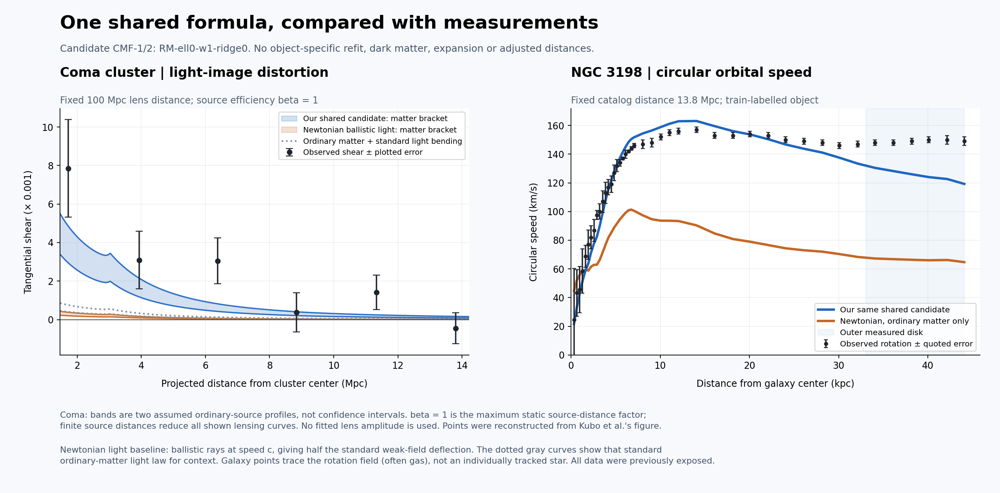

# CMF-1 / CMF-2: the shared solution is still unresolved

We executed two declared campaigns, **132 fitting configurations and 396 optimization starts**, without dark matter, expansion or changing adopted distances. These are 11 structural basis/memory choices crossed with regularization and objective weights, not 396 independent theories. All optimizers reported termination success; none of that establishes physical validity.

The selected shared law improves the validation galaxy score but performs worse than the matched MOND benchmark on the test-labelled galaxies. The best galaxy-only memory law has a small point-score advantage over MOND, with an uncertainty interval spanning no improvement and a severe cluster-pressure failure. Adding ordinary-source profile slopes did not replace either selected candidate.

[Requested observation comparison](observed-comparison.png) | [PDF](observed-comparison.pdf) | [SVG](observed-comparison.svg) | [Exact plotted data](observed-comparison-data.json) | [Independent audit](audit.json)

## The requested chart

NGC 3198 was chosen by name before inspecting its fit as a familiar extended-disk example, not because it fit well. It belongs to the historically exposed training partition. At its outermost measured radius **44.08 kpc**, observed circular rotation is **149.0 +/- 3.0 km/s**, the shared candidate predicts **119.3 km/s**, and ordinary-matter Newtonian gravity predicts **64.7 km/s**. The measured rotation field is a proxy for the circular orbit a star would follow; these data, often obtained from gas, do not track one individual star. Pressure/asymmetric-drift corrections and noncircular stellar motions are not solved here.

Coma shows tangential shear, the distortion of background images, rather than a directly measured trajectory of one photon. The blue/orange bands span the two fixed ordinary-source brackets, not statistical confidence bands. Curves use fixed source efficiency beta=1, the maximum in the adopted static thin-lens geometry; finite source distances lower this efficiency. The observed points and errors are reconstructed from Kubo et al.'s published figure. No lens normalization was fitted for the chart.

For the requested Newtonian light comparison, a ballistic test ray moving at c has half the standard weak-field deflection. Orange shows that explicitly defined approximation. Dotted gray also shows standard light bending from ordinary matter alone, so the stronger conventional baseline is visible. Neither includes dark matter.

## Matched observation scores

| Model | Galaxy train / validation / test RMSE, km/s | Cluster pressure train / validation / test chi2 per point |
|---|---|---|
| Ordinary matter | 52.56 / 58.22 / 47.77 | 238.60 / 225.18 / 134.90 |
| Matched simple MOND | 19.17 / 26.14 / 16.09 | 107.73 / 99.87 / 58.06 |
| Previous IH-1 shared law | 21.23 / 26.93 / 18.39 | 13.25 / 9.17 / 4.91 |
| CMF shared law | 21.69 / 23.99 / 21.72 | 10.84 / 9.83 / 5.06 |
| CMF galaxy-only law | 18.24 / 24.11 / 15.65 | 473.61 / 428.00 / 195.64 |

The recalculated simple-MOND scale is **1.08847758509e-10 m/s^2**, fitted only to the same training objects using the same equal-object squared-velocity objective. This replaces an unmatched historical comparison using a0=8.563335193921255e-11 and a 3,150-row reduction. The new baseline both uses all 3,152 rows and refits its coefficient; the score change must not be attributed only to adding two rows. MOND is credited as a reference, not presented as this project's mechanism.

All partitions were historically exposed. The second campaign explicitly used the first campaign's findings to motivate its new feature. Each stage saved its selection before its own test/Coma evaluation, but that ordering does not make reused observations blind. Cluster scores condition on one fitted nonnegative boundary pressure per object, including test-labelled clusters. Only quoted diagonal pressure errors are available.

The paired object bootstrap gives shared-minus-MOND test RMSE **5.633 km/s**, with conditional 95% interval **[2.474, 8.964]**. The galaxy-only difference is **-0.444 km/s**, interval **[-1.539, 0.647]**. These 10,000-resample intervals are conditional on the exposed sample and fixed selected models; they do not correct for selection, missing baryonic uncertainties or repeated experimentation.

The shared choice has 11 coefficients; the galaxy-only choice has 14, versus one fitted acceleration scale for this simple-MOND reference. Source and input nuisance assumptions also matter. A small raw-score advantage is not a simplicity or evidence advantage. No active dark-matter comparison was run, so superiority to dark-matter models is not established.

## The selected equation

The primary shared selection is **RM-ell0-w1-ridge0**. Its selected memory length is zero: the best shared candidate from this family does not require outward profile memory. Define ordinary acceleration g_b in m/s^2, physical radius r in kpc, source-mass proxy M in solar masses:

    x = tanh[-ln(max(g_b,1e-30)/1e-10)/4]
    y = tanh[ln(r/10)/4]
    z = tanh[ln(M/1e11)/4]
    P = sum theta_j F_j
    g = g_b exp[8 tanh(P/8) / (1+(g_b/1e-7)^2)]
    v_circular = sqrt(r_physical * g)

| Basis F_j | theta_j |
|---|---:|
| 1 | 0.580608253012 |
| x | 2.26479129561 |
| x2 | -0.238535523831 |
| x3 | -1.87819266324 |
| y | -1.13258762458 |
| xy | 6.37716361811 |
| y2 | -7.91735473167 |
| z | 1.45214584287 |
| xz | -3.76998735232 |
| z2 | -0.741869909468 |
| yz | 6.62007626721 |

The hypothetical radial-memory versions solve ell dH/dln(r)=x-H with their declared inner boundary; h=H-x enters the response. This is radial profile memory, not a time step, vector graviton alignment or a microscopic hitchhiking derivation. CMF-2 added only derivatives of the ordinary-source acceleration, never observed velocity or pressure. Coefficients of either sign allow enhancement and suppression while keeping total inward acceleration positive. The exponential cap and high-acceleration release are declared modeling choices.

## Removing the arbitrary lens normalization

The same total force enters the stipulated weak-field integral:

    alpha(b) = (4/c^2) integral_0^infinity g(sqrt(b^2+u^2)) b/sqrt(b^2+u^2) du
    gamma_t = (D_l beta/2) [alpha/b - d alpha/db]
    beta = 1-D_l/D_s, 0 <= beta <= 1

The fixed adopted Coma distance is 100 Mpc. We preserve the previous h=0.7 radial conversion; their cross-catalog angular consistency has not been recalibrated. Source photometric redshifts are not converted into distances through expansion. The source model is truncated at 3 Mpc; the extra force has a declared 9 Mpc reach followed by an inverse-square tail. The small feature near the gas cutoff in the plot comes from this assumed truncation.

| Candidate | Gas central density, cm^-3 | Preferred unbounded beta | Free-shape chi2 | Physically bounded chi2 |
|---|---:|---:|---:|---:|
| joint | 0.0025 | 2.941 | 4.615 | 12.771 |
| joint | 0.0045 | 1.717 | 4.261 | 7.587 |
| galaxy | 0.0025 | 0.671 | 3.823 | 3.823 |
| galaxy | 0.0045 | 0.464 | 3.816 | 3.816 |

For the shared candidate, the preferred amplitude needs beta greater than one. Moving sources farther away cannot supply that best-fit normalization in this geometry. However, the six shear bins have broad errors: the bounded high-source case is not by itself a decisive statistical exclusion. Missing covariance, source weights, bin edges and independent geometry still prevent an absolute lensing-validation claim. The galaxy-only candidate can reach an admissible beta, but fails the pressure transfer; it is not a joint solution.

## Verification and preserved history

Both source implementations were committed before their fits: CMF-1 protocol f9a5928, source 9726084; CMF-2 protocol 7121a21, source 115f3fa. A concurrent remote merge brought the older cluster branch onto main at 3a920b0. We preserved it in merge e5960c3 before the second implementation; source/input hashes verify the present calculations' dependencies.

All **33 preliminary controls** pass. The first and second campaigns pass **14 and 16** selected pressure/optical refinement checks respectively. Source-grid and inner-boundary sensitivities are reported separately from pass/fail checks; the second campaign also checks the galaxy-only memory law rather than inferring its robustness from the zero-memory joint winner.

The audit checks **21 evidence hashes**, **27 inputs/sources against their recorded Git commits**, and **149 unchanged distances**. An independently written selected polynomial reproduces velocities to 1.71e-13 km/s and pressure to 6.94e-17 in the archived units. Independent ODE memory agrees within 7.03e-10; adaptive optical quadrature agrees within 3.34e-07 relative. The adaptive integrator emitted 3 roundoff/tolerance warnings near piecewise interpolation knots; these are saved in audit.json. The comparison passes the audit's 1e-4 threshold, not a claim that the integrator attained every tighter internal tolerance.

The first chart rendering had an overlapping annotation/footer; visual inspection led to spacing corrections. Fitting evidence and plotted values were unchanged. Run archives refuse overwrite. No failed candidate or negative shear bin was removed.

## What remains before there is a solution

The work narrows the mathematical requirements; it does not solve the requested universe. Shared predictions must improve galaxy transfer without losing cluster pressure and lens strength. A physical transport law must derive the ordinary-source field, its vector following/swirl behavior, and matter/light coupling. Source fuel, field energy, attachment/release energy, recoil and boundary flow must balance. The empirical positive force law does not supply that accounting.

Fresh matched cluster pressure, ordinary-matter and calibrated lensing measurements are needed, along with independent galaxy validation. New geometry cannot be tuned to repair this result. Increasing polynomial flexibility has already been tried here and did not yield a shared win.

## Attribution

[SPARC data](https://arxiv.org/abs/1606.09251), [X-COP pressure](https://arxiv.org/abs/1805.00042), [Kubo et al. Coma shear](https://arxiv.org/abs/0709.0506), and [Alabi et al. fixed Coma distance convention](https://academic.oup.com/mnras/article/496/3/3182/5859958) supply observations or stated distance inputs. The latter paper's expansion model is not adopted.

[MOND](https://adsabs.harvard.edu/pdf/1983ApJ...270..365M), [standard line-of-sight lensing](https://arxiv.org/abs/astro-ph/9912508), polynomial regression, saturation, relaxation, ridge penalties and bootstrap are established work. [Earlier symbolic acceleration-law searches](https://doi.org/10.1093/mnras/stad597) also exist. This project owns its implementation and declared candidate combinations, not these established tools, and asserts no historical novelty.
