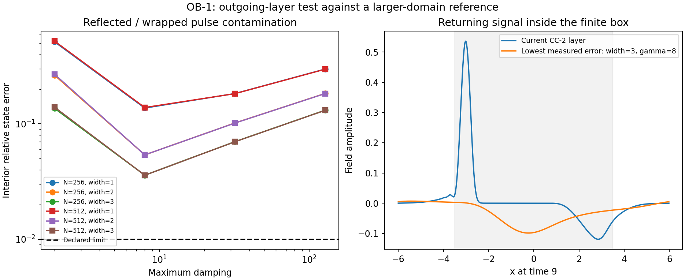

# OB-1 / OB-2: preserving outgoing waves without a false returning signal

Completed 20 September 2026. [Original protocol](boundary-protocol.md), [declared follow-up](boundary-amendment.md), [OB-1 results](boundary-v1/summary.json), [OB-2 results](boundary-matched-v1/summary.json), [independent audit](audit_boundaries.py).

**The original CC-2 damping layer is not adequate after a wave reaches the boundary.** All 24 OB-1 settings fail the declared 1% interior-contamination target. An auxiliary first-order matched treatment passes that target in 18 of 24 follow-up cases, including the selected width-one, maximum-damping-eight profile. The new prototype has not yet been integrated or validated in the nonlinear 3D solver. Its success must not retroactively turn the original sponge into a pass.

## Test and original failure

A compact, initially right-moving scalar pulse travels in a periodic length-12 interval to time9, long enough for outgoing energy to encounter the damping layer and potentially return. We compare with a length-36 domain at the same cell spacing, whose wave has not encountered its boundary. The test uses256 and512 cells in the smaller interval, three layer widths and four damping strengths. It is the vacuum principal-part wave, without the massive/nonlinear terms of the full model.

The error is sqrt(E_difference/E_initial) inside |x|<3.5, using field-gradient and momentum differences from the large-domain reference. This is an energy-weighted state norm, not a percentage of reflected energy or a pointwise field-amplitude error. Both reflected and periodically wrapped signals can contribute.

The original approach damps only canonical momentum. Its width1, gamma_max2 setting, identical to CC-2's vacuum layer, gives51.39% and52.12% interior state error at the two grids. It removes roughly73% of initial energy; a substantial residual returns. Raising damping alone also creates reflection: the best original case is width3, gamma_max8, with errors3.592% and3.588%, still failing1%. All energy-ledger checks pass. Thus accurate accounting of removed energy does not guarantee an isolated boundary.



## Matched first-order change

The OB-2 prototype evolves auxiliary momentum P and gradient V:

```text
Pdot = D V - gamma P
Vdot = D P - gamma V
Qdot = dx sum gamma(P^2+V^2)
E = dx sum(P^2+V^2)/2
```

With the same damping on both variables, P+V and P-V obey independent advection/damping equations. D is centered and skew-adjoint, so the undamped transport does not change the discrete energy. In the interior, V represents the field gradient. We do not impose or claim that it remains the gradient of a physical scalar throughout the auxiliary absorbing layer.

This discretization has different vacuum dispersion from OB-1. OB-2 therefore uses its own matching large-domain reference; it is not compared to the old stencil as if both were identical.

| Layer / system | N=256 interior error | N=512 interior error |
|---|---:|---:|
| Original CC-2 layer, width1 / gamma2 | 51.39% | 52.12% |
| Momentum-only damping, width1 / gamma8 | 13.71% | 13.86% |
| Matched P,V damping, width1 / gamma8 | 0.3765% | 0.4610% |

The last setting is selected by the predeclared rule: narrowest width passing both resolutions, then smallest damping. It removes99.9799% and99.9977% of the initial energy at the two grids. Its energy-ledger errors are7.84e-7 and2.99e-8, below1e-5. No opposite-going characteristic is generated to measured precision in the matched system; periodic return and discretization error still limit the finite-box comparison. All six strength-two matched cases fail the contamination gate and remain archived.

This is standard matched-boundary mathematics, not a new physical theory. [Steven Johnson's notes](https://arxiv.org/abs/2108.05348) explain perfectly matched layers and their limitations. We have implemented a particular 1D first-order prototype, not a general 3D PML or an exact nonlinear absorbing boundary.

## Effect on the research goal

The current CC-2 short-duration campaign checks a regime before significant boundary return and includes larger-domain comparisons. Its evidence remains useful within that scope. A long-duration vortex run using the original sponge could confuse returning waves with sustained field structure, so that extension must wait for a suitable boundary implementation and validation.

Next test a boundary treatment with the massive term, all3D directions/corners and the relevant weak exterior field speeds, retaining energy/flux accounting. A single pulse spectrum and incidence direction do not establish that result. The isolated/outgoing part of requirement3 is therefore still open, even though OB-2 supplies a working vacuum component. No dark matter, expansion or observational fit was involved.

Protocol42c1b34 and implementation925e2ca produced OB-1. Amendment3bdf1e4 and implementation68cc2e6 preceded OB-2. Separate immutable archives retain all failures and successes. `python -B research_work/experiments/common_cone/audit_boundaries.py` verifies source/output hashes and independently reconstructs every saved contamination metric.
