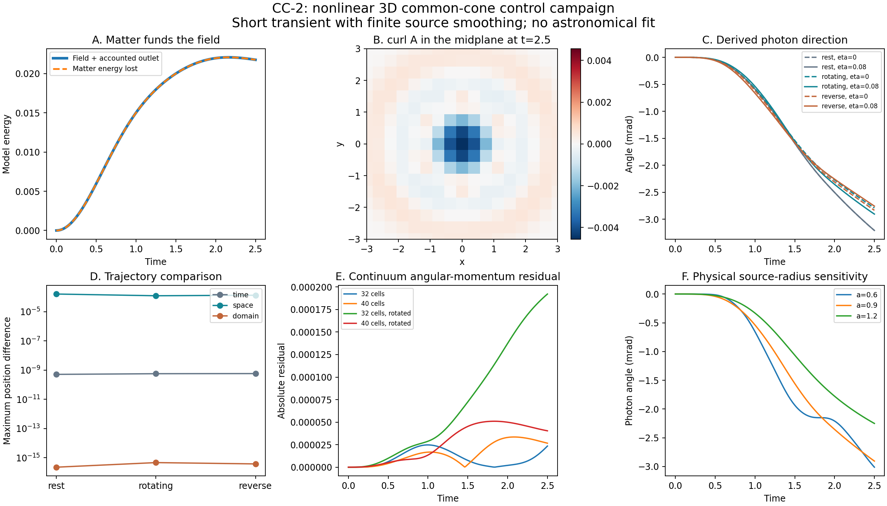

# CC-2: nonlinear three-dimensional source and wave evolution

Completed 20 September 2026. [Protocol](evolution-protocol.md), [solver](evolution.py), [driver](run_evolution.py), [independent audit](evolution-audit.json), [chart](evolution.png).

All 31 declared evolutions completed. 31/31 pass the energy-ledger and averaged-cone gates; 11/11 refinement/domain/rotation comparisons pass. All 77 full discrete-Hamiltonian controls and 233 independent provenance/endpoint checks pass. This is an actual coupled 3D calculation, but a short dimensionless control experiment, not a persistent galactic swirl or a joint observational solution.

## What the solver includes

Six moving ordinary-matter sources, a spherical finite-radius interpolation/deposition profile, four dynamic scalar/vector fields, optional massive or massless probe, all field self-interaction derivatives, source recoil, and a damping-energy ledger are evolved together. Fields initially contain zero energy. The Hamiltonian determines both the source term and the matter/light response. No independent optical multiplier, inserted halo, dark matter, expanding geometry or changed observed distance is present.

The primary cube has length 12 and 32 cells per side, step 0.02, duration 2.5 and source radius 0.9. Six unit masses begin on a radius 0.7 ring, resting or with tangential canonical momentum magnitude 0.2 of either sign. The coupling is g=.08, kappa=.5, eta=0/.08 and omega=.2. Eighteen primary cases span source sense, vector coupling and probe type. Thirteen additional runs test time/grid/domain changes, a 3D rotation and source-radius sensitivity.

The field energy averages forward/backward squared gradients and uses centered gradients in the drift term. Its canonical adjoint derivative, including coefficient self-sources, is implemented directly. The positive cellwise gradient/kinetic block follows from |beta|<alpha and the squared-gradient averaging bound. Particle energy samples alpha and beta using the same normalized spherical weights used for deposition; the derivative of weight normalization is retained in the force.

This regularization makes the particle cone depend on averaged alpha,beta, not the exact field cone at a point. A finite source profile remains nonlocal. The smallest recorded energy/cone residual does not remove that physical limitation. Continuum common-cone reasoning and local convexity from CC-1 remain distinct from proof of global nonlinear stability.

## Conservation and source funding

Maximum scaled drift in H+Q is 1.10548e-09; the gate is 1e-4. Q records energy removed by Pi_dot=-gamma Fdot, for which Qdot=integral gamma Fdot^2. Every integrator endpoint is saved. The maximum averaged-cone residual is 2.22045e-16, consistent with roundoff. Independently reconstructing every final Hamiltonian agrees within 1.77636e-15.

The omitted-self-source negative control gives an energy-ledger derivative error of 0.000431591, compared with 4.82274e-10 for the complete equations. This checks that energy accounting depends on the actual nonlinear terms, not merely the integrator tolerances.

For the rotating eta=.08 example without a probe, final field energy is 0.02176289605, matter Hamiltonian energy loss is 0.02176289654, and outlet energy is 4.25062e-15. Funding includes field-dependent particle energy, not just mechanical kinetic energy. It does not establish a microscopic emission process, a galactic fuel supply or acceptable clock changes.

Maximum continuum momentum and angular-momentum diagnostic residuals over the whole campaign are 3.883e-08 and 0.00153879. Field orbital terms and vector spin are included. The finite grid breaks exact continuous symmetry; these residuals are measured, not declared exact conservation identities.

## Refinement, domain and rotation

| Comparison | Maximum position difference | Final field-energy relative change | Declared result |
|---|---:|---:|---|
| rest time | 5.07528e-10 | 1.20673e-06% | PASS |
| rest space | 0.000161927 | 0.970628% | PASS |
| rest domain | 2.22132e-16 | 1.88294e-11% | PASS |
| rotating time | 5.63457e-10 | 1.20384e-06% | PASS |
| rotating space | 0.000123626 | 1.15269% | PASS |
| rotating domain | 4.581e-16 | 1.964e-11% | PASS |
| reverse time | 5.74187e-10 | 1.20387e-06% | PASS |
| reverse space | 0.000134138 | 1.1527% | PASS |
| reverse domain | 3.72386e-16 | 1.96241e-11% | PASS |
| rotation N=32 | 0.000140907 | not a declared gate | PASS |
| rotation N=40 | 7.23138e-05 | not a declared gate | PASS |

The time-only and spatial tests have position ceiling 0.01 and field-energy ceiling 5%. The enlarged-domain tests preserve cell spacing and use ceilings 1e-4 and 0.1%. Back-rotated trajectory comparisons use position ceiling 0.01. Failure labels, if present, are retained rather than redefined. Two grid resolutions do not establish a continuum extrapolation.

The minimum conservative geometric clearance from the physical box boundary is 0.6; the maximum measured boundary field amplitude is 1.42183e-08. This uses the maximum measured characteristic speed, source support extent and run duration. Lattice tails need not have strict compact support. The larger-domain comparisons provide the direct domain-sensitivity test.

**Boundary qualification:** OB-1 separately showed that the original sponge fails after outgoing waves reach it. OB-2 provides a passing 1D vacuum matched-wave prototype, not an integrated nonlinear 3D boundary. CC-2 therefore supports the short tested interval only. Do not interpret this campaign as permission to use the same boundary for long-lived swirls. See [boundary report](boundary-report.md).

## Bending and physical smoothing

Final photon angles in milliradians from the initial path:

| Source | Scalar only | Scalar + vector | Change in bend magnitude |
|---|---:|---:|---:|
| rest | -3.209857 | -3.209087 | -0.024% |
| rotating | -2.792410 | -2.905980 | 4.067% |
| reverse | -2.835740 | -2.758327 | -2.730% |

The sign depends on source rotation and the chosen off-axis light path. A transient vector contribution is not a universal extra scalar attraction. The massive probes are also evolved, but these paths are not circular stellar orbits. The archived probe_angle is an absolute xy coordinate heading; it equals the bend from the initial heading for the unrotated cases in this table, but not for the rotated configurations. The fast source fixture is not a galactic-speed model: [CC-2S](slow-motion-report.md) quantifies the direct-current suppression at illustrative galactic speeds.

| Source radius in rotating photon case | Final field energy | Photon angle, mrad |
|---|---:|---:|
| 0.6 | 0.026774261 | -3.012201 |
| 0.9 | 0.021763494 | -2.905980 |
| 1.2 | 0.018965815 | -2.251246 |

Changing this radius changes the regulated physical source, not just mesh resolution. Sensitivity is retained rather than selecting the best-looking radius. Rotating a configuration and changing its smoothing radius answer different questions; a rotation pass does not make predictions independent of the regulator.

## What must change before observational claims

The current compact linear exterior fails the flat-rotation target and lacks the standard spatial-curvature optical contribution, as shown in [CC-2W](weak-field-report.md). Those findings are not repaired by the successful numerical evolution. [PF-0](phase-budget-report.md) tests an attributed reduced amplitude-feedback idea and finds substantial threshold sensitivity; it is not the full 3D completion.

The next coupled candidate needs consistent spatial response, a derived mechanism for sustained outer support, source and angular-momentum budgets, and a validated long-duration boundary. Its parameters must then face held-out galaxies and clusters together, including local light/clock constraints. None of these broader requirements is marked achieved by CC-2. The [goal ledger](../../../research_plan/solution-goal-ledger.md) remains active (repository-root ledger path: research_plan/solution-goal-ledger.md).

## Attribution and reproduction

The Hamiltonian geometry, compact interpolation, finite differences and wave absorption methods are established mathematics; [CC-1](report.md) and [OB-2](boundary-report.md) record sources. These equations are a project candidate, not a claim of historical uniqueness, Einstein gravity or a generally covariant vector theory.

Protocol 18dde4a and numerical source b69322f precede the original run. The archive pins all numerical sources and includes 31 particle paths/momenta, 31 final field states, every endpoint's energy/invariant/cone diagnostics, controls and declared comparisons. Full field movies are not stored. `python -B research_work/experiments/common_cone/audit_evolution.py` performs the independent audit; `report_evolution.py` renders this report/figure from the completed archive. The original driver refuses to overwrite evolution-v1. The historical repository-wide suite was not rerun or declared green.
