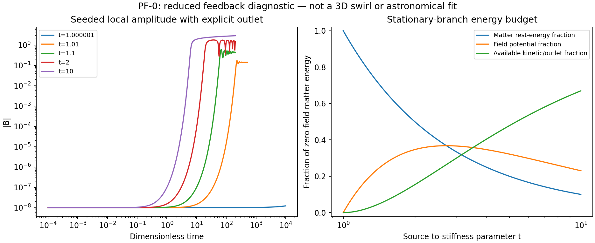

# PF-0: nonlinear growth has an explicit cost and a narrow weak-response window

Completed 20 September 2026. [Protocol](phase-budget-protocol.md), [implementation](phase_budget.py), [first results](phase-budget-v1/summary.json), [independent verifier](audit_phase_budget.py).

The proposed amplitude feedback can grow a seeded local field and transfer energy from the matter term without an unaccounted reservoir. All 300 derivative/ledger controls, eight stationary-branch checks and 16 trajectories pass their declared numerical tests. However, the simple branch does not generically produce a weak gravitational response: the tested weak-potential band occupies a source-to-stiffness interval only about ten parts per million wide. This is an important constraint on the proposal, not a galaxy or cluster result.



## Restricted model and what its energy means

The proposal makes a vector amplitude affect the lapse through U=-lambda |A|^2/2. In the scalar-decoupled, homogeneous, single-amplitude restriction, rescaling gives

```text
h = exp(-2B^2) P^2/2 + B^2/2 + t exp(-B^2/2)
t = lambda rho / Omega^2
```

The three terms are field kinetic energy, field potential energy and matter rest-energy. B and P are dimensionless amplitude and canonical momentum; Omega is the effective positive mode stiffness scale. This is not a full spatial mode reduction with derived coefficients, a source-current generation calculation, or a model of an actual galaxy. It holds density fixed, decouples the scalar, and omits orientation and gradients. A nonzero vector amplitude need not have curl.

Each trajectory starts with B=1e-8 and P=0, with its initial energy included. For gamma=0 there is no energy outlet. For gamma=0.05 the canonical damping is accompanied by Qdot=gamma Bdot^2, so h+Q must remain constant. Q is a modeled outlet, not independently demonstrated radiation. Exact zero seed stays exactly zero in the separate deterministic control; the toy does not manufacture a perturbation from nothing.

The maximum scaled energy-ledger drift is 3.02e-9, below 1e-6. Small seed energies can lie below the precision of the much larger matter term: a printed zero drift in the low-amplitude cases is not a measurement of exact conservation at arbitrary precision. The seeded trajectories at t=1.01,1.1,2 and10 reach half their nonzero branch amplitudes in both damping cases. Those at t=1+1e-6 do not do so within the declared horizon; that is a horizon-limited observation, not an exclusion of their analytic instability. Undamped motion is not expected to settle into a potential minimum.

## Stationary branch and budget

For t<=1, zero amplitude is a local minimum, with zero quadratic curvature at t=1. For t>1 it becomes unstable and nonzero stationary amplitudes satisfy

```text
B_*^2 = 2 log(t)
U_* = -log(t), alpha_* = 1/t
V''(B_*) = 2 log(t)
```

The listed positive curvature is for the one amplitude tested. It does not certify all spatial or vector-orientation modes, or global nonlinear stability.

| t | U at the nonzero branch | Matter energy remaining | Field potential / initial matter energy | Available kinetic/outlet fraction |
|---|---:|---:|---:|---:|
| 1.000001 | approximately -1e-6 | 0.999999 | approximately 1e-6 | approximately 5e-13 |
| 1.01 | -0.0099503 | 0.990099 | 0.009852 | 0.00004918 |
| 1.1 | -0.0953102 | 0.909091 | 0.086646 | 0.004263 |
| 2 | -0.693147 | 0.5 | 0.346574 | 0.153426 |
| 10 | -2.302585 | 0.1 | 0.230259 | 0.669741 |

The final column is the difference between the unseeded zero-field energy and the stationary potential minimum. It is not the measured radiated fraction of every finite-duration run, and its smallest entries rely on the analytic expansion rather than subtracting nearly equal floating-point totals. Strong growth can draw substantially on matter rest-energy. That cost and the associated clock/lapse change cannot be ignored when scaling the proposal to real sources.

For the declared weak-response band 1e-8<=|U_*|<=1e-5, the condition is

```text
1.000000010000000 <= t <= 1.000010000050000
```

The relative width is approximately 9.99005e-6. This is a local parameter-sensitivity result, not a measured tolerance on any galaxy's density. In a spatial theory, density and mode stiffness vary together; nonlinear profiles or a self-regulation mechanism might change the inference. None was demonstrated here. A universal model cannot simply set a separate t for each object and call that an explanation.

## Attribution and next decision

Matter-induced field growth and exponential couplings have clear precedents in [Damour–Esposito-Farese scalarization](https://arxiv.org/abs/gr-qc/9602056) and [Ramazanoglu vectorization](https://arxiv.org/abs/1706.01056). PF-0 is an attributed adaptation within the candidate design, not a historical novelty claim or an imported neutron-star solution. It supplies no evidence that the complete model avoids those theories' possible instabilities or observational constraints.

This branch should not advance directly to a fitted galaxy or cluster curve. It first needs a spatial model that generates real circulation, explains the amplitude without separate object tuning, respects local clock constraints and supplies the desired outer force. The independent CC-2 three-dimensional control campaign is continuing with its original equations. No dark matter, expansion or astronomical data fit was introduced here. The twelve-item objective remains active and incomplete.

Protocol commit 4a19475 and implementation ef748a8 precede this calculation. All first trajectories, controls and branch results are preserved with source and output hashes in phase-budget-v1. Reproduce its integrity and independent energy reconstruction with `python -B research_work/experiments/common_cone/audit_phase_budget.py`; the original runner refuses to overwrite the archive.
