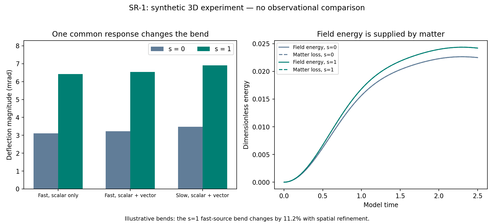

# SR-1: reciprocal spatial response in coupled 3D evolution

20 September 2026. Synthetic dimensionless source experiment; no observational data or fitted cluster/galaxy parameters. No dark matter or cosmic expansion. The full twelve-item solution remains incomplete.

## What changed

The same constitutive spatial coefficient now enters particle energy, light speed, field kinetic/gradient energy, and all reciprocal field/source derivatives. s=0 recovers CC-2. s=1 adds equal weak temporal/spatial response; it is an established metric-optics choice, not an independently fitted lens multiplier or new historical invention. Lambda=0 in all evolutions; lambda=.5 is exercised only in derivative controls.

For stationary beta=0 and weak U=-C0/r, slow-particle acceleration is -grad U to leading order. The photon Hamiltonian is exp((1+s)U)|p|. Along a straight zeroth-order ray at impact b, integrating (1+s) C0 b/(b^2+z^2)^(3/2) over z gives deflection 2(1+s)C0/b. Therefore s=1 restores the usual factor 4C0/b at fixed orbital normalization. This analytic weak static limit does not imply that the dynamic source below yields an exact factor of two.

The frozen field principal block has a positive symmetrizer and characteristic speeds beta.n +/- C; photons have that same local cone. This is evidence of frozen principal hyperbolicity, not a proof of full nonlinear stability or stable galactic orbits. Finite source averaging gives an averaged cone and remains a nonlocal regulator.

## Numerical evidence

- Local controls: 240/240; coupled-grid directional derivatives: 24/24; four omitted-self-source negative controls distinguish the incorrect equations.
- CC-2 equivalence: energy error 0, maximum RHS error 4.64039e-16.
- Original box: 0/8 trajectory qualifications pass. The failed conservative boundary clearance is preserved, not waived because energy drift is small.
- Enlarged boxes: 8/8 trajectory qualifications pass; 10/10 time, space and domain comparisons pass.
- Independent archive audit: 487 checks pass; maximum raw-state energy reconstruction error 1.77636e-15; maximum final Hamiltonian directional-derivative error 5.71843e-09.
- Maximum scaled H+Q drift 6.8987e-11; averaged-cone error 6.66134e-16; minimum geometric clearance 0.9.
- Maximum absolute total momentum drift 1.06498e-07; angular momentum drift 0.000164175. Grid angular momentum is not an exact invariant.

The clearance uses the largest sampled characteristic speed and source extent, and distance to the damping-layer entrance. It is a conservative continuum travel estimate plus a numerical edge-amplitude check, not a proof of a perfectly absorbing boundary. No long-time boundary claim is made.

| Source/control | s | Bend (mrad) | Field energy | Matter energy lost | Absorbed energy |
|---|---:|---:|---:|---:|---:|
| s0-scalar | 0 | -3.10880356 | 0.0224222371 | 0.0224222374 | 8.989e-19 |
| s0-fast | 0 | -3.22457471 | 0.022485508 | 0.0224855084 | 9.058e-19 |
| s0-slow | 0 | -3.47204136 | 0.0221669039 | 0.0221669043 | 8.63e-19 |
| s1-scalar | 1 | -6.42540046 | 0.0241363852 | 0.0241363856 | 9.735e-19 |
| s1-fast | 1 | -6.54092156 | 0.0241984875 | 0.024198488 | 9.803e-19 |
| s1-slow | 1 | -6.91151368 | 0.0221402748 | 0.0221402751 | 8.671e-19 |

Negative signed bends point toward the source for this geometry. Values are relative to the initial ray heading. The fast source has momentum/mass=.2 (speed about .196c); the slow source is set to 200 km/s. The photon retains its test energy 1e-4, so these slow-source runs are not yet a negligible-photon-backreaction astrophysical limit.

| Refinement/comparison | Probe position difference | Relative field-energy difference | Passed |
|---|---:|---:|---|
| time | 9.00277e-10 | 8.01839e-09 | True |
| space | 0.000611914 | 0.0330423 | True |
| domain-s0-scalar | 4.44089e-16 | 3.55498e-12 | True |
| domain-s0-fast | 0 | 3.5709e-12 | True |
| domain-s0-slow | 1.11022e-16 | 3.44489e-12 | True |
| domain-s1-scalar | 1.11022e-16 | 3.56383e-12 | True |
| domain-s1-fast | 0 | 3.57906e-12 | True |
| domain-s1-slow | 2.22045e-16 | 3.45248e-12 | True |
| domain-s1-fast-time | 0 | 3.57892e-12 | True |
| domain-s1-fast-space | 1.91078e-18 | 1.97137e-13 | True |

The photon bend itself differs by 11.1697% relative to the finer-grid result. The declared position/field-energy gates passing does not establish percent-level lensing accuracy. More spatial refinements and source-radius tests are required before interpreting a precise bend prediction.

## Interpretation and remaining rejection tests

- scalar: changing s=0 to s=1 changes the bend magnitude by a factor 2.06684 in this particular dynamical experiment.
- fast: changing s=0 to s=1 changes the bend magnitude by a factor 2.02846 in this particular dynamical experiment.
- slow: changing s=0 to s=1 changes the bend magnitude by a factor 1.99062 in this particular dynamical experiment.
- At s=0, switching on the vector coupling in the fast-source pair changes bend magnitude by 3.72398%. This includes reciprocal source/field changes, not just a ray deflection in a frozen field.
- At s=1, switching on the vector coupling in the fast-source pair changes bend magnitude by 1.79788%. This includes reciprocal source/field changes, not just a ray deflection in a frozen field.

These are controlled mechanism comparisons, not agreement with cluster observations. No eta=0 slow-source run was declared, so the slow-source values do not isolate the vector contribution. No source-sense reversal or rotated spatial-response run was included; CC-2 rotation results cannot be transferred automatically. The coarse/fine spatial comparison also changes domain length; the eight matched-resolution domain comparisons quantify that dependency.

The main unresolved structural problem survives: an isolated compact source in the linear exterior still gives Kepler/Yukawa declining rotation. Increasing the spatial optical response does not generate an extended, source-funded force. The direct-current suppression, amplitude-threshold sensitivity, physical source budget and long-lived swirl all remain open. The next meaningful development is to derive an extended-field support mechanism with a single universal law and test formation, stability, outer force and local limits; long runs still require a qualified massive/nonlinear 3D outgoing boundary. Do not proceed to claimed observational success by fitting an independent lensing multiplier.

## Reproduction and attribution

The first archives are immutable: run_spatial.py creates spatial-v1 and run_spatial_enlarged.py creates spatial-v2 only if absent. To reproduce without removing archived evidence, create a separate checkout at implementation commit 0ba3c92 (which predates both archives), then run Python with -B on run_spatial.py and run_spatial_enlarged.py in that order. The numerical source hashes are unchanged between that commit and the original runs. Use audit_spatial.py from the completed campaign to inspect the regenerated evidence. In the current checkout, run audit_spatial.py against checked-in evidence, then report_spatial.py for derived outputs. Manifests pin protocol and numerical source hashes and Git commits. The auditor reconstructs energy directly from raw arrays without calling solver energy/ingredients, and compares final-state Hamiltonian gradients against the solver RHS.

| Component | Attribution/status |
|---|---|
| Hamiltonian matter/light evolution and optical metric | Established mathematics; [Gibbons et al.](https://arxiv.org/abs/0811.2877). |
| Equal weak temporal/spatial response s=1 | Established metric response, explicitly adopted as a constitutive choice. |
| Optional amplitude coupling | Related to [scalarization](https://arxiv.org/abs/gr-qc/9602056) and [vectorization](https://arxiv.org/abs/1706.01056); derivative-tested only here. |
| This effective scalar/vector Hamiltonian and reciprocal discrete campaign | Specific candidate construction and measured numerical results; historical uniqueness is not claimed. |

