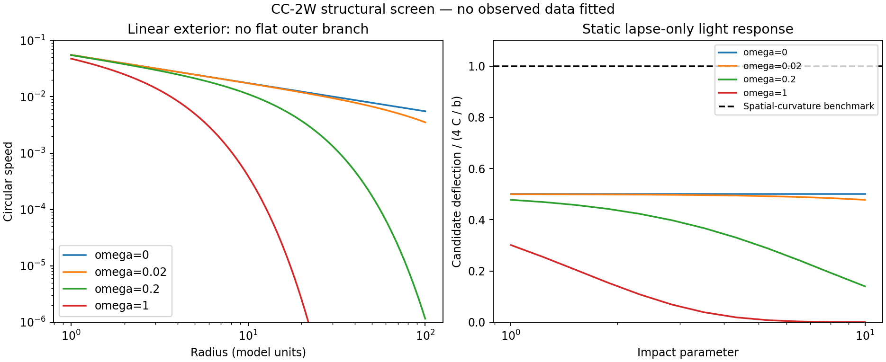

# CC-2W: what the linear exterior cannot supply

Completed 20 September 2026, while the separately declared CC-2 nonlinear 3D campaign runs. [Protocol](weak-field-protocol.md), [calculation](weak_field.py), [summary](weak-field-v1/summary.json), [chart](weak-field.png).

**The current compact-source weak-field branch does not supply flat outer rotation or the standard static spatial-curvature light response.** All 404 orbit calculations and 48 light-integral checks reproduce their mathematical references, but none of the 404 orbit samples meets the declared flat-slope target. This is a scientific limitation, not a numerical failure or an observational fit. Nonlinear, extended or time-dependent configurations are not excluded by this exterior approximation.



## Radial force and stable orbits

Linearizing the scalar equation outside an ordinary compact source gives

```text
(Laplacian - omega^2) phi = g rho
U = g phi = -C exp(-omega r)/r,  C=g^2 M/(4 pi)
a(r) = C exp(-omega r)(1+omega r)/r^2
v_c^2 = r a(r)
d ln v_c/d ln r = -1/2 - (omega r)^2/[2(1+omega r)]
kappa_orbit^2 = C exp(-omega r)[1+omega r-(omega r)^2]/r^3
```

Here a is the inward acceleration magnitude and kappa_orbit is the radial epicyclic frequency, not the model's directional-coupling parameter. Circular force balance alone does not guarantee orbital stability. For omega>0 these point-source circular orbits become radially unstable beyond omega*r=(1+sqrt(5))/2. That statement is restricted to this linear potential and test-body approximation.

At omega=0 the speed declines as r^-1/2. Positive omega steepens that decline; changing C changes amplitude but not the slope. The 101 logarithmic radii from1 to100 were evaluated at each of omega=0,0.02,0.2,1. None has |d ln v/d ln r|<=0.1. Unstable sampled circular orbits number0,5,55,90 respectively. This is not a new inference about any particular observed galaxy: no galaxy was fitted here.

The zero-net-current rotating-ring reference gives vector-potential slopes -2.00408,-2.00102,-2.00025 over successive radius doublings from10 to80. The current sum is zero within1.2e-16. This is consistent with a dipole far field rather than a persistent monopole contribution. The fixture is a prescribed uniform current ring, not evidence that the nonlinear system sustains that ring. A finite-mass compact source's linear circulation does not by itself turn the scalar exterior into a flat rotation curve.

## Static light response

With no drift, the current photon Hamiltonian is H=(1+U)|p| to first order, while slow matter accelerates as -grad U. Straight-ray integration therefore gives

```text
deflection(b) = integral U'(sqrt(b^2+z^2)) b/sqrt(b^2+z^2) dz
              = 2C/b                         (omega=0)
              = 2C omega K_1(omega b)         (omega>0).
```

All48 numerical line integrals agree with these references to at most2.37e-15 relative error. For omega=0 the result is half of4C/b, the standard weak-field response when equal temporal and spatial metric potentials both contribute to light bending. The massless-range ratio is independent of C, so renormalizing the same force law cannot fix it while retaining the orbital normalization.

This is the familiar distinction between a lapse-only optical response and spatial curvature, not a new formula or invention. The relation between light deflection and spatial curvature is discussed in [Will's review of gravity tests](https://arxiv.org/abs/1403.7377). The comparison here uses a theoretical reference, not a Solar System or cluster likelihood. It does not establish that cluster data require precisely this factor for the current source model or smoothing.

## Change in research direction

Improving conservation and the shared cone is necessary, but these limits show that those improvements alone do not establish the requested solution. Two additional pieces need derivation and testing:

1. **Spatial optical response tied to the same field energy.** An independent ray multiplier would obscure the problem. A spatial metric or equivalent constitutive response must modify the matter, light and mediator Hamiltonians consistently, and recover local tests. In a weak metric with temporal potential U and spatial potential V, slow matter primarily measures U while light measures U+V. Choosing V=U recovers the familiar factor two, but that choice must come from an action/field law and is established gravitational geometry, not an original discovery.
2. **A sustained outer-field mechanism.** A long-lived nonlinear field distribution, a derived current-dependent response, or a sourced memory law must produce the needed radial behavior with a real budget. Changing constants in this compact linear Yukawa branch cannot flatten its exterior. An inserted halo or per-galaxy force correction is not a completion. A nonlinear gradient law that reproduces established MOND/AQUAL mathematics would need to be named and credited rather than presented as our invention.

The running CC-2 experiment remains useful: it checks whether the nonlinear, source-funded evolution is mechanically reliable and provides a control for subsequent changes. Its short transient cannot settle the asymptotic or long-lived questions above. Finish and audit it before changing its equations; preserve both its positive and negative outcomes.

## Scope and record

No dark matter, expansion or observation-derived distance conversion was used. These tests do not replace the joint held-out galaxy/cluster fit. The complete twelve-item objective remains active. Protocol commit dc7cdfc; implementation commit19950e2; first outputs and hashes are in weak-field-v1. The archive is immutable under the runner. No numerical result was selected as a winner or promoted to an observed prediction.
