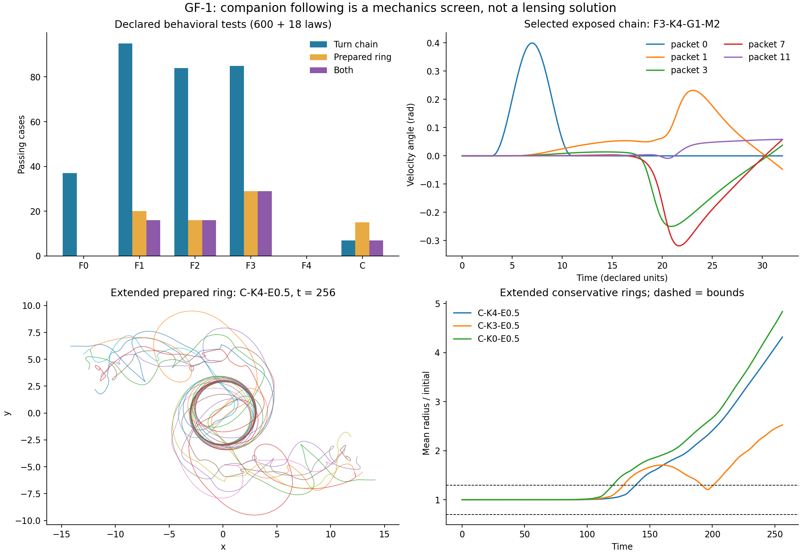

# GF-1: what follows, what swirls, and what remains unexplained

**Completed finite campaign; no star-motion or cluster-lensing solution.** The catalogue contains 600 force/memory formulas and 18 conservative parameter cases. 1515 trajectories were executed across the original screen, both preserved selection rounds, refinements and diagnostics. One further circular initial condition was unavailable. Every executed trajectory stayed finite. All data use the declared nonexpanding planar packet model, with no dark-matter source and no astronomical distance fitting.

**The strongest interpretation is limited:** some laws transmit an imposed turn and preserve a prepared ring for about one revolution, but the common central potential alone also passes those short tests. The selected conservative rings lose the required shape after longer evolution while conserving energy and momentum. A short swirl is not evidence for a new graviton theory.

[Formula catalogue](catalogue.md) | [protocol](protocol.md) | [attribution](review-and-provenance.md) | [completed RW-1 review](rw1-completion-review.md) | [audit](audit.json)

## How this differs from the earlier whirlpool calculation

RW-1 fits an instantaneous radial force from ordinary-matter source elements, varying its reach, core and amplitude. GF-1 instead evolves the positions and velocities of interacting companion packets. A forced leader turns; follower trajectories respond through their stated interactions. A separate closed ring tests persistence with no applied torque or central pinning. No initial swirl is claimed to have formed spontaneously.

The branch advanced during this task: 2be9b33 had no RW-1 results, ff02d8b fixed archive bookkeeping, and e5367bd supplied the completed report. Its mass-dependent galaxy law has training/validation errors 21.32/29.68 km/s and cluster score 153.23 per point. The cluster law instead gives 20.64 per point but galaxy training error 726.57 km/s. The lenses fail. These are reviewed branch results, not GF-1 reruns; the feature branch was not merged.

## The equations and variations actually tested

All packet equations are nondimensionalized using a reference length, time and unit packet inertia. Restoring dimensions gives different coefficient units for different force families; the shared numerical 0.2 is not a measured universal gravitational constant. The common credited pair energy is U=(1/16) sum_(i<j)[2 exp(-r/0.4)-exp(-r/2)].

For the 600 laws, a_i=-grad_i U+0.2 Phi_i. The product grammar is **5 force choices x 6 radial kernels x 5 angular gates x 4 memories = 600**. Kernels include Gaussian, exponential, two inverse-power profiles, a compact-support profile and an annular profile. Gates range from all neighbors to increasingly strong forward preferences with direction agreement. Memories are instantaneous, one-stage, two-stage and underdamped. The catalogue spells out every combination.

| Force | Explicit additional interaction | Purpose / accounting limit |
|---|---|---|
| F0 | sum W_ij(u_j-v_i) | Align velocities; can dissipate/inject energy and lacks reciprocal recoil |
| F1 | P_i sum W_ij(u_j-v_i) | Turn without guide work; net momentum generally not conserved |
| F2 | P_i sum W_ij(u_j-v_i+tau omega_j J u_j) | Follow a remembered turn; auxiliary memory has no derived energy ledger |
| F3 | sum S_ij cross(u_i-u_j,e_ij) J(v_i-v_j) | Equal/opposite, zero-work exchange; orbital angular momentum generally changes |
| F4 | sum W_ij q_ij/(1+q_ij^2)^(3/2), q=d-tau u_j | Attract toward an approximate trailing position; no causal mediator |
| C | L=0.5 sum v_i^2+eta/32 sum_(i<j)K_ij(v_i-v_j)^2-U | Explicit conservative energy and canonical momentum; no preferred leader |

Here P=I-nn^T, J rotates by 90 degrees, u is the selected velocity memory, and S is the symmetric part of W. The conservative 18 cases use six kernels and eta=0.5,2,8. Their mass matrix is M=I+(eta/16)Laplacian(K), their energy is H=0.5 v^T M v+U, and angular momentum is sum x_i cross p_i with p=Mv. Its positive kinetic metric, Euler-Lagrange force and conserved quantities were independently checked.

Sign-reversed following, changed pulse amplitudes, mirrored turns, doubled chain length, longer integration, and smaller timesteps are explicit follow-ups. A negative kinetic metric was tested as a rejection control, not accepted as a successful physical state. No published observation or fixed distance was altered to improve a score.

## Corrected primary results

| Family | Cases | Turn-chain passes | Prepared-ring passes | Both |
|---|---:|---:|---:|---:|
| F0: Velocity alignment | 120 | 37 | 0 | 0 |
| F1: Transverse following | 120 | 95 | 20 | 16 |
| F2: Curvature memory | 120 | 84 | 16 | 16 |
| F3: Reciprocal gyroscopic exchange | 120 | 85 | 29 | 29 |
| F4: Trailing-target attraction | 120 | 0 | 0 | 0 |
| C: Conservative kinetic coupling | 18 | 7 | 15 | 7 |

The conservative row includes one unavailable ring initialization, C-K5-E8: no positive circular balance at radius 3. The other 17 were executed and all passed the conservative energy, linear-momentum and canonical-angular-momentum tolerances over time 64; 15 passed the separate behavioral shape test. Those are finite-time statements.

**Scoring correction:** the first implementation searched only 16 time units of lag for a time-32 trajectory instead of the declared 20. Original counts (218 and 4 chain passes) remain archived. Correcting saved trajectories gives **301/600 and 7/18** chain passes and **61/600 and 7/18** joint short-fixture passes. Selection was recomputed and its follow-ups rerun. No equations or thresholds were changed. [Correction and regression control](scoring-correction.md).

## Refinement and adverse results

All 27 latest mechanics/scoring controls pass. All 30 selected short-fixture timestep comparisons satisfy the declared 5% criterion. Mirror trajectories and zero-input straight chains pass their checks. A zero-input case is intentionally not scored as a successful response to a nonexistent pulse.

| Corrected selection follow-up | Behavioral passes |
|---|---:|
| Half-amplitude turn (0.2) | 11/12 |
| Larger turn (0.6) | 12/12 |
| Mirrored turn | 12/12 |
| 24 packets, time 32 | 0/12 |
| Reversed coupling, chain | 12/12 |
| Reversed coupling, ring | 12/12 |
| Selected conservative rings, time 256 | 0/3 |

Long-chain observations were extended to time 64 as a separately declared diagnosis. 0/12 meet the original combined gate even then. The wider-lag descriptive correlations and threshold arrivals are in diagnostic-analysis.json; a response outside the declared lag window does not retroactively turn the original failure into a pass.

| Conservative long run | First sampled failure, dt .02 / .01 | Final radius ratio, dt .02 / .01 | Energy drift, dt .01 |
|---|---:|---:|---:|
| C-K4-E0.5 | 114.8 / 114.8 | 4.31723 / 4.31725 | 6.86e-12 |
| C-K3-E0.5 | 106.4 / 106.4 | 2.52583 / 2.52571 | 8.94e-12 |
| C-K0-E0.5 | 98.4 / 98.4 | 4.83706 / 4.83705 | 2.21e-12 |

Long-run conservation and final-radius convergence are reported separately in [diagnostic-analysis.json](diagnostic-analysis.json). Conservation does not guarantee a stable ring. These runs cover roughly four initial orbital periods, not permanent stability.

## The essential null comparison

With the added following coefficient exactly zero, the central potential alone has last-four gain 0.4948, correlation 0.7881 and best lag 18.2. It passes the short chain and short ring, then fails the long ring and both long-chain windows. Therefore the short-fixture pass count does not identify the added following law as the cause. It is a search filter, not evidence that a new interaction is needed or better.

The driven chain is an open experiment: the leader's external reaction and sampled work are recorded. Its energy change is not a closed-system conservation failure. Rings are closed. The F-family conservation_pass field is ineligible by construction; only the derived C-family uses that promotion gate. The zero-coupling central baseline is analytically conservative even though it retains its F0 catalogue identifier.

## What would turn this into predictions for stars and cluster lenses?

1. **Fund and form the population.** Couple photon-energy conversion to the same dynamical companions and include the energy and momentum carried by the source. A prepared ring of counted packets is not a derived galactic reservoir.
2. **Derive the matter and light interaction together.** These packet accelerations are not yet the acceleration of a star or the bending of a photon. One action or equivalent closed field law must determine both; fitting unrelated strengths to each observable would not meet the goal.
3. **Provide spatial propagation and three-dimensional stress.** Every screened law acts instantaneously in a plane. Temporal memory is not a finite signal speed. A candidate mediator must carry recoil, energy, orbital/angular effects and a defined propagation law.
4. **Test one normalization across observations.** Predict galaxy rotation, stellar lens kinematics, gas support, deflection and shear using the same source histories, distances and parameters. RW-1 demonstrates why a good individual fit is insufficient.
5. **Use real acceptance data.** The current cluster comparison lacks a matched shear catalogue; a curve inferred from a pressure fit is not an observed lensing validation.

GF-1 does not decide between an alternative time model and photon conversion. Neither was included as a source law here. Its negative results apply to the declared mechanics and fixtures, not every possible completion of the fictional universe.

## What is and is not ours

The source code, explicit combination catalogue and this particular comparison were constructed for the project. Mathematical ingredients have predecessors: Cucker-Smale velocity alignment, Vicsek directional alignment, Cavagna and colleagues' turning/spin waves, D'Orsogna and colleagues' attraction/repulsion vortices, and standard Lagrangian/Noether mechanics. [Primary-source register](review-and-provenance.md). No exhaustive novelty search has established that any candidate has never previously been considered.

RW-1's approximate sqrt(M)/r far-field scaling is also not new: it approaches the [deep-MOND relation in Milgrom's 1983 paper](https://adsabs.harvard.edu/pdf/1983ApJ...270..365M). Reaching an existing formula through a different fit does not transfer authorship. No such empirical law was inserted into GF-1's dynamics.

## Reproducibility and status

The protocol was pushed as 011dc87 before code/execution; the implementation was committed as d45b775. Subsequent commits preserve controls, the unavailable initialization, full screening trajectories, first follow-ups and the scoring correction. Exact source hashes and Git revisions are in every invocation manifest. All old evidence is retained. Large trajectories are committed as byte-identical chunks, not discarded or resampled. See [README](README.md) for loading and verification.

The final evidence audit checks 76 assertions; all pass = True. Numerical checks and corpus provenance are distinct from scientific acceptance. **No candidate has established the required sustained collective gravity, star motions and cluster lensing together.**
