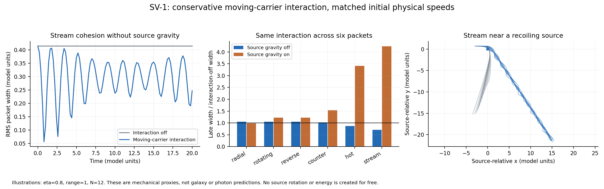

# SV-1: conservative attraction between moving carriers

A bounded momentum-dependent interaction can produce measurable packet cohesion with a conserved mechanical energy and reciprocal source recoil. In the declared stream example without source gravity, the late packet width is about 29% smaller than the interaction-off control after matching initial physical emission speeds. This is a finite, low-speed mechanical result. It does not establish universal extra gravity, photon hitchhiking, or a galaxy/cluster solution.

## What was executed

The original 252 settings span six source packets, seven signed strengths, three interaction ranges and ordinary-source gravity on/off. Thirty-six predeclared refinements were run. An amendment repeats the same 252 settings and 36 refinements with matched source-relative physical velocities. All 504 primary integrations and 72 refinements pass their declared numerical gates. The initial 32 Hamiltonian controls and 378 velocity-matching controls pass.

The amendment matters: with momentum-dependent coupling, identical canonical momenta mean different actual velocities. The original fixed-momentum scan is preserved; it is not silently replaced. Relative physical velocities are matched in the second scan, with different source recoil velocities and required preparation energy recorded.

## The interaction and its energy

The complete Hamiltonian and equations are in [the protocol](protocol.md), with initialization in [amendment 1](amendment-1.md). The extra term is

    H_interaction = - eta/(N-1) sum_(i<j) w_ij p_i dot p_j

with a Gaussian spatial kernel. The same Hamiltonian supplies both the force and the velocity law. Source recoil is dynamical; a compensating source spin accounts for the released packet's initial angular momentum. For |eta|<=0.8 the kinetic matrix has eigenvalues at least 0.2, and the softened source potential has a finite lower bound.

The source begins with a prescribed carrier reservoir. Preparation energy is the increase from coincident, resting carriers at the source plus compensating spin energy. Unchanged rest energies cancel in that difference. This is the required release/preparation work, not a derived conversion process or demonstrated astrophysical fuel supply. After preparation no external work is added.

## Matched-speed findings

The table uses the fixed eta=0.8, range=1 slice, not a winner chosen to fit observations. Ratios are late-time RMS widths divided by the corresponding interaction-off control. Below one means a narrower packet; it does not by itself mean stronger gravity.

| Packet | Source gravity off | Source gravity on |
|---|---:|---:|
| radial | 1.048 | 0.978 |
| rotating | 1.050 | 1.223 |
| reverse | 1.050 | 1.223 |
| counter | 1.021 | 1.538 |
| hot | 0.865 | 3.410 |
| stream | 0.707 | 4.238 |

The stream example with source gravity off has width ratio 0.7069; required preparation energy is 15.636 model units versus 5.729 for the control, a factor 2.73. Thus cohesion is not obtained with an uncounted energy bonus. It is a finite-time effect over t=0..20, not proof of indefinite binding.

With source gravity on, the stream has a broader packet but a larger fraction still near the source. Retention and coherent following are different metrics. In the same slice, rotating and hot packets also broaden. A tighter packet is therefore not a universal outcome, and no stable self-generated cluster-scale whirlpool has been demonstrated.

The initially radial symmetric packet acquires no substantial net circulation; rotating/reverse packets inherit their supplied angular momentum and have matching radial outcomes. Neither result demonstrates generation of net angular momentum from nothing.

## A force-sign trap caught by the controls

At eta=0.8 the parallel pair has attractive canonical force and inward separation acceleration. The opposite-heading pair has repulsive canonical force but also inward instantaneous separation acceleration in the declared one-dimensional setup, because the velocity-momentum relation changes with separation. The orthogonal control has geometric separation acceleration even with the interaction off. Thus the model cannot be advertised as an exclusively aligned-attraction or predecessor-following law based only on the p_i dot p_j factor. Actual trajectories decide.

## Verification

Across both primary scans, maximum scaled energy drift is 8.97e-07; maximum canonical momentum drift is 4.83e-14; angular-momentum drift is 2.12e-07. The largest selected refinement discrepancy is 0.000263, below the declared 0.001 relative-position threshold. These are numerical consistency checks, not observational passes.

The independent audit verifies 19 evidence files and 8 pinned source/protocol instances. A separate scalar pair-sum energy calculation reproduces archived endpoint energies to 2.13e-14 model units. Rotation-reversal radial symmetry differs by at most 5.14e-14 relative. Full trajectories, scalar histories, failures and all settings are archived.

## Why this is not yet the astronomical theory

The carriers have a finite inertial mass and low-speed kinetic energy. There is no massless limit, causal field mediator, photon equation, field production from empty initial data or physical coupling scale fitted to galaxies. The interaction is instantaneous, frame-dependent, and normalized by a finite packet's particle count. Those are explicit limitations, not completed requirements. A long Gaussian tail also supplies no finite propagation cone.

OP-1's observed-data findings are unchanged: blanket radial retention did not improve shared transfer, and Coma's absolute normalization remains unresolved. This mechanical proxy has no new prediction to place on the observed lensing/rotation chart.

## Attribution

Hamilton equations and their conservation identities are established mechanics; see [the expert account of the action principle](https://www.scholarpedia.org/article/Principle_of_least_action). Gaussian kernels and spectral positivity bounds are standard mathematics. Velocity-dependent interactions also predate this work: [Essen's account of the Darwin interaction](https://arxiv.org/abs/1008.1182) discusses the established electromagnetic precedent. We do not implement the Darwin electromagnetic Hamiltonian or claim its mathematics as an invention. This is a declared project combination with no claim that it has never been considered. DOP853 is an established numerical method supplied by SciPy.

## Next work justified by these results

1. Derive a local mediator whose finite-speed dynamics replace the instantaneous kernel, while preserving a positive energy and reciprocal recoil.
2. Specify the source reservoir and production process. Compute the energy needed to fill a spatial field from ordinary matter, rather than merely preparing twelve carriers.
3. Derive an actual follower response: compare equal physical emissions, opposite headings and counter-rotation, retaining the common-potential control.
4. Only then derive a common matter/light response and return to the fixed galaxy and cluster observations. Do not transplant the 29% width effect into a lensing-strength multiplier.

## Reproduction

Original protocol: 14e6185; original source: 2cebb65. Matched-speed amendment/source: b3f539b. Run each driver in an isolated checkout without its evidence directory to reproduce a fresh archive; neither driver overwrites results.

    python -B research_work/experiments/conservative_carriers/audit_report.py

Requires NumPy, SciPy and Matplotlib. This command audits existing evidence and rebuilds the report/figure. No dark matter or expanding geometry is used.
