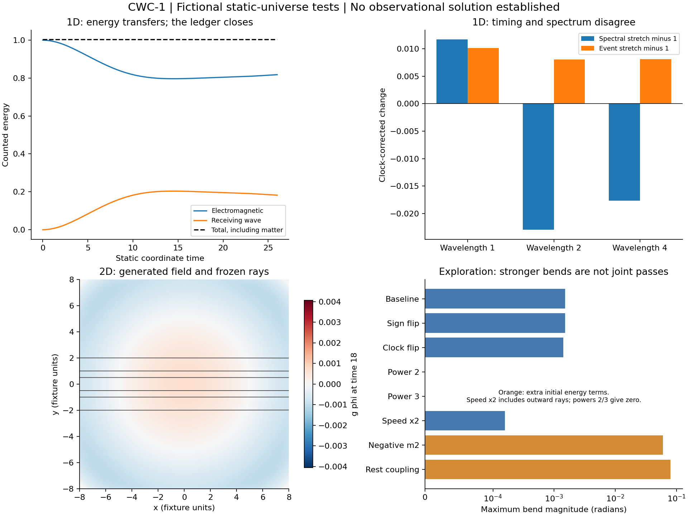

# CWC-1: coupled conversion, clocks and generated lensing
19 September 2026. Executed under the owner's static-universe, no-dark-matter
constraints. [Plan](protocol.md), [derivation](derivation.md),
[attribution](provenance.md), [follow-up attribution](provenance-follow-up.md),
[reproduction](README.md), [archive verification](publication-verification.json).

**Outcome:** The coupled Hamiltonian can transfer finite electromagnetic energy
into a receiving wave and produce attractive optical bending from a generated
profile. The tested family does not solve the joint timing, matter and cluster
problem. Sign/power/constant changes were actually run; none passes the whole
homogeneous scientific screen. No astronomical fit or historical novelty is claimed.

## Plan-to-execution record

| Stage | Executed evidence | Result |
|---|---|---|
| Attribution | Primary sources and prior project derivations; component claim register | Familiar ingredients credited; originality unestablished |
| Small systems | 27 parameter cases + 5 controls; Hamiltonian derivatives, reversal and missing-reciprocity negative control | Numerical pass; joint mechanism fail |
| Spatial conversion | 29 one-dimensional runs, including colors, intensities, direction, mass, wave speed and source-off controls | Original arrival-convergence gate failed; other numerical gates passed |
| Resolution follow-up | 6 runs at 4096, using original windows and thresholds | All four follow-up numerical gates pass; physical failures persist |
| Generated lensing | 6 two-dimensional runs, three grids, six signed ray impacts, refined rays, straight-field and weak-gradient controls | Inward bends; original mirror gate failed |
| Mirror diagnostic | Equal-action and reflected-source fixtures | Both symmetry diagnostics pass; original failed gate preserved |
| Unusual laws | 66 homogeneous laws + 66 source-off controls; 8 spatial screens and 8 Hamiltonian derivative checks | Numerical gates pass; 0/66 complete homogeneous mechanism passes |
| Observation readiness | 35 timing rows, 175 disks/3391 points, 6 lens systems, 6 Coma shear bins, 12 cluster density profiles | Input checks pass; all six prediction prerequisites remain unmet |

There are 164 homogeneous cases and 51 spatial runs,
plus the derivative, reversal, ray and input checks. The measurement inventory
is an executed readiness audit, **not** an observational model fit.
Historical jobs containing excluded geometry or halo comparisons were not run.

## What the tests establish
The starting receiving amplitude and momentum are zero in production runs.
Every reciprocal force follows the same Hamiltonian. Finite material internal
energy is included; material clocks are effective oscillators, not solved atoms.

Small-system energy error is at most 6.45e-11, and the independent
arrival/clock identity error is at most 1.1e-09. The largest Hamiltonian
finite-difference discrepancy is 4.32e-11.
The deliberately omitted reciprocal source yields a
3.33% energy defect and is rejected.

The 4096-point 1D fixture finishes with receiving energy
0.182264 from initial electromagnetic energy 1.
Electromagnetic loss is 0.182180; counted material internal
energy loss is 8.34263e-05.
Maximum relative total-energy error is 2.77e-07.
This is classical field-energy transfer, not a proof of a microscopic photon
splitting process or a photon-number measurement.

The primary 2D snapshot bends all six rays inward. Maximum bend is
0.0015375 radians in dimensionless fixture units;
192-to-256 bend change is 0.944%,
ray-step refinement changes the answer by 3.02e-08
of the largest bend, and the weak-gradient comparison differs by
0.140%.
Total-energy error is 3.88e-05.
Only 0.287% of receiving energy remains
inside radius 3 at time 18. This is weak finite-duration central retention,
not a stable cluster reservoir. Bending convergence does not certify
convergence of every energy or field statistic.

These are frozen periodic 2D snapshots. There is no claim of evolved 3D
astrophysical light propagation, realistic cluster formation, actual source
geometry, physical mass normalization or universal gravity.

## What fails
The refined primary measured spectral stretch is 0.977055
(a blueshift under the defined diagnostic), while its event stretch is
1.008077. Their relative mismatch is
3.175%, exceeding 1%.
The equal-energy carrier stretch spread is
3.497%, exceeding 1%.
The largest fixed-ruler, clock-normalized optical-speed change is
6.500%, exceeding 0.1%.
Finite pulses are broad and distorted; these diagnostics are not precision
astronomical line measurements.

At a common position, the baseline force per inertial mass is proportional
to I/M. Doubling internal action at fixed inertial mass doubles the acceleration.
The b=0 case protects its clock by assumption but removes that material force.
The b=1 homogeneous closure keeps the fixed-ruler local speed constant but
cancels the measured homogeneous redshift. Changing the clock exponent is a
physical change requiring a material completion, not a coordinate relabeling.

For the generalized homogeneous F(phi) laws, the directly checked identity is

S_spectrum = S_events = exp[(1-b)(F_observed-F_emitted)].

This identity is for homogeneous propagation; the distorted spatial pulses
do not inherit it automatically. The baseline b=2 source-off run also
generates receiving energy from finite material internal energy. That is
counted and allowed as an energy source, but rules out calling it
photon-exclusive production. No broad photon-budget exclusion assumes a
universal cosmic age or a finite total illumination history.

## Numerical failures retained and investigated
The 1024-to-2048 arrival difference was 0.052171,
above 0.02. At 2048-to-4096 it is 0.014171, below the
unchanged 0.02 rule. Receiving-energy change is
0.001691 of initial EM energy.
The original failed directory remains [spatial1d-v1](evidence/spatial1d-v1/results.json).

The primary 2D mirror residual is 1.784%,
above 1%. Opposite material sources were deliberately assigned unequal actions.
Equalizing actions at the same total energy reduces the residual to
2.51e-07; reflecting the original
sources reproduces reflected rays to 1.65e-08.
This diagnoses physical source asymmetry rather than discarding the failed
criterion. The original [spatial2d-v1](evidence/spatial2d-v1/results.json)
still has numerical_pass=false; the separate mirror audit passes.

## Deliberately unusual laws: all outcomes retained
| Change | Executed outcome | Interpretation |
|---|---|---|
| g to -g consistently | Identical ray observables; phi changes sign | Field relabeling for this symmetric potential, not a rescue |
| F=g phi^2, g phi^3, g phi^5 | Empty homogeneous state remains empty; 2D square/cube rays remain straight | F'(0)=0 prevents classical production without a new seed mechanism |
| b=-2,-1,0,0.5,1,2,4 | Some positive shifts; no joint homogeneous pass | Clock/force/source changes must all be counted |
| Receiving speed doubled | Smaller bending with mixed inward/outward rays | Changed propagation constant does not supply the missing completion |
| Negative squared mass plus bounded quartic | Stronger bend; 65.536 units of initial receiving potential energy in the 2D box | A counted initially unstable field reservoir, not an empty-energy receiving channel |
| Added material-rest coupling | Stronger bend and reduced composition contrast; material energy funds most generated waves | Additional matter coupling and source, not a photon-only derivation |

The material-rest 2D run starts with 4.003 material energy units and 1 EM unit.
It finishes with about 0.550 receiving energy, while EM loses only about 0.0116.
The larger optical signal cannot be attributed to photon losses alone.
Neither stronger-bending variant is promoted as a successful theory or a
precision result from its 128-point exploratory screen.

Negative kinetic-energy ghosts were rejected algebraically by the positive
energy requirement; no unbounded-energy model was used to manufacture a pass.
No constant, source term or sign was edited silently after a result.

## Attribution and next decision
Maxwell/Hamiltonian mechanics, dynamic-medium frequency conversion, scalar
couplings, scalar quartic potentials and symmetric splitting are established
mathematics. Photon/graviton mixing has its own established literature and is
not identical to this effective scalar receiving wave. The primary sources,
access limitations and permitted claim language are in the attribution files.
Code was written for this campaign; that does not confer originality on its equations.

Revisiting conversion and clocks together was useful: it gives an explicit,
conservative model with falsifiable cross-checks. This tested family should
not be promoted to a solution for galaxy clusters. A next model would need a
microscopic source interaction and a consistent matter/rod/clock completion
that predicts the same observed timing and material/lensing behavior without
an inserted unseen profile. The present results do not exclude all fictional
conversion or time alternatives.

## Checkpoints and integrity
Protocol/provenance checkpoint 7abb52b preceded execution; c11cbaa implemented
the Hamiltonian, f22aab2 declared 1D tests, f5d94ae published 1D evidence and
declared 2D tests, 1bfcf28 declared the unusual-law and resolution follow-ups,
and 13da431 published 2D/exploratory evidence and declared the final controls.
No force-push or rewrite of older PF5/RUT evidence was used.

Verification matches 105 source digests to the exact pre-run Git
commits and current files, and 7 consumed-input digests to current
inputs. Every evidence file has a final digest. Failed scientific/numerical
gates are retained separately from successful process completion.
