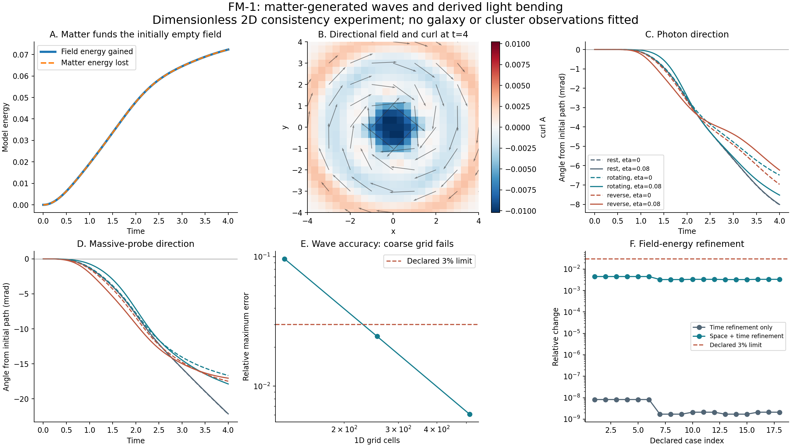

# FM-1: a matter-funded wave field that bends light

Completed 20 September 2026. [Declared protocol](protocol.md), [implementation](field_model.py), [campaign driver](run_campaign.py), [independent audit](audit.json), [figure](results.png).

**Result:** this candidate produces a directional, circulating field from moving ordinary matter, starting with no field energy. Both massive particles and light respond through the same Hamiltonian. All 96 declared trajectories completed, all 36 trajectory/field-energy refinement comparisons passed, and energy transferred from matter accounts for the generated field. The coarsest independent wave test fails its accuracy target and remains a failure. This is a two-dimensional consistency result, not a galaxy or cluster fit or a completed relativistic theory.

No dark matter, expansion, prescribed halo, observed-distance change, or adjustable optical multiplier was introduced. No observations were fitted in FM-1. Earlier galaxy and cluster scores, including the remaining CMF/OP failures, are unchanged.



## What changed since SV-1

SV-1 prescribed a finite population of massive carriers interacting through an instantaneous momentum-dependent kernel. FM-1 replaces that interaction with dynamical scalar and vector fields whose wave principal part has speed one. Ordinary matter generates those fields, recoils, and supplies their energy. Light is a massless particle of the same Hamiltonian family, so its bending law is derived rather than fitted separately.

In dimensionless units, with F=(phi,A_x,A_y), the candidate is

```text
H = integral [Pi^2 + |grad F|^2 + omega^2 F^2]/2 d^2x
    + sum_i E_i exp(sigma_i)
E_i = sqrt(m_i^2 + p_i^2)
u_i = p_i/E_i
sigma_i = g phi_bar(q_i) + eta A_bar(q_i) dot u_i
omega = 0.2
```

The bar averages over each finite matter profile. Differentiating this one Hamiltonian gives

```text
qdot_i = exp(sigma_i) [u_i + eta (A_bar - u_i(A_bar dot u_i))]
pdot_i = -E_i exp(sigma_i) [g grad phi_bar + eta (grad A_bar)^T u_i]
Fdot = Pi
Pidot = Laplacian F - omega^2 F
        - sum_i E_i exp(sigma_i) (g, eta*u_ix, eta*u_iy) f_a(x-q_i)
```

The source deposition and particle interpolation are adjoints, including derivatives of the discrete profile normalization. This makes energy exchange a property of the equations, with numerical conservation checked separately.

The leading-order, static elimination of the fields gives an interaction proportional to minus the scalar-source product and minus the momentum dot product, weighted by the wave operator's static Green function. That connects to the motivation behind SV-1's directional coupling. It does not make the finite-coupling dynamical models identical. Momentum-force signs alone still do not determine physical acceleration.

For m=0, H is homogeneous of degree one in momentum. In a prescribed field, rescaling photon energy therefore preserves the ray trajectory. With finite photon backreaction, energy independence is approximate and was tested explicitly.

## The completed campaign

Six mass-one particles begin on a radius-0.8 ring. They are initially resting, rotating, or reverse rotating. There is no external ring support. Every field and field momentum starts at zero. Scalar coupling g is 0 or 0.08; directional coupling eta is -0.08, 0, or 0.08. Each source/coupling setting runs without a probe, with a massless photon, and with a massive probe: 54 primary cases.

The photon starts at (-2.5,0.7) with momentum (0.0001,0); the massive probe starts at (-1.5,0.7) with mass 0.0001 and free speed 0.4. They are different diagnostic paths, not an observed star/light pair. The domain is [-8,8)^2. The compact, separable profile has fixed radius 0.75 per coordinate. Primary runs use 48 cells per side, RK4 step 0.02 and final time 4.

Eighteen cases are repeated at step 0.01, first on the same grid and then at 64 cells: 36 refinements. Six photon cases repeat with twice the initial momentum. No setting was chosen because it gave a favorable result.

| Declared check | Result |
|---|---|
| Hamiltonian gradients, deposition, normalization, positivity and zero-coupling controls | 67/67 pass |
| Primary trajectory energy and boundary checks | 54/54 pass |
| Refinement-run energy and boundary checks | 36/36 pass |
| Refinement position and field-energy comparisons | 36/36 pass |
| Photon energy-doubling direction comparison | 6/6 pass |
| Independent archive, endpoint energy and evolved-gradient audit | 362/362 pass |
| 1D wave accuracy at 128 / 256 / 512 cells | FAIL / PASS / PASS |
| 1D ahead-of-front amplitude at those grids | 3/3 pass |

The maximum scaled total-energy drift across all 96 runs is 1.16e-10, against the declared 1e-4 ceiling. Every integrator endpoint is measured and archived. The independent endpoint energy reconstruction agrees to 8.88e-16. Gradient controls use the scaled error |numerical-analytic|/max(1,|analytic|), not a fractional error against nearly zero derivatives.

The largest trajectory change under refinement is 0.001554 model length units, below 0.01. The largest final field-energy change is 0.4507%, below 3%. Halving the time step alone changes trajectories by at most about 1.3e-9; spatial resolution dominates these comparisons. Two grids establish this declared check, not an extrapolated continuum solution.

The separate 1D compact-pulse test compares against d'Alembert's exact massless wave solution at time two. Relative maximum errors are **9.611%, 2.426%, and 0.608%**. The 128-cell case fails the 3% target. Ahead-of-front amplitudes are 9.23e-5, 5.68e-5, and 2.46e-5, each below 0.001. The failure is retained without changing its threshold. These pulse grids have different physical resolutions from the 2D source campaign; their pass/fail labels do not transfer automatically between problems.

## What the swirl does

In the rotating, no-probe, g=eta=0.08 example, the field gains **0.07233200449** energy units and matter loses **0.07233200519**. The roughly 7.1e-10 difference is numerical total-energy drift. The funding includes the field-dependent particle/rest-energy terms; it is not solely mechanical kinetic-energy loss, nor a demonstrated microscopic photon conversion process.

At time four this example has maximum |curl A|=0.010229 and circulation integral inside radius two of -0.040478. Reversing the source rotation reverses that circulation. The initially resting, no-probe source has net circulation consistent with zero. The source's initial rotation supplies angular momentum; FM-1 does not generate net rotation for free. Local curl in the initially resting case can occur from the finite six-body geometry and discretization and is not evidence for a macroscopic spontaneous swirl.

Final physical photon directions, in milliradians from the initial horizontal path, are:

| Source | Scalar only, eta=0 | Scalar + directional, eta=0.08 | Change in inward bend magnitude |
|---|---:|---:|---:|
| Initially resting | -8.0239 | -8.0078 | -0.20% |
| Rotating | -6.4907 | -7.5224 | +15.89% |
| Reverse rotating | -6.9667 | -6.2314 | -10.55% |

Thus a circulating field can enhance the bend along one path, but it can also reduce it. That directional dependence is a prediction to investigate, not universal extra attraction. The two scalar-only rotating baselines differ because the moving, discrete sources are seen along the same off-axis probe path. A true reflection also moves that path to the other side. Rotation-reflection checks were consequently performed on probe-free configurations, where the symmetry actually applies.

The corresponding massive-probe directions are -22.1954 to -22.1541 mrad (rest), -16.6696 to -17.8784 mrad (rotating), and -17.4893 to -17.0516 mrad (reverse). These are transient deflections, not circular-orbit velocities or a flat rotation curve.

Reversing eta globally leaves particle trajectories unchanged and changes the vector field sign: this is a field redefinition, not a way to make the interaction repulsive. The recorded trajectory symmetry residual, including the reflected source-ring checks, is at most 8.33e-16. Doubling photon energy changes the final direction by at most 3.89e-8 rad, below the 0.001-rad limit. This is a small-backreaction ray test, not a coherence, polarization, image-width, or observed broadband lensing test.

## Limits exposed by this step

The field PDE has a finite-speed principal part, but finite-radius averaging is instantaneous within each source profile. The lattice also has small numerical tails. The geometric wave-cone clearance from the periodic boundary stays at least 0.75 model units; the maximum final boundary field amplitude across the campaign is 9.79e-10. These checks support the chosen finite-domain calculation; they do not establish strict point-local causality.

Positive total energy does not ensure Lorentz invariance, kinetic convexity, or a universal speed bound. The rotating, vector-only photon cases reach speed **1.000489944**, about **0.049% above** the field-wave speed. The scalar-plus-vector cases tested here did not exceed one. The former cases remain explicit counterexamples to a universal bound for this Hamiltonian. No speed-bound gate was declared, so this is a physical limitation rather than a relabeled numerical pass.

Continuum momentum and angular momentum diagnostics are not exact invariants of this square-grid, separable-profile discretization. Across all runs their largest absolute residuals are 1.05e-7 and 5.40e-4. For the rotating g=eta=0.08 source without a probe, angular residual falls from 5.35e-4 at 48 cells to 2.09e-4 at 64, while halving the time step alone hardly changes it. The fixed separable source shape itself is anisotropic, so spatial refinement need not restore exact rotational invariance. Both field orbital angular momentum and vector spin are included.

The experiment lasts four time units. It has not established a durable, self-supporting swirl, long-range amplification, a galactic source budget, or a three-dimensional lensing law. All astronomical fits remain those of the earlier campaigns. There is no new evidence here that the model beats MOND or dark-matter models on observations.

## Attribution

The wave equation and its exact 1D traveling-wave solution are established mathematics; the pulse reference follows [Matthew Hancock's MIT wave-equation notes](https://ocw.mit.edu/courses/18-303-linear-partial-differential-equations-fall-2006/22ead9d70b36836a68d13c7393e19649_waveeqni.pdf). Hamiltonian ray optics also predates this project; [Hamilton's original optics papers](https://www.maths.tcd.ie/pub/HistMath/People/Hamilton/Optics.html) are the historical source. Velocity-dependent current interactions have established precedents, including the Darwin electromagnetic interaction discussed in [Essen's research paper](https://arxiv.org/abs/1008.1182). That paper is precedent, not experimental support for FM-1 or an identification of this field with electromagnetism.

The exponential coupling and its parameter choices are a project candidate. Wave mechanics, Hamiltonian differentiation, scalar/vector fields, interpolation, and Green-function elimination are not claimed as inventions. This limited attribution review cannot certify that the particular formula has never appeared elsewhere. No established theory is being relabeled as a new discovery.

## Next declared research priority

Before fitting another astronomical curve, construct and test a completion with an explicit common propagation cone and rotationally symmetric source treatment. Derive its source budget, massive motion, and massless rays together. A useful comparison would retain this exponential candidate as a control and test whether the direction-dependent bending survives once a universal speed bound is enforced. Any alternative must receive its own protocol before tuning or running it.

Then test longer-lived, source-generated configurations and move to a three-dimensional isolated-source calculation with resolution and domain-size controls. Only after that should one normalization and one coefficient set face held-out galaxy rotation and cluster-lensing data. Field energy, local clock response, image distortion, and source fuel must be carried through those comparisons. These are future tasks, not completed FM-1 results.

## Reproduction and preserved evidence

Protocol commit: `1fa8355`. Numerical implementation used for the run: `21cb60c`. The audit/plot implementation was checked in separately at `4eb59f3`. `evidence-v1/manifest.json` pins the protocol and numerical sources to their Git commit and SHA-256 hashes; `evidence-v1/evidence-hashes.json` covers all 13 saved evidence files other than the hash list itself. The archive retains all 96 particle paths and momenta, all final field states, every endpoint's energies/diagnostics, the failed pulse result, refinements, and sign/reflection checks. It does not retain full field snapshots at every time step.

Run `python -B research_work/experiments/finite_mediator/audit_report.py` to verify the archive and regenerate the audit/figure. It uses NumPy and Matplotlib and does not overwrite original evidence. `run_campaign.py` refuses an existing evidence-v1 directory; rerunning the scientific campaign requires a separate checkout or a newly declared output version, never deleting the preserved first run. FM-1 is a standalone campaign; the repository-wide historical suite was not rerun or declared green.
