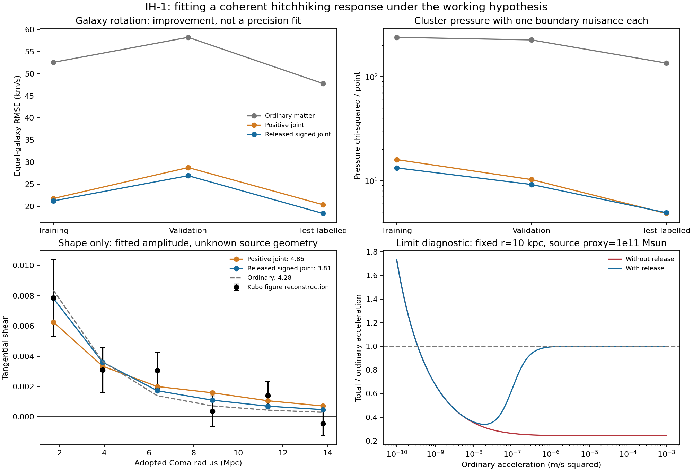

# IH-1: the response a coherent hitchhiking theory would need

**We treated the mechanism as the working hypothesis and solved for a useful observational response.** A shared, deterministic formula substantially improves galaxy rotation and cluster-pressure predictions over the fixed ordinary-matter calculation. A signed version with release at large acceleration also modestly improves the exposed Coma shear-shape comparison. It does not match all quoted measurement errors or yet derive a self-sourced, energy-funded graviton interaction.

[Primary protocol](protocol.md) | [sign follow-up](counter-protocol.md) | [release amendment](recovery-protocol.md) | [audit](audit.json) | [exact coefficients](summary.json)

## The final fitted formula

All accelerations below are in m/s squared. Let g_b be the measured ordinary-matter model's acceleration, r the radius in kpc and M the fixed ordinary-source mass proxy in solar masses. Define sigma(u)=1/(1+exp(-u)) and

    u = -2.43138908 + 0.53652428 ln(g_b/1e-10) -0.42161087 ln(r/10)
        +0.12877284 ln(M/1e11) +0.71197510 tanh[ln(M/1e12)/2]
    f = sigma(u)
    S = (g_b/g_flip)^2 / [1+(g_b/g_flip)^2],  g_flip = 3.61004896e-11
    D = 1/[1+(g_b/1e-7)^2]
    g_total = g_b [1-0.75787287 S D] + 3e-9 f
    v_predicted = sqrt(r_physical * g_total)

Here f is the smooth inward coupling fraction, S activates the opposite turning contribution and D releases that opposite contribution at large acceleration. These meanings are hypotheses assigned to an effective response. They are not measured attachment probabilities or a derived quantum binding law. Roundoff in this displayed formula is avoided by using the exact saved coefficients.

The optical primary uses the same added acceleration a_H=g_total-g_b, with no separate fitted light-strength coefficient:

    alpha(b) = (4/c_light^2) integral_0^infinity [g_b(r)+a_H(r)] b/r dz
    r = sqrt(b^2+z^2)

The spherical Coma extrapolation holds the ordinary mass fixed outside its 3 Mpc source, applies the response to 9 Mpc, then continues its additional acceleration as r^-2. Reach 3/30 Mpc and light coefficient 0/0.25/4 are preserved sensitivities, not chosen by shear fit. The 9 Mpc reach and high-acceleration release scale are imposed options, not measured source ages or uniquely inferred constants. The selected 1e-7 release scale is the top of the tested grid; its value is poorly identified by these galaxy/cluster data.

## How observations constrain it

For a galaxy point the exact required extra acceleration is a_required=v_observed^2/r-g_b. The initial positive-only closure needs f_required=a_required/a_sat and odds chi_required=f_required/(1-f_required). This inversion simply restates the measured curve; the independent task is fitting the same compact input-only rule across objects. No observed velocity or pressure is used as an input feature for another object's prediction.

The inverse archive retains 190 negative required responses out of 3,152 positive-radius measurements. Of these, 52 are below the ordinary prediction by more than three quoted velocity errors; ordinary-matter uncertainties are not included in that count. Thus negative required values do not by themselves establish a new outward force. They motivated the explicitly declared sign test under the fixed matter model.

Two ordinary-model rows have zero inward g_b after the declared component combination. They remain in the scores; a 1e-30 m/s squared logarithm floor defines evaluation there, and the fitted positive exponent sends the inward addition toward zero. This is a limitation of using net ordinary acceleration as a feature. The 3,152 rows must not be silently compared as identical to older 3,150-row reductions.

## What was fitted and what was kept fixed

Five positive response families vary local gravity, path radius, source amount and a smooth source-mass transition. Four fixed capacities give 20 variants. Twelve signed variants add opposite steering; three release variants repair their large-acceleration limit. Each was fitted to galaxies alone and jointly with clusters: **35 variants, 70 fits, 210 starts**. All starts returned optimizer success; that is numerical termination, not a uniqueness certificate.

SPARC contributes 149 selected galaxies, split 89/29/31, with fixed distances and disk/bulge mass-to-light factors 0.5/0.7. Its source-mass proxy uses total light with factor 0.5 plus 1.33 times HI mass, so the proxy's bulge treatment is approximate. X-COP contributes 246 pressure points in 12 clusters, split 6/3/3. Its ordinary source is the released gas and stellar profile; five clusters use a frozen stellar-fraction template from the seven with measured profiles. Pressure uses spherical thermal hydrostatic balance and diagonal errors, with one fitted nonnegative outer boundary pressure per cluster, including transfer clusters. Cluster scores test profile shape conditional on those boundaries.

The joint objective is galaxy equal-object squared RMSE/20^2 plus cluster chi-squared/point/10. Parameters use training targets; validation chooses the candidate; selections are saved before test or Coma scoring for each stage. All data had already appeared in the project. The later signed/release stages are exposed follow-ups, not fresh blind evidence. Neither source aperture independence nor source-mass proxy uncertainty is established.

## Actual scores

| Model | Galaxy train / validation / test RMSE (km/s) | Cluster train / validation / test chi-squared per point |
|---|---|---|
| Ordinary matter | 52.56 / 58.22 / 47.77 | 238.60 / 225.18 / 134.90 |
| Positive joint | 21.78 / 28.77 / 20.37 | 15.92 / 10.23 / 4.83 |
| Signed joint | 21.23 / 26.93 / 18.39 | 13.25 / 9.17 / 4.91 |
| Release joint | 21.23 / 26.93 / 18.39 | 13.25 / 9.17 / 4.91 |
| Galaxy-only signed | 19.02 / 25.04 / 16.07 | 34.79 / 29.26 / 14.51 |

The final released joint law improves test-labelled galaxy RMSE from 47.77 to 18.39 km/s and cluster pressure chi-squared/point from 134.90 to 4.91. The validation results are 26.93 km/s and 9.17/point. It fails the predeclared combined validation target because the galaxy threshold was 22 km/s. **The final galaxy chi-squared per point remains 75.64 / 46.88 / 43.00** (train/validation/test), using quoted velocity errors and fixed ordinary models. Therefore the improvement is not a statistically adequate fit to all measurements. The better galaxy-only fit transfers less well to cluster pressure.

Coma has only six figure-reconstructed shear bins, missing source geometry and covariance. With one nonnegative shape normalization per curve, the primary low/high ordinary-source brackets give chi-squared 3.8149/3.8158 for the final response, versus 4.2839 for ordinary matter. The positive-only joint law gives 4.8585/4.7720. The improvement of about 0.47 is modest and not evidence that extra parameters or microphysics are established. The normalization is degenerate with unavailable source geometry; **absolute cluster lensing has not been matched**. No distance was varied.

## Why the release correction matters

The signed law before release approaches g_total/g_b=1-epsilon=0.2430 at arbitrarily large ordinary acceleration. That retains a 76% cancellation and does not recover the fixed baseline. Multiplying by D makes the opposite term vanish and the bounded positive term negligible relative to g_b. The repaired law approaches ratio 1. This is an asymptotic consistency result, not a Solar-System, binary, gravitational-wave or strong-field observational pass.

The deterministic fraction can be embedded phenomenologically as ell*df/ds=f_eq-f. This campaign fits only its local equilibrium limit. Repeated identical inputs then produce identical paths; no random-event angular scatter is introduced. That assumption does not derive phase coherence, finite-memory behavior, image sharpness, color independence or a specific attach-and-release trajectory.

## Numerical verification and conservation scope

All 12 stored preliminary/limit controls and all 42 pressure/projection refinement comparisons pass. Independent evaluation of the final force reproduces saved velocities within 1.5e-13 km/s. Adaptive integration agrees with the Gaussian quadrature deflection to 1.93e-9 relative. The audit verifies 27 evidence digests and 35 source/input files at their recorded commits; all adopted galaxy distances are unchanged.

At the test-particle level a stationary radial potential with Phi'=g_total gives H_m=p^2/(2m)+m Phi. A stipulated optical Hamiltonian H_gamma=c|p|exp(2 Phi/c^2) conserves stationary photon Hamiltonian energy and yields the displayed first-order bending. These are effective descriptions. They do not supply an emission rate, positive field energy, binding energy, recoil reservoir or the work needed to create the field. Complete energy accounting remains mandatory and unresolved; no conservation pass for the full mechanism is claimed. No hidden mass distribution was inserted to produce this fit.

## Attribution and next physical derivation

Observation sources are [SPARC (Lelli, McGaugh and Schombert)](https://arxiv.org/abs/1606.09251), [X-COP (Ghirardini et al.)](https://arxiv.org/abs/1805.00042), and [Kubo et al. Coma shear](https://arxiv.org/abs/0709.0506). Only the archived observed profiles and ordinary-source products are used; inferred dark-matter/NFW products are not evaluated. Published distance calibrations are retained under the user's universe contract.

Logistic saturation, deterministic relaxation, inverse calibration, potential mechanics and [line-of-sight lensing](https://arxiv.org/abs/astro-ph/9912508) are established mathematical tools. The square-root-acceleration limit is already associated with [Milgrom (1983)](https://adsabs.harvard.edu/pdf/1983ApJ...270..365M). Our family can approach that limit; its fitted exponent near one half is not a discovery or evidence of historical originality. The code and candidate combinations implement this project's assumptions; no claim that nobody has considered them is made.

The concrete next derivation is to obtain f, S and D from a funded companion-wave action, show that ordinary matter generates its stated source dependence and swirl, and derive the shared matter/light coupling rather than impose it. Then test absolute image geometry, resolved stellar-lens motion, timing, frequency dependence and genuinely new observations. For now the equations specify what a successful version of the working hypothesis must approximate, and where this version still misses the data.

