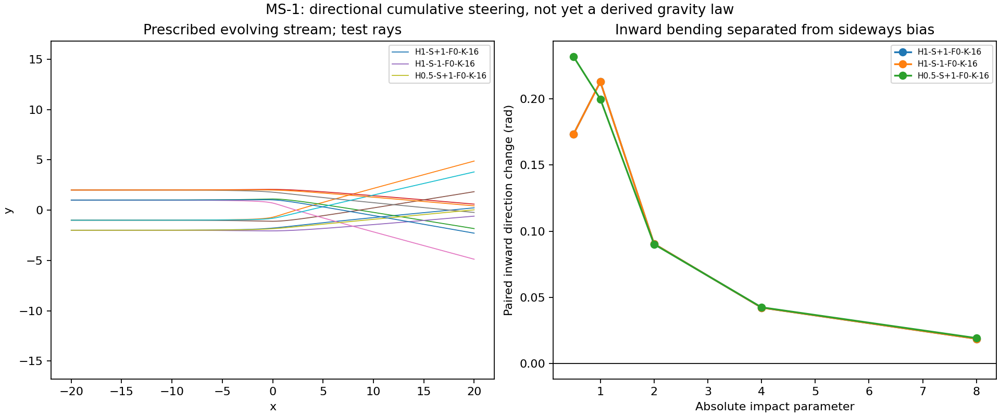

# MS-1: cumulative steering in matter-fed streams

The owner's along-the-river hypothesis was made explicit as directional turning accumulated along a ray. A counted source emits companions into a prescribed spiral wind with an evolving outer front. The stream geometry is assumed, not self-organized from the GF-1 packets.

Ran 210 parameter cases and 2,100 primary rays, 60 first refinements, and 160 finer refinements. No dark matter, expansion, distance fit or observational lensing fit. All primary rays reached the observer plane.

**Following an outward stream did not give the required inward lensing in this law.** All 90 positive-coupling cases have nonpositive mean paired inward deflection at impacts 1,2,4. The rays can turn and sweep sideways, but outward following is not automatically attraction toward the source.

The largest primary inward mean, 0.115245 rad, occurs for H1-S+1-F0-K-16: **negative coupling**, which turns light away from the outgoing heading. That is an exploratory counter-following law, not evidence that positive stream following solved lensing. These dimensionless angles are toy outputs, not predictions in arcseconds for real clusters.

## What was varied

Five spiral pitches, both handednesses, three alignment gates, and seven signed coupling values (-16,-4,-1,0,1,4,16). Each has ten opposite-side impact parameters. The direction law is theta_dot=kappa*u_g*F(cos(psi-theta))*sin(psi-theta). Straight aligned flow produces no bend; sustained deflection needs changing stream direction or heading mismatch. Inward paired deflection and common sideways motion are scored separately.

At the same age every pitch contains exactly the same emitted energy Q*(age0+t). Tighter winding raises residence density but shortens radial reach. Source plus emitted energy remains 10. This is an energy transport accounting control, not a derived microscopic emission or torque mechanism.

## Verification and preserved failures

Seven preliminary controls pass; full-grid chirality reflection is exact, and zero coupling gives a straight ray to about 7e-13 numerical error. Only 52/60 initial refinement comparisons pass: the sharp source/front boundaries leave eight unresolved at dt0.01. Those failed scores remain unchanged.

Additional dt0.005 versus dt0.0025 comparisons pass 78/80 under the original angle/position/exposure limits. The set includes all six selected counter-following laws and two positive-coupling representatives. Unconverged values must not be promoted.

The first command returned exit1 solely while printing a NumPy Boolean as JSON, after all results, the plot and completion marker had been saved. The console serialization was corrected; the first simulation archive was not overwritten or rerun to hide it.

## Limits and next extension

Photon speed and energy are fixed by the steering ansatz. The opposite momentum impulse is recorded as a debt to the prescribed stream, not integrated as a reciprocal field response. Emission microphysics, neighbor-led wind formation, emitter torque, a common stellar-force law and actual cluster shear remain unresolved. This result limits this particular outgoing alignment law, not all coherent stream interactions.

The requested attach-detach idea is a separate [HH-1 experiment](../photon_hitchhiking/protocol.md). It tests whether a carried direction memory differs from continually sampling the current local stream.

Prior work is credited in [the protocol](protocol.md). Standard gravitational lensing already accumulates along a path: [Bartelmann and Schneider](https://arxiv.org/pdf/astro-ph/9912508). The proposed distinction here is an added direction-dependent coupling, not discovery of path integration.

