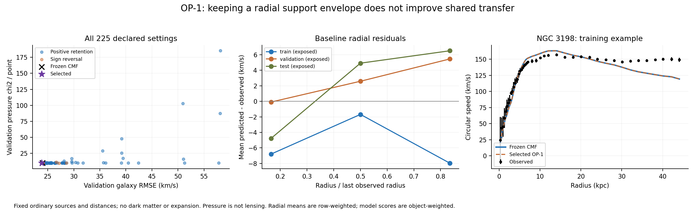

# OP-1: finite outer-support persistence

The 225-setting declared scan does not improve the shared model's galaxy transfer. Both selection rules choose the same small sign-reversed correction; validation improves slightly, test performance worsens, and primary cluster pressure and Coma predictions stay essentially unchanged. The recurrence and selected numerical calculations pass their declared checks. This diagnoses this envelope closure, not every possible swirl.

## Frozen observation scores

| Model | Galaxy train / validation / test RMSE (km/s) | Pressure train / validation / test chi2 per point |
|---|---|---|
| baseline | 21.692 / 23.993 / 21.722 | 10.841 / 9.827 / 5.057 |
| protected | 21.687 / 23.810 / 21.772 | 10.841 / 9.827 / 5.057 |
| MOND | 19.170 / 26.144 / 16.089 | 107.731 / 99.869 / 58.059 |

Selection: d0.25-L30-eta0.5-A-0.5. The 11 CMF coefficients were fixed. Four universal settings were scanned; no per-object force fit. Of 226 cases including baseline, 220 have valid training/validation force. Invalid cases and reasons remain in candidates.json. All partitions are historically exposed. Cluster scores include one fitted boundary pressure per object and diagonal errors only.

Selected-minus-CMF test RMSE is 0.0497 km/s, conditional paired 95% interval [0.0, 0.16187149926079017]. Selected-minus-MOND is 5.682 km/s, interval [2.5232400358852396, 9.00344333739474]. Neither is an improvement. The two selected records are the same formula, not independent replications.

## What this teaches us

The full validation/test samples have positive average outer residuals, whereas NGC 3198 underpredicts outer speeds. A general increase in outer support therefore fixes neither the sample-wide calibration nor its transfer. The selected negative amplitude is one of the protocol's sign controls, not an after-the-fact edit.

The retained envelope is seeded at the first available radius. Removing the first 10% of sampled radii changes predicted speeds by as much as 15.29 km/s in the selected case. This is a material dependence on incomplete interior information. It is a sensitivity, not a failed step-refinement check.

## Cluster lensing

| Ordinary-source bracket | Preferred beta | Bounded chi2 (six bins) |
|---|---:|---:|
| ne0=0.0025 cm^-3, Mstar=5.0e+12 Msun | 2.941 | 12.771 |
| ne0=0.0045 cm^-3, Mstar=2.0e+13 Msun | 1.717 | 7.587 |

These match the frozen CMF predictions at the displayed precision. Beta greater than one cannot be achieved in the adopted static geometry. Broad reconstructed-bin errors and absent covariance/source information prevent an absolute lensing verdict. The 3/9/30 Mpc reach sensitivities are archived and were not used for selection.

## Equations, energy and originality

The exact recurrence and units are in [the declared protocol](protocol.md). H is a squared-speed support envelope, not energy density. Its empirical force remains unfunded by a source/carrier Hamiltonian. We do not promote it to a physical graviton theory.

The scan uses established running maxima, exponential attenuation, quadrature and bootstrap, alongside the project's declared closure. Data and optical/MOND methods retain the [CMF attribution](../coherent_memory_fit/report.md#attribution). There is no historical novelty claim.

## Verification and reproduction

173 preliminary checks pass; 326 selected refinement comparisons pass (163 unique comparisons, repeated for the identical two selections). The independent quadratic-cost envelope reproduces archived velocities to 5.68e-14 km/s. The audit verifies 14 evidence files and 24 inputs/source files both locally and at their recorded commit, plus all 149 adopted distances.

Protocol commit: 8c59e03. Source commit: 956297f. Evidence is in evidence-v1; the driver refuses to overwrite it. From the repository root:

    python -B research_work/experiments/outer_persistence/audit_report.py

For a fresh execution use an isolated checkout at the source commit and run campaign.py. Requires NumPy, SciPy and Matplotlib. No new empirical data were acquired.

## Next physical question

Replace the imposed support envelope with an explicitly reciprocal, energy-counted interaction. A bounded momentum-dependent interaction can test whether nearly parallel moving carriers attract and develop circulation beyond the ordinary-potential control. It must also be tested for opposite headings, source recoil, preferred-frame effects and causal limitations. A successful toy mechanism would still need a relativistic/light coupling and astronomical normalization; this campaign does not supply those.
