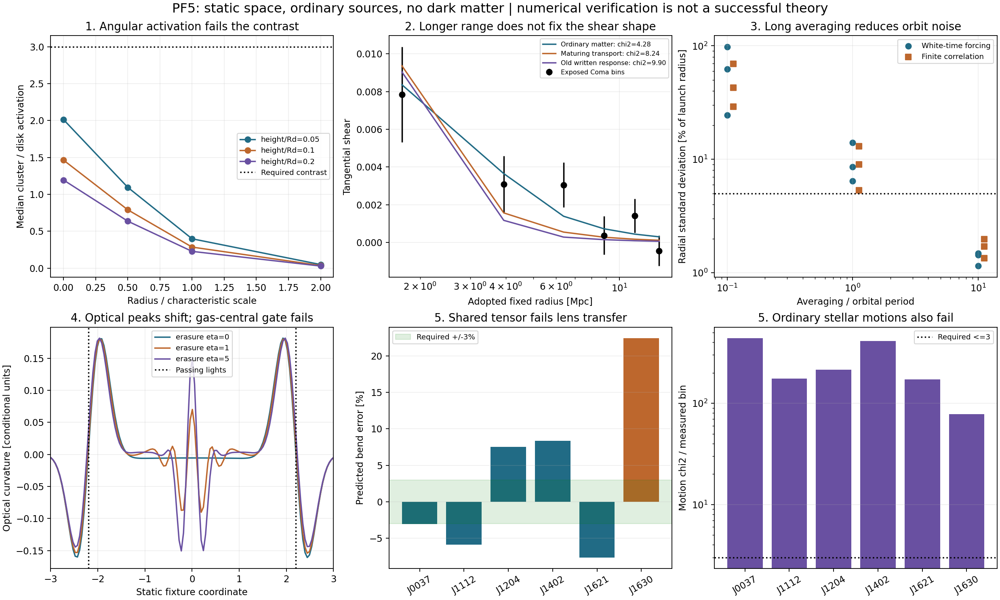

# PF5 results: five photon-response hypotheses

All five primary experiments and the finite-correlation extension were executed. Their final declared numerical gates pass; **none passes its full mechanism screen**. This campaign does not solve cluster lensing. No dark-matter source or expanding-universe dynamics was used.

| Experiment | Executed coverage | Numerical result | Mechanism outcome |
|---|---|---|---|
| Angular activation | 175 disk light profiles, 12 cluster proxies, 3 heights, 3 softenings, nested source sampling | Refined pass; original sampling failure retained | Required threefold cluster/disk boost fails |
| Maturing transport | 27 parameter settings, 6 primary sampling runs, ballistic/nonmaturing controls, 2 emissivity sensitivities | Pass | Longer range, worse primary Coma shape than ordinary matter |
| Fluctuation amplitude | Independent covariance solves; 12 white-time and 12 finite-correlation orbit runs; 3 correlation-time covariance checks | Pass | Square-root scaling; only long averaging consistently quiet in these fixtures |
| Shock erasure | 9 collision runs (3 grids x 3 strengths), source-off, uniform-flow and analytic-decay controls | Pass | Modest peak displacement; gas-central condition fails |
| Directional optical strain | 4 reciprocal-mode energy controls, Hamiltonian rays, 5 shared lengths, 6 lenses and refined spatial solves | Pass | Lens bending and stellar motions fail |

## Angular activation

The median nested-sampling score change fell from 0.05109 (failed 0.05 limit) to 0.01340. Angular isotropy/beam/plane, rotation, luminosity and subdivision controls pass. At one characteristic radius the cluster/disk median ratios are 0.397, 0.284, 0.226. The required ratio is at least 3 across all declared radii and thicknesses. Full quantile overlap and softening sensitivity are retained in the JSON. These are disk-only light and thermal-emissivity proxies, not bolometric radiation reconstructions.

## Maturing transport

The frozen primary gives Coma chi2=8.23898, versus ordinary matter 4.28394 and the older pressure-written response 9.90248. These are six exposed bins with one nonnegative geometry nuisance (five nominal degrees of freedom); they are weak-shear shape screens, not absolute lensing predictions. Both ordinary-mass brackets have the same shape here because their adopted gas and stellar profiles are proportional.

The primary contribution at 5 Mpc is 2.636 times the old finite-footprint contribution. The maximum packet-doubling change is 1.54% on the normalized maximum response scale (limit 15%). All 27 settings are published without replacing the declared primary with a scan winner. A positive optical coefficient was calibrated at1 Mpc from the old pressure response before scoring Coma; it is not an independently funded microscopic interaction. Packet propagation is causal; the Gaussian optical readout remains a conditional nonlocal rule.

## Fluctuations and orbit stability

The white-time stationary covariance solves agree to 1.34e-14; mean injection/damping agree to 3.63e-15. The amplitude exponent is 0.500000000000. The finite-correlation primary solves agree to 1.96e-14; the other declared correlation times are retained. The square-root law is conditional on linear covariance scaling and a square-root readout, not a demonstrated mass-speed relation for real galaxies.

| Time forcing | Averaging/orbit | Quiet primary seeds /3 | Refined seed quiet |
|---|---|---|---|
| White | 0.1 | 0 | False |
| White | 1 | 0 | False |
| White | 10 | 3 | True |
| Finite correlation 0.2 | 0.1 | 0 | False |
| Finite correlation 0.2 | 1 | 0 | False |
| Finite correlation 0.2 | 10 | 3 | True |

Each orbit is measured for 20 periods after an initially empty field burns in for at least five averaging times. Quiet means radial standard deviation and median-radius drift each below 5%, with angular-momentum error below1e-5. Refinements compare statistical behavior, not matched Brownian trajectories. These are negligible-mass probes of a radial fixture. The field ledger in expectation and its explicit split-integrator residual are saved; signed stochastic exchanges do not establish a finite positive photon reservoir or matter backreaction.

## Gas collision and erasure

The largest relative gas+field+fuel+boundary energy error is 3.28e-15; no positivity floor adds energy. The source-off field stays zero and the uniform-flow entropy and constant-source decay controls pass.

| Erasure strength | Positive optical peak | Positive gas peak | Distance from light at 2.2 | Noncompression entropy residual |
|---|---|---|---|---|
| 0 | 1.9395 | 1.4355 | 0.2605 | 32.0% |
| 1 | 1.9512 | 1.4707 | 0.2488 | 32.4% |
| 5 | 1.9746 | 1.5410 | 0.2254 | 32.7% |

Erasure moves optical peaks slightly closer to the passing lights, but gas peaks fail the predeclared central-region bound 0.75. About one third of the measured entropy residual lies outside compression, so this numerical residual cannot be treated as pure physical shock entropy. The simulation is 1D with prescribed light tracks, local field storage and a passive optical readout; no observed merger or full spatial energy-momentum closure is claimed.

## Tensor optics and lens galaxies

The homogeneous reciprocal mode conserves photon+field+heat energy to 2.73e-13. Isotropic, source-off and zero-coupling controls vanish. The optical metric remains positive. Refined ray agreement is 0; agreement with the analytic weak Gaussian ray is 2.24e-07. Spatial lens refinement changes the unit tensor bend by at most 0.180%.

The five-lens training screen selects length 30 kpc and coupling 0.17189; maximum tensor eigenvalue magnitude is 2.71e-06, below 1e-3. These settings are carried unchanged to exposed J1630. The largest primary bend error is 22.45%, exceeding 3%.

| Lens | Bend discrepancy | Stellar-motion chi2/bin |
|---|---|---|
| J0037-0942 | -3.06% | 439.91 |
| J1112+0826 | -5.90% | 175.61 |
| J1204+0358 | +7.53% | 214.87 |
| J1402+6321 | +8.38% | 412.26 |
| J1621+3931 | -7.65% | 171.74 |
| J1630+4520 | +22.45% | 78.19 |

The stellar mass is fitted only within the adopted Chabrier–Salpeter interval, with constant orbital anisotropy allowed in [-2,0.45]. Optical fitting cannot repair the severe ordinary-stellar motion failure. Light anisotropy uses stellar-mass-scaled luminosity proxies, not measured bolometric input. The reciprocal homogeneous test and spatial phenomenological response have not been derived as one closed theory.

## Independent checks and reproducibility

An independent finite-packet survival test agrees with its analytic prediction within 0.257 sampling standard errors. Ballistic and constant-scattering displacement checks are within 2.043, 0.484 standard errors. Point-source projected curvature error is 1.04e-06. The isolated CL-F1 analytic and independent 3D optics checks also pass. No historical joint suite containing excluded comparisons was run.

All numerical thresholds were declared before their respective runs. The first E1 sampling failure and the E2 array-shape execution failure remain under evidence/e1-v1 and evidence/e2-v1. Refinement retained the original scientific thresholds. Manifests include source/input hashes and starting commits. The latest runner inventories active repository modules and rejects the excluded CL1/CL2 source loaders. Historical data files contain unused model branches; only the documented ordinary-source measurements and static-registry values enter these calculations.

Source and run instructions: [README](README.md). Original [protocol](protocol.md), [E1/E2 implementation](implementation-notes.md), [E3/E4 integrators](integrators-e3-e4.md), [E5 integrator](integrator-e5.md), [extra controls](extended-checks.md).

## What remains unresolved

A common photon interaction must still supply the response normalization, conserve energy and momentum with moving matter, predict the bolometric radiation history, and reproduce both cluster shear and galaxy/lens dynamics with shared parameters. Present evidence supports a few toy mechanisms and rejects the complete declared screens. Novel mathematical ingredients are proposals for this fictional universe; historical uniqueness has not been established.

Evidence:
- [e1-v2](evidence/e1-v2/results.json) ([manifest](evidence/e1-v2/manifest.json))
- [e2-v2](evidence/e2-v2/results.json) ([manifest](evidence/e2-v2/manifest.json))
- [e3-v1](evidence/e3-v1/results.json) ([manifest](evidence/e3-v1/manifest.json))
- [e4-v1](evidence/e4-v1/results.json) ([manifest](evidence/e4-v1/manifest.json))
- [e5-v1](evidence/e5-v1/results.json) ([manifest](evidence/e5-v1/manifest.json))
- [e3-colored-v1](evidence/e3-colored-v1/results.json) ([manifest](evidence/e3-colored-v1/manifest.json))
- [audit-v1](evidence/audit-v1/results.json) ([manifest](evidence/audit-v1/manifest.json))
