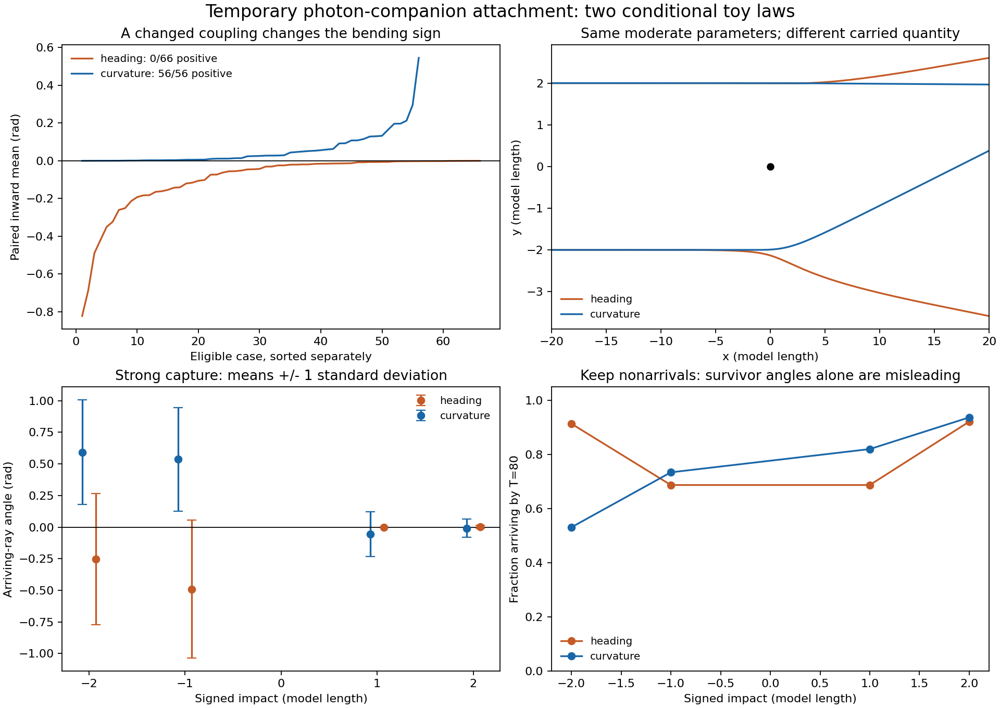

# HH-1 / HH-2: temporary attachment can carry direction or curvature

**Executed toy campaigns; neither is a validated theory of gravity.** Temporary attachment can be represented mathematically. In these tests, carrying an outgoing companion's heading spreads light outward; carrying its inward turning curvature gives inward bending. The latter is a new, explicitly declared interaction postulate. The simulations do not derive a real photon-graviton bound state, spontaneous swirl formation, stellar dynamics or observed cluster lensing.

[HH-1 declaration](protocol.md) | [HH-2 declaration](protocol-curvature.md) | [numerical follow-up](numerical-followup.md) | [integrity audit](integrity-audit.json) | [machine-readable comparison](comparison.json)

## What was assumed

Use MS-1's finite, counted matter source and prescribed spiral wind: source energy 10, emission Q=1/30, launch radius 0.5, companion transport speed 0.5, initial age 30. At pitch h=tan(beta), radial transport is 0.5/sqrt(1+h^2); u=Q/(4*pi*v_r*r^2) only between the launch sphere and the expanding *emission front*. That front is transport in static space, not expansion of the universe. More winding increases local residence density while reducing radial reach at fixed age and emitted energy.

Photons have imposed unit speed and constant energy, starting at x=-20, observed at x=20 or censored at model time 80. 'Nonarrival' means missing this plane by that deadline; it does not prove absorption or permanent trapping. Matter emits into a prescribed field; ordinary matter emission microphysics and a three-dimensional self-consistent swirl are still missing.

## The two attachment laws

Let n be photon direction, t the local companion tangent, p attached occupation, a=k_on*u*((1+n dot t)/2)^2 and b=k_off. Both laws use

    p_dot = a*(1-p) - b*p

**HH-1: carry heading.** A captured companion gives a stored vector t_capture until release. The mean moment m obeys

    m_dot = a*(1-p)*t - b*m
    theta_dot = kappa*cross(n,m),     x_dot = n

**HH-2: carry curvature.** For t=cos(beta)*e_r+sin(beta)*e_phi, direct differentiation gives

    C = (t dot grad)t = (sin(beta)/r)*(cos(beta)*e_phi-sin(beta)*e_r)
    q_dot = a*(1-p)*C - b*q
    theta_dot = chi*cross(n,q),      x_dot = n

C has inward radial component -sin(beta)^2/r despite the outgoing radial velocity. A discrete attachment stores C_capture and turns the photon under chi*(I-n*n^T)*C_capture until release. This copies a curvature vector at capture; it does not dynamically keep the attached pair on one evolving streamline. kappa and chi use the same numeric grid for comparison but are different couplings with different dimensional meanings before nondimensionalization.

After leaving the source front, an already attached photon keeps its stored moment until it releases it; it does not sample a nonexistent stream there. Release is exponential with mean bound duration 1/b. A later capture can select a new local direction or curvature.

The mean-state closure is not an exact ensemble average of nonlinear random trajectories. Discrete histories therefore test scattering and nonarrivals separately. Events occur at the integration midpoint, at most one capture/release transition per step.

## Complete parameter screen

For each law: pitch {0.5,2,4}, capture coefficient {1,10,100}, release rate {0.1,1,10}, and guide coefficient {1,4,16}: 81 cases with ten signed impacts. Primary mean step 0.02; six fixed cases repeated at 0.01. Three fixed stochastic cases at four impacts, 128 realizations each, at steps 0.01 and 0.005 with recorded independent seeds.

| Model | Mean rays arriving / 810 | Eligible paired cases / 81 | Positive inward means | Random arrivals at step 0.005 / 1536 |
|---|---:|---:|---:|---:|
| heading | 770 | 66 | 0 | 1430 |
| curvature | 715 | 56 | 56 | 1395 |

Eligibility requires both sides to arrive at each impact 1,2,4. Inward A=(theta_minus-theta_plus)/2 and sideways B=(theta_minus+theta_plus)/2. A positive *mean* of three pairs is only a sign diagnostic, not a lensing acceptance threshold. The 15 HH-1 and 25 HH-2 ineligible cases are retained, not successes or zeros.

HH-2's largest eligible primary mean is 0.545529 rad for H2-A100-D0.1-K1, with mean absolute sideways component 0.455750 rad. This is strongly asymmetric bending, not a clean isotropic lens. It is an exposed selection and not an observational prediction.

Including numerical follow-ups and mirrors, these attachment campaigns contain **1,970 mean trajectories and 6,144 discrete histories**. This is in addition to GF-1's 618 formula cases/1,515 trajectories and MS-1's 210 cases/2,320 rays.

## Numerical checks and unresolved values

A time step is the simulated interval between integration updates. Halving it tests resolution while leaving the physical law and parameters unchanged. Model time is not yet calibrated to seconds. A resolution failure is not by itself a rejection of the idea.

| First step 0.02 vs 0.01 | Arriving pairs within angle/position tolerance | Both censored | Arrival mismatches |
|---|---:|---:|---:|
| heading | 47/50 | 10 | 0 |
| curvature | 46/48 | 12 | 0 |

The archived first audits report 57/60 and 58/60, including matched nonarrivals as passes. The table above separates those censored cases; matching censorship does not establish trajectory accuracy. Original audits are preserved.

| Additional step 0.005 vs 0.0025 | Arriving pairs within tolerance | Both censored | Arrival mismatches |
|---|---:|---:|---:|
| heading | 4/6 | 4 | 0 |
| curvature | 56/57 | 13 | 0 |

The follow-up includes the failed heading representative and all six curvature representatives plus its exposed largest-inward case. Two heading and one curvature observer comparisons remain outside the original 0.01 tolerance. Full terminal-state differences for censored rays are also saved; these are not declared converged. Discontinuous source/front boundaries and long path sensitivity remain numerical concerns.

All 20 follow-up controls pass: analytic bound-state steering, exponential decay after leaving the front, event bookkeeping, observer positions, unit-speed path bounds and full chirality reflection. HH-1's four original controls and HH-2's independent finite-difference curvature check pass. Occupation/moment bounds hold across the archived mean states.

The integrity audit verifies 176 exact evidence byte hashes, 19 source files against their recorded Git commits and 17 ray archives. All pass. This is reproducibility and numerical implementation evidence, not a physical validation.

## Why random hitchhiking is not yet a satisfactory lens

For the strong curvature case H4-A100-D0.1-K16 at impact -2, 68/128 rays arrive in the finer stochastic run. Those survivors have mean angle 0.5933 rad and standard deviation 0.4136 rad, with mean extra travel time 9.830 model units. At impact +2, 120/128 arrive with mean -0.00810 rad and standard deviation 0.07281 rad. The two sides behave very differently.

The moderate curvature case at impact -2 has mean 0.06521 rad but standard deviation 0.24379 rad among 126 arrivals. Rare attachments can make a broad mixture of undeflected and strongly scattered light. Stronger average bending is not enough if images blur or the selected arriving rays conceal large losses. A zero survivor angle can also mean only the unscattered rays reached the plane.

Between the two independent-seed curvature ensembles, the largest mean difference is 2.34 combined standard errors. This is descriptive: twelve small ensembles, rare events, survivor selection and a changed timestep do not establish a stochastic convergence theorem. A tiny sample with zero captures cannot establish an exactly vanishing physical rate.

## Conservation, attribution and what remains to test

The source energy plus emitted transport energy is counted. The additional attachment law has **no derived binding Hamiltonian or reciprocal stream evolution**. Maintaining imposed photon speed/energy does not establish energy, momentum and angular-momentum conservation for the full source-stream-photon system. Opposite photon momentum is a recorded debt, not a dynamically evolved recoil. It must be paid by a completed model.

These are fictional companion coupling states. No real massive particle is claimed to ride a photon at light speed for free, and no established spin-2 quantum bound state is asserted. Frequency-independent rates were imposed; achromatic lensing and physical dispersion were not independently derived. No dark matter, expanding geometry or distance fitting is used.

The user's physical picture motivates these combinations. Curvature calculus, transverse projection, rate equations, persistent memory and random attachment/release are established mathematics, not claimed inventions. The [GF-1 attribution register](../companion_following/review-and-provenance.md) credits related alignment/swarming constructions. No historical novelty has been established. Standard lensing already integrates along the ray: [Bartelmann and Schneider](https://arxiv.org/pdf/astro-ph/9912508). The proposed distinction is state-dependent coupling to a directed stream, not counting the same ordinary gravity repeatedly as free amplification.

Before an astronomical test can promote this route: derive a reciprocal attachment/release action with a positive counted energy; evolve the companion field and emitter recoil; show that the swirl forms and transports causally; derive both matter and photon responses from the same coefficients; converge capture statistics and boundary crossing; then freeze a calibration and test star velocities, shear, image sharpness, arrival times and color. No current result chooses this route over the separate clock or energy-conversion alternatives.

