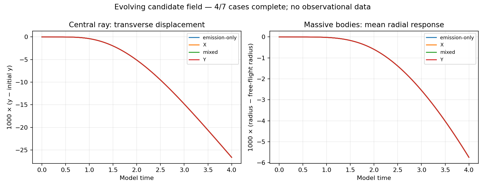

# SE-B evolving bundle checkpoint

4 of seven declared cases have complete archives.

| Case | Central bend (model radians) | Arrival offset (model time) | Area gain | Bundle derivative error | Numerical gates |
|---|---:|---:|---:|---:|---|
| emission-only | -0.011270736 | 0.0107100034 | 1.03328373 | 0.000397 | True |
| X | -0.011272043 | 0.0107104647 | 1.03328549 | 0.000397 | True |
| mixed | -0.0112774617 | 0.0107160817 | 1.03329593 | 0.000397 | True |
| Y | -0.0112771959 | 0.010718004 | 1.03329702 | 0.000397 | True |

The detector is x=1.5; rays launch at x=-1.5 near y=1 with parallel +x
momentum. The detector map includes the evolving background, not a frozen
lens snapshot. Arrival offsets are coordinate times relative to flat flight.
Area gain refers to the parallel-ray transport map, not yet an astronomical
magnification. No galaxy or cluster measurements appear in this chart.

The massive-body chart subtracts free flight from the same initial position
and velocity, derived from the zero-field candidate Hamiltonian. These short
test-body paths are not stable orbits, circular speeds or a rotation curve.

Independent audit: audit_bundles.py reconstructs detector crossings and maps
from every-step traces and background energy from raw endpoint states.
Probe cone extrema are recorded by the runner; the archive does not contain
the full field at every step for independent reconstruction of those extrema.

Comparative emitter effects must wait for matching completed cases. Time,
space and probe-radius comparisons are still required before interpreting
a point-ray result. Positive source enhancement alone is not lens enhancement.
Hamiltonian optics and numerical bundle derivatives are established methods;
the shared response law is a candidate assumption. All twelve goals remain active.
