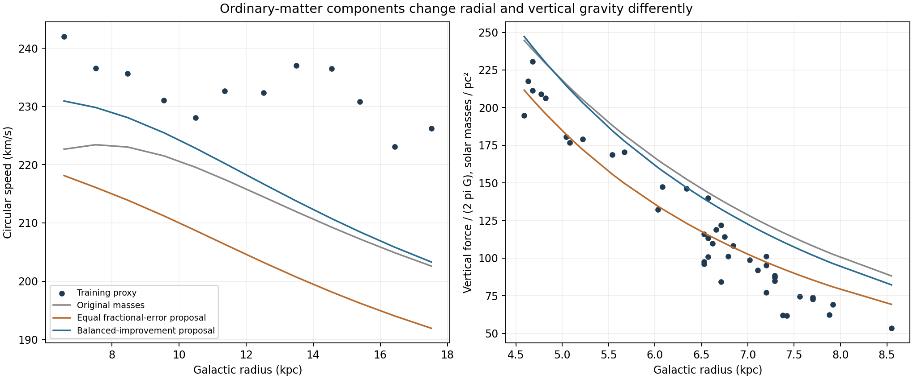

# Ordinary-matter components and the frozen companion response

**Separating the components reveals a direction that improves both comparisons, but it does not establish an allowed mass model or validate the theory.** A balanced local proposal improves rotation RMS by 12.9% and vertical RMS by 12.6% in full nonlinear field calculations. It uses illustrative mass changes at the gas/central-component bounds; independent constraints on those masses are still required.

| Full refined field calculation | Rotation RMS (km/s) | Vertical RMS (surface-equivalent units) |
|---|---:|---:|
| Original components | 18.79 | 33.31 |
| Equal fractional-error proposal | 28.56 | 14.52 |
| Balanced-improvement proposal | 16.36 | 29.11 |

The first proposal reduces a combined error score while worsening rotation. This is why both observables must be reported separately. The second minimizes the larger RMS ratio to the original comparison, using the local response to propose parameters. Both are checked with the full nonlinear field equation. Neither is a global optimum or a mass posterior.

## What changed

The previous global normalization test scaled every ordinary component together. Here three groups vary independently: the thin/thick stellar disks together; the two gas disks together; and the stellar bar plus nuclear components together. Their spatial shapes remain fixed. The central black hole is unchanged.

| Component | First proposal: mass / original mass | Balanced proposal: mass / original mass |
|---|---:|---:|
| Stellar disks | 0.700 | 0.962 |
| Gas disks | 0.700 | 0.700 |
| Central stars (bar + nuclei) | 1.300 | 1.300 |

Every scale was restricted to **0.7–1.3 as an illustrative sensitivity range**. These are not published confidence bounds. The balanced proposal therefore means about 3.8% less stellar-disk mass, 30% less gas, and 30% more central stellar mass. This does not claim that such changes are compatible with photometry, gas surveys, microlensing or other constraints.

The original disk masses in this implementation are approximately 3.699 x 10^10 solar masses in stellar disks and 1.319 x 10^10 in gas. Those are integrated model components, not independent new mass measurements. The bar is based on an analytic representation of a dynamically fitted distribution, as described by [Sormani et al. (2022)](https://arxiv.org/abs/2204.13114). Its normalization must retain that provenance.

A subsequent source check found that [McMillan (2017), section 6.4](https://academic.oup.com/mnras/article/465/1/76/2417479) also explored gas-mass changes of +/-30 percent as a sensitivity test. That provides methodological precedent, not evidence that our combined proposal is allowed. We do not import that study's halo-dependent mass posterior into the fictional model.

## Formulas and what is genuinely new here

**Known Newtonian linearity for ordinary matter:**

`Phi_b = s_star Phi_stellar_disks + s_gas Phi_gas_disks + s_central Phi_central_stars + Phi_BH`.

**Previously archived empirical response inside a known QUMOND-style field structure:**

`Laplacian(Phi_c) = divergence[A (|gradient Phi_b|/a_star)^(p-1) gradient Phi_b]`.

`a_total = -gradient(Phi_b + Phi_c)`.

The field coefficients A, p and a_star are unchanged. The mathematical field structure is known, and identifying it with companions remains hypothetical. This experiment introduces no new photon or capture formula. It changes component mass inputs and recomputes their nonlinear additional field. There is no potential-stretch parameter q in this calculation.

It would be incorrect to rescale each component's companion field separately and add them: the fractional-power response depends on the combined ordinary field. Every plus/minus perturbation and reported candidate therefore receives a complete field solve.

## Measured numerical response

Centered +/-5% mass perturbations estimate local derivatives around the original model. The following are median changes predicted by those derivatives for a +10% mass change, holding the other groups fixed. They are responses of this model, not empirical measurements of mass uncertainty.

| Group increased by 10% | Median rotation change (km/s) | Median vertical-force change (surface-equivalent units) |
|---|---:|---:|
| Stellar disks | 4.98 | 8.15 |
| Gas disks | 0.79 | 2.13 |
| Central stars (bar + nuclei) | 2.26 | 1.13 |

Central stellar mass raises outer rotation with less increase in the tested vertical force than disk mass does. Gas changes affect the vertical comparison relatively strongly. This explains why a shared overall mass multiplier concealed useful freedom. It does not identify which component should actually change.

## Data, approximation and verification

The rotation inputs remain twelve approximate Jeans bins from 542 training Cepheids. The vertical inputs remain 43 previously exposed Bovy-Rix force inferences, with their original potential/selection/frame assumptions. No stellar validation or test outcomes were evaluated. The study is not a replacement for a common-frame, selection-aware stellar-orbit likelihood or the inner-bulge comparison.

The first proposal minimizes equal-observable mean squared fractional residuals in a linearized response, with the illustrative bounds above. The balanced proposal instead minimizes the worse RMS ratio relative to the baseline. These loss choices expose the tradeoff; neither is a full likelihood. A local response is not guaranteed to find the nonlinear best fit, especially at a parameter boundary.

The separately integrated components reproduce the original force to relative error 3.15e-14 on the probe set. Independent analytic disk-mass integrals agree to better than 0.007%. Original refined scores are recovered. For the first proposal, linearized versus full coarse predictions differ by at most 0.437 km/s and 0.374 vertical units. Its coarse/refined differences are 0.0092 km/s and 0.285 units. The balanced proposal is also reported from a full refined solve, rather than from its linear forecast. All stored metric rows and source hashes are checked.

## Implication for the larger objective

The earlier global-mass conflict did not establish that component uncertainty was exhausted. This test supplies a concrete improvement direction without altering the gravity coefficients. The next evidence needed is whether independent ordinary-matter observations allow those changes, and whether a complete orbit/selection analysis retains the improvement. We should not keep widening arbitrary mass bounds until a graph matches.

The residual discrepancies remain substantial, and the analysis does not explain photon-to-companion conversion, event timing, lossless travel, capture or lensing. A stronger case requires those physical links as well as acceptable joint predictions. Total photon supply remains deferred, not passed.

Reproduce with `run.py`, `verify.py`, then `report.py`. Original source files, observations and holdout assignments are unchanged. Raw stellar rows stay in the ignored cache; all diagnostic code, prediction rows and input hashes are versioned.
