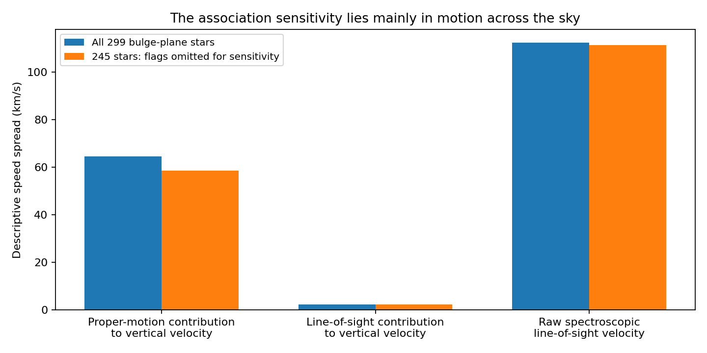

# Which measurements drive the bulge-height sensitivity?

**The position-flag sensitivity is primarily in the proper-motion/distance contribution, not the independently measured APOGEE line-of-sight velocities.** This narrows the observational issue without repairing the associations or establishing a gravitational explanation.

We recomputed velocities for the same 27,884 selected training stars with catalog median distances, separating the spectroscopic line-of-sight contribution from Gaia proper motion times distance. The catalog, prior distance reconstruction and original holdout assignments remain unchanged. In the bulge-plane subset, removing the 54 positional flags as a sensitivity experiment changes the proper-motion contribution's spread from 64.50 to 58.49 km/s. The raw APOGEE line-of-sight spread changes only from 112.27 to 111.22 km/s. These are different directional projections of stellar motions; their absolute spreads must not be equated.

## Decomposition and provenance

Known linear coordinate transformation, not new companion physics:

`v_z = v_z,solar + v_z,line-of-sight + v_z,proper-motion`

In heliocentric Galactic axes, the two terms are `v_los sin(b)` and `4.74047 d mu_b cos(b)` in km/s, with distance in kpc and proper motion in mas/year. Our executed transform also includes the small tilt between the Galactic sky plane and the adopted Galactocentric plane. We evaluate the spectroscopic-only, proper-motion-only, zero-motion and full transforms separately, in the same frame: solar position 8.2 kpc, height 0.0208 kpc, Cartesian velocity [11.1, 248, 7.25] km/s. Their sum agrees to better than 1.2e-13 km/s.

Known variance identity:

`Var(v_z) = Var(v_z,line-of-sight) + Var(v_z,proper-motion) + 2 Cov(the two terms)`

The covariance is retained. Adding spreads or assuming independent physical components would be wrong. These are descriptive spreads of reconstructed velocities, not intrinsic dispersions corrected for all measurement errors or an orbital likelihood.

## Results

Each entry is original sample -> sample with >0.5-arcsec association flags temporarily omitted; all values are km/s. Non-2MASS identifiers, which were not assessed by the epoch screen, remain included and explicitly unassessed.

| Region | Proper-motion vertical spread | Spectroscopic vertical spread | Raw line-of-sight spread |
|---|---:|---:|---:|
| bulge plane | 64.50 -> 58.49 | 2.20 -> 2.35 | 112.27 -> 111.22 |
| bulge offplane | 62.60 -> 62.60 | 9.62 -> 9.62 | 84.22 -> 84.22 |
| disk plane | 20.64 -> 19.36 | 4.00 -> 4.01 | 36.03 -> 35.69 |
| disk offplane | 25.14 -> 25.13 | 16.19 -> 16.19 | 37.25 -> 37.25 |

The median-distance calculation gives total bulge-plane vertical spreads of 64.40 -> 58.35 km/s. The prior approximate posterior-mean calculation gave 64.97 -> 58.83 km/s. Their numerical difference is expected because they use different distance summaries; both show the same sensitivity. The off-plane median-distance spread is 60.93 km/s. This consistency does not validate either distance model.

APOGEE's line-of-sight measurement does not depend on the Gaia proper motion used here. Region membership still depends on the distance model, and the samples were selected using joint survey data. The near-plane sight lines provide very little direct leverage on vertical velocity, which explains why the spectroscopic vertical contribution is small even when the raw line-of-sight spread is large. The raw line-of-sight difference between plane and off-plane populations remains; different viewing directions, positions and stellar populations can produce such a difference without requiring a different gravity law.

## Limited like-for-like check

We also compare flagged and other bulge-plane stars in shared cells of five degrees in longitude, two degrees in absolute latitude and 0.25 dex in metallicity. Each side needs at least three stars. Six cells qualify, containing 23 flagged and 74 other stars. The same cell weights, proportional to the smaller count in each cell, are used for both sides. The pooled within-cell and mixture spreads are in `results.json`.

The effect is not uniform: individual cells include both larger and smaller spreads among flagged stars. One four-star flagged cell has a proper-motion vertical spread of approximately 171 km/s. This limited overlap does not supply a robust population correction, independent significance or evidence that all flagged stars are wrong. No threshold or cell definition was optimized to fit a gravity model.

## Consequence for the next gravitational calculation

We should not tune the deposition geometry to this raw height contrast. The shared-potential fit must account for association uncertainty, distance-input provenance and the observed line-of-sight/proper-motion components together. A line-of-sight-only check can provide a useful control, but cannot by itself recover all three velocity components or the vertical gravitational field near the plane. The requested bulge versus outer-disk inference remains unfinished.

This result addresses reliability of a proposed observable. It supplies no new evidence for the photon-to-companion interaction, persistent spectral redshift, event stretching, lossless transport or gravitational storage. Those remain distinct mechanism requirements, and the total photon-supply budget remains deferred.

## Reproduction and checks

Run `run.py`, `report.py`, then `verify.py`. The inputs are the unchanged matched catalog, prior conditional-distance moments and the training-only association sidecar. Source hashes, per-region moments, the exact variance decomposition and cell-level results are recorded. No validation or test outcomes are opened. The figure uses no error bars because this is a descriptive sensitivity comparison, not a fitted uncertainty model.

- [Association/epoch audit](../stellar-association-window/report.md): exact positional flags and retrieved 2MASS records.
- [Distance-input audit](../stellar-orbit-support/report.md): shared parallax inputs and unresolved associations.
- [Common orbital likelihood contract](../rotating-bar-orbits/likelihood-contract.md): required selection, distance and orbital treatment.
