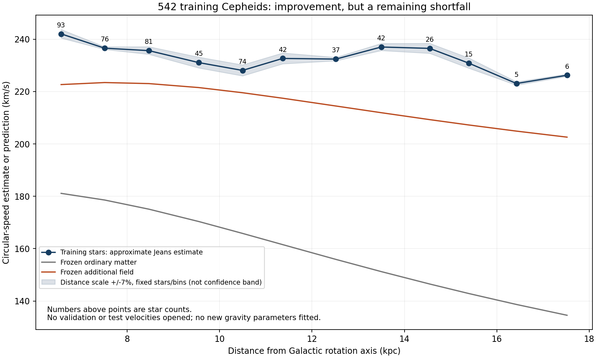

# Individual Cepheids in a shared coordinate frame

**The frozen additional field improves the training comparison, but remains too weak in every radial bin.** Starting from individual measurements does not remove the shortfall found with the published Cepheid curve. This is a conditional training diagnostic, not a validated reconstruction or a fresh holdout result.

| Model | Bin RMS discrepancy (km/s) | Mean predicted minus inferred speed (km/s) |
|---|---:|---:|
| Ordinary matter | 75.24 | -74.15 |
| Frozen additional field | 18.79 | -17.83 |

The comparison averages squared model circular speeds at the actual stellar radii before taking a square root. It uses equal weights across twelve bins; these RMS values are not uncertainty-weighted significances. The last two bins contain only five and six stars.

## Distances and formulas

**Known empirical calibration, not our invention:** Ripepi et al. (2023), Table 3, gives absolute Wesenheit magnitude `M_W = a + b log10(P/day)`. Fundamental-mode coefficients are `(a,b)=(-2.744,-3.391)`; first-overtone coefficients are `(-3.224,-3.588)`. Its All Sky calibration uses Gaia parallax information. It does not require a cosmological redshift-distance relation.

**Known photometric definitions:** `w = G - 1.90(BP-RP)` and `d/kpc = 10^((w-M_W-10)/5)`, using intensity-averaged variable-star photometry. The color combination reduces extinction sensitivity under an adopted extinction law; it cannot guarantee zero dust systematics. The table's ABL scatter is not a magnitude scatter or a fractional-distance uncertainty. Coefficient covariance, metallicity, extinction-law variation and calibration selection are not fully modeled here.

**Known approximate Jeans equation:** `Vc^2 = <vphi^2> - <vR^2> [1 - R/Rd - 2R/Rsigma]`, with fixed `Rd=4 kpc` and `Rsigma=27.3 kpc` for this diagnostic. This assumes steady axisymmetric dynamics and prescribed radial profiles, omits the vertical mixed-moment term, and uses error-corrected second moments. It is not a one-star speed prediction. The additional field is the previously archived QUMOND-style conservative completion of our empirical response, not a derived photon-capture equation.

In plain language, distances convert angular movement into speed. The orbit approximation then estimates how strong gravity would have to be to support a population with those motions. Each step has assumptions; matching the final numbers alone cannot establish photon conversion.

## Selection and reserved data

Protocol commit `f04e0fe` preceded calculation of individual-star distances and velocities. A fixed hash of Gaia ID assigns 60/20/20 percent roles. Among measurement-ready stars with a supported single pulsation mode, there are 1,389 training, 433 validation and 443 test candidates. Only training coordinates and velocities were processed. The spatial and vertical-velocity cuts leave **542 training stars: 348 fundamental and 194 first overtone**.

No numerical selection was adjusted to match the authors' 903-star sample. Multimode objects are deferred, and we do not claim exact replication of their sky exclusions. The selection here uses `6 <= R <= 18 kpc`, absolute azimuth within 30 degrees of the Sun direction, `|z| <= 0.5 kpc`, and `|vz| <= 100 km/s`.

The role assignment is a random-star reserve, not a geographically independent survey. Gaia systematics and the previously exposed published curve remain shared. Validation and test candidate counts are availability counts, not final spatially selected counts. A stronger held-out claim requires a completed distance/selection/orbit method and frozen model choices before inspecting those outcomes.

## Numerical and assumption checks

- The common frame now matches the archived giant code exactly: Astropy `galcen_distance=8.2 kpc`, `z_sun=0.0208 kpc`, solar Cartesian velocity `[11.1,248,7.25] km/s`. Positive reported rotation follows the Galactic disk. After the first training run, we corrected the interpretation of 8.2 from cylindrical radius to three-dimensional distance, a **0.0264 pc** convention difference. This implementation amendment is recorded in the protocol; the original is preserved in Git.
- The exact coordinate transform to Feng's convention changes median individual rotation by 2.119 km/s; to Eilers' convention by -2.117 km/s. These are individual-velocity shifts, not revised published circular-speed curves. Their listed solar radii are interpreted cylindrically in these comparison transforms.
- A first-order error calculation includes proper-motion correlation, radial-velocity error and an independent 7-percent distance-error scenario. It neglects sky-position uncertainty and distance-motion correlations. The error subtraction changes the bin proxy by at most **0.244 km/s**.
- Rescaling all selected distances by 0.93 or 1.07, retaining nominal stars and bin membership, moves the inferred-speed proxy by at most **2.134 km/s**. This is a fixed-membership sensitivity, not a full refit or a confidence interval; model radii and sample membership would also need updating for a complete alternative-distance evaluation.
- Analytic-coordinate fixtures recover positions and velocities to below `1e-9` in their stated units. Monte Carlo propagation for 20 training stars with 4,000 draws each agrees with predicted variances to a median 1.46% and maximum 6.91%. This checks the implementation of the assumed error model, not its physical completeness.
- Refined and coarse field predictions differ by at most 0.0099 km/s. Frozen source/data hashes, training-only identifiers, and bin counts pass verification.

## Actual training comparison

The inferred column is an approximate population estimate from measurements, not a directly measured gravitational acceleration. All speeds are km/s.

| Mean radius (kpc) | Stars | Inferred from motions | Ordinary matter | Added-field total |
|---|---:|---:|---:|---:|
| 6.57 | 93 | 242.02 | 181.12 | 222.67 |
| 7.51 | 76 | 236.56 | 178.57 | 223.44 |
| 8.47 | 81 | 235.63 | 175.08 | 223.04 |
| 9.55 | 45 | 231.06 | 170.36 | 221.52 |
| 10.50 | 74 | 228.07 | 165.82 | 219.55 |
| 11.37 | 42 | 232.65 | 161.54 | 217.45 |
| 12.52 | 37 | 232.40 | 155.90 | 214.48 |
| 13.50 | 42 | 237.01 | 151.24 | 211.92 |
| 14.55 | 26 | 236.49 | 146.50 | 209.28 |
| 15.39 | 15 | 230.85 | 142.87 | 207.24 |
| 16.42 | 5 | 223.08 | 138.68 | 204.89 |
| 17.52 | 6 | 226.22 | 134.56 | 202.59 |

## Implication for the larger theory

This result supports continuing to investigate extra gravitational effects, but it does not specifically support photon-generated companions over other explanations. The current field's radial shortfall and earlier excess pull toward the disk need a common physical response, not independent adjustments for each observable. A fuller treatment of mass-model uncertainty and stellar populations is still needed before attributing all residuals to the field law.

Separately, a viable photon mechanism must produce the observed spectral shifts and event timing, transport companion energy consistently, and explain long-lived storage and lensing. Those unresolved requirements are not addressed by this stellar reduction. The total photon-supply budget remains deferred, not passed.

The next step is to test the distance and population assumptions on the training stars and connect the resulting orbit model to the same three-dimensional field used for bulge/disk comparisons. Do not open the reserved outcomes merely to tune away this discrepancy.

## Reproduce

Run `python -X utf8 run.py`, then `verify.py`, then `report.py` from this directory (or use their repository-relative paths). Raw and derived stellar rows are in the ignored cache; scripts, protocol, summaries and figure are versioned. Run.py only writes training-star velocity products. Reported results are derived from the frozen catalog in the protocol.

Sources: [Ripepi et al. 2023 calibration](https://openaccess.inaf.it/bitstream/20.500.12386/36524/1/aa43990-22-compressed.pdf); [Feng et al. 2026 methodology](https://academic.oup.com/mnras/article/546/2/stag011/8416425); [Eilers et al. coordinate and moment conventions](https://arxiv.org/html/1810.09466v2); [known QUMOND field structure](https://arxiv.org/abs/0911.5464).
