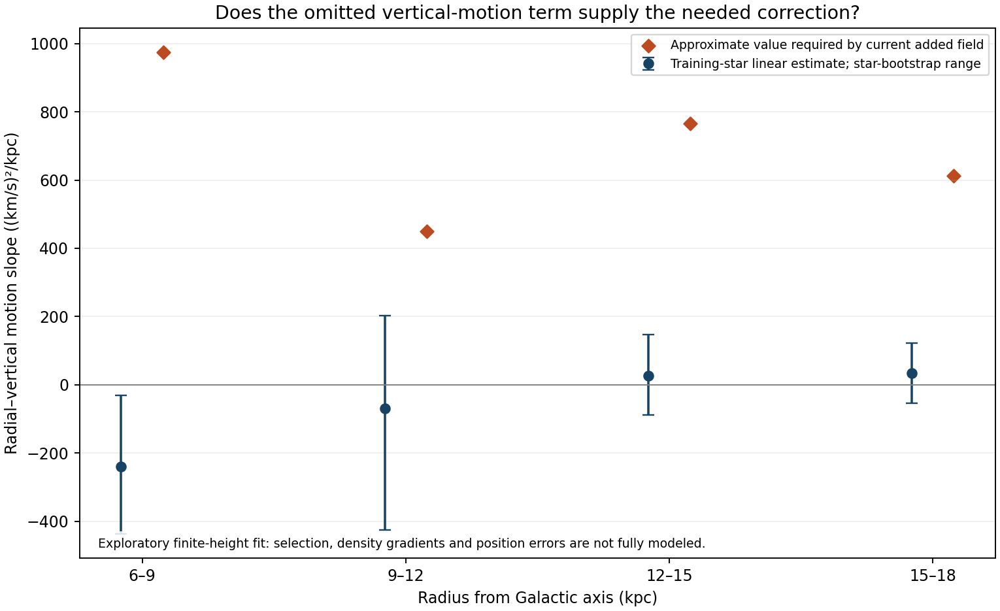

# Can orbital assumptions repair the Cepheid discrepancy?

**A different declining radial profile alone cannot reconcile this frozen field with the training-star moments under steady, axisymmetric, zero-tilt assumptions.** All twelve bins fall below the corresponding minimum circular speed. This eliminates one simple proposed repair within that framework; it does not exclude all companion physics or prove that all the inferred moments are unbiased.

The added-field prediction is below the conditional floor by 5.83–25.87 km/s (bin RMS 16.93 km/s). These are model-to-condition gaps, not statistical significances. Ordinary-matter results are also retained in `requirements.json`.

## What was calculated, and why

**Known physics:** the steady axisymmetric radial Jeans equation relates the potential to the stellar population:

`Vc² = Sphi - SR [1 + d ln(n SR)/d ln R] - T`

`T = (R/n) d(n Q)/dz`, with `SR=<vR²>`, `Sphi=<vphi²>`, and `Q=<vR vz>`.

Here `n` is stellar tracer number density, not ordinary-matter mass density or companion density. The term `T` describes how radial and vertical stellar motions vary together with height. It is not itself vertical gravitational acceleration. These equations are known Jeans mechanics, not formulas unique to our hypothesis. [Primary formulation and moment-error subtraction](https://arxiv.org/html/1810.09466v2).

**Conditional algebra, not a new physical law:** if `T=0` and `n SR` does not increase outward, then `Vc² >= Sphi - SR`. This floor allows any nonincreasing radial-pressure profile, so it does not depend on choosing 4 kpc or 27.3 kpc scale lengths. To reach our lower predicted speed with zero tilt instead requires

`d ln(n SR)/d ln R = (Sphi - Vmodel²)/SR - 1`.

The required slopes are positive in every bin, spanning 4.76–85.37. If the previously assumed declining radial second moment is retained, the implied local stellar-density growth lengths are 0.168–1.750 kpc. A growth length is the distance for a local exponential increase by a factor of e; it is not a measured scale length. No such density profile was fitted or adopted, and raw survey counts cannot determine it without selection corrections.

In plain language: changing how gradually the usual outward-declining stellar population thins out is insufficient. Within this simplified equilibrium picture, making the weaker field work requires reversing that trend, a substantial extra orbital term, or a change in the inferred measurements or gravity.

## Required changes by radius

The last column asks how fast the radial–vertical correlation would have to change with height if the original radial profile is retained. It uses `T_required = Vproxy² - Vmodel²`. Near a reflection-symmetric midplane with `Q=a z`, `T(0)=R a`.

| Radius (kpc) | Conditional floor (km/s) | Added-field speed (km/s) | Required density growth length if zero tilt (kpc) | Required a ((km/s)²/kpc) |
|---|---:|---:|---:|---:|
| 6.57 | 239.2 | 222.7 | 0.532 | 1369 |
| 7.51 | 235.5 | 223.4 | 0.275 | 803 |
| 8.47 | 234.0 | 223.0 | 0.449 | 682 |
| 9.55 | 227.4 | 221.5 | 1.750 | 452 |
| 10.50 | 225.7 | 219.5 | 1.113 | 363 |
| 11.37 | 230.4 | 217.4 | 0.545 | 602 |
| 12.52 | 230.9 | 214.5 | 0.284 | 640 |
| 13.50 | 235.7 | 211.9 | 0.175 | 834 |
| 14.55 | 235.1 | 209.3 | 0.168 | 834 |
| 15.39 | 229.5 | 207.2 | 0.190 | 672 |
| 16.42 | 220.4 | 204.9 | 0.535 | 474 |
| 17.52 | 223.1 | 202.6 | 0.484 | 579 |

These are local bin requirements. They do not construct a global equilibrium distribution or prove that such a distribution is possible.

## Check against above/below-disk training motions

We used only the existing 542 training stars. Measurement covariance is propagated into `vR*vz` under the same proper-motion/RV and independent 7-percent distance-error scenario as the preceding reduction. Within four broad radial regions, a simple odd linear model `Q(z)=a z` is fitted. A second fit allows an intercept. No field parameter is changed.

| Radius (kpc) | Stars above / below | Estimated a | 2.5–97.5% star-bootstrap range | Approximate a required |
|---|---:|---:|---:|---:|
| 6–9 | 146 / 104 | -240 | -437 to -31 | 974 |
| 9–12 | 84 / 77 | -70 | -425 to 203 | 450 |
| 12–15 | 57 / 48 | 27 | -89 to 148 | 766 |
| 15–18 | 13 / 13 | 34 | -55 to 122 | 612 |

All slope columns have units `(km/s)²/kpc`. Required broad-bin values are star-count-weighted summaries of the finer-bin requirements, not an exact forward prediction at each star's height.

The exploratory slopes do not supply the required positive corrections. However, the intervals above resample stars only: they are **not a complete confidence interval for the physical midplane derivative**. The sample is selected, radial variations are pooled, the data extend to finite heights, position errors are ignored in the regression, and vertical density gradients away from the plane matter. The median absolute heights range from about 0.043 to 0.223 kpc, and the outer region has only 26 stars. Allowing an intercept changes the outer slope from about 34 to 9, illustrating model sensitivity. We therefore do not turn this comparison into a sigma-level rejection or apply it as a validated correction to the rotation curve.

## Consequences for the larger task

This result makes the next choice more concrete. We should not spend further effort selecting a different positive exponential scale length to repair this particular field. The remaining plausible work is to quantify distance/selection and non-equilibrium effects, constrain ordinary-matter components, and test a physically specified three-dimensional companion response. Any change to that response must also address the earlier excessive pull toward the disk, rather than independently increase the radial force in each region.

The result does not yet compare stars inside the bulge; these Cepheids span 6–18 kpc. The large red-giant sample remains necessary for the user's bulge-above/below-versus-plane comparison. Photon redshift, event timing, conversion and permanent storage remain separate unsolved requirements. The total energy-supply budget is still deferred.

## Verification and provenance

This analysis uses previously exposed training results and introduces no fresh holdout claim. Validation/test outcomes remain unopened. The regression archive includes every leave-one-star-out slope range and maximum individual leverage; these are influence diagnostics, not exclusions of stars.

`run.py` records source hashes and checks training-only identifiers. `verify.py` tests the Jeans signs with nine analytic density/velocity fields using independent finite differences (maximum error 0.000952 (km/s)²), verifies the inverse requirements, and checks the pressure floor across 4824 slope cases. Cross-covariance diagonals reproduce the previous error propagation, and all regional star counts match. These checks validate the calculation under its assumptions, not those assumptions themselves.

Run `run.py`, `verify.py`, then `report.py` using Python. Stellar rows remain in the ignored cache; the code, input hashes, per-bin requirements and exploratory regression summaries are versioned. No earlier model score, calibration or holdout assignment was changed.
