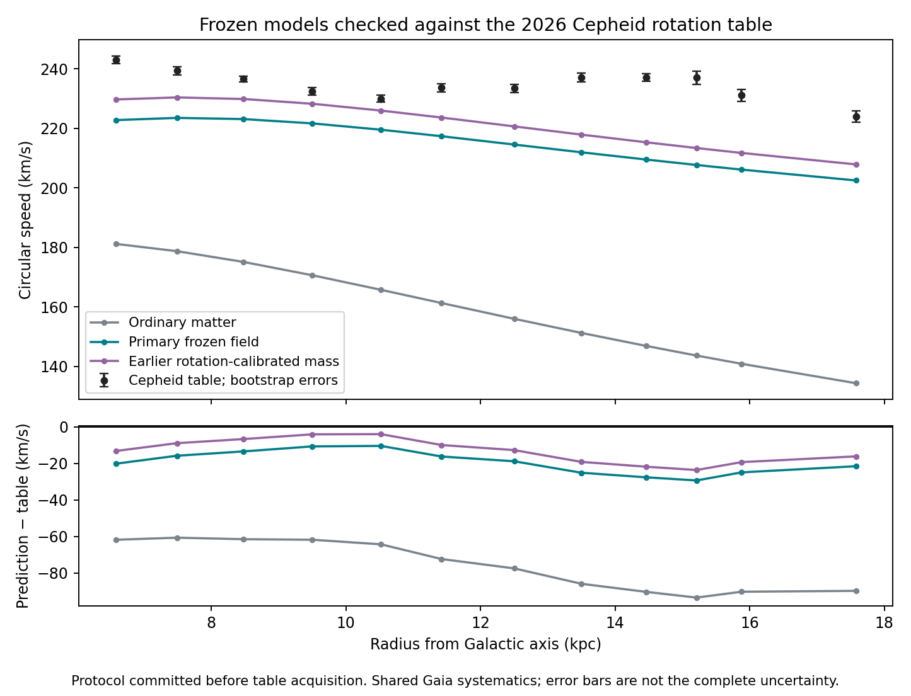

# Frozen predictions tested against a new Cepheid rotation catalog

**The new-catalog check gives improved but still inadequate agreement.** The primary frozen extra-gravity model underpredicts all twelve Cepheid rotation bins, with RMS error 20.46 km/s. Its mass normalization previously fitted to the older red-giant rotation data reduces RMS to 14.82 km/s, but still underpredicts every bin. No parameter was fitted to the Cepheid table.

| Predeclared model | RMS error (km/s) | Mean prediction minus table (km/s) | Median predicted / table |
|---|---:|---:|---:|
| Fixed ordinary matter | 76.84 | -75.75 | 0.6794 |
| Primary conservative completion | 20.46 | -19.53 | 0.9180 |
| Previously rotation-calibrated mass | 14.82 | -13.33 | 0.9454 |

This result supports an improvement over this fixed ordinary-matter baseline, but it does not establish that the selected extra field reproduces the new curve. The older red-giant comparison's smaller residuals cannot be generalized to every stellar population.



## What was frozen, and when

The protocol was committed and pushed as [f7b2980](https://github.com/lrspeiser/photon-graviton/blob/f7b2980/research_work/results/cepheid-rotation-check/protocol.json) **before this task opened the article or downloaded its numerical table**. At freezing, the search result had exposed the title, population count, stated radial range and table availability, not the table values.

The protocol fixed the target table, eligibility, primary and secondary models, coefficients, mass settings, numerical resolution and reported metrics. It hashed the existing field solver, calibration results and cached bar/nuclear inputs. All hashes remain unchanged. The acquisition/evaluation wrappers were written after downloading the table; they call that frozen solver and implement the predeclared comparisons. This is not a claim that every wrapper line was committed before data access.

All twelve eligible published rows are retained for all three models. None is removed for a large residual, location within the curve, or disagreement with a smooth profile. The original model has lambda_mass=1. The sole secondary setting, lambda_mass=1.0777525635344904, was already fitted to the older Eilers rotation rows and declared before the Cepheid values were read. It is not promoted over the primary model after observing the result.

## Observational source and assumptions

[Feng et al. (2026), Table 1](https://doi.org/10.1093/mnras/stag011) supplies twelve drift-corrected rotation bins from 903 Gaia DR3 classical Cepheids, using Period–Wesenheit distances. We use the Cepheid-only table, not the paper's combined-tracer curve or halo fit. Its quoted errors come from 100 bootstrap resamples.

The publication adopts R_sun=8.275 kpc and solar azimuthal velocity 250.2 km/s. Its stellar-frame conventions differ from earlier reductions. We retain its published radii and speeds without an improvised correction. A rigorous common-frame comparison requires reconstructing the stellar observables; no fitted zero-point shift is introduced here.

The sample has shared Gaia astrometry and the same Galaxy as the earlier work. Individual-star overlap is not established. Circular speeds also require population, selection and dynamical assumptions. This is therefore a **first frozen-model check on this catalog**, not a completely independent raw-observation experiment. The bootstrap errors do not include every systematic or bin covariance.

## Equations and provenance

**Known field-equation construction applied to the archived empirical fit, not a new photon-derived law:**

```
laplacian Phi_b = 4 pi G rho_b
nu(y) = 1 + A y^(p-1)
laplacian Phi = divergence[nu(|gradient Phi_b|/a_star) gradient Phi_b].
```

The [previous implementation report](../conservative-field-completion/report.md) identifies the established QUMOND-style structure, the fixed ordinary-matter components, limitations and checks. The empirical constants remain A=0.2422960665538504, p=0.4624587420104399 and a_star=7.249608968708169e-10 m/s². The axisymmetrized bar, disks, gas, nuclei and central mass are unchanged; no dark halo is inserted.

**Known circular-orbit identity and conditional mass homogeneity:**

```
v_c(R) = sqrt[-R a_R(R,0)]
a_R(lambda) = lambda a_R,b + lambda^p a_R,extra.
```

The second equation follows from scaling all ordinary source masses together while keeping their shapes and response parameters fixed. It is not a new physical cause or a fit to these Cepheids. It was independently checked against a rescaled Poisson solve in the [mass-response audit](../milky-way-mass-response/report.md).

## Numerical and data checks

The downloaded official HTML is retained in the ignored data cache with its SHA-256 recorded. Its four rendered copies of Table 1 contain identical values; the parser retains one twelve-row table. It does not count those copies as separate observations. `observations.json` preserves all values, errors, exclusions (none) and source metadata.

All 36 model/row predictions are retained, and their scores are independently recomputed. The maximum coarse-to-refined change is below 0.00984 km/s, much smaller than the observed residuals. Parent model hashes and calibration files remain unchanged.

No model prediction lies within one quoted bootstrap error of its table value. Error-standardized residuals are saved for audit, but they are **not a formal significance or rejection probability**: there is no complete observational/model covariance in this calculation. The graph shows the published bootstrap errors with that limited interpretation.

## What follows for the goal

The result is a useful test of transfer beyond the earlier red-giant calibration. It fails the stronger requirement of close agreement with the new table under the fixed assumptions, even though both extra-gravity variants improve substantially over the chosen ordinary baseline.

The twelve rows are now exposed. If model shape, mass components, frame parameters or the response law are changed using this result, a future check must use a genuinely reserved evaluation; these same rows cannot be relabeled as fresh holdouts. A model that matches rotation also still needs the off-plane, lensing, photon-spectrum, event-timing and production/storage connections. This new comparison does not resolve those remaining requirements.

Reproduce with `prepare.py`, `evaluate.py`, `verify.py` and `plot.py` in this directory, run with Python from the repository root using their repository-relative paths. `freeze.py` intentionally refuses to overwrite an existing protocol.
