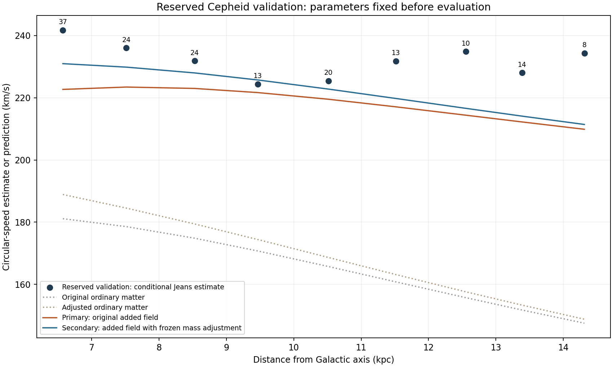

# Frozen Cepheid validation results

**The reserved-star test is complete for the declared approximate pipeline.** From 433 measurement/mode candidates, the fixed spatial and velocity cuts retain **167 validation stars**, with **9 scored radial bins**. No parameter was fitted to these outcomes. The final test role remains untouched.

| Frozen model | Validation bin RMS (km/s) | Mean predicted minus inferred speed (km/s) | Bins underpredicted |
|---|---:|---:|---:|
| Original ordinary matter | 67.74 | -66.83 | 9 / 9 |
| Primary: original added field | 15.36 | -13.83 | 9 / 9 |
| Adjusted ordinary matter | 64.52 | -63.28 | 9 / 9 |
| Secondary: added field with frozen mass adjustment | 12.36 | -9.91 | 8 / 9 |

The secondary mass choice changes RMS relative to the primary by a 19.6% reduction (negative would mean worsening). This quantifies transfer to held-out stars under the same assumptions, not physical validation of the mass choices or photon origin. The primary predicts lower speeds in 9 of 9 scored bins; residual disagreement remains.

## What was frozen before opening outcomes

Commit **e5cf484** contains the protocol, complete evaluation program and component adapter before the first validation-star distance/velocity calculation. Hashes cover those programs, the calibration and frame, field coefficients, bar/nuclear caches, original catalog, role assignments, and the previously fitted component scales. The adapter's component class definitions were checked to match the prior calculation exactly.

The primary is the original conservative additional field. The secondary retains the previously fitted component multipliers: stellar disks **0.961997**, gas disks **0.700000**, central stars **1.300000**. The black hole and spatial component profiles remain fixed. No potential-stretch parameter is used. Both ordinary-matter-only counterparts are included as controls.

Distances use the same published period–Wesenheit calibration and the same solar frame as training. The same moment-error scenario includes an independent 7-percent distance uncertainty. Selection remains `6 <= R <= 18 kpc`, `|phi| <= 30 degrees`, `|z| <= 0.5 kpc`, and `|vz| <= 100 km/s`. Each one-kpc bin needs at least five stars and physically valid error-corrected moments. Every bin is listed below; there is no residual-based exclusion or merging.

## Per-bin outcome

All numerical speed columns are km/s. The inferred speed is a conditional population Jeans estimate, not a directly observed acceleration.

| Radius interval (kpc) | Validation stars | Inferred from motions | Primary prediction | Secondary prediction |
|---|---:|---:|---:|---:|
| 6–7 | 37 | 241.70 | 222.67 | 230.95 |
| 7–8 | 24 | 236.02 | 223.43 | 229.83 |
| 8–9 | 24 | 231.81 | 222.98 | 227.97 |
| 9–10 | 13 | 224.36 | 221.65 | 225.71 |
| 10–11 | 20 | 225.41 | 219.51 | 222.78 |
| 11–12 | 13 | 231.79 | 217.07 | 219.75 |
| 12–13 | 10 | 234.85 | 214.39 | 216.59 |
| 13–14 | 14 | 228.00 | 212.21 | 214.08 |
| 14–15 | 8 | 234.32 | 209.85 | 211.40 |
| 15–16 | 3 | Not scored | — | — |
| 16–17 | 0 | Not scored | — | — |
| 17–18 | 1 | Not scored | — | — |

For context, the following uses training metrics restricted to the same bin indices. The stars and exact radii still differ, so these are descriptive comparisons rather than a paired measurement test.

| Model | Training RMS on matched bins (km/s) | Validation RMS (km/s) |
|---|---:|---:|
| Original ordinary matter | 70.44 | 67.74 |
| Primary: original added field | 17.61 | 15.36 |
| Secondary: added field with frozen mass adjustment | 14.48 | 12.36 |

## Formula status and interpretation

The period–Wesenheit calibration, coordinate transforms, moment-error propagation, and simplified Jeans equation are **known methods**, not unique formulas of this project. The gravitational calculation uses the **previously archived empirical response in a known conservative field structure**. Its identification with photon-generated companions remains a hypothesis. The secondary ordinary-matter normalizations were fitted on training/exposed data and have not been established by independent mass constraints.

This opening is narrower than full theory validation: the larger stellar likelihood is unfinished, but the frozen pipeline can still be tested honestly on reserved stars. The test answers whether its fixed conditional predictions carry over, without claiming that shared calibration, equilibrium, radial-profile, selection or mass assumptions are correct. No acceptable-fit threshold based on complete observational uncertainty was available, so these RMS values are not turned into sigma-level acceptance or rejection.

The reserved stars share Gaia calibration and the same Galactic population with training. Published aggregate Cepheid curves had already been examined. Consequently this is **a held-out star subset, not a new independent catalog or a test of all systematic errors**. It says nothing new about photon production, supernova event timing, lossless transport, capture, long-lived storage, lensing, or total energy supply. Those remain separate requirements; the total photon-supply budget remains deferred.

## Verification and exposure record

All frozen hashes remain unchanged. Selected identifiers are unique, belong to validation, and are disjoint from both training and final test. Spatial cuts, bin counts, minimum-count rules and stored metrics are verified. Coarse/refined prediction differences are at most **0.0099 km/s**, below the declared 0.1 km/s numerical tolerance. Original empirical parameters and the final test assignment are unchanged.

**These validation outcomes are now exposed.** They must not be described as fresh validation after any future tuning. The final test should only be opened after the remaining method and model decisions are fixed; this result does not authorize repeated tuning against that sample.

Reproduce with `evaluate.py`, `verify.py`, then `report.py`, using the recorded local inputs. `freeze.py` refuses to overwrite an existing protocol. Raw and derived validation-star rows remain in the ignored data cache. The tracked files retain summaries, code, per-bin predictions and provenance.
