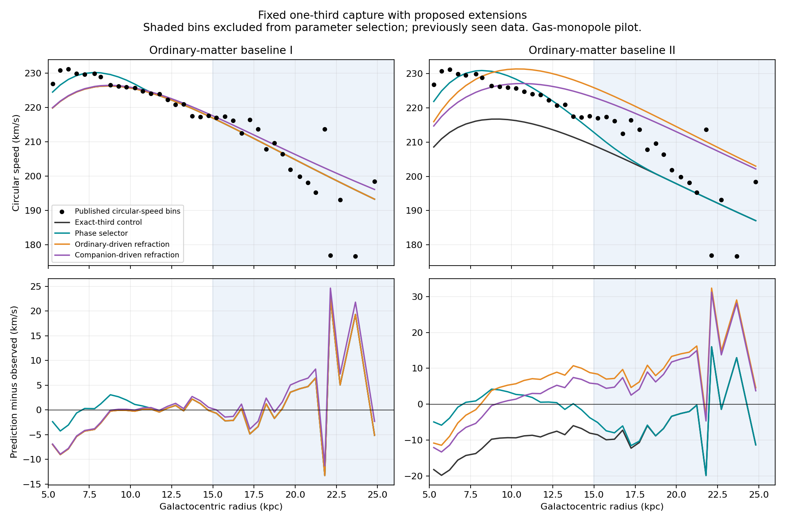

# Companion extensions: refraction, phase selection and photon interactions

13 September 2026. Executed bounded analysis, with the original exact-one-third capture parameters retained. This is a hypothetical nonexpanding-universe research model, not established new physics.

## What we learned

**Phase-dependent settling is the most useful new candidate in these tests. Refraction did not improve prediction in the outer Milky Way. Quantum-field interactions offer a language for constructing a mechanism, but ordinary mixing does not produce the redshift we need. String theory does not yet supply an additional calculable prediction.** None of these results solves lensing, the absolute energy supply, or supernova duration stretching.

We completed 60 refraction configurations and 2,706 phase-selector configurations using 38 archived Milky Way circular-speed measurements and two ordinary-matter baselines. Parameters were chosen with the first 20 radial bins; the outer 18 were excluded from selection. These measurements have been examined previously, so this is a spatial transfer diagnostic, not a blind validation or a new-galaxy test. All configurations, including failures, are in the machine-readable results.

## Foundation retained

The unchanged empirical retention law is

\[
X=\frac{L_{3.6}/(10^9L_\odot)}{(R_d/\mathrm{kpc})^2},\qquad
\eta(X)=\frac{X^{1/3}}{1+X^{1/3}}.
\]

**Provenance:** the Hill-function shape is known mathematics. Our radiation/capture interpretation and calibrated use of the one-third exponent are proposed; the exponent is not derived from quantum theory. The archived capture routine and constants generate the same deposited mass inventory before any extension. Disk scale remains 2.6 kpc and luminosity remains the existing stellar-mass-to-light proxy. Neither is newly measured here.

Photons supply traveling companions, traveling companions retain their energy until capture, and captured energy contributes to the well. A minimal transport ledger is

\[
\partial_tu_\gamma+\nabla\!\cdot\mathbf F_\gamma=j_\star-Q,
\quad\partial_tu_c+\nabla\!\cdot\mathbf F_c=Q-C,
\quad\partial_tu_d+\nabla\!\cdot\mathbf F_d=C.
\]

**Provenance:** standard continuity-equation structure; our assignments of conversion Q and capture C are hypotheses. These equations conserve the listed energy only when omitted work, heating, release and mediator exchanges vanish. A settling model must add those exchanges with balancing terms. Conserving deposited mass in a profile calculation is not a proof of full energy conservation. No universe age, outer source horizon or new supply normalization was imposed in this study.

## Refraction: change how the same deposit produces a force

We tested

\[
\nabla\cdot[\epsilon(\rho_{\rm driver})\nabla\Phi]
=4\pi G(\rho_b+\rho_d),\qquad
\epsilon=\epsilon_\infty+(1-\epsilon_\infty)
\frac{\rho_{\rm driver}}{\rho_{\rm driver}+\rho_c}.
\]

**Provenance:** density-dependent gravitational permittivity and this modified-Poisson structure exist in refracted-gravity literature. Our addition of the fixed companion source, choice of ordinary or companion density as driver, and parameter grid are proposed adaptations. Values above one were explicitly included to allow weakening; this extends the usual low-density enhancement interpretation. We do not adopt the expanding cosmological solutions in the [covariant refracted-gravity paper](https://arxiv.org/abs/2109.11217).

In ordinary language, the deposit stays where it was, but its surroundings change how the gravitational pull spreads. This affects radial and vertical pull together; it cannot arbitrarily fix one without consequences for the other.

The axisymmetric finite-volume calculation retains flattened stellar components but replaces thin-disk gas with its spherical monopole. Every extension is compared with an identical gas-monopole control. This explains why the control values differ slightly from the earlier full-gas-disk frozen transfer (6.76/10.41 km/s). A change of baseline is not counted as an improvement.

Errors below are unweighted RMS in km/s, not reduced chi-square or observational uncertainty.

| Ordinary-matter baseline | Model selected on inner bins | Inner error | Outer error |
|---|---|---:|---:|
| I | Unmodified exact-third control | 3.68 | 8.36 |
| I | Ordinary-density refraction: selects no change | 3.68 | 8.36 |
| I | Companion-density refraction | 3.66 | 9.05 |
| II | Unmodified exact-third control | 11.83 | 9.78 |
| II | Ordinary-density refraction | 7.45 | 14.15 |
| II | Companion-density refraction | 6.48 | 12.97 |

The nontrivial selected cases all have epsilon-infinity 0.85; critical densities are 10^5 for baseline I/companion and 10^7 solar masses/kpc cubed for both baseline II cases. Some selections reach a density-grid edge. No selected extension improves outer prediction. This rejects a benefit for this tested family and grid, not every possible refracted theory.

We also calculated the force toward the Galactic plane at height 1.1 kpc. The 43 archived comparison summaries involve dynamical modeling and are not independent raw measurements; they are stored as provisional diagnostics and were not used to pick parameters. Their apparent agreement cannot validate this extension. A three-dimensional bar/bulge inference still requires stellar populations, orbital modeling and survey selection.

## Phase selection: let local conditions choose which deposits settle

Instead of choosing a compact fraction separately for each galaxy, we tried a known ideal-boson condensation criterion:

\[
T=\frac{m\sigma^2}{k_B},\quad
T_c=\frac{2\pi\hbar^2}{m k_B}\left[\frac{\rho_d/m}{\zeta(3/2)}\right]^{2/3},
\quad f=\max\{0,1-(T/T_c)^{3/2}\}.
\]

**Provenance:** critical temperature and ideal homogeneous-gas condensate fraction are known statistical physics. Applying them to companions, choosing sigma-squared = G M_total,monopole(<r)/(3r), and interpreting f as the fraction allowed to contract are our proposed closures. This is not the published superfluid-dark-matter model, an equilibrium solution, or a derivation of the companion temperature. [Superfluid models](https://arxiv.org/abs/1711.05748) motivate examining phases; their cosmological origin and particular force law are not adopted.

For a source shell dM at r, fraction f moves to sr and fraction 1-f remains. Thus

\[
M_{\rm new}(<R)=\int [(1-f(r))\Theta(R-r)+f(r)\Theta(R-sr)]\,dM(r).
\]

**Provenance:** ordinary mass-conserving transport identity, with our proposed temperature-dependent fraction and contraction s. The circular-speed calculation uses the known Newtonian relation v_c^2=R partial_R Phi. These tests therefore concern the spatial distribution of effective deposited mass, not a measured boson mass or a demonstrated energy exchange rate.

| Baseline | Control inner/outer error | Phase inner/outer error | Selected mass | Contraction s | Compact inventory |
|---|---:|---:|---:|---:|---:|
| I | 3.68 / 8.36 | **1.81 / 8.36** | 17.78 eV/c² | 0.896 | 13.9% |
| II | 11.83 / 9.78 | **2.85 / 9.29** | 13.34 eV/c² | 0.803 | 32.3% |

This provides a concrete way to improve central placement without moving the whole halo. In baseline I the rearranged material remains inside the outer comparison radii, so the outer force is unchanged by the spherical shell theorem. Baseline II gains only about 0.48 km/s in outer RMS. The large inner improvements are fitted improvements, not independent predictions.

Freezing baseline-I parameters and applying them to baseline II gives inner/outer errors 8.94/9.78. Reversing the transfer gives 9.01/8.33 for baseline I, making its inner fit worse. These are two representations of the same galaxy, not two observed galaxies. They expose sensitivity to ordinary-matter assumptions and do not establish universal constants.

At an illustrative ultralight mass of 10^-22 eV/c² the ideal criterion puts essentially all the inventory into the condensed phase. With the selected contraction factors held fixed, outer errors are 10.41/9.01. This limit loses the selective compact fraction; it is not a full fuzzy-dark-matter calculation or an exclusion of ultralight fields.

Four physical requirements remain:

1. Traveling companions at exactly c cannot be the same freely moving massive particles used in this nonrelativistic phase calculation. Capture must create a distinct massive bound state or collective excitation, with an explicit energy and momentum balance.
2. A single photon below the fitted 13–18 eV rest-energy scale cannot create that massive particle on its own. Energy pooling, an existing reservoir or a different interpretation of effective mass would be needed. We have not calculated such a process.
3. A thermal condensate needs relaxation and suitable particle-number behavior; neither follows from the original lossless-wave hypothesis. The local ideal-gas formula may be inappropriate for a gravitating, interacting, inhomogeneous field.
4. The calculation determines f from the initial profile and then moves mass. It must eventually be coupled to the updated potential, density, heat release and support. The current pilot does not establish stability or a formation time.

The lesson is that **a state-dependent settling rule is worth retaining as a candidate**, while the fitted particle masses should not be promoted to properties of a discovered substance.

## QED-like interactions: conversion must change surviving photon energy

There is a real precedent for photon–graviton mixing in an external magnetic field: the [Gertsenshtein effect](https://arxiv.org/abs/2301.02072). Its ordinary coupling is extremely weak. This makes field mixing a legitimate analogy, not evidence that it explains our fitted redshift or supplies galactic deposits.

The distinction is decisive. Converting some whole photons into another field reduces brightness. In a stationary mixing environment, the remaining photons do not automatically acquire lower frequencies. Our required process must leave an outgoing photon with reduced energy, or exchange energy with a time-dependent background. A schematic inelastic channel would be gamma + environment -> gamma-prime + companion + environment-prime. That channel is a proposed requirement, not a supplied interaction theory; recoil and momentum must be included.

We quantified one possible price of discrete inelastic conversion. Suppose each event removes fraction delta and event counts are Poisson-distributed with mean Lambda. Then

\[
E_N=E_0(1-\delta)^N,\quad
\langle E\rangle/E_0=e^{-\Lambda\delta},\quad
\frac{\mathrm{Var}(E)}{\langle E\rangle^2}=e^{\Lambda\delta^2}-1.
\]

**Provenance:** exact standard Poisson statistics applied to our illustrative loss mechanism. Setting Lambda delta = alpha D recovers the mean-energy version of the existing exponential loss law. It does not prove a microscopic interaction or make the mean individual redshift equal to the redshift of the mean energy.

Using the archived alpha = 0.0002488993/Mpc, a 100-million-light-year path gives mean energy loss 0.7602% and mean-energy redshift 0.0076605. To keep added relative line width below an illustrative 10^-5, each event must remove at most 1.31×10^-8 of the energy, requiring at least about 582,000 events on that path. At a 10^-6 width allowance, the limits become 1.31×10^-10 and 58.2 million events. These allowances are examples, **not measured spectral limits**.

This explains why rare, large losses are troublesome: nominally identical photons acquire different shifts, broadening a line instead of simply moving it. Frequent tiny losses or a coherent frequency-changing process avoid that particular stochastic problem more readily, but require a calculated broadband coupling and tests of angular scattering, polarization, brightness and environment dependence. Neither ordinary QED nor the calculations here derives an achromatic alpha.

## Time, lensing and string-inspired fields

Energy loss still does not determine the separation of arriving events. A complete propagation rule needs an arrival map t_observed=F(t_emitted,path); its local derivative determines duration stretching. **This is a general timing identity, not our new time law.** Matching spectral redshift alone does not fix that derivative. A static additional delay shared by both ends of a supernova light curve does not stretch the curve. A viable time-dependent interaction must calculate both frequency and envelope behavior and confront electromagnetic/gravitational-wave timing.

Likewise, the nonrelativistic force potential alone does not fix light bending. In a conventional weak-field metric convention, slow motions probe Phi while lensing probes Phi+Psi. **This is a known relativistic distinction.** Our epsilon equation has not specified Psi. Arbitrarily increasing lensing after fitting rotation would add an independent fitting rule, not solve the problem.

String constructions can motivate axion-like and scalar fields; see the [type-IIB axiverse analysis](https://arxiv.org/abs/1206.0819). They do not uniquely predict the masses, couplings, capture law or one-third exponent used here. Their practical contribution would be a particular low-energy interaction to calculate. We therefore did not invent a numerical string-theory fit without such inputs.

A possible organizing framework is a local effective action, schematically in natural units,

\[
S=\int d^4x\sqrt{-g}\left[\frac{A(\chi)R}{16\pi G}
-\frac12(\nabla\chi)^2-V(\chi)-\frac{Z(\chi)}4F_{\mu\nu}F^{\mu\nu}
 +\mathcal L_c+\mathcal L_{\rm int}+\mathcal L_b\right].
\]

**Provenance:** known scalar–tensor/effective-field-theory building blocks; this schematic combination is a proposed organizational option, not a novel derived theory. Choosing A, Z, V and the interaction is substantive missing physics. Varying a specified action would connect force, field energy and propagation instead of assigning them separately. It would still need to reproduce capture and retention, and would not automatically produce exponential redshift. A static Z alone is not a general redshift solution.

This is the useful role for QED-like or string-inspired thinking: make the exchange explicit enough that its side effects can be calculated. Naming a framework cannot replace the exchange law.

## Verification and limits

The [protocol](protocol.md) was written before the new sweeps. [Refraction code](refraction.py) checks its constant-epsilon solution against Phi=Phi_N/epsilon, the epsilon=1 control, and sparse residuals. Selected grid/domain changes alter speeds by at most 0.031 km/s. This pilot discretizes a correction about the analytic Newtonian potential; the gas-monopole and boundary approximations are deliberate limitations.

[Phase code](phase.py) checks fraction bounds and mass conservation to 10^-12 relative tolerance. Doubling radial resolution and increasing angular quadrature changes selected speeds by under 0.0019 km/s. A numerically irrelevant gas tail below 10^-100 solar masses is zeroed to prevent interpolation reciprocal overflow. The numerical sweeps pass with Python warnings treated as errors. [Conversion code](conversion.py) verifies its exact linewidth identity. Machine-readable results preserve every predicted speed and every grid case.

The circular-speed inputs are from the archived [Eilers et al. analysis](https://arxiv.org/abs/1810.09466), not direct orbital speeds for individual bulge stars. No new raw astrometry, lensing data or measured spectral-line-width likelihood was fitted. No new comparison against MOND/NFW was run; earlier comparisons remain in force. Parameter counts, astrophysical systematics and previously seen data prevent treating these RMS reductions as model selection evidence.

## Recommended branch and concrete next outcomes

Earlier [wave/particle support tests](../isotropic-galaxy-transfer/wave-particle-report.md) did not beat partial migration on the six normalized halo-profile targets. Earlier [coupled exchange tests](../isotropic-galaxy-transfer/feedback-report.md) reached roughly the same omitted-target error as that migration benchmark after refitting. The new phase pilot addresses the choice of mobile fraction but does not inherit support or stability from those different models. We have not combined all extensions into a many-parameter joint fit, which would not by itself identify which mechanism explains an improvement.

Keep exact-third capture and the earlier frozen model as the reference. Retain phase-dependent settling as an experimental branch; do not replace the reference or add refraction to it based on this sweep.

1. **Derive a conservative bound-state exchange rule.** Specify what changes at capture, the outgoing/released energy, and how the settled state supports itself. Outcome: a calculable version of the phase candidate that preserves the light-speed traveling channel. Without it, the improved profile is only a placement recipe.
2. **Freeze a shared settling rule and transfer it across galaxies.** Include ordinary-matter uncertainty and compare with the same unmodified controls. Outcome: learn whether the inner-Milky-Way gain survives elsewhere rather than selecting parameters for each object.
3. **Write one explicit inelastic photon interaction.** Derive its frequency shift, noise, deflection and timing from the same coupling. Outcome: decide whether conversion can actually replace the observed redshift mechanism without broadening or blurring the signal excessively.
4. **Supply a relativistic force/propagation completion before claiming a lensing fix.** Outcome: predict stellar motions and bending together, with mediator stress and the energy ledger included.

No established joint solution has emerged. The useful advance is narrower and concrete: selective settling can improve the inner profile without automatically inflating the outer force, whereas the tested refraction changes generally do inflate it. The conversion analysis also identifies a quantitative design requirement for any discrete photon-loss mechanism.

## Reproduction

From the repository root with NumPy, SciPy and Matplotlib installed, run `python research_work/results/companion-extensions/refraction.py`, then `phase.py`, `conversion.py` and `plot.py` at that same directory path. The scripts read archived local inputs and write their adjacent JSON/PNG outputs; no new download is required. `manifest.json` records the input, source and output SHA-256 hashes for this execution. The two-baseline transfer in `phase.py` is a post-sweep robustness diagnostic, not part of the initial parameter-selection protocol.
