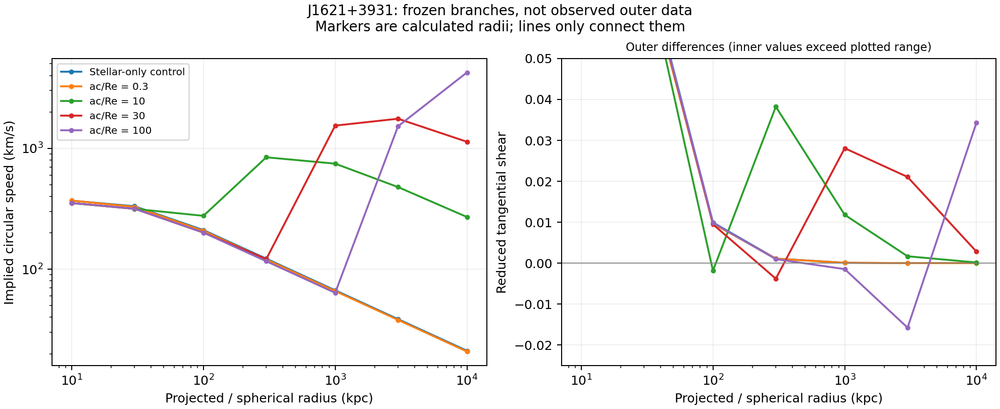

# Outer measurements can distinguish almost identical inner fits

13 September 2026. Frozen J1621+3931 fixed-scale branches. No refitting or new observed outer data.

## Main finding

Reducing the reservoir inventory does not simply reduce its observable gravity everywhere. It moves the strong gravitational effect inward. The ac/Re=10 branch stores about 486 times less mass than the ac/Re=100 branch and has nearly identical inner chi-squared, but predicts about 843 rather than 116 km/s for a hypothetical circular orbit at 300 kpc. Their reduced tangential shears there are approximately 0.03823 and 0.000984.

At the recorded distance, 300 kpc corresponds to 1.37 arcmin. This supplies a nearer potential discriminator than the original extreme branch's several-megaparsec signature. It is a conditional prediction, not a detection or a demonstrated observing capability for this particular field.

## Frozen comparison

All seven previously fitted scale choices were projected. The three zero-density solutions at ac/Re=0.1, 1 and 3 reproduce the stellar-only control and are represented once below. Re denotes the observed projected half-light scale used in the fit. Circular speed is the spherical circular-orbit diagnostic, not an observed dispersion or a speed prediction for every individual tracer.

| Branch ac/Re | Inner-data total chi-squared | Circular speed at 300 kpc (km/s) | Reduced shear at 300 kpc | Circular speed at 1 Mpc (km/s) | Reduced shear at 1 Mpc |
|---|---:|---:|---:|---:|---:|
| Stellar-only | 3.093851 | 122.18 | 0.001120 | 66.93 | 0.000101 |
| 0.3 | 2.948645 | 120.37 | 0.001087 | 65.95 | 0.000098 |
| 10 | 2.762839 | 842.67 | 0.038231 | 746.50 | 0.011810 |
| 30 | 2.761992 | 121.36 | -0.003795 | 1540.29 | 0.028088 |
| 100 | 2.761989 | 116.39 | 0.000984 | 63.76 | -0.001454 |

Here "inner-data total" includes all forty-bin-dataset measurements belonging to this galaxy, including its former outer motion bin; it is not a new withheld score. Lens calibration is consumed. The compact 0.3 branch and stellar-only branch remain very similar at these outer radii, so a null outer excess would not by itself distinguish those two or prove companions absent. Their stellar normalizations differ as a result of the lens calibration.

The intermediate ac/Re=30 solution instead gives about 1540 km/s at 1 Mpc and reduced shear 0.02809. At 300 kpc it has negative reduced tangential shear (-0.003795), while the ac/Re=10 branch is strongly positive. Negative shear means radial image stretching, not negative mass. The peak circular speeds for ac/Re=10, 30 and 100 are approximately 885, 1874 and 4246 km/s at 424, 1841 and 9173 kpc, respectively, on the inherited finite scan. These peak radii are sampled estimates, not precise observed boundaries.

## Equations and provenance

Each fixed branch retains rho_d=D J(r;ac,k0)/[1+(r/ac)^2]^2, its fitted stellar gradient and its lens-calibrated stellar mass. Attenuation and integration are known mathematics; the deposited-density interpretation and stipulated opacity are project hypotheses. A free D absorbs the one-third retention factor, so this comparison cannot confirm that exponent.

Under the inherited spherical effective-density response:

    v_c^2(r)=G[M_stars(<r)+M_d(<r)]/r,
    Sigma_crit=c^2/[4*pi*G*Dl*(Dls/Ds)],
    kappa=Sigma/Sigma_crit,
    mean_kappa=M_2d/(pi*R^2*Sigma_crit),
    g_t=(mean_kappa-kappa)/(1-kappa).

These are established gravitational and circular thin-lens relations, not new photon-conversion equations. Source geometry is the same conditional geometry used in the fits, not a new expansion-based distance inference. The distinct signatures arise because density and capture scale alter enclosed mass and projected mass differently. In particular, distant spherical shells can influence projected lensing while giving no inner Newtonian force.

## What to compare next, and what cannot be inferred yet

A useful independent comparison spans projected radii around 100-1000 kpc (about 0.46-4.56 arcmin for this adopted distance), then extends outward if the data permit. Several radii matter because the competing branches change shear sign at different locations; one point or a freely adjusted constant convergence is insufficient. Source-distance distributions, background selection, intervening structure and the galaxy's environment must enter an actual shear likelihood.

For motions, observations of satellites or other tracers need a distribution/orbit model. The table's circular speeds cannot be compared directly with line-of-sight dispersions. The large branch differences supply a target for that modeling, not a valid exclusion by themselves. At megaparsec radii, the isolated spherical approximation and other gravitating structures may be especially important.

If no such independent constraint is available, these branches remain degenerate rather than becoming confirmed through the inner fit. A physically derived stopping radius or incident-field distribution could also resolve the ambiguity, but an arbitrary cutoff selected for lower mass would merely add another adjustment. None of the branches yet derives a source history, support or stable capture.

## Numerical verification

The calculation uses 8001 radial mass points, 192 incoming angles and split projection quadrature. Doubling projection order from 192 to 384 changes kappa by at most 1.28e-11 and mean kappa by 1.88e-10. Catalogue mean-kappa errors are below 9.93e-08; the independently evaluated projected-mass derivative identity agrees in kappa within 3.06e-07. The newly refitted largest branch reproduces prior frozen outer speeds within 0.00142 km/s and reduced shear within 2.33e-8.

The dense projection/critical-curve scan was deliberately not repeated: no new claim about additional images or critical curves is made. Numerical checks verify the frozen formulas at the stated resolution, not physical stability, distribution-function positivity, source supply or observational agreement.

## Reproduction and record

Run reservoir-branch-outer.py and plot-reservoir-branches.py in research_work/results/companion-extensions/. The result JSON records seven radii per branch, geometry, stellar/companion contributions, circular speeds, potential diagnostics and numerical checks. Choices precede execution in reservoir-branch-outer-protocol.md. The shared exact-third reference remains unchanged. These results extend the paper supplement beyond PDF v1.3.
