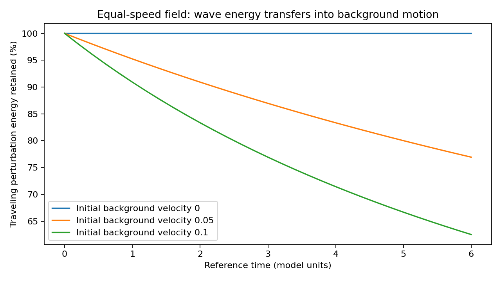

# Does the equal-speed companion field preserve traveling-wave energy?

**No, in the executed evolving-background examples.** The proposed equal-speed field conserves its total Hamiltonian energy, but the traveling perturbation transfers a substantial fraction of its energy to the background motion. The intended lossless-companion condition is therefore not established by this candidate and is contradicted in these examples under the stated common reference-energy convention.

This is a test of the recently proposed logarithmic-gradient field, not a rejection of all possible companion theories or a measurement of real gravitons. There are no photons, capture terms, external forcing or repeated source injections during the evolution. That separation makes it possible to test retention without mixing it with continuing photon production.

## Model and known derivation

The hypothesized positive field Hamiltonian is

`H = integral [Pi^2/(2K) + K*c0^2/2 * (partial_x ln n)^2] dx`, with n>0.

Established canonical variation gives `n_t = Pi/K` and `Pi_t = K*c0^2/n * partial_xx ln n`. Linear waves about uniform n=N have speed c0/N, matching the photon-ray speed in a uniform environment. These mathematical constructions are known; their proposed use as companion/time physics is not certified original or observationally established.

The executed model uses K=c0=1, a periodic domain of length 16 and a localized right-moving carrier/envelope perturbation centered at x=4. Its Gaussian envelope width is 0.5 and carrier wavelength is 1. The initial perturbation has zero spatial mean. Amplitudes 0.001 and 0.003 test the weak-wave regime. Initial homogeneous field velocities are 0, 0.05 or 0.1; their kinetic energy is explicitly pre-existing and is not attributed to converted light. Evolution ends at reference time 6.

The initial wave velocity includes the leading adiabatic amplitude correction. This selects an approximately right-moving wave; it does not prescribe its subsequent energy or maintain it externally. The full nonlinear equations determine both the background and perturbation throughout the run.

## Energy definition and exact accounting

Established decomposition of the kinetic energy into its spatial mean and variance:

`E_background = L * mean(Pi)^2/(2K)`

`E_wave = integral [(Pi - mean(Pi))^2/(2K) + K*c0^2/2 * (partial_x ln n)^2] dx`.

These nonnegative terms sum exactly to H. E_wave is the nonuniform perturbation energy in this finite-box Hamiltonian, not a separate species' stress tensor or a measured deposited gravitational mass. A gain in the zero-mode term does not prove that energy has physically been deposited uniformly throughout space; spatial transport requires its own local analysis.

The background work is tracked independently through

`dE_background/dt = L * mean(Pi) * mean(n_tt)`.

Its integral agrees with the background energy gain and the wave-energy loss. Total energy conservation is checked relative to the small initial wave energy as well as the total, so the large background cannot hide a numerical error.

## Results

The last column is the familiar adiabatic wave-action prediction E_wave proportional to frequency proportional to 1/N, evaluated with the simulated mean field. It is a conditional approximation, not a fitted normalization.

| Initial background velocity | Wave amplitude | Final mean field N | Wave energy retained | Adiabatic retained fraction N_initial/N_final |
|---:|---:|---:|---:|---:|
| 0.00 | 0.001 | 1.000021 | 99.9979% | 99.9979% |
| 0.05 | 0.001 | 1.300017 | 76.9232% | 76.9221% |
| 0.10 | 0.001 | 1.600015 | 62.5010% | 62.4994% |
| 0.05 | 0.003 | 1.300156 | 76.9180% | 76.9139% |

At background velocity 0.05, the wave retains approximately 76.923 percent of its initial perturbation energy. At 0.1 it retains approximately 62.501 percent. The lost energy appears in the background kinetic term; it has not disappeared from the model. The near-static control retains approximately 99.998 percent, with a small self-induced background response. Thus this is an environment-dependent energy exchange, not an unconditional numerical damping term.

The weak wave moves approximately 5.24674 length units in the 0.05 case; integrating c0/mean(n) predicts approximately 5.24726. This is a useful propagation diagnostic, not proof of exact finite-amplitude equality between a wave centroid and a photon ray in a nonuniform field. No detector-clock or physical-unit calibration is added here.

## Numerical checks

The 256- and 512-cell calculations agree within the declared 1e-5 absolute refinement gate for retention, centroid displacement and final mean field. Their raw results are retained. Spectral derivatives are paired so that the force is the derivative of the same discretized gradient energy. The total-energy drift and wave/background exchange residual are each below 1e-6 of initial wave energy; the independently integrated background work agrees within 1e-5 of that energy.

A doubled-domain control uses length 32 with 512 cells, keeping the original grid spacing. It changes the retained fraction by only approximately 0.00000617 in absolute fraction, compared with approximately 0.231 lost. This finite check reduces concern that the main loss is merely the selected box length; it does not prove an infinite-domain limit. Positive n is maintained throughout sampled evolution. No numerical loss is interpreted as companion capture.

## Clock convention and the remaining physical requirement

In the homogeneous adiabatic limit, using universal clocks with d tau=dt/N would convert a reference energy approximately proportional to 1/N into a nearly constant local energy proportional to N*E_reference. But the same conversion applies to photon frequencies under the shared law and recreates the earlier measured-redshift cancellation. Renaming the energy standard only for companions would require a separately derived physical coupling; it cannot be done silently inside a common conservation ledger.

The result therefore sharpens the next requirement. A successful branch must explain why photons exhibit a lasting observed shift while companions keep their intended transport energy, even if both propagate at the same local speed. The present shared dispersion law does not provide that distinction. A separate internal reservoir, additional interaction or different matter/dispersion law would need its own energy accounting and predictions before adoption.

The equal-speed field should remain a candidate-specific failure of the current retention test, not a completed solution. The full photon interaction, source independence, local clocks, capture, three-dimensional gravitational response and lensing remain unresolved. The total photon-supply budget is still deferred; this experiment concerns retention of already-present wave energy, not the universe's total supply. No astronomical observations or holdouts were fitted or opened.

## Reproduction

Run `run.py`, `report.py` and `verify.py`. `results.json` preserves both grid resolutions, the doubled-domain control, coarse histories, transfer-work values and source hash. All units are the model's dimensionless reference units.

- [Equal-speed candidate](../companion-speed-consistency/report.md): derivation, small-wave speed check and fixed-speed comparison.
- [Matter-clock closure](../matter-clock-closure/report.md): clock/energy conventions and observable cancellation.
- [Finite photon feedback](../finite-signal-feedback/report.md): distinct conversion and arrival-time problem.
