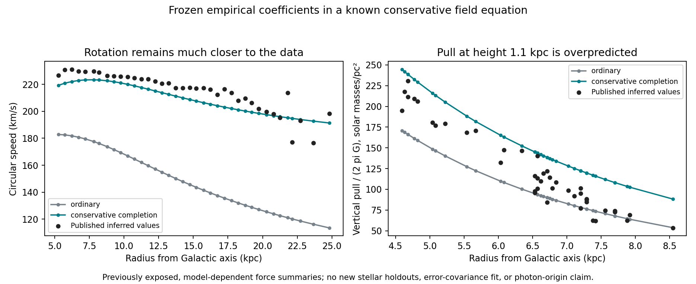

# A conservative three-dimensional completion tested against Milky Way summaries

**The frozen empirical extra-gravity relation can be put into a consistent potential equation, but this particular completion does not fit both radial and vertical gravity well.** It retains a much improved rotation curve while overpredicting the pull toward the disk at height 1.1 kpc. This is new numerical evaluation of a known field-equation construction, not a new first principle or a photon-origin result.

| Model | Rotation RMS, 38 bins (km/s) | Vertical-force RMS, 43 estimates (equivalent solar masses/pc²) |
|---|---:|---:|
| Same ordinary matter alone | 67.44 | 27.99 |
| Frozen rule in conservative completion | 8.61 | 33.31 |

The completed model's median predicted/observed vertical-force ratio is 1.2692 and its mean vertical residual is +30.92 surface-equivalent units. Its median rotation ratio is 0.9686. No parameters were refitted. A median ratio does not mean every point differs by the same percentage.



## Provenance and scope of the observations

The 38 rotation bins and 43 vertical estimates are the previously exposed data archived in `milky-way-capture/inputs.json`. They are not newly opened stellar holdouts. [Eilers et al.](https://arxiv.org/abs/1810.09466) infer an axisymmetric rotation curve, outside the innermost Galaxy, using a Jeans analysis. [Bovy and Rix](https://arxiv.org/abs/1309.0809) infer vertical constraints from modeled tracer populations and Galactic potentials. Those constructions carry assumptions, including halo modeling in the vertical analysis, which are not adopted as active components of our fictional hypothesis.

We use these as conditional, model-dependent benchmarks rather than assumption-free acceleration measurements. The plot omits error bars; no full covariance, mass-model posterior, survey-selection fit, significance test or complete raw-star likelihood is claimed. The actual bulge populations above/below and beneath the bar still require the separately specified orbital analysis. The vertical rows here span roughly 4.6–8.5 kpc, not a new central-bulge measurement.

## Equations and what is known versus postulated

**Existing project empirical fit, using ordinary power-law mathematics:**

```
g_extra(g_b) = A a_star (g_b/a_star)^p
A = 0.2422960665538504
p = 0.4624587420104399
a_star = 7.249608968708169e-10 m/s^2.
```

These coefficients are loaded from the archived SPARC training fit. They are not fitted to the Milky Way here. Their identification with a photon-loss scale still has the previously demonstrated normalization degeneracy; this calculation does not remove it.

**Known quasi-linear potential construction; the choice to apply it to our fitted rule is a new comparison postulate:**

```
laplacian Phi_b = 4 pi G rho_b
nu(y) = 1 + A y^(p-1)
laplacian Phi = divergence[nu(|gradient Phi_b|/a_star) gradient Phi_b]
acceleration = -gradient Phi.
```

This uses the structure of [Milgrom's QUMOND formulation](https://arxiv.org/abs/0911.5464). It is not unique to our work and is not derived from companion conversion or deposition. Our exponent is the archived empirical value, rather than imposing the standard asymptotic MOND exponent. No expanding geometry, cosmological formation assumption or dark halo is included in the computed field.

**Known variational construction specialized to the chosen function:** writing X=|gradient Phi_b|²/a_star²,

```
Q(X) = X + [2A/(p+1)] X^((p+1)/2)
dQ/dX = nu(sqrt(X))
L_grav = -[2 gradient Phi dot gradient Phi_b - a_star^2 Q(X)]/(8 pi G)
L_source = -rho_b Phi.
```

Varying the two potentials gives the two field equations. This is a nonrelativistic gravity construction; it does not specify a spacetime metric for light deflection or a receiving energy reservoir. The usual local source and matter dynamics must be included for the corresponding conservation statements. It is not a complete relativistic companion theory.

Unlike multiplying the local Newtonian acceleration directly, the calculated force is the derivative of one interpolated scalar potential. In spherical symmetry it recovers the original algebraic relation. In flattened galaxies a nonlocal correction is required; the rotation curve is therefore not forced to equal the earlier algebraic result exactly. The computation tests that consequence rather than suppressing it.

## Global ordinary-matter field and numerical solution

The baseline includes the same published bar, nuclear components, two holed stellar disks, two gas disks and softened central mass used in the earlier field work. The bar is **azimuthally averaged** by keeping only its m=0 harmonics; this is an axisymmetric diagnostic, not a rotating three-dimensional bar-population model.

To evaluate the Poisson response beyond the previous disk interpolation domain, we construct a global Legendre expansion of the same analytic disk densities. Coarse/refined disk expansions use angular orders 128/256, 512/1024 angular nodes and 1536/3072 radial nodes, extending to 500 kpc. The integrated refined disk mass is 5.01840e10 solar masses, within 0.00616% of an independent surface-density integral. This is a numerical normalization check of the stipulated model, not an independent astrophysical mass measurement.

The cached L64 bar and L16 nuclei are continued as exterior multipoles beyond 100 kpc. The completed response uses even Legendre orders through 64/128, angular nodes 256/512, and 600/1200 radial nodes. Integration by parts obtains the source-divergence solution from radial and tangential field coefficients, avoiding finite differences of the density source. Power-law radial kernels are integrated analytically for a source interpolated linearly in log radius. Both acceleration components are derivatives of the same potential spline.

The monopole force is the radial average of the algebraic extra field; its potential is assigned an arbitrary additive reference at the inner boundary. With this uncut empirical power law the potential at infinity diverges. Thus the 200/400 kpc domain comparison is **not a physical capture cutoff or proof of finite global stored energy**. It checks the omitted nonspherical exterior contribution to the local field. A finite source/history completion remains necessary for a deposited-reservoir interpretation.

## Checks and limitations

| Numerical comparison | Maximum change |
|---|---:|
| Coarse/refined rotation prediction | 0.0152 km/s |
| Coarse/refined vertical prediction | 0.3856 surface-equivalent units |
| Response domain 200 → 400 kpc, rotation | 0.000494 km/s |
| Response domain 200 → 400 kpc, vertical | 0.0000622 surface-equivalent units |

The new ordinary-matter implementation differs from the archived disk-grid baseline by at most 0.0900 km/s in these rotation rows and 0.2559 vertical units. This small numerical/model-representation difference is retained; old and new geometry scores are not described as exactly identical baselines.

Independent spherical Plummer and razor-thin Kuzmin cases have analytically known conservative extra forces. The spherical case agrees within 0.00220%. The singular razor-thin case requires higher angular resolution than the finite-thickness Milky Way disks: its initial 1.44% discrepancy failed the declared 1% check. Exact kernel integration and a dedicated order-512/2048-node angular evaluation reduce it to 0.247%. This development failure and the different analytic-test resolution are recorded in `verification.json`.

Finite differences of the analytic-test potentials agree with the returned forces within 6.32e-7 relative. Refined closed-loop work is below 1.89e-6 (km/s)², with quadrature changes below 1.22e-5. These checks support the solver in the tested regimes; they are not universal error bounds, a collective-stability proof or a substitute for uncertain Galactic component masses.

## What this changes

We now have an implemented field-equation alternative to the earlier hand-chosen spherical and equipotential-shape extensions. It preserves conservative forces and makes the vertical prediction without an independently adjusted vertical multiplier. Under the frozen baseline it still overpredicts that observable, despite improving rotation substantially.

Therefore the earlier rotation success cannot alone justify this closure or establish where companions deposit. A revised deposition/response law must explain the field geometry and pass shared radial/vertical tests. Changing the fitted coefficients or baryonic model would be new development requiring declared nuisance treatment and independent evaluation; the existing exposed rows cannot become a fresh holdout after such changes. Lensing, photon spectrum/event timing, transport and storage remain separate unresolved connections.

Reproduce with `run.py`, `run.py --refined`, `run.py --refined --outer 400`, `verify.py` and `summarize.py` in this directory. Run each with Python from the repository root using its full repository-relative path. All final scores and row-level predictions are retained.
