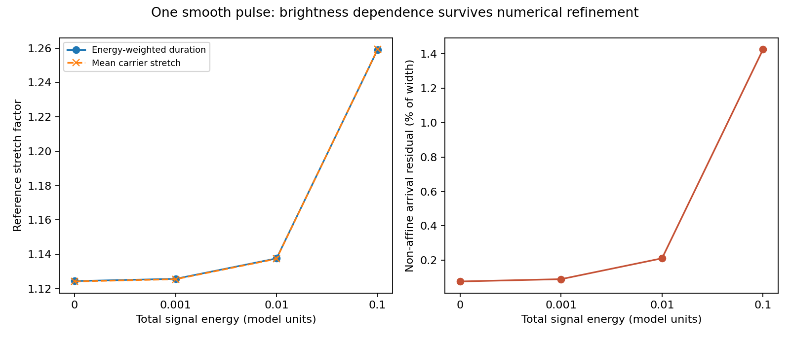

# Does the signal-feedback prediction depend on numerical packet grouping?

**The finite-brightness effect survives a fixed smooth-pulse calculation and is invariant under splitting coincident packets.** It is therefore not simply an artifact of the earlier three-packet representation, within this effective Hamiltonian and its fixed smoothing assumptions. This establishes numerical consistency of that prediction, not its correctness for astronomical light.

## What changed, and what stayed fixed

The prior experiment measured three separated finite packets. Here the incoming signal has one prescribed smooth spatial energy/number profile, proportional to a cosine squared on -0.05 < x < 0.35, centered at x=0.15. All initial carrier frequencies equal one, so the initial energy and photon-number profiles have the same shape. Total signal energy is 0, 0.001, 0.01 or 0.1 in model units. The zero case uses passive rays with a normalized diagnostic measure and no finite signal energy.

The initial driving packet, field, monitoring planes, periodic box, field-wave speed, inertia and smoothing are unchanged from the previous finite-signal model. In particular, the driver energy is 0.01 and the initial rolling-field energy is separately 0.01. These are not inferred astrophysical values or energy supplied by the test signal.

Gaussian quadrature represents the same smooth initial profile with 8, 16 and 32 points. These are integration samples, not three different physical pulse trains. Each sample has a conserved occupation weight and evolves with full field feedback. Source and detector crossings are measured for every sample; neither monitoring plane injects or removes light.

We also replace each of 32 samples by four exactly coincident samples, each carrying one quarter of its occupation weight. Their summed source, energy and momentum are identical. A separate 64-mode field run checks the 32-mode reference. No model parameters are fitted to make the refinement checks agree.

## Formula status

The Hamiltonian, canonical equations, Gaussian quadrature and weighted variance/least-squares formulas are known mathematics. Applying them to this pulse is a project diagnostic, not a new first principle. The identification of the field with a photon-generated gravity source remains hypothetical.

The radiation Hamiltonian is `sum_j N_j k_j/n_bar(X_j)`, with fixed occupation N. Splitting a coincident packet preserves this sum and its field source exactly. Spatially redistributing energy would instead change the physical initial condition and is not covered by this invariance.

We report two finite-duration measures. The count-weighted time width is the standard deviation of crossing times weighted by the conserved photon-number profile. The energy-weighted width uses the corresponding emitted or received photon energies as weights. Their ratio is a finite-event width stretch; it is not assumed equal to a particular carrier's frequency stretch.

To measure distortion, fit one affine arrival map `t_received = a + S_fit t_emitted` with the same count weights. The residual RMS is divided by the received count-weighted time width. This is a descriptive measure of departure from a uniformly stretched event, not an observational error bar or a supernova acceptance threshold. The fitted affine map does not change the simulated arrivals or remove their physical distortion.

## Results for the resolved pulse

All stretch factors are in the declared reference-clock convention. Mean carrier stretch is weighted by the conserved photon-number profile.

| Total signal energy | Mean carrier 1+z | Count-width stretch | Energy-width stretch | Non-affine arrival residual / received width |
|---:|---:|---:|---:|---:|
| 0 | 1.124192 | 1.124247 | 1.124411 | 0.0768% |
| 0.001 | 1.125506 | 1.125563 | 1.125727 | 0.0902% |
| 0.01 | 1.137366 | 1.137441 | 1.137595 | 0.2114% |
| 0.1 | 1.259238 | 1.259601 | 1.258991 | 1.4258% |

At signal energy 0.1, the energy-weighted event width is stretched by approximately 1.259 and the non-affine arrival residual is 1.426 percent of the received count-width. At 0.01, those values are approximately 1.138 and 0.211 percent. Even the passive pulse has a small distortion because the separately driven background evolves. The figures cannot be assigned to observed supernovae without a physical normalization and a source/population model.

## Verification

Increasing quadrature from 16 to 32 points changes every reported stretch/distortion statistic by less than 1e-6 in absolute units, the declared numerical gate; the actual differences are much smaller and are retained in `results.json`. The 8-point comparison is also retained. Coincident splitting and 32-to-64 field-mode refinement change mean carrier stretch, energy-width stretch and field-energy gain by less than 1e-8. Total-energy and total-momentum drift remain below 1e-8 relative in every executed case.

The verification program reconstructs source/received weighted widths, carrier statistics and the best affine map directly from the saved crossing times and frequencies. A conservative Fourier-amplitude bound remains positive over the whole spatial domain at sampled times. These finite checks do not prove a continuum limit as physical smoothing tends to zero, an isolated-space boundary condition, or a microscopic quantum model.

## Consequence for the theory

The earlier brightness dependence cannot be dismissed merely by redefining how much light a numerical packet represents. Within the resolved smooth-pulse calculation, a stronger signal changes its shared field enough to alter both its mean redshift and arrival map. The amount still depends on the model's uncalibrated inertia, smoothing, illumination and initial field.

We must now establish these physical scales and the source/environment relationship before comparing brightness-dependent shifts or event distortions with data. Choosing arbitrary scales to suppress an unwanted effect would not be a first-principles prediction. This calculation also retains the known matter-clock limitation: the reported reference factors are not automatically what real atomic detectors measure. No new local-clock law is adopted here.

The result improves the credibility of the numerical mechanism test, but supplies no observational evidence for photon conversion, lossless companions, permanent capture or extra gravity. The bulge/orbit likelihood and the joint lensing test remain separate unfinished work. No astronomical data were fitted or held-out outcomes opened; the total photon-supply budget remains deferred.

## Reproduction

Run `run.py`, `report.py` and `verify.py`. `results.json` retains all quadrature cases, both controls and the resolved source/detector crossing records. The pulse shape is fixed across refinements. The current script hash is recorded.

- [Finite measured-signal feedback](../finite-signal-feedback/report.md): previous three-packet experiment, endpoint clock controls and matched-emission-time comparison.
- [Sustained illumination](../sustained-illumination/report.md): distinct steady-illumination limit and finite photon-inventory accounting.
- [Matter-clock closure](../matter-clock-closure/report.md): the difference between reference shifts and shifts measured with a coupled clock.
