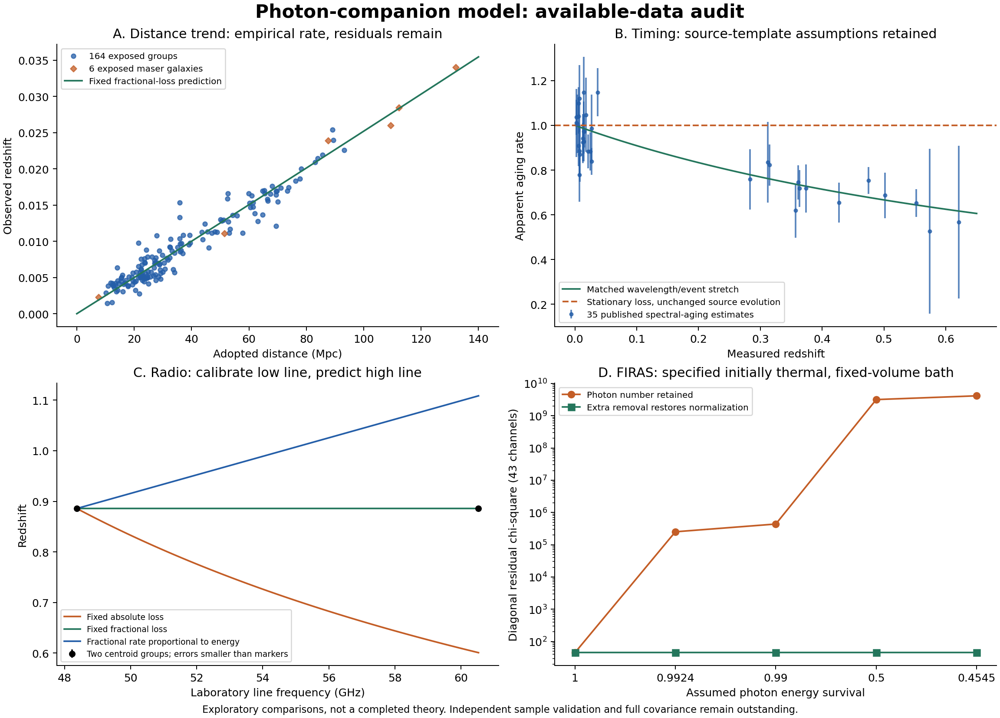

# Electromagnetic audit: results and required changes

The completed calculation suite supports a common fractional redshift law as a useful empirical starting point. It does **not** establish a complete photon-companion theory. Stationary energy loss misses whole-event stretching; an explicit time-field construction repairs that kinematic issue but conflicts with loss-free same-metric companions and still lacks a consistent source. A thermal-history test also requires additional photon/background physics.

The current [formula specification](../../../research_plan/electromagnetic-transfer-specification.md) labels known equations, new postulates, conditional consequences and empirical calibrations. The [coverage register](coverage.md) identifies what has and has not been tested. All 32 original observational requirements remain active. No expansion history or dark-matter halo was used to fit the new calculations.

## What was actually run

| Test | Inputs and scope | Result |
|---|---|---|
| Distance-redshift prediction | All 164 recovered groups, original split; fixed alpha and distances | Original 25-object test RMS reproduced: 415.414 km/s in c times redshift residual units |
| Maser distance check | All six previously exposed maser galaxies; same alpha | RMS 384.275 km/s; motion and shared distance/calibration uncertainty remain unresolved |
| Spectral aging | All 35 published rows, independently checked against the recovered paper text | Stationary timing chi-square 150.569; matched stretching 26.949 |
| Radio chromaticity | Two independent centroid groups representing three methanol lines | Common fractional shift is compatible at this summary precision; tested strong color-dependent alternatives miss the line agreement |
| Microwave spectral shape | All 43 FIRAS residual channels | Number-retaining thermal conversion fails this specified history; extra removal restores normalization by construction |
| Local and multimessenger checks | Published clock, gamma/GW and drift summaries | Large universal changes to atomic constants fail their conditional clock test; equal propagation speeds remain compatible with unknown intrinsic emission delays |
| Prescribed clock fields | 48 finite-event cases and 12 exact inverse-affine cases | Static fields only delay; particular evolving profiles stretch/compress. Exact accumulating candidate links energy and arrival intervals |
| Seven-band grid | 70 predictions from radio to gamma rays, zero path through 1 billion light-years | Formula and energy checks pass; these are synthetic predictions, not 70 observed objects |

The samples overlap earlier project work. They are not a fresh blind validation and must not be pooled into one global chi-square. The new radio transcription and all summary selections were inspected before execution; the protocol records that exposure. The exact time-field test was added under a [separate amendment](time-candidate-amendment.md) after the initial results, so it is explicitly a repair experiment.



## 1. Redshift can be computed, but the rate is still empirical

The reused rate gives z=0.0076604806 over 100 million light-years. Every frequency receives the same fractional shift in the achromatic baseline. The carrier loses 0.7602244% of its energy; the corresponding proposed whole-event stretch is 0.7660481%. These percentages differ because energy survival is the reciprocal of wavelength stretch.

The [170 prediction rows](redshift-predictions.csv) retain observed redshifts, adopted distances, splits and residuals. The 164-group errors are 457.577 km/s in training, 437.065 in validation and 415.414 in the original test subset. These labels preserve the old split; every subset has already been exposed. Independent velocity information and a calibrated uncertainty model are still needed. The earlier explicit expansion comparison was numerically similar; this pass does not make a new equivalence claim.

There is no general observed rest-frequency marker for every point of a continuum. Applying the equation to a gamma-ray energy is a prediction, not a measurement of the photon's emitted energy. Nor must local, approaching or gravitationally blueshifted sources have positive total redshift. The synthetic 1 Mpc source approaching at 300 km/s has total z=-0.00075151 under the declared Doppler-plus-transfer rule; this is an illustration, not a fitted real object.

## 2. Radio lines require nearly common fractional shifts

The published absorber has z=0.8858010 for the 48 GHz pair and z=0.8858052 for the 60.531 GHz line. The pair's redshifts were tied in the original fit, so it supplies one centroid group. We use the published differential offset 0.66 +/- 0.39 km/s. The 12.179 GHz line is retained as a documented profile mismatch, not counted as a clean common-gas constraint. [Kanekar et al., Table 1](https://arxiv.org/abs/1412.7757)

Calibrating each trial once to the lower-frequency centroid gives:

| Loss law | Predicted high-frequency z | Measured high-frequency z |
|---|---:|---:|
| Fixed absolute loss, p=-1 | 0.6009423 | 0.8858052 |
| Constant fractional loss, p=0 | 0.8858010 | 0.8858052 |
| Fractional rate proportional to energy, p=1 | 1.1084584 | 0.8858052 |
| p=2 | 1.2367045 | 0.8858052 |
| p=3 | 1.3009289 | 0.8858052 |

This identifies a needed change for the failed candidates: their mean transfer must become much less frequency-dependent. It does not show a new interaction exists. We do not adopt the tiny fitted p=1.55e-5 as physical: two centroid groups, source systematics and unavailable full covariance cannot establish universal chromaticity. No distance was supplied for this absorber test, so A was calibrated; it did not validate our distance coefficient.

The 13.85 km/s Gaussian FWHM also limits a particular independent-jump mechanism. If all that width is generously allocated to conversion, each multiplicative jump can remove at most about 6.07e-10 of photon energy. This is a conditional noise allowance, not a bound on coherent deterministic conversion. Images and polarization still need their own kernel calculations.

## 3. Timing remains evidence with source assumptions

The [35 aging-rate predictions](spectral-aging-predictions.csv) compare the actual published Table 3 values with 1 and 1/(1+z). The latter has a much smaller diagonal residual score. A fitted exponent gives b=0.9664, with a formal delta-chi-square-one interval 0.8640..1.0729. Rounded inputs explain the small differences from the paper's scores. [Blondin et al.](https://arxiv.org/abs/0804.3595)

Illustratively inflating uncertainties by 10% or 20% of each measured aging rate reduces the two scores to 83.49 versus 13.13 and 39.63 versus 5.77. These are declared sensitivity examples, not justified replacements for the authors' errors or a robust coverage analysis. Shared template and selection uncertainties remain missing.

An intrinsic source-evolution law can exactly mimic a propagation exponent in the simple family tested: only their sum is identified by these summaries. Thus this is not a synchronized source clock or a direct measurement of extra flight days. Any proposed source-evolution explanation must predict the spectra and populations independently.

The existing DES observer-time cache contains calibrated fluxes, but our earlier real-data inference development failed its numerical likelihood gate. We did not silently score DES width products as a new independent confirmation or claim that this gate has been repaired.

## 4. A concrete time rule repairs the kinematics

The known characteristic variation equation says a time-independent path delay does not stretch emission intervals at matching endpoint clocks. We verified that result and tested an explicit alternative:

    q(s,t) = 1 / [1 + c*kappa(s)*(t-t_ref)]
    dt/ds = 1/c + kappa(s)*(t-t_ref)
    wavelength stretch = event stretch = exp(integral kappa ds)

This is a proposed inverse-affine time field with a known integrating-factor solution, chosen to implement the desired accumulation. It is not a first-principles discovery or a demonstrated cosmic environment. Local c is unchanged in the stipulated clock/ruler geometry, and both diagnostic endpoint clocks have q=1.

All 12 exact-profile cases agree with independent integration to a maximum numerical error of 3.55e-15. A 50-digit finite-interval check confirms that a ten-day sequence across the 100-million-light-year profile arrives over 10.0766048 days. This is a candidate prediction, not a newly measured supernova. The profile has zero redshift drift at fixed path even though successive travel delays increase.

It leaves four major physical problems: the prescribed flat-space lapse lacks the required ordinary-GR positive-energy source; its spatial gradients exert forces; the specific profile cannot extend more than about 6.55 billion years into its past without leaving its positive-denominator domain; and massless companions obeying the same metric would lose energy too. A distinct companion coupling or a change to the no-loss premise is required. Its driver-to-companion energy transfer is not yet derived.

## 5. The microwave repair has a brightness cost

Using all 43 released residual channels with the declared diagonal likelihood gives:

| Photon energy survival r | Number-retaining chi-square | With additional survival r^3 |
|---|---:|---:|
| 1 | 45.02 | 45.02 |
| 0.99239776 | 252,221 | 45.02 |
| 0.99 | 438,289 | 45.02 |
| 0.5 | 3.171e9 | 45.02 |
| 1/2.2 | 4.143e9 | 45.02 |

This assumes an initially thermal, homogeneous, unreplenished radiation bath in fixed volume with ordinary mode density. It is not an inferred CMB age or a Big-Bang initial condition. Temperature and the released Galaxy template coefficient were fitted; full covariance and calibration priors were not available. [FIRAS product description](https://lambda.gsfc.nasa.gov/product/cobe/firas_monopole_spect.html)

The extra removal column is a mathematical restoration, not evidence for that process. At stretch 2 it retains only one eighth of photons. Applied to directed light as well as the bath, it makes flux eight times lower than the number-preserving stretched-signal prediction. The removed energy must heat or populate another accounted sector. A separate source/thermalization model is an alternative, but its spectrum and energy balance must be computed; changing photon number cannot be hidden inside a redshift coefficient.

## 6. Local shifts, non-shifts and high-energy timing

The inferred path-transfer contribution over one centimeter is only 8.07e-29 in fractional shift. The miniature-clock experiment instead measures a gravitational comparison gradient of order 1e-18 per centimeter; its published summary agrees with the ordinary predicted gradient at approximately 0.58 combined quoted standard errors. The first number is not a refit of the clock apparatus. It demonstrates why weak path loss does not require erasing known gravitational shifts. [Clock experiment](https://doi.org/10.1038/s41467-023-40629-8)

An optional coupling that changes the fine-structure constant at the full fitted propagation rate is incompatible with the retained optical-clock summary. The conditional dimensionless coupling allowance is about 4.14e-8. This is not a bound on a universal rescaling of all ideal clocks; it is a test of a dimensionless atomic-constant coupling. A generic instruction to change a time constant is insufficient to determine which case applies.

Gamma-ray and GW observations constrain relative arrival behavior with source-lag assumptions. At an illustrative 40 Mpc, a fractional speed mismatch of 1e-15 accumulates about 4.12 seconds. Equal speeds remove that propagation term; they do not require equal emission times. GRB090510's 30.5 GeV photon arriving 0.829 seconds after the trigger does not supply its emission energy or a known flight delay. These summaries cannot certify every high-energy spectrum. [Fermi observation](https://doi.org/10.1088/0004-637X/716/2/1178), [GW170817 comparison](https://arxiv.org/abs/1710.05834)

## Decision

Retain the achromatic fractional-loss law as an empirical baseline. Promote the inverse-affine time profile to an explicitly incomplete candidate for dynamical derivation, not an accepted law. Do not repair the microwave spectrum with universal photon removal until its brightness and heating costs are tested. Preserve all failed comparisons and the no-loss companion contradiction.

No tested candidate now meets every requirement. The next change must supply a **common physical interaction**: its mean energy exchange, phase/timing behavior, fluctuations, clocks, receiving field and gravity must follow together. Adjusting alpha separately for each object or band would hide the failures instead of resolving them.

## Reproduction and numerical checks

Run from the repository root:

```sh
python -X utf8 research_work/results/electromagnetic-audit/run.py
python -X utf8 research_work/results/electromagnetic-audit/plot.py
python -X utf8 research_work/results/electromagnetic-audit/verify.py
```

Requires NumPy, SciPy, mpmath and matplotlib. Input SHA-256 hashes and script hash are in [input-manifest.json](input-manifest.json); full results are in [results.json](results.json). Closed-form frequency drift agrees with independent ODE integration within 2.89e-15 relative error. Spectral photon/energy integrals, brightness Jacobians and scalar transfer/capture accounts pass the specified checks. Source files are unchanged. Successful numerical checks do not certify the physical assumptions or a complete likelihood.
