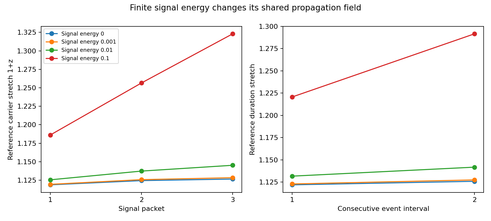

# Finite signal feedback: color, event timing and conserved energy

**Finite signal energy changes the redshift and timing in this candidate, while the faint-signal limit approaches the earlier common-background result.** This is a new test of finite signal feedback in the existing Hamiltonian. It is not a new microscopic interaction or an astronomical fit.

The preceding weak-signal test omitted signal backreaction. The radiation-train calculation included a finite driving population, but still measured timing with infinitesimal probes. Here the three finite packets whose arrival intervals are measured also drive the field. Their lost energy is included in the same receiver ledger as the separate driving packet. No field reset or independent reservoir is assigned to each signal.

## Known equations and the hypothesis being tested

The established canonical Hamiltonian structure is retained:

`H = H_field + sum_j N_j k_j / n_bar(X_j)`

`dX_j/dt = 1/n_bar`, `dk_j/dt = k_j (partial_x n_bar)/n_bar^2`.

The field is a periodic Fourier representation with positive kinetic and gradient energy. Its source is the sum of `N_j k_j/n_bar^2` contributions through the same Gaussian smoothing kernel. Here N is a fixed classical occupation/packet weight, k is carrier momentum in units with c=hbar=1, and the packet energy is `N k/n_bar`. Changing packet loading is not automatically changing photon color. The use of this field as a companion/time mechanism is a project hypothesis, not established physics or a uniquely derived formula.

We use the prior box length 8, inertia 1, wave speed 0.5, smoothing width 0.2 and initial homogeneous rolling rate 0.05. There are 32 and 64 positive Fourier modes in the resolution comparison. One driving packet begins at x=0.4 with energy 0.01. Three equal-energy signal packets begin at x=0.35, 0.15 and -0.05. All radiation is present initially. The source and detector are passive monitoring planes at x=0.4 and x=2.4; they neither inject nor remove packets. Source crossing times are measured rather than assumed to retain the initial spacing.

These are dimensionless effective wave packets, not modeled stars, a supernova light curve or individual microscopic photons. The receiver begins with 0.01 units of homogeneous kinetic energy, which is recorded separately and not credited to photon conversion. The calculation ends at time 4.5 in its stated periodic domain. No inference about an isolated three-dimensional void or infinite-time transport follows from it.

## Executed results

S denotes 1+z in the reference clock convention. A single perfectly affinely stretched event would have one common S; the reported intervals need not be identical in an evolving field.

| Initial total signal energy | Three carrier S values, range | First interval S | Second interval S | Receiver energy gained |
|---:|---:|---:|---:|---:|
| 0 | 1.118717 - 1.126532 | 1.121839 | 1.125801 | 0.00202595 |
| 1e-05 | 1.118724 - 1.126550 | 1.121848 | 1.125817 | 0.00202814 |
| 0.001 | 1.119397 - 1.128386 | 1.122814 | 1.127384 | 0.00224663 |
| 0.01 | 1.125509 - 1.145168 | 1.131603 | 1.141697 | 0.00438655 |
| 0.1 | 1.186166 - 1.323047 | 1.220557 | 1.291520 | 0.03831854 |

The zero-energy row uses test rays of finite carrier frequency with zero packet weight. The field is still driven by the separate 0.01-energy packet and the initial rolling state; this is not a no-radiation universe. At signal energy 0.01, increasing feedback adds approximately 0.00679, 0.01288 and 0.01864 to the three carrier stretch factors relative to probes in the weak background launched at exactly the same source crossing times. Matching those times prevents confusing a changed emission time with the feedback itself. At 0.00001, the corresponding increments shrink to approximately 0.00000680, 0.00001284 and 0.00001853.

The two finite interval stretches at signal energy 0.1 are 1.22056 and 1.29152. They are averages of a changing arrival map, so disagreement with a single packet's carrier stretch is not a numerical failure of the ray equations. For each packet, an independent infinitesimal probe through its already computed shared field recovers its arrival and local carrier/arrival Jacobian relation. This checks the realized propagation map; it does not assert that varying a finite packet's launch time leaves the field unchanged.

## Clock standards and local interpretation

The main table uses the existing reference-clock convention. A separate passive control integrates clocks with `d tau = dt/n_bar` at each monitoring plane. Its local carrier factor is `S_local = S_reference n_emitted/n_received`; finite intervals are computed from the integrated clocks, not by multiplying a long duration by a single endpoint factor.

For signal energy 0.01 the two q=1/n duration factors are 1.02005 and 1.02653, rather than the reference factors 1.13160 and 1.14170. Thus endpoint standards materially change the predicted observable. These clocks do not source the field, have no derived atomic coupling and do not complete the earlier universal-matter model. Their kinematic local-speed property is not proof of a self-consistent matter/ruler sector. The homogeneous matter-clock cancellation remains a distinct documented limitation.

## Conservation and numerical checks

The total Hamiltonian and total canonical momentum include all four radiation packets and the field. Receiver energy gain equals the sum of driver and signal losses, with the pre-existing field energy subtracted. The field is not held fixed while claiming finite-photon conservation. Conversely, the passive clock control contributes no modeled energy and cannot support a claim of full matter-sector conservation.

Maximum sampled relative energy and momentum errors are 1.73e-15 and 6.94e-16. Changing from 32 to 64 modes changes carrier stretches by less than 5.33e-15. These are finite numerical checks of the declared smooth, periodic model, not a proof of microscopic convergence.

At fixed total packet energies, multiplying signal carrier frequencies by three and dividing their occupation weights by three leaves the stretch unchanged to numerical tolerance. This is the expected nondispersive symmetry of the assumed Hamiltonian. It does not show that a derived microscopic interaction preserves every observed electromagnetic spectrum.

An independent analytic control removes all finite radiation loading while retaining the initial rolling field. It recovers the known reference factor exp(0.1) and exactly unit local stretch under the passive q=1/n clock convention, for both carriers and finite intervals. This checks the new packet/clock implementation against the earlier homogeneous cancellation. A conservative Fourier-amplitude bound also stays positive over the entire spatial domain at each sampled time; this does not bound every unsampled time.

## What this changes in the research program

The candidate has a controlled faint-signal limit, but finite brightness is an additional physical input. A viable astronomical model must specify the environmental field, illumination, smoothing and inertia in physical units, then predict whether real sources perturb it enough to produce forbidden brightness-dependent redshift or event distortion. We cannot choose an arbitrary large background solely to hide this dependence without deriving its source, energy and clock behavior.

This comparison closes the specific omission of finite measured-packet feedback. It does not close the stronger requirement of an autonomous source-propagation-detector model with realistic matter, spectra, three-dimensional lossless companions and capture. Nor does it derive the common gravity response or validate the bulge inference. No astronomical training values were fitted, no holdouts were opened, and the total photon-supply budget remains deferred.

Run `run.py`, `report.py` and `verify.py`. Raw numerical cases, both resolutions, the color control, energy exchanges, endpoint clock readings and matched weak-background comparisons are retained in `results.json`. The earlier weak-probe implementation is imported unchanged and its hash recorded.

- [Weak-signal timing](../weak-signal-timing/report.md): prior infinitesimal-signal result and propagation identities.
- [Finite radiation trains](../radiation-train/report.md): finite drivers with weak timing probes.
- [Closed Hamiltonian backreaction](../companion-backreaction/report.md): energy/momentum model and initial rolling-state limitations.
- [Matter-clock closure](../matter-clock-closure/report.md): why a reference-energy change need not be a measured redshift.
