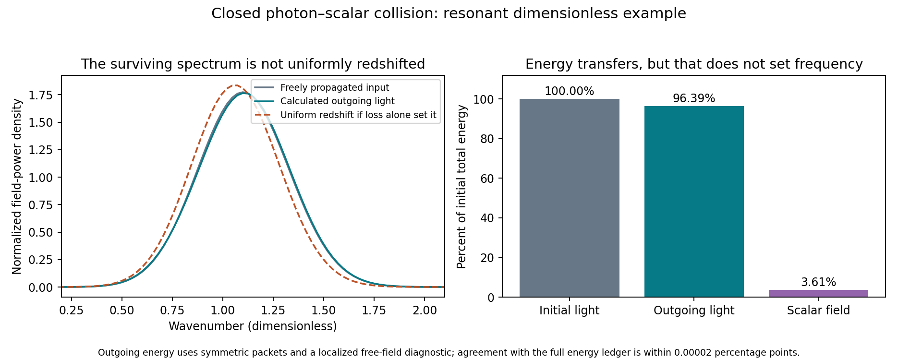

# Does the interacting field actually redshift the surviving light?

**The tested scalar-photon interaction transfers energy without producing the required redshift.** In a resonant collision, 3.611% of the initial energy remains in the scalar field, but the surviving light's energy-weighted mean wavenumber increases by 0.2208%. The normalized spectrum is slightly reshaped; it is not a uniformly redshifted copy of the input. Total energy conservation and numerical refinement both pass.

This is a dimensionless mechanism calculation, not an astronomical observation, a graviton detection, or an exclusion of every companion theory. It extends the earlier closed gauge-kinetic calculation by measuring carrier-resolved outgoing fields. No galaxy, lens or redshift holdout was opened or rescored.

## Model and formula provenance

**Known scalar-electromagnetic interaction family, with a hypothetical chosen completion:** use the same classical action as the preceding pulse study, in natural units and metric signature (-,+,+,+):

```
L = -Z(phi) F_mu_nu F^mu_nu/4 - (partial phi)^2/2 - m^2 phi^2/2
Z(phi) = exp(g phi).
```

The phi F^2 vertex is established scalar coupling physics, not unique to this project. The exponential positive completion and initial states are modeling choices; their astrophysical applicability is unestablished. See the [existing action specification](../microphysics/action-specification.md) and [preceding Hamiltonian derivation](../gauge-kinetic-transfer/report.md). This is a scalar, not the tensor graviton of general relativity.

**Conditional equations derived from that chosen action:** with one transverse electromagnetic potential A, Pi=Z A_t, and pi=phi_t,

```
A_t = Pi/Z
Pi_t = partial_x(Z A_x)
phi_t = pi
pi_t = phi_xx - m^2 phi + (g/2)(Pi^2/Z - Z A_x^2).
```

The scalar and electromagnetic energies include their interaction through Z. No external driving, absorption, expansion or gravitational capture is inserted. All calculations use g=0.3, width=3, initial centers -15/+15, a periodic length 240, and final time 80. Each opposing packet initially carries energy 0.5 per transverse area in these dimensionless units. The packets have a Gaussian envelope times a cosine carrier; the total box energy starts at 1. Refinement uses 2048 points/dt=0.01 and 4096 points/dt=0.005. Outgoing packets have not wrapped around the box.

**Known on-shell kinematics, explaining the diagnostic choice:** for two exactly opposing vacuum photon modes, energy-momentum matching to one scalar gives

```
m^2 = (omega_1 + omega_2)^2 - (omega_1 - omega_2)^2
    = 4 omega_1 omega_2.
```

Equal carriers at omega=1 therefore suggest a resonant scalar mass m=2. The finite wave packets contain a range of frequencies, so this is not a monochromatic transition probability or an astrophysical rate calculation. The resonant case was added to ensure that the spectral question was tested where actual energy transfer occurs; it was not calibrated to observations.

## Results

| Scalar mass | Carrier | Final scalar energy fraction | Outgoing energy-weighted mean k / free mean k |
|---:|---:|---:|---:|
| 0.2 | 1 | 2.5641e-9 | 1.0000000626 |
| 0.2 | 2 | 7.7736e-19 | 0.99999999998 |
| 0.2 | 4 | 2.5706e-26 | 0.99999999969 |
| 2 | 1 | **0.03610983** | **1.00220831** |

These are refined results. The first three tiny spectral differences must not be interpreted as physical redshift detections. The first is smaller than the remaining local kinetic-coefficient departure; the higher-carrier changes shrink strongly with the integration error. Essentially negligible residual scalar energy is not proof that no intermediate exchange occurred.

For the resonant case, the outgoing field-power ratio is 0.96388999. Its energy-weighted mean k changes from 1.10525844 to 1.10769919. The positive direction is toward blue. Because the spectrum is reshaped, this is a centroid diagnostic, not a claim of uniform blueshift of every spectral component.



**Known free-wave diagnostics, used conditionally:** at the right outgoing packet we measure

```
E_right = (A_t - A_x)/2
P(k) = |Fourier[window * E_right]|^2, k > 0
mean_k_energy = sum(k P)/sum(P).
```

The reference is the exact freely translated initial packet with the same window. The local, field-weighted RMS departure of Z from 1 is 7.30e-10 in the resonant output, supporting this nearly free-field interpretation there. The proxy sum(P/k) falls to 0.96236681 of its initial value. Power divided by this wave-action proxy increases by 0.1583%; this is consistent with depletion/redistribution rather than fixed-number uniform redshift, but is **not an independently counted photon population or a complete quantum detector calculation**.

If a fixed number of photons all lost the same fraction of their energy, their common frequency factor would equal their remaining energy fraction. Applying that **conditional known identity** to the scalar fraction gives 0.96389017, a downward shift of 3.611%. The dashed plot is that hypothetical uniformly shifted spectrum; the action's outgoing spectrum is visibly different. An energy ledger alone therefore cannot select that spectral transformation.

## Verification and scope

- Refining the resonant run changes the stored scalar fraction by 5.94e-10 absolute and the mean-wavenumber ratio by 5.64e-11 absolute.
- The resonant refined total-energy drift is below 1.63e-11. Across all runs, including the highest-frequency coarse case, the maximum is 4.99e-7.
- The scalar energy fraction plus the symmetric outgoing field-power ratio differs from unity by 1.80e-7. The small windowed-field mismatch is retained, not declared zero.
- Recomputing the centroid from the saved normalized spectrum reproduces the reported ratio within 1e-12.

This paired spatial/time refinement is a numerical check for these smooth packets, not a global convergence proof for arbitrary nonlinear states. The scalar fraction is measured at finite final time, not proven permanently stored. Event-duration stretching, capture, gravitational lensing, the total astrophysical photon-supply budget and universal electromagnetic frequency coverage remain outside this experiment.

## Consequence for the full theory

The useful advance is that a previously unmeasured consequence of our action is now calculated. Coupling light to a companion does not automatically implement the proposed redshift law, even where transfer is appreciable and conservation holds. This particular resonant collision mainly removes light energy while reshaping the surviving spectrum in the wrong centroid direction.

Do not promote this gauge-kinetic interaction into the redshift data-fitting pipeline as an already-derived conversion law. A successful replacement or extension must derive the surviving spectrum, event timing and matter-clock response from the same dynamics. Independently fitting a redshift coefficient and a galactic stored-density profile still does not connect them physically. This result narrows the candidate mechanism; it does not strengthen a claim that the complete theory already matches observations.

Reproduce with `python research_work/results/gauge-kinetic-spectrum/run.py`, then the same command with `--resonant`, followed by `python research_work/results/gauge-kinetic-spectrum/summarize.py`. Raw numerical spectra and checks remain alongside the scripts.
