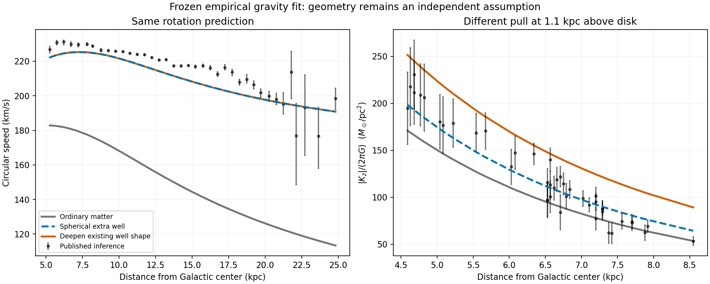

# Rotation agreement does not fix the three-dimensional well

Two conservative extensions of the same frozen empirical rotation relation give almost identical Milky Way rotation predictions but materially different vertical forces. This is a geometric ambiguity in the proposed theory, not a reason to adjust individual stars until the fit works. The comparison quantifies which additional prediction the companion capture/response rule must supply.

## Executed comparison

We used the azimuthal average of the existing three-dimensional ordinary-matter potential: stellar bar, stellar and gas disks, nuclear components and central mass. Averaging removes the bar's azimuth dependence for this controlled comparison; it is not a replacement for the full bar model needed inside the bulge. The same fixed baseline and the same previously fitted SPARC parameters are used in every case. No Milky Way parameters were fitted here.

| Prediction | Rotation RMS error, 38 published bins (km/s) | Vertical-force RMS error, 43 published estimates (equivalent solar masses/pc²) |
|---|---:|---:|
| Ordinary matter only | 67.50 | 28.07 |
| Added spherical well | 8.20 | 15.76 |
| Deepen the existing equipotential shape | 8.20 | 36.13 |

The two extra-well models differ in predicted rotation by at most 0.0000046 km/s after sampling refinement, as intended by their construction. The second model's mean vertical overprediction is 34.05 equivalent solar masses/pc². Thus identical rotation success can accompany very different off-plane behavior. Under this fixed baseline the spherical extension is closer to the retained vertical estimates. This does not establish spherical photon capture or exclude every potential-composition theory.

These are **previously exposed, model-dependent summary data**, not newly opened stellar holdouts. The vertical units express acceleration divided by 2πG; they are not a direct measurement of deposited mass. Bovy & Rix inferred their constraints using modeled stellar populations and Galactic potentials including a halo. Eilers et al. used an axisymmetric Jeans inference and excluded the inner five kpc. We retain them as conditional benchmarks with their provenance, not as assumption-free evidence in the fictional universe. No significance ranking or joint chi-square is claimed; full covariance, population assumptions, mass-model variation and selection are not included. The published error bars in the figure do not show all systematic uncertainty.

## Formulas and their status

**Previously fitted project template using known power-law mathematics; not a first-principles or uniquely new law:**

\[
g_c(g_b)=A a_* (g_b/a_*)^p,
\quad A=0.2422960666,\quad p=0.4624587420,
\quad a_*=7.249608969\times10^{-10}\;\mathrm{m/s^2}.
\]

The proposed identification a*=c²α is retained. Its amplitude degeneracy remains: an adjustable A prevents rotation alone from establishing photon origin. All coefficients come from the archived fit, not this comparison.

Write the azimuth-averaged ordinary-matter potential as Φ_b(R,z), with a_b=−∇Φ_b. Let g₀(R)=∂Φ_b(R,0)/∂R. We interpolate its equatorial curve on 0.2–32 kpc. The potential is monotone there; no extrapolation is allowed.

**Existing spherical geometry postulate, implemented on this baseline:**

\[
\Phi_c^{\rm sph}(r)=\int^r g_c[g_0(s)]\,ds,
\qquad \mathbf a_c^{\rm sph}=-g_c[g_0(r)]\,\hat{\mathbf r}.
\]

**Alternative geometry postulate using the known chain rule, not a derived companion mechanism:**

\[
\Phi_c^{\rm shape}(R,z)=F[\Phi_b(R,z)],\qquad
F'[\Phi_b(R,0)]=\frac{g_c[g_0(R)]}{g_0(R)},
\]
\[
\mathbf a_c^{\rm shape}=F'(\Phi_b)\,\mathbf a_b.
\]

This deepens existing equipotential surfaces with a multiplier set by potential rather than local force magnitude. F is numerically specified from the frozen equatorial template, not independently derived from capture. Both expressions are conservative by construction and reproduce the same equatorial extra force. They are finite-domain effective fields; positive deposited density, an outer boundary, support, source history, lensing and field-energy accounting are not established. Changing the arbitrary zero of Φ_b together with the argument of F leaves the construction unchanged.

**Known vector-calculus test applied to a tempting but generally invalid extension:** directly use

\[
\mathbf a_c^{\rm direct}=\lambda(|\mathbf a_b|)\mathbf a_b,
\quad\lambda(g)=g_c(g)/g,
\quad\nabla\times\mathbf a_c^{\rm direct}
=\nabla\lambda\times\mathbf a_b.
\]

The last term generally does not vanish in a flattened system. Around four rectangular paths in the R–z plane, the direct extension gives net work per unit mass of approximately −1767, −732, −496 and −153 (km/s)². Reversing a path reverses the sign. The refined conservative models give residuals below 0.00014 (km/s)², consistent with their numerical integration errors.

In everyday terms, a fixed well should not pay out net energy simply because a test object takes a closed route and returns to its starting location. The direct multiplier cannot describe that fixed well. A dynamic force with an explicit energy donor could behave differently, but would be a different physical model with additional bookkeeping. This result is not a general ban on companion fields.

The distinction between an algebraic force rule and a potential field equation is already established in modified-gravity literature, for example [Milgrom's QUMOND formulation](https://arxiv.org/abs/0911.5464). QUMOND solves a field equation; we have not implemented it here and do not claim it as a new photon-conversion theory.

## Numerical checks and limits

Doubling azimuth sampling from 32 to 64 points and the radial interpolation grid from 480 to 960 nodes changes any retained rotation prediction by less than 0.00037 km/s and any retained vertical prediction by less than 0.00090 surface-equivalent units. Raising bar order from L40 to L64 changes them by at most 0.0046 km/s and 0.246 units respectively. These finite-resolution comparisons are far smaller than the geometric difference, but are not continuum error bounds or mass-model uncertainty estimates. Closed-path quadrature was also doubled. Checks in summarize.py were selected as numerical diagnostic tolerances, not observational acceptance thresholds.

Run run.py, run.py --refined, run.py --bar-order 64, then summarize.py in this directory using the existing field caches. Results, all prediction rows, input provenance and verification are archived alongside this report. No raw stellar catalog was changed. No stellar validation/test likelihood was evaluated.

## Next requirements for the actual theory

The finding supports the user's proposed above/below-disk comparison: it can distinguish well shapes that rotation cannot. The next physical specification must say where companions deposit and how that distribution sets a conservative field, including the flattening and its dependence on the ordinary matter. It must determine this with a shared rule rather than choosing the most successful geometry separately for every dataset. The spherical construction remains a benchmark; the shape-preserving construction is a recorded alternative with a substantial vertical discrepancy under the stated baseline.

Before a full bulge fit, resolve the flagged catalog associations and distance likelihoods, build the shared orbit-population/selection model, and evaluate reserved observations with the complete procedure frozen. A good three-dimensional gravity fit would still leave photon origin, event timing, companion transport/capture, lensing and the deferred total source-energy budget to establish. Those requirements are not replaced by this geometric result.

Sources: [Eilers et al. rotation inference](https://arxiv.org/abs/1810.09466), [Bovy & Rix vertical inference](https://arxiv.org/abs/1309.0809), and the archived bar-field and joint-galaxy-audit provenance. Formula labels above distinguish established mathematics, empirical fitting and additional hypothesis choices throughout.
