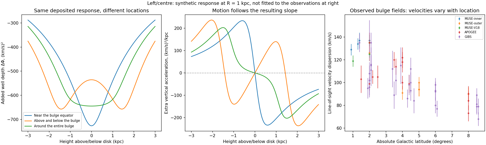

# Local well deepening and the bulge comparison

The user's clarification is adopted: **companion arrival need not push in an arrival direction or create a particular cold-particle distribution. It may change the shape/depth of the gravitational well near the deposit.** The preceding spherical mass-response fits are conditional comparison models, not the user's selected mechanism. Capture location, the stored state, and its response in the gravitational field remain distinct questions.

## A formula for the stated idea

**Proposed effective field response, using known superposition/kernel mathematics; no originality claim:**

\[
\Phi(\mathbf x,t)=\Phi_{\star}(\mathbf x,t)+\Phi_{\rm gas}(\mathbf x,t)+\Delta\Phi_c(\mathbf x,t),
\qquad
\Delta\Phi_c=-\chi\int u_d(\mathbf x',t)\,K_\ell(|\mathbf x-\mathbf x'|)\,d^3x'.
\]

Here u_d records stored companion energy. The kernel K tells us how a deposit changes the nearby well; chi sets the size of that response. A softened inverse-distance kernel K=1/sqrt(d²+ell²) gives a familiar smooth local depression. It is the **known Plummer/softened-gravity kernel**, not new physics. Chi=G/c² corresponds to a particular ordinary-gravity energy-to-source interpretation. A modified chi or kernel is permitted as a hypothesis, but needs field equations, energy/momentum conservation and independent tests. The static kernel is a quasistatic diagnostic, not a relativistic propagation law.

No incoming direction appears in that isotropic response kernel. Arrival directions determine the capture/source distribution; the final field response is a separate postulate. The conservation equation partial_t u_d + divergence F_d = Q_cap - L_d still accounts for stored energy. It does not by itself determine chi, the kernel, or the energy of the field response.

**Known weak-field force relation used for the first diagnostic:** a=-gradient Phi. A well's value, slope and curvature are different:

* Its **depth** is the potential value relative to a reference.
* Its **slope** determines the acceleration at that location.
* Its **curvature** determines how acceleration differs between neighboring locations. Near a symmetric, static midplane, a_z≈-(partial²Phi/partial z²)z; this is a local restoring-coefficient diagnostic, not a complete barred-orbit solution.

A constant lowering everywhere produces no new slope. A local depression generally produces slopes on its sides. At the bottom the slope can be zero even when the well is much deeper. Thus measuring upward/downward motion is a way to infer the changed well shape, not an imposed directional behavior for companions.

## Executed local-response test

Three synthetic deposit configurations have exactly the same total response amplitude: a ring around the bulge equator, two smaller rings above/below the bulge, and a shell around the entire bulge. They use the same 0.3 kpc softened kernel. The response amplitude is stipulated as 1,000 (km/s)² kpc; it has not been derived from photon energy or fitted to stars. Equatorial/shell radius is 1.5 kpc; the upper/lower rings have radius 0.5 kpc and heights ±1.5 kpc. These are deliberately simple geometry comparisons, not measured boundaries.

All three deepen the well at the centre and give zero acceleration exactly there by symmetry. Yet their added central vertical curvatures are respectively +279.4, -385.3 and +10.7 (km/s)²/kpc². **The upper/lower configuration can draw a slightly displaced star away from the midplane toward the added upper/lower depressions.** The equatorial configuration adds a restoring tendency toward the plane. Neither conclusion follows from the companions' travel direction. The ordinary stellar/gas field must be added before assessing the total restoring force and stability; an extra negative curvature does not automatically make the actual galaxy unstable.

The code computes 3,615 positions covering R=0,1,2,4,8 kpc and heights -3..3 kpc. Analytic forces agree with independently differenced potential values, and the centre symmetry checks pass. These are synthetic predictions, not a fit to the observational panel. A static field-response normalization is not an energy-budget or support calculation.

## What the bulge observations already provide

The new input is **57 field-level velocity summaries** from [Quezada et al., Table 2](https://arxiv.org/html/2509.06846), combining MUSE, APOGEE and GIBS. It includes fields close to the plane and at higher latitude. We saved the reported heliocentric mean velocities, dispersions and errors, with field/survey identities. Coordinates decoded from field names are rounded angular labels, not distances or precise Galactocentric positions.

For illustration, MUSE-inner field m0.7m1.4 has line-of-sight dispersion 137±7 km/s, while APOGEE p0p8 has 90±7 km/s. They are different sky fields and selections; this is evidence of a spatially varying velocity distribution, **not a clean same-radius comparison or a direct extra-force measurement**. The source paper reports approximate cylindrical rotation together with changing dispersion. A viable model needs to explain both, not just faster mean rotation everywhere at high latitude.

The field moments are derived from spectra and population/foreground treatment, not direct force meters. They have no companion-predicted counterparts yet; the comparison explorer displays “Not derived” rather than inventing a number. BRAVA's [IRSA catalog](https://irsa.ipac.caltech.edu/data/BRAVA/) is also identified for additional tracer data. The original UCLA endpoint failed TLS verification in this environment, so no files were fetched through an insecure bypass.

The older 38-bin rotation dataset begins at 5.27 kpc, and the 43 vertical-force estimates at 4.59 kpc. **Neither directly measures the inner bulge comparison requested here.** The new angular field summaries extend the observational inventory, but a physical same-radius comparison still needs distances and full motions.

## The three-way test we now need

| Population/location | What it tests | Required comparison |
|---|---|---|
| Stars in the disk plane beneath the bulge | Well shape within the bulge's equatorial region | Match radius, azimuth and stellar population to off-plane stars |
| Stars above/below that same bulge region | Whether the added well response changes with height or forms upper/lower depressions | Measure mean motions and velocity dispersions separately, plus cross-correlations |
| Disk stars beyond the bulge, both near and away from the plane | A control for the bulge's influence | Allow for the ordinary radial decline and different gas/stellar density |

A provisional binning scheme is R=0.5–3.5 kpc with |z|<0.2 versus |z|=0.5–1.5 kpc, and outer controls at R=5–9 kpc with matched height ranges. These are candidate selection boundaries, not cuts already executed or selected for favorable outcomes. Within each bin, retain azimuth relative to the bar and split comparable stellar ages/abundances. Foreground contamination, extinction and selection differ strongly near the plane.

**Known stellar-dynamics moment relation:**

\[
\nu a_z=\partial_t(\nu\langle v_z\rangle)
+\frac1R\partial_R(R\nu\langle v_Rv_z\rangle)
+\frac1R\partial_\phi(\nu\langle v_\phi v_z\rangle)
+\partial_z(\nu\langle v_z^2\rangle).
\]

This explains why velocities alone are insufficient. The number of tracer stars, their spatial gradients, correlated motions, and possible bar/time dependence enter the inferred force. A faster spread of velocities can reflect different orbits/populations as well as a different well. We must forward-model the projected data under one common response field, not treat line-of-sight dispersion as vertical acceleration or circular speed.

## Connection back to the redshift work

For illustrative 4–12 kpc stellar paths, the current achromatic loss coefficient predicts c*z_transfer≈0.30–0.90 km/s. These are synthetic path terms; not all bulge stars are at one common distance. The leading shared shift largely cancels in internal velocity comparisons, but a precision forward model should include the differential path term and endpoint gravitational shifts. The path term alone is far smaller than typical bulge velocity dispersions and is not an explanation of their full spatial pattern.

The effective kernel and its coupling must ultimately share a consistent energy/field description with photon conversion. A better orbital fit does not resolve the earlier time-stretching and loss-free-companion conflict. This clarification therefore expands the field-response alternatives while preserving all the redshift and conservation requirements.
