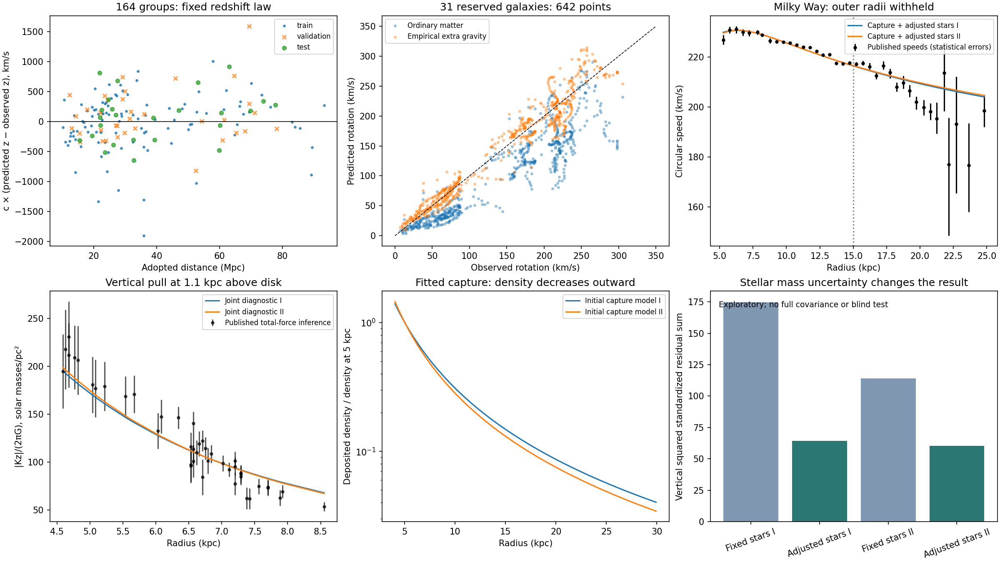

# Joint galaxy and redshift analysis

**Latest user clarification:** deposits may reshape/deepen the local well without a specified directional push or cold-particle interpretation. The [local-well and bulge extension](bulge-local-well.md) makes that distinction explicit, imports 57 additional bulge field summaries, and compares three synthetic well-response geometries. The spherical cold-source fits below are conditional comparison models, not a locked mechanism. The requested plane/bulge/off-plane dynamical fit is not completed by the earlier outer-disk datasets.

**We have useful empirical redshift and gravity formulas, and a capture model that can approximate the Milky Way's radial and vertical forces. We do not yet have one derived physical theory that reproduces all the observations.** This analysis retains the mismatches rather than adding an independent correction for every galaxy.

The new suite recalculates 164 distance-redshift groups and 3,150 rotation measurements in 149 galaxies, adds gas to two Milky Way stellar models, fits capture to inner Galactic rotation, predicts the outer rotation and vertical force, and tests a post-result stellar-mass repair. The earlier electromagnetic timing, spectrum and source failures remain in force. They were reviewed and integrated here, not all rerun as new experiments.

[Open the complete observed/predicted table](comparison.html). It contains 7,602 prediction rows because multiple models predict the same observations, plus 114 observed mean/dispersion entries from 57 bulge fields with no dynamical prediction yet. These are not 7,716 independent measurements. All original joint-fit input paths/hashes, retained sample splits and fitting rules are recorded in [protocol.json](protocol.json) and [input-manifest.json](input-manifest.json); the later bulge source and hash are in [bulge-inputs.json](bulge-inputs.json).

## What changed, and what worked

| Test | Result | Interpretation |
|---|---|---|
| Redshift, original 25 reserved groups | Constant-rate RMS 415.4 km/s; modified history 413.7 km/s | Tiny gain, while validation worsens slightly; retain simpler baseline |
| Rotation, original 31 reserved galaxies | Ordinary matter RMS 47.77 km/s; empirical extra-gravity rule 17.20 km/s | A common rule works substantially better, without per-galaxy tuning |
| Milky Way, same SPARC-trained rule | All-radius RMS 12.49 or 7.54 km/s for stellar models I or II | Useful transfer to another galaxy, conditional on stellar/gas assumptions |
| Uniform external capture | Cannot fit both inner and outer rotation satisfactorily | Absorption geometry alone does not give the required mass distribution |
| Centre-weighted capture, fixed stars | Inner RMS 0.90 km/s; outer RMS about 12 km/s | Excellent inner fit is not a full-galaxy or vertical-force success |
| Centre-weighted capture with adjusted stellar mass | Inner RMS 1.03–1.06 km/s; outer RMS 11.55–11.80 km/s | Vertical tension improves, but stellar/capture degeneracy remains |

Rotation RMS values for SPARC weight each galaxy equally. Redshift residuals are c times the redshift difference, not independently measured peculiar velocities. Milky Way radial errors in this table are unweighted RMS; fitting used the declared statistical-plus-3% sensitivity weights. No combined score merges these different experiments.

## 1. Redshift: retain the simple law and its residuals

**Proposed photon transfer written in known rate-equation mathematics:**

\[
\frac{dE_\gamma}{ds}=-\alpha E_\gamma,\qquad
\frac{dE_c}{ds}=+\alpha E_\gamma.
\]

**Known exponential solution, not an original mathematical discovery:**

\[
1+z_{\rm transfer}=e^{\alpha D},\qquad
E_\gamma/E_{\gamma,0}=e^{-\alpha D},\qquad
E_c/E_{\gamma,0}=1-e^{-\alpha D}.
\]

Refitting only the original 104 training groups returns alpha=2.488993265e-4 per Mpc, effectively the same as the earlier coefficient. The original validation/test groups have already been exposed in previous work; retaining their labels is not a new blind experiment. The distances are used as stipulated published facts, not recomputed from an expansion law. Their calibration, frame and interpretation still require their existing provenance caveats. A pure path-only prediction excludes independently unknown source motion and endpoint effects, so its residual cannot be assigned exclusively to failed conversion physics.

**At 100 million light-years**, the retained coefficient predicts z=0.00766048 and transfers 0.760224% of the original photon energy. Every frequency experiences the same fractional loss under this achromatic postulate. This is a computed example, not an object with an exactly known unshifted emitted spectrum at that distance.

Five examples selected only by proximity to that distance within the original test subset illustrate the remaining scatter:

| Group PGC | Adopted distance (Mpc) | Observed z | Predicted z | c times residual (km/s) |
|---|---:|---:|---:|---:|
| 19476 | 32.569 | 0.0091530 | 0.0081393 | -303.9 |
| 46247 | 32.719 | 0.0103338 | 0.0081770 | -646.6 |
| 6983 | 27.593 | 0.0046265 | 0.0068915 | +679.0 |
| 51787 | 26.965 | 0.0063777 | 0.0067341 | +106.8 |
| 20047 | 26.230 | 0.0078588 | 0.0065500 | -392.4 |

Close distances do not guarantee identical observed redshifts. Assigning whatever velocity is needed to each residual would exactly reproduce the table but would not predict it. We need independent velocity/environment information and distance systematics to test a more complete explanation.

**Exploratory modification using a known polynomial basis:** with x=D/(100 Mpc), set ln(1+z)=a x+b x². Its train-only fit gives a=0.02534426 and b=-0.00076075. Positive cumulative-loss derivative was enforced over the observed range, whose maximum is 93.20 Mpc. This is a photon-history diagnostic, not a local time-field derivation or a claim of novelty. Training RMS changes 457.58→457.06, validation 437.07→437.60, and test 415.41→413.74 km/s. That is not a persuasive reason to add the parameter. Do not extrapolate the negative quadratic term to arbitrary distances.

The illustrative 300 km/s motion floor plus propagated individual distance errors gives a test standardized RMS about 1.17 for the baseline. That conditional sensitivity calculation does not prove agreement: shared calibration, motion correlations and a verified error model are missing.

## 2. A common gravity rule transfers across galaxies

**Existing project empirical power-law template, using known dimensional analysis; not a derived capture law or a unique new formula:**

\[
a_* = c^2\alpha = 7.24961\times10^{-10}\ {\rm m\,s^{-2}},
\qquad g_{\rm extra}=A a_*\left(\frac{g_b}{a_*}\right)^p,
\qquad g_{\rm total}=g_b+g_{\rm extra}.
\]

\[
A=0.2422961,\qquad p=0.4624587,\qquad
v_{\rm predicted}(R)=\sqrt{R g_{\rm total}(R)}.
\]

The constants A,p were fitted on 89 SPARC galaxies, then left unchanged for 29 validation galaxies, 31 test galaxies, and the Milky Way. This reproduces the earlier project's power-law benchmark under the updated redshift-derived scale; it is not a newly discovered result. Stellar mass-to-light ratios remain 0.5 for disks and 0.7 for bulges; the signed gas and stellar potential contributions are retained. Published distances and inclinations stay fixed. These are conditional modeling choices, not exact measured masses. [SPARC primary paper](https://arxiv.org/abs/1606.09251).

The added rule improves galaxy-weighted RMS for 30 of the 31 reserved galaxies. A 5,000-draw paired bootstrap of galaxies, holding parameters fixed, gives a descriptive RMS improvement of 22.0–39.7 km/s. This does not include full uncertainty in distances, inclinations or mass-to-light ratios. It confirms a useful empirical trend, not the identity of the gravitating source.

**Important identifiability deduction:** gravity depends on A*a_*^(1-p), so changing alpha can be canceled exactly by changing A. Calling a_*=c²alpha does not establish a physical photon/gravity connection while A remains free. A microscopic interaction or an independently normalized source/capture calculation must remove this degeneracy. This algebraic invariance was checked numerically.

For vertical predictions, simply multiplying the full baryonic force vector by a locally varying factor can produce a nonzero curl, inconsistent with a single static Newtonian potential. This audit instead stipulates a **spherical conservative completion**: compute the extra radial force from the equatorial baryonic profile at spherical radius r, then direct it toward the centre. This is an additional geometry postulate, not a result of fitting the SPARC curves. It produces definite, testable vertical predictions.

## 3. Capture must explain a distribution, not just an extra speed

The uniform isotropic-bath control and the new centre-weighted candidate use the same ordinary straight-ray absorption equation. **Known transport solution applied to the proposed companion sector:**

\[
I_c(r,\mu)=I_0 e^{-\tau(r,\mu)},\quad
\tau=\int_{\rm entry}^{r}\beta\,ds,\quad
Q_{\rm cap}=4\pi\beta I_0 J(r),\quad
J(r)=\tfrac12\int_{-1}^{1}e^{-\tau(r,\mu)}d\mu.
\]

**Proposed capture profile with a familiar cored inverse-square shape, not unique to us:**

\[
\beta(r)=\frac{\beta_0}{1+(r/r_s)^2}\quad(r<100\ {\rm kpc}),
\qquad \beta=0\quad\hbox{outside}.
\]

This increases capture probability toward the centre. It is a radial proxy for the desired stronger-well preference, not a derived response to potential or a universal environmental law. The 100 kpc boundary is stipulated, not measured. The earlier flattened-disk test is preserved; this extension uses a sphere because it allows capture, enclosed mass and both force components to be connected exactly under the assumed gravity law.

**Conditional stationary-storage and cold-source assumptions:** rho_d is proportional to beta J. The proportionality represents accumulation time times boundary intensity divided by c². It is fitted here through total deposited mass M100. We compute the density rather than inserting a pre-fitted dark matter profile:

\[
M_d(<r)=4\pi\int_0^r\rho_d(u)u^2du,
\quad v_d^2(R)=\frac{G M_d(<R)}R,
\quad |K_{z,d}(R,z)|=\frac{G M_d(<r)|z|}{r^3},\quad r^2=R^2+z^2.
\]

These gravitational equations are established Newtonian relations. They assume the captured energy behaves as a cold source; they do not establish how freely propagating waves become long-lived supported deposits. The model does not include internal stellar companion emission, focusing, scattering, migration, driver stress, or capture recoil. Those omissions matter for a complete theory.

Uniform capture hits the initial mass bound. To avoid mistaking a numerical bound for a physical failure, an additional optically thin uniform-density control allows its normalization to rise freely. Its best inner RMS is 14.74–19.91 km/s and outer RMS is 78.86–93.86 km/s. It still cannot reproduce the radial shape. Increasing total energy alone does not fix it.

The centre-weighted candidate improves inner RMS to about 0.90 km/s and outer RMS to about 12 km/s, but r_s hits its lower boundary of 0.501 kpc. It is not a measured core radius. The total fitted M100 is approximately 7e11 solar masses; that is a required phenomenological normalization, **not energy shown to exist in the companion supply**. Source-energy magnitude remains deferred; local transport conservation does not establish global abundance.

At 25 kpc the initial fitted deposited density is only 4.9–5.7% of its value at 5 kpc. Yet equal-width shells at 25 kpc contain 1.22–1.42 times as much deposited mass because their area is 25 times larger. This distinguishes three ideas: density, mass intercepted in an entire shell, and extra force relative to declining stellar gravity. An increasing percentage speed excess does not require increasing local deposited density at the rim.

## 4. What the vertical test means and how the repair behaves

Think of the Milky Way as a plate. Radial force pulls toward its centre and controls circular motion. Vertical force pulls stars toward the plate from above and below and controls their up-and-down motion. It is the final stored distribution that produces this pull, not simply the direction from which a companion arrived.

The two stellar baselines use only the stellar components of [Pouliasis et al. Table 1](https://arxiv.org/html/1611.07979), without the paper's halo. Gas uses the fixed HI/H2 profiles of [McMillan Table 1](https://arxiv.org/html/1608.00971), evaluated with a gas-only potential. These are sensitivity benchmarks: their historical stellar choices were compared with halo-containing models, so they are not certified independent of all excluded modeling assumptions. Gas is kept separate when stellar normalization changes.

The 43 [Bovy–Rix vertical-force estimates](https://arxiv.org/html/1309.0809) also inherit their original potential-family assumptions. Their use here is provisional. Their R0=8 kpc convention is retained; a full joint fit must transform/reinfer positions and force constraints consistently from the raw stars. Their individual errors are not a complete covariance matrix. We do not import a dark matter density posterior as truth.

With fixed stellar masses, adding rotation-fitted capture raises the vertical squared-standardized-residual sum to 174.9 or 114.0 across 43 rows. That exposed the conflict described in the progress update. A [recorded post-result repair](repair-amendment.md) then varied one common stellar mass multiplier per baseline, using inner rotation and 22 vertical rows for calibration, with 21 other vertical rows and all outer rotation withheld from that adjustment.

| Diagnostic baseline | Stellar multiplier | Inner rotation RMS | Outer rotation RMS | Reserved vertical score / 21 rows |
|---|---:|---:|---:|---:|
| Model I + fixed gas | 0.727 | 1.06 km/s | 11.55 km/s | 31.28 |
| Model II + fixed gas | 0.798 | 1.03 km/s | 11.80 km/s | 29.09 |

The total vertical scores become 64.20 and 60.23. The improvement means ordinary stellar mass and companion gravity can trade off; it does not demonstrate that stars really have these adjusted masses. The prior width of 20% was an explicit sensitivity choice. This split is post hoc, all rows were already seen, and neighboring abundance populations can share systematics. Do not describe it as blind validation or turn these diagonal scores into strong probability claims.

The outer curve still has structured residuals. Improvements may require better baryonic profiles, a finite/different capture distribution, or a different gravitational response. Choosing one simply because it lowers the already-seen residuals would require a new independent test before claiming predictive success.

## 5. What prevents claiming that all our formulas work

The [earlier electromagnetic audit](../electromagnetic-audit/report.md) remains part of this joint assessment:

* **Spectral shifts versus event duration:** ordinary stationary energy loss lowers photon frequency but does not stretch an entire supernova light curve. The known-summary timing scores remain about 150.6 for no event stretch versus 26.9 for matched stretching. Source-population/template assumptions remain explicit.
* **Time-field candidate:** the prescribed inverse-affine lapse can match wavelength and event stretching mathematically, but is not sourced consistently. Companions following the same metric would also lose energy, contrary to the desired no-loss travel. The capture fit does not resolve this.
* **Microwave spectrum and brightness:** the specified fixed-volume thermal-history calculation fails under photon-number-preserving energy loss. Additional removal can restore the spectrum by construction but changes brightness and requires an energy destination. A different background source/history must be calculated, not assumed to pass.
* **Stable storage and momentum:** the stationary density used above has not been derived from a supported bound state. Energy conservation alone does not keep a freely moving wave at a fixed radius.
* **Same law across objects:** beta0, rs and M100 were calibrated for this Milky Way diagnostic. They have not yet been predicted from each other galaxy's measured radiation field and environment. The cross-galaxy power law is an empirical substitute, not proof of that causal chain.
* **Lensing, clocks, planetary motions and other regimes:** no new joint lensing or solar-system fit was performed. They remain explicit targets rather than automatic consequences of a good rotation fit.

Matching every noisy tabulated value is not the scientific goal. The goal is one model predicting the observations with justified uncertainty, without silently changing source physics, distances, velocities or capture strength for each object. These data do not yet uniquely determine that model.

## 6. Current formula decision and next concrete work

Retain the achromatic exponential redshift law as the empirical baseline; do not promote the negligible quadratic improvement. Retain the SPARC power relation as a target for the required extra gravitational response. Retain the centre-weighted capture profile as a conditional morphology comparison, while dropping uniform capture as a satisfactory Milky Way explanation in the tested spherical cold-source geometry. This does not reject other local-well response kernels. Keep both original and adjusted-stellar results visible, and investigate the user's bulge/plane comparison with the more general scalar-potential response.

The next causal calculation must replace the free boundary intensity and normalization with radiation from measured disk/bulge sources and a specified external field, then derive beta and stable storage from one interaction. The resulting distribution must reproduce both force components and lensing. Independently constrained stellar/gas mass and a raw-tracer vertical likelihood are needed to break the present degeneracy. Separately, a common photon/companion/clock interaction must resolve event stretching and no-loss companions. Until those tasks succeed, the work is a set of tested partial models, not an academic demonstration that the new branch of physics reproduces the universe.

## Reproduction and numerical verification

Run `python research_work/results/joint-galaxy-audit/run.py` from the repository root. Then run `repair.py`, `diagnostics.py`, `bulge.py`, `present.py`, and `verify.py` using that same directory prefix. Dependencies: NumPy, SciPy, Matplotlib and galpy; tested Python 3.13.5, NumPy 2.2.6 and galpy 1.11.1. Optional fresh HTML extraction in bulge.py uses beautifulsoup4; normal replay uses the saved JSON. The gas cache is checked against its generator hash and galpy version. Delete only that cache if intentionally recalculating it under a new compatible environment. No network access is needed to rerun from the repository inputs.

Doubling capture resolution changed reported predictions by under 0.0004 km/s or the stated vertical surface units. Gas expansion orders 30 and 40 differed by at most 0.1943% at the check points. Independent incoming-ray and volume-integrated capture ledgers agreed to 2.11e-8 relative; the transparent uniform-density mass limit and photon energy ledger passed. These verify numerical calculations under their assumptions, not the existence or sufficiency of companions. The figure and table filters were inspected. The manuscript PDF remains separately versioned; this is a post-draft analysis.
