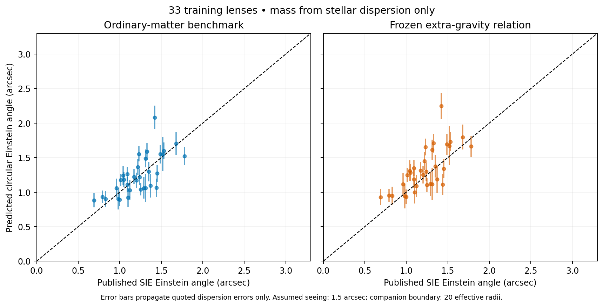

# First training-only stellar-motion to lens-angle comparison

The frozen empirical extra-gravity rule does **not improve** this first approximate comparison. For 33 training SLACS early-type lenses, a spherical ordinary-matter benchmark gives an Einstein-angle RMS discrepancy of 0.206 arcsec; adding the frozen extra-gravity relation gives 0.243 arcsec under the representative stated seeing and boundary assumptions. Its median predicted angle is about 9.7% above the published SIE angle, compared with 1.8% for the ordinary-matter benchmark.

This is evidence about a restricted modeling combination, not a rejection of every companion theory or proof that ordinary matter alone explains these lenses. Both mass scales are inferred from stellar dispersion; neither is independently constrained by photometry in this pilot. The actual photon-production/capture/metric mechanism remains unspecified.

## What was fitted and what was predicted

Only systems already assigned to training, classified early-type, and possessing spectroscopic dispersions were used: 33 of the 41 training systems. Validation and test scores remain unopened. All 33 were retained; no high-residual object was removed.

Each galaxy has one ordinary-matter mass normalization determined from its measured aperture dispersion, separately under each candidate potential. The image-derived angular effective radius sets the tracer shape. The Einstein angle is then predicted; it is not used to fit that mass. The coefficients A, p and a* are unchanged from the earlier galaxy-rotation fit.

The ordinary-matter profile is a spherical Hernquist approximation with uniform mass-to-light ratio. No separately modeled gas or central black hole is added. Orbits are isotropic, the aperture is a three-arcsecond diameter circle, and the source geometry is the archived static-Euclidean redshift-distance prescription. Angular effective radius is treated as a spherical projected half-light radius even though the catalog comes from elliptical de Vaucouleurs image models. This approximation is especially important for flattened systems and S0 galaxies.

The compound potential uses the same positive spherical extra-force prescription evaluated on this ordinary-matter profile, truncated as a source at a prescribed radius. Both metric potentials are assumed equal for computing lensing. These are additional model assumptions, not a new first-principles explanation.

## All tested configurations

Seeing FWHM of 0 and 1.5 arcsec are declared sensitivity examples, **not measured seeing for each spectrum**. The outer source boundary is tried at 5, 20 and 100 effective radii; none is claimed to follow from capture physics. The ordinary-matter benchmark has no companion boundary.

| Model | Assumed seeing FWHM, arcsec | Companion boundary / effective radius | Angle RMS discrepancy, arcsec | Median predicted / SIE angle |
|---|---:|---:|---:|---:|
| Ordinary matter | 0 | — | 0.2049 | 1.0159 |
| Ordinary matter | 1.5 | — | 0.2062 | 1.0181 |
| Empirical companion | 0 | 5 | 0.2325 | 1.0763 |
| Empirical companion | 0 | 20 | 0.2399 | 1.0892 |
| Empirical companion | 0 | 100 | 0.2423 | 1.0932 |
| Empirical companion | 1.5 | 5 | 0.2356 | 1.0843 |
| Empirical companion | 1.5 | 20 | 0.2433 | 1.0973 |
| Empirical companion | 1.5 | 100 | 0.2459 | 1.1013 |

For the 1.5-arcsec seeing, 20-effective-radius case, the median ordinary-matter mass in the companion model is 0.823 times that of the ordinary-matter-only benchmark. The latter's inferred masses span approximately 2.04×10¹¹ to 1.84×10¹² solar masses under the stipulated distance/profile assumptions. Those large freely inferred normalizations must be compared with independently modeled stellar populations before treating this as an admissible baryonic mass model. A flexible mass normalization can absorb missing physics.

The plotted bars propagate only the quoted dispersion ±error through mass inference and then the lens-angle prediction. They do not include Einstein-angle modeling error, light-profile uncertainty, distance uncertainty, orbital anisotropy, external shear/convergence, per-object seeing, population selection or field-equation uncertainty. No chi-square significance, probability of theory correctness or observational acceptance claim is computed.

## Formula provenance and implementation

**Known Hernquist model and its projected size relation:**

\[
j(r)\propto [r(r+a)^3]^{-1},\quad R_e=1.8153a,
\quad g_b(r)=GM/(r+a)^2.
\]

Here j is tracer luminosity density; its normalization cancels in the luminosity-weighted dispersion. This is an approximation to the observed light profile, not a new density formula. See [Hernquist (1990)](https://doi.org/10.1086/168845).

**Project empirical template using known power-law mathematics:**

\[
g_c=A a_* (g_b/a_*)^p,
\quad A=0.2422960666,\ p=0.4624587420,
\ a_*=7.249608969\times10^{-10}\;\mathrm{m/s^2}.
\]

Beyond the chosen source boundary r_t, replace the extra acceleration by g_c(r_t)(r_t/r)², retaining the enclosed equivalent source. This is the previously declared conservative spherical continuation, not a predicted capture radius.

**Known isotropic spherical Jeans equation and solution with vanishing outer pressure:**

\[
\frac{d(j\sigma_r^2)}{dr}=-jg,\qquad
j(r)\sigma_r^2(r)=\int_r^\infty j(s)g(s)\,ds.
\]

The luminosity-weighted aperture dispersion is

\[
\sigma_{\rm ap}^2=
\frac{\int_0^\infty j(s)g(s)K(s)\,ds}
{\int_0^\infty j(r)r^2W(r)\,dr},
\qquad K(s)=\int_0^s r^2W(r)\,dr.
\]

W is the orientation-averaged probability that light emitted at three-dimensional radius r enters the aperture. Without seeing it is 1 inside the aperture radius R_ap and 1−√(1−R_ap²/r²) outside. Then

\[
K(s)=\tfrac13[s^3-(s^2-R_{\rm ap}^2)_+^{3/2}].
\]

For Gaussian seeing, the two-dimensional aperture-inclusion probability is evaluated using the known noncentral chi-square distribution, then averaged over orientation. This is a convolution/selection calculation, not a gravity hypothesis. Because g_b scales as M and g_c as M^p, the predicted variance has the form Bm+Cm^p, with m=M/(10¹¹ solar masses); the mass root is solved using the measured dispersion only.

**Known equal-potential, spherical weak-deflection lensing formula and circular alignment equation:**

\[
\hat\alpha(b)=\frac4{c^2}\int_0^\infty g(\sqrt{b^2+z^2})\frac b{\sqrt{b^2+z^2}}\,dz,
\qquad \theta_E=(D_{ls}/D_s)\hat\alpha(D_l\theta_E).
\]

The circular predicted angle is compared with the catalog's intermediate-axis SIE Einstein angle as an approximate target. This does not fit actual lens images or turn SIE/LTM model alternatives into independent observations. The familiar sum-of-metric-potentials requirement remains; equal potentials are assumed here rather than derived for companions.

The SDSS aperture convention and lack of an aperture correction are documented in [SDSS velocity-dispersion measurements](https://www.sdss3.org/dr8/algorithms/veldisp.php). A primary SLACS dynamical analysis explicitly describes the three-arcsecond-diameter fiber and the need for a dynamical model: [Czoske et al., SLACS two-dimensional kinematics I](https://academic.oup.com/mnras/article/384/3/987/987582). Observational source tables and their assumptions are archived in lensing-data-readiness.

## Verification

Doubling the radial grid from 6,000 to 12,000 nodes and angular quadrature from 64 to 128 changes any predicted Einstein angle by less than 0.000092 arcsec. Independently solving Jeans pressure first and then integrating the aperture agrees with the swapped-integral kernel to 1.36×10⁻⁶ relative. The whole-aperture Hernquist benchmark recovers the analytic isotropic result σ²=GM/(18a). These verify the numerical operator under its assumptions; they do not establish a positive distribution function for every proposed total potential or validate the observational likelihood.

Reproduce with run.py, run.py --refined, then verify.py. All 264 model/system configurations, dispersion-propagated values, original target angles, fitted mass scales and input hashes are archived. Results are training diagnostics; no shared parameter was optimized against the lens angles, and no best variant is promoted as validated.

## Next decision

Do not respond to the overprediction by giving every lens a free companion normalization or by adjusting the spatial metric independently to match its image. First constrain the ordinary-matter mass/light profile from photometry under the same distance prescription, incorporate realistic seeing and orbital alternatives, and specify the shared companion source/metric law. If a prespecified extension still underperforms after those checks, retain that failure and test a clearly identified physical revision. The held-out systems remain available for evaluating the resulting frozen procedure.
