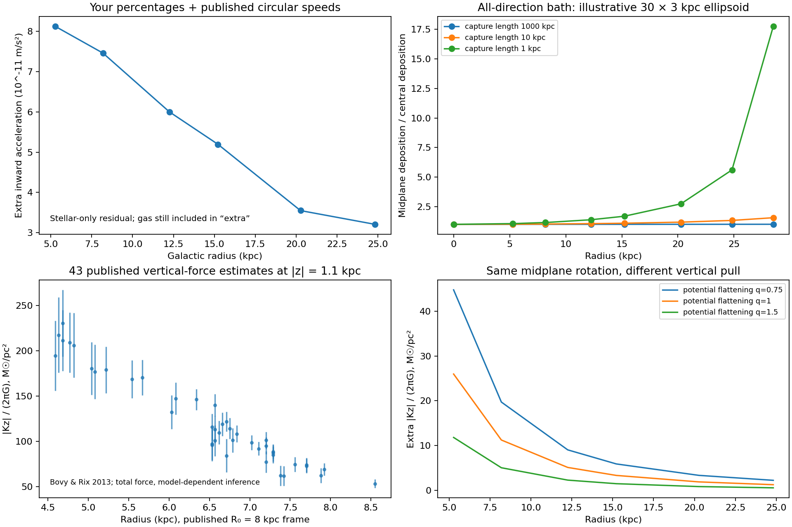

# Milky Way deposition: radial and vertical tests

The Milky Way provides a useful local test of the companion hypothesis. This diagnostic imports 38 published circular-speed bins and 43 published vertical-force estimates, recalculates the six user-supplied speed-excess rows, and evaluates 48 all-direction capture cases. **It has not fitted a companion-generated gravitational field to those 81 published estimates.** The capture kernel, supported deposit distribution, and baryonic subtraction still need to be connected before that claim is possible.

## What the quoted radial trend actually says

All six quoted radii occur in [Eilers et al., Table 1](https://arxiv.org/html/1810.09466). Matching radii identifies a suitable circular-speed table, but does not recover the original stellar mass model. We reconstruct the stellar speed implied by each rounded percentage; this is a conditional interpretation of the user's table, not a new independent measurement.

**Known circular-orbit mechanics**, assuming the same radius and ordinary weak-field gravity:

\[
g_R=\frac{v_c^2}{R},\qquad
g_{\rm extra}=\frac{v_c^2-v_b^2}{R},\qquad
v_b^2=v_\star^2+v_{\rm gas}^2+\cdots.
\]

Individual component radial contributions are signed: an exterior ring can pull outward. The familiar squared-speed decomposition is appropriate where the stated component contributes an inward circular-speed term. Use potentials for the full disk calculation.

**Conditional algebra using the user's stellar-only baseline:** for fractional excess p, v_star=v_c/(1+p) and g_extra/g_star=(1+p)^2-1. The following residual still contains omitted gas and any stellar-model errors.

| R (kpc) | Quoted speed excess | Extra pull / stellar pull | Extra inward acceleration (10^-11 m/s²) |
|---|---:|---:|---:|
| 5.27 | 16% | 34.6% | 8.13 |
| 8.19 | 25% | 56.3% | 7.46 |
| 12.25 | 36% | 85.0% | 6.00 |
| 15.22 | 44% | 107.4% | 5.19 |
| 20.27 | 50% | 125.0% | 3.55 |
| 24.82 | 63% | 165.7% | 3.21 |

**The percentage excess rises while the inferred extra acceleration falls.** The outer value is about 39% of the inner value. Thus the percentage trend is not proof that capture per unit volume increases outward. Gravity at a star depends on deposits throughout the galaxy, not just at that star's location. Under ordinary Newtonian gravity, a spherical outer shell produces no interior acceleration; an exterior disk ring can pull an interior star outward. Edge storage alone is not sufficient to explain faster interior circular motion.

**Empirical fits, not new laws:** the user's quoted nine-point fit is p_percent=5.78+2.36 R. Only six rounded rows are available here. Their own unweighted fit is 5.9932+2.3023 R, R²=0.98373, RMS=1.987 percentage points. These do not reproduce or contradict a fit to the missing nine-point table. Neither fit supplies observational uncertainties or a microscopic capture law. Do not extrapolate to the bulge, outside this interval, or other galaxies.

## Capture from every direction

**Known transport mathematics applied to a proposed companion sector:** let I_c(x,n,t) be companion energy intensity in direction n, j_c the directional source, and beta the capture probability per length. In a straight-ray, no-scattering approximation with speed c,

\[
\frac1c\partial_t I_c+\mathbf n\cdot\nabla I_c=j_c-\beta I_c,
\qquad Q_{\rm cap}(\mathbf x)=\beta(\mathbf x)\int I_c(\mathbf x,\mathbf n)\,d\Omega.
\]

Energy transferred from photons supplies j_c; it is not a second independently created source. The angular integral must include light from the disk and bulge as well as any external boundary bath. Directional capture or focusing would replace this scalar straight-ray approximation with a specified kernel and propagation law.

For steady external illumination, define the optical depth back to the boundary as tau=integral beta ds. Then I_c=I_boundary exp(-tau). This is ordinary absorption mathematics, not unique to this project. **The proposed physics is the identity of the companions and the rule setting beta, not the exponential.** No measured value of beta has been obtained.

For this executed control only, use a uniform isotropic bath, constant beta inside the ellipsoid R²/a²+z²/h²<1, and zero beta outside. Set a=30 kpc, h=3 kpc. These are illustrative geometry choices, not a measured Milky Way capture boundary. Backtracking a ray x-s n gives

\[
A s^2-2Bs+C=0,\quad
A=(n_x^2+n_y^2)/a^2+n_z^2/h^2,
\quad B=\mathbf x^T\!\operatorname{diag}(a^{-2},a^{-2},h^{-2})\mathbf n,
\quad C=R^2/a^2+z^2/h^2-1,
\]
\[
s=(B+\sqrt{B^2-AC})/A,\qquad
\frac{Q_{\rm cap}}{4\pi\beta I_{\rm boundary}}
=\frac{1}{4\pi}\int e^{-\beta s}\,d\Omega.
\]

These are geometric deductions, not a first-principles interaction. This control isolates shielding: it does not impose the stronger-well capture preference yet.

| Illustrative capture length 1/beta | Midplane deposition at 24.82 / 5.27 kpc | Near-face / midplane deposition at solar radius |
|---|---:|---:|
| 1,000 kpc | 1.003 | 1.001 |
| 10 kpc | 1.317 | 1.227 |
| 1 kpc | 5.288 | 19.389 |

“Near-face” means z=0.9 times the local ellipsoid half-height, not a fixed stellar height. Strong absorption can create an outer enhancement, but also a much stronger enhancement toward the upper and lower faces. For the 1 kpc case, about 83.5% of midplane capture at solar radius comes from directions with |n_z|>0.7, compared with 30% in an unattenuated isotropic angular field. The disk faces matter. This result supports investigating your top-down suggestion, but does not show that the resulting gravity fits the Galaxy.

Deposited power per volume, per annulus, and gravitational acceleration are different quantities. Larger annuli have more area even if the local capture density is constant. None of these normalized shape calculations establishes the available source energy; that budget remains deferred by user instruction.

## Turning capture into a gravity prediction

**Proposed storage assumption and known conservation structure:**

\[
\partial_t u_d+\nabla\cdot\mathbf F_d=Q_{\rm cap}-L_d.
\]

Permanent deposits set L_d=0, but do not by themselves set the deposit flux F_d to zero. Migration, orbital support, pressure, and capture recoil must be specified. Only if deposits remain stationary and illumination is steady for T can one infer u_d=T Q_cap. Setting rho_d=u_d/c² and using Poisson gravity is a conditional cold, nonrelativistic deposit approximation. It is not automatically valid for a trapped radiation field or an altered-gravity sector. Binding energy, pressure, driver energy and emitted-source mass changes must be included in a full account.

**Known Newtonian field relations, used as the first comparison:**

\[
\nabla^2\Phi=4\pi G(\rho_b+\rho_d),\quad
v_c^2(R)=R\partial_R\Phi(R,0),\quad K_z=-\partial_z\Phi.
\]

Both orbital speeds and vertical pull must follow from the same Phi. In axisymmetry, writing g_R=-partial_R Phi,

\[
4\pi G\rho=-\frac1R\partial_R(Rg_R)-\partial_z K_z.
\]

This equation explains why a map of both components helps recover where the gravitating material resides. One height alone does not supply the vertical derivative; multiple heights are needed. If gravity is modified, replace this field equation explicitly and derive both components again. Do not fit separate unexplained multipliers to the radial and vertical forces.

**Concrete demonstration using an existing potential family:**

\[
\Phi_d=\tfrac12v_0^2\ln[(r_c^2+R^2+z^2/q^2)/r_c^2],
\quad v_d^2(R,0)=\frac{v_0^2R^2}{r_c^2+R^2},
\quad |K_{z,d}|=\frac{v_0^2|z|}{q^2(r_c^2+R^2+z^2/q^2)}.
\]

This is the [known flattened logarithmic potential](https://docs.galpy.org/en/latest/reference/potentialloghalo.html), used only to demonstrate ambiguity. Its conventional name does not assign dark matter as the source here. It is not our proposed new law or the computed product of the ellipsoid capture model. The chosen q values have nonnegative Newtonian source density; the infinite model needs an outer completion and is not a finite-mass galaxy.

With core radius 1 kpc and one normalization to the user's solar-radius stellar-only residual, q=0.75, 1 and 1.5 all give the same midplane radial force at every radius. At R=8.19 kpc and |z|=1.1 kpc their extra |K_z|/(2piG) values are respectively **19.72, 11.24 and 5.05 solar masses per square parsec**. The vertical pull differs by nearly a factor of four despite identical rotation. These are predictions of an illustrative shape family, not fits to the vertical data. Do not compare them to total measured K_z without adding the baryonic contribution.

In plain language: stars circling the center measure the sideways pull; stars moving above and below the disk measure its thickness and vertical distribution. The two measurements can rule out storage shapes that either one alone permits. “Top-down illumination” describes where incoming energy travels; “vertical gravity” describes the force of the entire final distribution. They are related through the model, not interchangeable.

## Data status and assumptions

* **Imported rotation:** Eilers et al. Table 1, 38 bins, 5.27–24.82 kpc. Retain total circular-speed estimates and their published asymmetric statistical errors; do not import the paper's fitted dark matter decomposition. Axisymmetry, tracer distributions, distances and equilibrium enter the Jeans inference, and reported systematics are not represented by the tiny statistical bars alone. The inner barred region is outside this measurement's adopted scope. [Primary paper](https://arxiv.org/html/1810.09466).
* **Imported vertical comparison, provisional:** Bovy & Rix Table 3, 43 abundance-selected populations, R=4.59–8.55 kpc, |z|=1.1 kpc. Keep the force column separately from inferred surface density, and preserve their R0=8 kpc coordinate convention. Their inference used specified potential/distribution-function families, including a halo component. Therefore these compressed estimates are **not certified independent of the excluded dark-matter modeling assumptions**. They are a diagnostic comparison pending a tracer-level refit; no DM density posterior is adopted as fact. Shared systematics/covariances are not supplied by treating rows as independent. [Primary paper](https://arxiv.org/html/1309.0809).
* **Located, not downloaded/refitted:** the authors' [SEGUE data release](https://zenodo.org/records/211326) provides a route to the original stellar sample. A new likelihood must retain its selection function and measurement errors.
* **Modern extension needed:** Gaia phase-space structure shows departures from simple equilibrium. Include perturbation/selection checks before interpreting vertical structure as deposited companions. [Gaia DR3 phase-spiral analysis](https://arxiv.org/abs/2407.04286). The present diagnostic does not claim to use all Gaia stars or all current Milky Way measurements.
* **Missing stellar-only baseline:** retrieve the original mass model, gas distribution, and missing three rows before promoting the user's percentages into a likelihood. Matching the tabulated radii is insufficient provenance for the percentages.

## Solar neighborhood versus the Solar System

This calculation concerns the Sun's neighborhood in the Galaxy. A broad Galactic field accelerates the Sun and nearby planets together. Planetary orbits mainly constrain the small difference across the Solar System, plus any deposits actually bound to it. **Known tidal scaling** gives a_Gal,tide/a_Sun of order (v_c/R0)^2 r^3/(GM_Sun): about 2.1e-17 at 1 AU and 2.1e-11 at 100 AU for the adopted circular speed. This is an order-of-magnitude Galactic contribution, not a full tidal tensor or a fitted planetary bound. Compact solar capture must be separately calculated; the Galactic 56% stellar-baseline excess cannot be added to the Sun's central force.

## Executable next goals and outcomes

1. **Recover ordinary matter:** obtain disk/bulge stellar mass, gas profiles, uncertainties and the original percentage-table calculation. Outcome: a reproducible baryonic potential with radial and vertical forces. Otherwise missing gas could be falsely counted as companion gravity.
2. **Build the actual incident field:** integrate the measured disk/bulge emissivity and a declared external companion boundary intensity, using the existing photon conversion law. Outcome: I_c(R,z,n) with energy provenance. Otherwise “from every direction” remains an arbitrary supply assumption.
3. **Freeze one capture rule:** specify beta from the selected binding interaction and common environmental variables, with units, zero-void-capture behavior and momentum accounting. A constant-beta ellipsoid is the executed control, not the adopted physical rule. Outcome: one rule predicting capture throughout the Galaxy, rather than one fitted rate per radius.
4. **Evolve and support deposits:** solve storage/migration and the same gravitational field. Outcome: rho_d or the replacement stress/field source plus both predicted forces. Otherwise a capture map is being mistaken for a stable mass map.
5. **Fit radial data, predict vertical data:** freeze baryonic priors, capture parameters, coordinate conventions, selection and systematic treatment. Fit the allowed radial calibration set; evaluate vertical and held-out radial constraints without retuning. Refit raw vertical tracers when the published compressed inference depends on excluded assumptions. Outcome: residuals and uncertainty intervals for both directions, not a single R².
6. **Extend spatial coverage:** use stars at several heights and azimuths, then bar/bulge, outer disk, streams and disk flaring with appropriate dynamics. Outcome: distinguish round storage, a thick layer, a thin layer, and surface capture. Add Solar System and lensing tests of the same field; a Milky Way morphology success cannot establish cluster lensing by itself.

No source-budget pass, microscopic derivation, fully fitted Galaxy or uniqueness claim follows from this diagnostic. The established advance is a concrete all-direction capture calculation, an interpretation of the user's radial trend, and a paired radial/vertical test that can constrain the storage geometry.

## Reproduction and checks

Run `python research_work/results/milky-way-capture/run.py` from the repository root. Inputs are in [inputs.json](inputs.json), all computed rows in [results.json](results.json), and formulas in [run.py](run.py). HTML source hashes and source table identities are stored with the inputs; the full source papers are not redistributed. Six-point arithmetic, the transparent limit, exact spherical-center attenuation, reflection symmetry, radius-column consistency, positive intensities, and common radial forces were checked. Doubling angular quadrature changed the 48 intensity values by at most 1.96e-5 relative. This numerical convergence is not astrophysical accuracy. The figure was visually inspected. The previous paper PDF remains versioned separately; this report is a post-draft research update.
