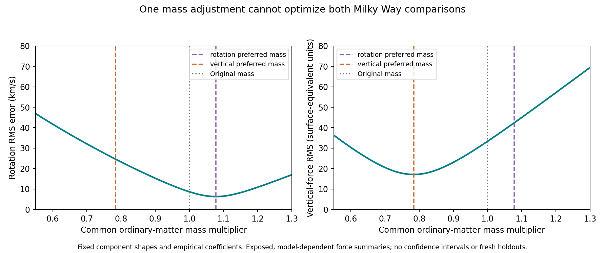

# Can one ordinary-matter mass adjustment repair the radial/vertical mismatch?

**The two comparisons favor opposite mass adjustments in the tested field model.** With component shapes and the empirical extra-gravity coefficients fixed, rotation RMS is minimized by increasing all ordinary masses by 7.78%; vertical-force RMS is minimized by decreasing them by 21.62%. The latter makes the rotation prediction substantially worse.

This is a nuisance-parameter sensitivity test on previously exposed, model-dependent Milky Way force summaries. It is not a fresh holdout, a full Galactic mass-uncertainty analysis, a confidence interval, or an exclusion of every ordinary-matter model or companion field.

| Calibration | Common ordinary-mass multiplier | Rotation RMS (km/s) | Vertical RMS (surface-equivalent solar masses/pc²) |
|---|---:|---:|---:|
| Original fixed mass | 1.00000 | 8.61 | 33.31 |
| Minimize rotation RMS | 1.07775 | **6.26** | 42.33 |
| Minimize vertical RMS | 0.78383 | 24.59 | **17.07** |
| Minimize equal-observable log score | 0.77145 | 25.66 | 17.15 |

At the rotation-selected mass, median vertical pull is 34.9% high. At the vertical-selected mass, median rotation speed is 11.4% low. Thus an overall mass-calibration change trades one discrepancy for another under this fixed geometry.



## Scope of the changed parameter

We scale **all ordinary-matter components together** by lambda: stellar disk, bar, nuclei, gas and central component. Their spatial shapes stay fixed. This tests the specific question of an overall normalization error; it is not a claim that these masses share one observational uncertainty or that the full search interval 0.3–2.0 is astrophysically allowed. Independent stellar mass-to-light ratios, gas calibration, thickness, scale length, bar shape, distance-frame parameters and orbital populations remain separate uncertainties.

The underlying force model is the [preceding conservative completion](../conservative-field-completion/report.md). Its extra response is based on the archived empirical exponent p=0.4624587420104399 and fixed A and a_star. No photon-loss coefficient, companion coupling or galaxy-specific extra-gravity coefficient is adjusted here.

## Exact scaling and formula provenance

**Known Newtonian linearity and a conditional algebraic consequence of the chosen power law; not a new fundamental formula:**

```
rho_b -> lambda rho_b
gradient Phi_b -> lambda gradient Phi_b
B_extra = A (|gradient Phi_b|/a_star)^(p-1) gradient Phi_b
B_extra(lambda) = lambda^p B_extra(1).
```

The Poisson solve used in the known [QUMOND-style construction](https://arxiv.org/abs/0911.5464) is linear in the divergence of B_extra. With the same homogeneous boundary prescription, its extra acceleration therefore scales in the same way:

```
a_total(lambda) = lambda a_b + lambda^p a_extra.
```

For these equatorial rotation and off-plane vertical rows, the ordinary and extra components both point inward/toward the plane. This sign condition is checked against a direct field solution. Hence the observable scaling is

```
v_c^2(lambda) = lambda v_b^2 + lambda^p [v_total^2(1)-v_b^2]
K_z(lambda) = lambda K_z,b + lambda^p [K_z,total(1)-K_z,b].
```

The vertical K_z values use the preceding report's surface-equivalent acceleration units. They are not directly counted deposited masses. Absolute values alone would not justify this formula if the acceleration components reversed direction; the direct check prevents that ambiguity here.

This exact homogeneity avoids refitting or re-solving the field at every trial mass. It applies to a common rescaling of the ordinary source, not arbitrary changes in shape, an external field held fixed, a different response law, or independent rescalings of separate components.

## Fitting and checks

The script separately minimizes rotation mean-squared residual, vertical mean-squared residual, and the following **chosen descriptive score using known logarithmic error mathematics**:

```
S = 0.5 mean_rotation[ln(predicted/observed)^2]
  + 0.5 mean_vertical[ln(predicted/observed)^2].
```

This gives the two observables equal weight irrespective of row count. It is not a likelihood: measurement uncertainties, correlations and model systematics are absent. Its optimum need not lie between the optima for absolute RMS, because relative errors weight low-force observations differently. The joint score falls from 0.04805 to 0.02175 while rotation becomes worse; quoting only the score improvement would hide the tradeoff.

All fits use the same 38 rotation and 43 vertical rows already evaluated in the parent work. Evaluating one fitted setting against the other observable is a cross-observable diagnostic, not a newly blinded validation exercise. The search bounds are fixed at 0.3–2.0, with no optimum at a boundary. A separate 1,701-point scan checks each scalar optimizer. Lambda=1 reproduces the archived RMS values within 1e-10.

For an independent check of the shortcut, `verify_direct.py` builds the ordinary field, multiplies it by 0.8, and performs a fresh refined Poisson-response solve. Direct predictions agree with the homogeneity calculation within 1.71e-12 km/s for rotation and 5.12e-13 vertical units. The parent solver's recorded hash remains unchanged. Both ordinary and extra force signs are explicitly checked.

For diagnosis only, `row-mass-diagnostics.json` records the mass multiplier each individual row would require for exact agreement. Their medians are 1.0859 for rotation and 0.7432 for vertical. **These individual values are not adopted as model parameters.** Allowing a separate normalization at every radius would defeat the shared prediction we are testing.

## Consequence for the research program

We should not dismiss the vertical discrepancy merely as an overall error in the ordinary mass estimate. This simplest normalization adjustment is insufficient in the tested geometry. It also does not justify immediately blaming the companion mechanism: separate component masses, shapes, orbital selection and the provenance of the inferred forces still need treatment.

A physically specified deposit geometry must predict a compatible radial and vertical field under a common ordinary-matter model. The full stellar catalog analysis remains the route to a less model-dependent test, with matched populations, distance/astrometry likelihoods, survey selection and orbital distributions. None of those requirements is replaced by a mass rescaling. Photon origin, spectral/event stretching and the conversion to stored field states remain open independently.

Reproduce with `python research_work/results/milky-way-mass-response/run.py`, `python research_work/results/milky-way-mass-response/verify_direct.py`, and `python research_work/results/milky-way-mass-response/plot.py`.
