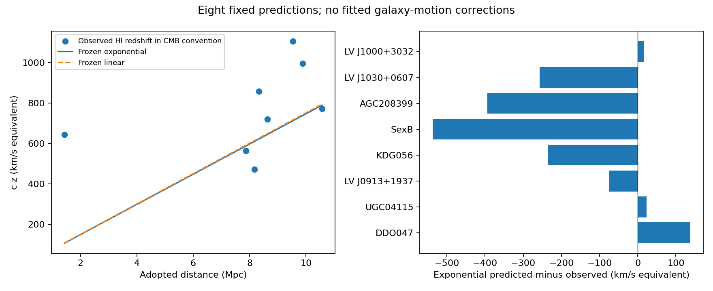

# Eight-galaxy cross-catalog redshift test with frozen formulas

**The existing exponential distance rule does not outperform the frozen linear control on this eight-galaxy comparison.** RMS residuals are 271.88 versus 270.11 km/s, respectively. This is an executed conditional prediction test with no retuning, not a certified independent validation sample or evidence that either rule explains the galaxies' individual motions.

## What was fixed before scoring

Commit **427fa9f** freezes the eight identities, numerical input hashes, both model coefficients, frame conversion and complete evaluation program before the selected distances and velocities were extracted for scoring. Selection uses the latest 24-pending-target registry and the previously documented explicit AGC/UGC radio identity support. Every selected target has a unique supported class-1 match and a TRGB or SBF distance. The corrected Haynes ALFALFA catalog also confirms class 1 and an optical counterpart for all eight before evaluation.

This intentionally uses directly documented ALFALFA velocities, not an assumption that we have reconstructed the ELVES authors' exact historical SIMBAD velocity choice. Positions agree within the predeclared 30-arcsec radius. No residual-based exclusion, alternate source choice, galaxy-specific velocity or new rate is fitted. These galaxies' group, selection and historical-distance independence are not certified, so the result must not be promoted as a wholly fresh blind test.

The ELVES publisher's adopted TRGB/SBF distances are retained as stipulated observational inputs. ALFALFA's flow-model distances and inferred masses are not imported. The two fixed prediction laws are

`z_predicted = exp(alpha*D) - 1`, with alpha=0.0002488993286382367 per Mpc,

and the historical training-fitted linear control `z_predicted = beta*D`, with beta recorded in protocol.json. The exponential accumulation and linear approximation are established mathematical forms, not unique equations invented by this project. The physical interpretation of alpha as photon-to-companion conversion remains hypothetical and unproved.

## Measurement convention

The source velocity is the heliocentric optical-convention HI-profile midpoint from the corrected Haynes catalog. We use `z_helio = Vhel/c`, followed by the frozen exact spectral-frame factor `1+z_CMB = (1+z_helio)*F`. This frame label is a comparison convention, not an imported expansion or Big-Bang explanation. An already CMB-corrected value is not corrected twice.

The tabulated statistical center uncertainty is half the source's width error. It is not the uncertainty in a galaxy's independent motion or the complete redshift model. The reported residual is `c*(predicted_z-observed_z)`, a convenient redshift-equivalent unit. It is not a fitted peculiar velocity or a direct velocity measurement in the CMB frame.

## Per-galaxy results

T means TRGB and S means SBF. The last three columns use redshift-equivalent km/s. All eight objects are retained.

| Galaxy | Distance method | Adopted distance (Mpc) | Observed c*z_CMB | Exponential predicted c*z | Predicted minus observed |
|---|---|---:|---:|---:|---:|
| DDO047 | T | 8.170 | 472.3 | 610.3 | +138.0 |
| UGC04115 | T | 7.870 | 564.9 | 587.8 | +23.0 |
| LV J0913+1937 | T | 8.630 | 719.3 | 644.6 | -74.7 |
| KDG056 | S | 8.327 | 858.0 | 622.0 | -236.0 |
| SexB | T | 1.430 | 644.1 | 106.7 | -537.4 |
| AGC208399 | S | 9.540 | 1106.6 | 712.7 | -393.9 |
| LV J1030+0607 | S | 9.875 | 995.4 | 737.8 | -257.6 |
| LV J1000+3032 | T | 10.570 | 772.8 | 789.8 | +16.9 |

| Frozen rule | RMS residual (km/s) | Mean absolute residual (km/s) | Mean residual (km/s) |
|---|---:|---:|---:|
| Exponential | 271.88 | 209.66 | -165.21 |
| Linear | 270.11 | 208.99 | -161.38 |

Five TRGB objects have exponential RMS 250.68 km/s; the three SBF objects have RMS 303.96 km/s. Those tiny method subsets do not support a robust calibration comparison. Seven of eight distances fall below the original 10.20-93.20 Mpc calibration interval; only LV J1000+3032 is within it. All frame corrections here are positive, reflecting a nonuniform set of sight lines rather than an isotropic independent sample.

The largest discrepancy is Sextans B. It is not dropped or assigned an inferred motion to improve the score. Near galaxies can have substantial motions compared with a distance-based redshift contribution, but this experiment does not measure or predict those motions. The current conversion formula alone therefore does not reproduce every observed redshift in this sample.

The two frozen predictions differ by less than 5 redshift-equivalent km/s for every object, far below their residual scatter. This is a weak distance range for distinguishing exponential curvature from a linear trend. The 1.77 km/s RMS difference is not assigned statistical significance. We lack a full correlated-motion, distance-calibration, environmental and survey-selection likelihood and therefore do not turn measurement-error-only ratios into sigma-level claims.

## Exposure record and limits

These eight outcomes are now exposed and cannot be reused as fresh validation after tuning. Of the original 29 staged candidates, five remain previously excluded, eight have now been evaluated in this conditional cross-catalog test, and 16 remain unscored by it. None is newly certified independent. The historical audit files are preserved; exposure-update.json records this newer state.

During pre-evaluation header inspection, the first 65 lines of the ELVES source were displayed, including some data rows. The exact object names are recorded in protocol.json. None is among the eight selected objects. This exposure still matters for other pending targets and is not erased by the later freeze. Broader prior galaxy-distance or dynamical exposure may remain even for these eight.

The result tests the common descriptive law beyond its original distance domain; it does not validate the photon receiver, time mechanism, companion energy retention, capture, bulge dynamics or lensing. Those open physical requirements cannot be solved by fitting an object-specific correction to this table. The total photon-supply budget remains deferred. The final Cepheid test role remains unopened.

## Reproduction and verification

The frozen evaluate.py verifies input hashes before extracting only the selected eight outcomes, checks counterpart positions and evaluates both unchanged formulas. verify.py independently reconstructs the metrics and prediction/frame conversions. Raw publisher tables remain in the ignored data cache; their URLs and hashes, exact identities, code and per-object predictions preserve the audit trail. prepare.py refuses to overwrite the protocol. Re-run evaluate.py, report.py and verify.py with the frozen inputs.

## Sources

- [ELVES-Field paper](https://arxiv.org/abs/2602.16766) and [publisher table](https://content.cld.iop.org/journals/0004-637X/1001/2/244/revision1/apjae4c5ct1_mrt.txt): adopted distances and methods.
- [Corrected Haynes ALFALFA catalog documentation](https://cdsarc.cds.unistra.fr/viz-bin/ReadMe/J/ApJ/861/49?format=html&tex=true): identifiers, heliocentric HI midpoint velocities and detection classes.
- [Haynes source paper](https://wiki.physics.wisc.edu/ObsCos/images/2/24/Haynes_ALFALFA_Source_Catalog_ApJ_2018.pdf): optical velocity convention and statistical center-error definition.
- [Prior source-provenance audit](../redshift-priority/elves-velocity-metadata-report.md) and [latest prior quarantine decisions](../redshift-priority/elves-quarantine-screen-report.md): identity support and the limits of freshness claims.
