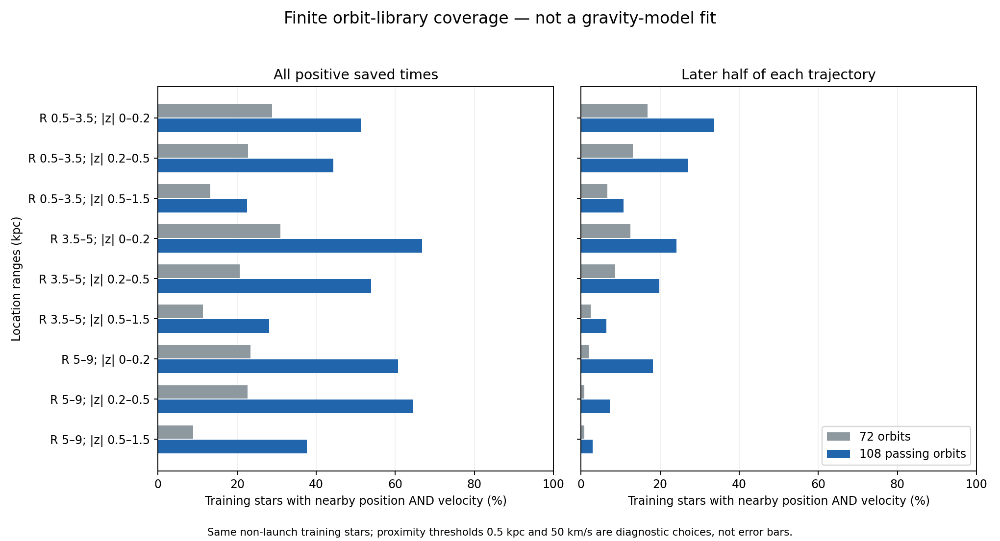

# Expanded training orbit library

The library now contains 108 numerically passing paths: the original 72 plus 36 of 36 proposed additions. This improves the representation of the existing empirical extra-potential candidate. It is not a fitted stellar population, a new gravity law, or an independent observation confirming companions.

## What was done and why

A fixed prospective rule selected four populated missing starting-state neighborhoods in each of nine radius/absolute-height cells. The rule used only existing training data, a 0.5-kpc spatial neighborhood and a 50-km/s velocity neighborhood. It selected by missing library coverage, not by gravity residual. All 36 starts passed the existing association-window screen; none carried the existing distance-disagreement flag. This does not prove every distance or association correct. No actual-epoch association requery was performed for these new starts.

Each trajectory covers approximately 244 million years in the unchanged rotating full-bar potential. The propagation and extra-force refinement thresholds were retained. The old paths and their documented limitations were not rewritten. Every original and newly proposed launch star is excluded from the comparison, including any proposed path that fails; t=0 samples are excluded too. The resulting target sample is identical for the old and expanded libraries.

## Numerical checks

- Successive-tolerance trajectory and Jacobi checks passed for 36/36 new paths.
- Sampled-path extra-force refinement passed for 36/36; largest relative difference was 0.3889% against the unchanged 1% threshold.
- The old-library coverage was reproduced exactly on the shared evaluation sample. Twelve exhaustive neighbor-search controls checked the expanded result. Nested distance thresholds and reduced time sampling obey the expected inclusion relations.

## Coverage on the same training stars

There are 27,606 eligible non-launch targets. The percentages below describe proximity to at least one saved orbit state; they are not percentages of stars explained by the theory.

| Saved-time choice | Old covered | Expanded covered | Old fraction | Expanded fraction |
|---|---:|---:|---:|---:|
| all positive | 4,663 | 13,942 | 16.89% | 50.50% |
| half sampling | 4,518 | 13,726 | 16.37% | 49.72% |
| late half | 542 | 2,360 | 1.96% | 8.55% |

All-positive times run from about 0.49 to 244 Myr; late-half times run from about 123 to 244 Myr. Half sampling keeps every second positive saved time. The late-half comparison checks whether coverage persists away from the initial launch; it does not prove stationary orbit occupations.

The later-half coverage is only 8.55%, compared with 49.72% when the same number of saved times is spread across the whole integration. The difference therefore cannot be attributed just to having fewer saved states. Much of the present coverage depends on the early trajectory segments. This is a reason to improve duration and orbital-phase sampling before fitting a stationary population, not evidence that the stars or gravity field themselves change this way. The dominant missing high-|z| 5–9-kpc population has only 2.88% late-half coverage. These findings prevent treating the larger library as ready for a decisive bulge/disk gravity test.

| R (kpc) | Absolute height (kpc) | Targets | Old coverage | Expanded coverage | Expanded, late half |
|---|---|---:|---:|---:|---:|
| 0.5–3.5 | 0–0.2 | 232 | 28.88% | 51.29% | 33.62% |
| 0.5–3.5 | 0.2–0.5 | 778 | 22.75% | 44.34% | 27.12% |
| 0.5–3.5 | 0.5–1.5 | 524 | 13.17% | 22.52% | 10.69% |
| 3.5–5 | 0–0.2 | 455 | 30.99% | 66.81% | 24.18% |
| 3.5–5 | 0.2–0.5 | 460 | 20.65% | 53.91% | 19.78% |
| 3.5–5 | 0.5–1.5 | 670 | 11.34% | 28.06% | 6.42% |
| 5–9 | 0–0.2 | 4,379 | 23.43% | 60.72% | 18.18% |
| 5–9 | 0.2–0.5 | 8,910 | 22.67% | 64.52% | 7.33% |
| 5–9 | 0.5–1.5 | 11,198 | 8.86% | 37.61% | 2.88% |

Signed-height breakdowns and all nine distance/velocity threshold combinations are retained in results.json. The main table combines above/below only for readability; a future likelihood must retain signed height and bar position.

## Scientific interpretation and next requirements

This is adaptive training-library development, not a holdout. The selected starting states depend on training motions and the existing candidate library, so improvement cannot be presented as predictive validation. Numerical trajectory accuracy also does not establish a stationary stellar population. The earlier long-duration failures and occupation-variation findings still apply; no relaxation of their thresholds is implied.

The original 72 paths include distance-flagged and far-outward paths, and their documented unresolved issues remain. These additions do not resolve survey selection, posterior-distance prior recycling, mass-model uncertainty, or the complete velocity-distribution likelihood. The nine cells concern the selected chemically restricted 0.5–9-kpc sample, not all Milky Way stars or the 20–25-kpc outer rotation curve.

Before interpreting a bulge/disk discrepancy as companion gravity, construct equivalent ordinary-matter orbit coverage and develop the shared population/error/selection model; establish adequate duration and occupation sampling. Keep gravity parameters frozen during this readiness step. The same fitted spatial potential must predict radial, rotational and vertical motions together. The present potential is an empirical response built with known conservative-field mathematics; its photon production/capture origin is still underived.

The broader goal remains open: propagation must jointly explain spectral redshift, whole-event timing and endpoint clocks; companion transport must conserve physical energy and momentum; deposits need capture, retention and spatial support; one response must survive joint stellar and lensing tests. The failed relativistic stress check in the separate reservoir candidate remains a failure. The total photon-supply budget remains deferred, not passed. Adding orbits does not solve these physical requirements.

No validation or final-test observations were opened or scored.
