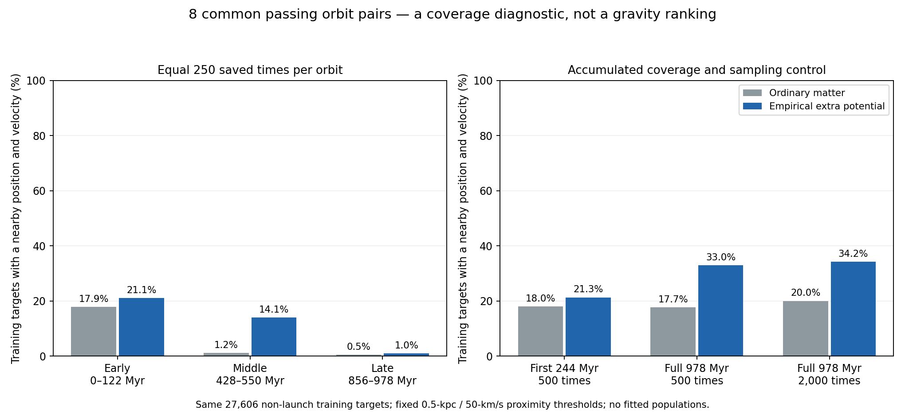

# Paired long-duration orbit diagnostics

Longer integration helps cumulative coverage but does not solve the late-window representation problem. For the eight common passing pairs, the candidate covers 21.31% of targets over the first 244 Myr and 33.03% over 978 Myr at the same 500 saved times per orbit. Yet coverage during the last equal-size window is only 1.02% for the candidate and 0.49% for ordinary matter. This is evidence that duration alone has not produced a reliable population representation; it is not a comparison of gravitational likelihoods.

This calculation tests whether longer integrations improve the finite orbit representation needed for the bulge/disk comparison. Nine fixed training-derived starts were followed for approximately 978 million years under both ordinary-matter gravity and the existing empirical extra-potential candidate. The initial stars, ordinary-matter components, rotating frame, physical parameters and numerical gates are shared. No gravity parameter or stellar likelihood was fitted.

## Selection and numerical checks

The starts are expansion indices 0, 4, 8, 12, 16, 20, 24, 28 and 32: the first populated-gap launch in each of nine radius/absolute-height cells. Selection used the candidate library, so even a matched comparison of these starts is not neutral model selection. All passed the prior association-window screen and none carried the existing distance-disagreement flag; exact-epoch associations and distance likelihoods are not newly established.

| Model | Complete saved paths | Trajectory/Jacobi passes |
|---|---:|---:|
| ordinary | 9/9 | 8/9 |
| full | 9/9 | 8/9 |

The candidate extra-force refinement passed for 9/9 probes; its largest sampled relative difference was 0.3811% against the unchanged 1% threshold. Its first 244-Myr segment agreed with the archived short path within the existing position/velocity gates for 9/9 probes. Ordinary components are the same previously audited fields; this is not a new certification of their mass assumptions or discretization.

The common passing indices are [0, 8, 12, 16, 20, 24, 28, 32]. Excluded paired indices are [4]. Every attempt is retained. The common passing subset is selected on numerical reliability and cannot be treated as an unbiased stellar sample or used to rank gravity. Leaving an interpolation domain would be a computational limitation, not evidence of physical escape.

## Does coverage persist later in the journey?

The same 27,606 eligible training stars are used throughout, excluding all 108 original/expansion launch stars. A star is covered only if some saved state lies within both 0.5 kpc in position and 50 km/s in velocity. These thresholds are diagnostic choices, not measurement error bars. Coverage is not the fraction of stars explained by a gravitational theory. All initial-time samples are excluded.

| Time selection | Samples/orbit | Ordinary covered | Candidate covered | Ordinary fraction | Candidate fraction |
|---|---:|---:|---:|---:|---:|
| early equal250 | 250 | 4,945 | 5,813 | 17.91% | 21.06% |
| middle equal250 | 250 | 327 | 3,885 | 1.18% | 14.07% |
| late equal250 | 250 | 136 | 282 | 0.49% | 1.02% |
| first quarter500 | 500 | 4,971 | 5,883 | 18.01% | 21.31% |
| full history equal500 | 500 | 4,897 | 9,118 | 17.74% | 33.03% |
| full history2000 | 2000 | 5,527 | 9,434 | 20.02% | 34.17% |

The first three rows have equal numbers of saved states: roughly 0.49–122, 428–550 and 856–978 Myr. The last three distinguish adding physical duration from merely adding sample count. Full-history equal500 uses every fourth positive saved time; full-history2000 uses every positive saved time. A cumulative union can only gain coverage when points are added, so its increase alone is not evidence for stable orbital populations.

## Orbit occupation, with failures retained

Known statistical definition, not a new physical formula: TV = one half of the sum over bins of the absolute difference between the early and late time fractions. Zero means identical binned fractions; one means no overlap. The radius/signed-height/bar-angle bins are exactly those in the earlier duration audit. TV depends on those bins and is not a probability of model failure. Small values do not prove stationarity.

| Start | Model | Numerical pass | TV at 244 Myr | TV at 489 Myr | TV at 978 Myr | R/height-only TV at 978 Myr | Bar-angle range (turns) |
|---:|---|---|---:|---:|---:|---:|---:|
| 0 | ordinary | True | 0.456 | 0.268 | 0.326 | 0.049 | 6.358 |
| 0 | full | True | 0.064 | 0.092 | 0.268 | 0.079 | 8.403 |
| 4 | ordinary | False | 0.548 | 0.358 | 0.224 | 0.128 | 11.976 |
| 4 | full | False | 0.364 | 0.232 | 0.400 | 0.368 | 15.436 |
| 8 | ordinary | True | 0.908 | 0.792 | 0.370 | 0.222 | 2.428 |
| 8 | full | True | 0.424 | 0.312 | 0.160 | 0.067 | 5.737 |
| 12 | ordinary | True | 1.000 | 0.854 | 0.688 | 0.359 | 1.917 |
| 12 | full | True | 0.848 | 0.924 | 0.710 | 0.446 | 0.564 |
| 16 | ordinary | True | 0.984 | 0.818 | 0.188 | 0.036 | 0.398 |
| 16 | full | True | 0.808 | 0.850 | 0.441 | 0.103 | 2.043 |
| 20 | ordinary | True | 0.880 | 0.942 | 0.284 | 0.104 | 0.308 |
| 20 | full | True | 0.828 | 0.964 | 0.436 | 0.035 | 1.934 |
| 24 | ordinary | True | 0.968 | 0.960 | 0.406 | 0.126 | 5.147 |
| 24 | full | True | 0.924 | 0.808 | 0.373 | 0.131 | 2.422 |
| 28 | ordinary | True | 1.000 | 0.902 | 0.806 | 0.547 | 4.518 |
| 28 | full | True | 0.940 | 0.956 | 0.273 | 0.074 | 1.668 |
| 32 | ordinary | True | 0.948 | 0.958 | 0.839 | 0.580 | 4.610 |
| 32 | full | True | 0.932 | 1.000 | 0.513 | 0.218 | 1.897 |

Occupation values on rows marked False are descriptive outputs of unverified long paths; they cannot support precise dynamical conclusions. Bar-angle ranges use sampled unwrapped positions. Large ranges alone do not establish mixing, and restricted ranges can correspond to physical libration. Half-time occupation sensitivities, full integration attempts, signed-height coverage cells and source hashes are retained in the JSON results.

## Why a billion years is not automatically sufficient

Supplementary kinematic diagnosis added after the integrations began, without changing their selection: in the existing rotating frame, the known identity is d(phi_bar)/dt = (x v_y - y v_x)/R^2 - Omega_bar. If this instantaneous relative rate remained constant, a full relative turn would take 2 pi divided by its absolute value. This is a standard rotating-frame calculation, not a new formula from our theory or a measured return period. Real rates change along noncircular orbits.

| Start | Initial radius (kpc) | Initial relative angular rate (km/s/kpc) | Constant-rate full-turn timescale (Myr) |
|---:|---:|---:|---:|
| 0 | 3.367 | 12.799 | 480 |
| 4 | 1.185 | 11.193 | 549 |
| 8 | 2.845 | 29.774 | 206 |
| 12 | 4.613 | 13.698 | 448 |
| 16 | 4.749 | -3.414 | 1799 |
| 20 | 4.497 | 2.966 | 2072 |
| 24 | 8.838 | -11.391 | 539 |
| 28 | 7.888 | -8.541 | 719 |
| 32 | 8.296 | -10.228 | 601 |

Two initial rates imply relative-phase timescales longer than the integration. A star and the bar can move at nearly the same angular rate, so their relative position changes slowly even while the star moves rapidly around the Galaxy. This explains why a duration expressed only as years is not a universal phase-coverage criterion. These initial timescales do not establish an actual resonance, orbital period, capture mechanism or the duration required for statistical convergence.

## Scope and scientific consequences

These nine probes test duration and phase representation. They do not replace the 108-orbit library with a fitted population or provide equally complete libraries for both gravity models. Neither equal orbit weights nor a few observed launches specify the actual Galactic distribution of stars. The targets are the existing chemically restricted 0.5–9-kpc training sample; no claim extends this test to every Galactic population, the 20–25-kpc outer disk, or external galaxies.

A meaningful gravity comparison still needs a sufficiently sampled orbital population, the same population flexibility across models, justified ordinary-matter uncertainty, survey selection and a non-duplicated treatment of Gaia/StarHorse distance information. It must predict radial, rotational and vertical velocity distributions jointly before scoring reserved observations. The candidate field is an empirical conservative response, not a derived photon-deposition law.

The next methodological step is an orbit-population construction with a documented duration/phase-convergence criterion: determine whether its predicted spatial and velocity distributions remain stable when the integration window is lengthened or shifted. The present results do not justify selecting one common duration for all paths. A few favorable returning paths or additional cumulative samples must not stand in for that check.

The larger objective remains active. An acceptable nonexpanding photon/companion mechanism must also account for spectral redshift and event timing together, actual source/detector clocks, physical energy and momentum, capture and supported deposits, and lensing. The failed stress-energy gate in the separate reservoir construction remains unresolved; the cosmic photon supply remains deferred, not passed. No validation or final-test outcome was opened or scored.
