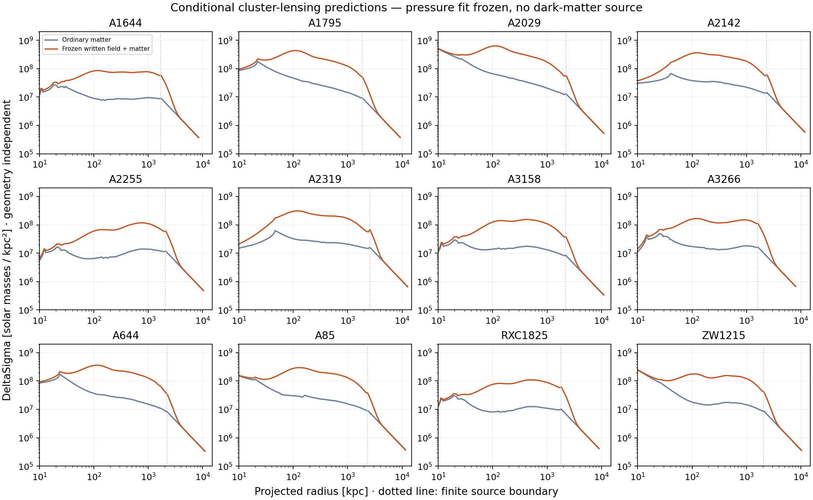
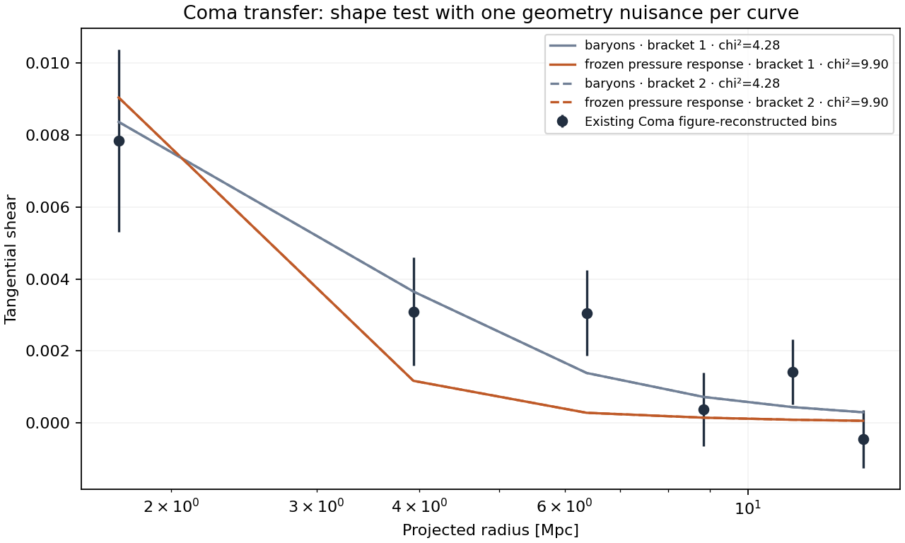

# Cluster lensing: executable, conditional, and still testable

Base `37dab06`; frozen pressure response; 12 X-COP sources; no dark-matter source.

Numerical gates: **PASS**. Archive/input integrity: **True**.

Protocol committed before execution: `7f92423`. This is CL-F1, a distinct follow-up;
the handover's unspecified six-item CL-2 stage 2 review was not available locally.
The working checkout is on `codex/cluster-lensing-forward`; the older machine
checkout at `C:/Users/henry/Documents/Codex/photon-graviton` was at `d4a5646`.
GitHub main and its cluster feature branch were both verified at `37dab06`.

**Fresh verification:** the new analytic gates pass; the independent 3D versus
projected bend differs by 4.69e-6. Source/projection refinement gives bend changes
4.14e-6 and 5.00e-6, and DeltaSigma changes 5.35e-4 and 2.53e-4 on A1795/A2319.
CL-1 and CL-2's targeted check jobs both pass and match their archives. The full
suite was not rerun; its known failed stage-8 gate is unchanged, and stage 9 remains
unrun. Python 3.13, NumPy 2.2.6 and SciPy 1.16.1 were used. All changed Python
files compile. Plot formatting was improved after the calculation without changing
`results.json`; its code hashes describe the calculation-time files.

The solver calculates physical deflection and DeltaSigma, then (when distances are supplied) convergence, shear, reduced shear, signed magnification, critical curves and point-source image positions. CSV files contain the full profiles.

The five footprint amplitudes come only from the archived pressure fit (8.55 chi² per pressure point). No lensing fit changes them. Negative effective field density is retained; it is a property of the potential, not added matter.

Geometry: Fictional static Euclidean demonstration; NOT the actual cluster distances.

D_l=200 Mpc, D_s=1000 Mpc, D_ls=800 Mpc. Source offset: 5 arcsec.

| Cluster | Tangential critical radii (arcsec) | Images found |
|---|---:|---:|
| A1644 | none in scan | 1 |
| A1795 | none in scan | 1 |
| A2029 | none in scan | 1 |
| A2142 | none in scan | 1 |
| A2255 | none in scan | 1 |
| A2319 | none in scan | 1 |
| A3158 | none in scan | 1 |
| A3266 | none in scan | 1 |
| A644 | none in scan | 1 |
| A85 | none in scan | 1 |
| RXC1825 | none in scan | 1 |
| ZW1215 | none in scan | 1 |

These angular results are conditional on the stated geometry. The search finds sign-bracketed roots; tangent roots and images outside the recorded radial range are not certified.



## Coma: frozen-response transfer

| Ordinary-matter bracket | Baryons-only shape chi² | Written-field shape chi² |
|---|---:|---:|
| 1 | 4.284 | 9.902 |
| 2 | 4.284 | 9.902 |

Six previously exposed, figure-reconstructed bins. Each curve fits one nonnegative inverse-critical-density nuisance; this tests shape only and does not establish absolute bending. No untouched observational holdout is available.



## What remains unresolved

The light rule has not been derived from a photon interaction. Photon supply, field-energy accounting and formation at these strengths remain open. CL-2 still fails the joint galaxy/lens/cluster test. X-COP optical profiles are predictions with finite source boundaries, spherical symmetry and no matched shear catalog. Below 10 kpc the input source is extrapolated. A cluster merger needs a nonspherical, evolving source calculation.

The existing finite footprints lose their additional deflection beyond the ordinary source plus their widths. More normalization cannot repair that outer-shape limitation. A creative successor must change how the photon-written field propagates or how light samples it, and must earn its energy budget rather than introduce an independent invisible mass profile.

## Reproduce

```sh
python research_work/results/path-memory/cluster_lensing_checks.py
python research_work/results/path-memory/run_cluster_lensing.py --demo-geometry
```

For adopted geometry, replace `--demo-geometry` with `--geometry-json path.json`; use `--cluster A1795` for a single cluster. Without a geometry flag, physical bend and surface-density diagnostics are exported without assigning angular predictions.
