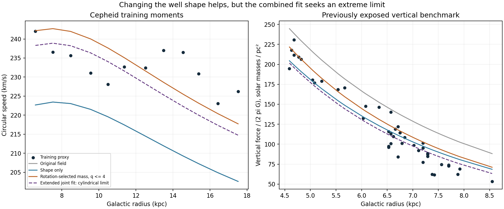

# Shared potential-shape and ordinary-mass response

**A shared change in well shape improves the vertical comparison, but this restricted family does not yield a satisfactory finite companion model.** The chosen joint loss keeps improving toward an added potential independent of height. That is a diagnostic limit, not a finite deposited source or evidence that the Galaxy has that geometry.

We fitted exposed data: twelve Cepheid training bins and 43 published vertical-force estimates. Reserved stellar outcomes remain unopened. This is exploratory parameter fitting after observing discrepancies, not a new holdout success.

| Case | Ordinary-matter multiplier lambda | Potential stretch q | Rotation RMS (km/s) | Vertical RMS (surface-equivalent units) |
|---|---:|---:|---:|---:|
| Original field | 1.0000 | 1.000 | 18.79 | 33.31 |
| Shape only | 1.0000 | 1.846 | 18.79 | 15.18 |
| Rotation-selected mass, original shape | 1.2260 | 1.000 | 7.00 | 60.32 |
| Rotation-selected mass, q <= 4 | 1.2260 | 4.000 | 7.00 | 16.50 |
| Joint fit, q <= 4 | 1.1113 | 4.000 | 11.10 | 15.00 |
| Extended joint fit: cylindrical limit | 1.1793 | infinite | 7.80 | 14.89 |

Vertical units are acceleration divided by `2 pi G`, expressed as equivalent solar masses per square parsec; they do not directly measure companion mass. Rotation and vertical RMS cannot be compared numerically as if they had the same units. The joint search minimizes the equal-observable mean squared logarithmic residual, an explicit balancing choice rather than a likelihood. No quoted measurement error, complete covariance, mass prior, or survey-selection posterior is included.

## Formula and provenance

**Hypothetical geometry extension, using known coordinate deformation and the chain rule:**

`Phi_total(R,z) = lambda Phi_b(R,z) + lambda^p Phi_c0(R,z/q)`

`a_R = lambda a_b,R(R,z) + lambda^p a_c0,R(R,z/q)`

`a_z = lambda a_b,z(R,z) + (lambda^p/q) a_c0,z(R,z/q)`

Here `Phi_c0` is the archived conservative completion of the project empirical acceleration relation and `p=0.4624587420` is unchanged. Lambda scales **all** ordinary components at fixed shape, including gas and central components. The `lambda^p` response follows the previously verified homogeneity of that completion. It is not an independently justified stellar-mass prior. The combined deformation is a new exploratory choice in this project, not a claim of new mathematical structure or a derivation from photon capture.

The q parameter stretches the existing additional potential in height. At `z=0`, it leaves the radial added force unchanged. At nonzero height it alters vertical pull. It is **not** generally the density axis ratio, nor an absolute potential axis ratio, since the original potential was already nonspherical. A scalar potential makes the force conservative; positive source density and physical formation do not follow automatically. The established distinction between deforming a potential and obtaining an admissible density is discussed by [Baes (2009)](https://academic.oup.com/mnras/article/392/4/1503/965081). We use that mathematical point, not the paper's cosmological or dark-matter assumptions.

## What the tests resolve

With ordinary matter fixed, a vertical stretch of about **1.85** reduces vertical RMS from **33.31 to 15.18**, while rotation remains at **18.79 km/s** discrepancy. This confirms that the two observed directions can respond differently to the well shape using a single conservative potential.

Fitting the common ordinary-matter normalization to Cepheid rotation selects **22.60 percent more ordinary mass** and reduces rotation RMS to **7.00 km/s**. Keeping the original shape then worsens vertical RMS to **60.32**. Stretching the added potential reduces this, but the restricted joint fit reaches `q=4`, the original search boundary. These are fitted values, not a finding that the additional ordinary mass exists or is observationally allowed.

We explicitly audited the boundary instead of treating `q=4` as a well-determined shape. Reparameterizing with `mu=1/q` permits the cylindrical limit `mu=0`. Under the chosen joint loss, the best retained case has **lambda=1.1793 and mu=0**, with RMS values **7.80 km/s and 14.89**. In that limit the added potential keeps its radial force but has zero vertical force at every finite height. A height-independent source is not an isolated finite galaxy reservoir. A finite realization would need an independently specified change of shape and an outer boundary; neither is supplied by this fit.

This behavior points to a real modeling requirement: we need to understand the ordinary-matter components and the spatial response of the proposed deposits together. Adding an adjustable shape can improve a graph without establishing the physical theory.

## A lower bound independent of the chosen shape

At the rotation-selected normalization, ordinary matter alone exceeds **27 of 43** published vertical estimates. If the companion contribution pulls toward the disk, it cannot reduce those values. The pointwise residual lower bound is

`minimum absolute residual_i >= max(lambda K_b,i - K_observed,i, 0)`.

This is elementary inequality reasoning, not a new gravity formula. It gives an unavoidable RMS lower bound of **10.75** surface-equivalent units for that normalization, even allowing an arbitrary nonnegative extra contribution at each row. That permissive bound need not correspond to a realizable common field. It is conditional on this ordinary-matter shape and these published inferences, not an exclusion of all mass models or all additional fields.

## Source and numerical checks

We reconstructed the additional field's effective Newtonian source through the known Poisson equation `rho_eff = Laplacian(Phi_c)/(4 pi G)`. For finite `q=1`, approximately `1.8465`, and `4`, no negative source values appeared on the **2,501-point grid** covering `0.5 <= R <= 30 kpc`, `0 <= z <= 10 kpc`. Differentiation steps of 0.004 and 0.002 kpc were compared. This is local numerical evidence only: it does not establish positivity between grid points, in the unresolved center, at large distances, or in the infinite-stretch limit. It also does not establish stable orbital support or a production mechanism. A signed effective Poisson source would have different implications for a geometric modified-field theory than for a positive deposited-mass interpretation.

Independent analytic potential tests check the deformation's gradient, Poisson derivative and closed-loop work. Stored prediction rows reproduce the reported metrics. The undeformed case reproduces the archived rotation and vertical scores. An independent **17,871-point parameter grid** does not beat the retained extended optimizer. Input hashes remain unchanged; no original field implementation or prior score was overwritten.

## Scope and next work

The vertical benchmark is a previously exposed, model-dependent inference from Bovy and Rix, with its original Galactic-potential assumptions retained as provenance. It is not a newly measured raw-star acceleration and is not adopted as assumption-free evidence in the fictional universe. Its relationship to the Cepheid and giant distance/coordinate conventions still requires a joint stellar-level likelihood. The Cepheid comparison uses approximate Jeans moments of 542 training stars, not a complete orbit-population fit.

The analysis supplies a target for a physical capture/storage law: it must produce the needed radial response while respecting vertical data and an admissible finite geometry. It does not explain how photons create that source. Redshift, event timing, lossless companion transport, permanent capture, lensing and conservation remain requirements of the full theory. The total photon-supply budget remains deferred, not passed.

Next, component-level ordinary-matter uncertainty and a finite source prescription are more meaningful than continuing to increase this arbitrary q parameter. The fitted shape here is not promoted to the main theory and is not ready for reserved-data evaluation.

Run `run.py`, `verify.py`, then `report.py` using Python to reproduce the archived diagnostic with the local field cache. Raw catalogs remain ignored; summaries, formulas, code and provenance are versioned.
