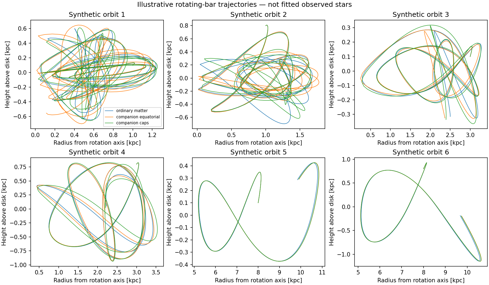

# Rotating-bar orbits for the Milky Way comparison

This calculation turns the earlier three-dimensional force model into an orbital forward operator. It compares the same six illustrative initial states under ordinary matter, a separate halo comparison, and three frozen companion-deposit geometries. It is **not a fit to observed stars**, an equilibrium stellar population, or evidence that photons caused any additional gravity. No held-out stellar velocities were loaded or scored.

In plain language, gravity determines how a star's path bends. It does not give one speed for every star at a given location. The path and its history determine where the star spends time and how fast it passes through a region. The requested comparison between the plane beneath the bulge and stars above/below it therefore needs a population of orbits, not a multiplier applied to every measured speed.

## Shared inputs and known equations

The [field foundation](../bar-field-foundation/report.md) supplies the published bar, stellar disks, gas disks, nuclear stellar components and central black-hole approximation. The halo is added only for its labeled comparison. The companion cases retain the earlier equatorial ring, paired upper/lower rings and shell with the same response amplitude and smoothing. Their placements are proposed synthetic diagnostics; they are not a derived capture distribution or an inferred energy supply.

The bar rotates at an adopted 37.5 km/s/kpc, using the magnitude in the pinned [Hunter24 AGAMA example](https://github.com/GalacticDynamics-Oxford/Agama/blob/f302756b8af2b763db58e278e30478517dc8eea3/py/example_mw_potential_hunter24.py). Positive rotation is prograde in this calculation's right-handed axes; upstream uses a different sign convention. This value is a reference choice, not a unique measured pattern speed. No Sun-to-bar orientation is needed for these synthetic bar-frame initial conditions; a stellar likelihood must apply and vary that orientation consistently.

**Known rotating-frame Hamiltonian mechanics, not a new companion formula:**

\[
H_J=\tfrac12|\mathbf p|^2+\Phi(\mathbf x)-\Omega L_z,
\qquad
\dot{\mathbf x}=\mathbf p-\boldsymbol\Omega\times\mathbf x,
\qquad
\dot{\mathbf p}=-\nabla\Phi-\boldsymbol\Omega\times\mathbf p.
\]

Here p is the inertial velocity expressed in the rotating axes. For a rigidly rotating fixed potential, the Jacobi quantity H_J is conserved, although the star's inertial energy and angular momentum need not be separately conserved. This established result and its derivation are given in [Bovy's galactic-dynamics text](https://galaxiesbook.org/chapters/IV-03.-Hierarchical-Galaxy-Formation_4-Dynamical-processes.html). The source bar and deposits are prescribed test-particle potentials here; their own dynamical backreaction and energy supply are not solved.

Initial radii are 1, 3 and 8 kpc, each at heights 0.1 and 0.8 kpc and bar azimuth 30 degrees. Radial and vertical velocities are 20 km/s; tangential velocity is 0.8 times an initial ordinary-matter circular-speed diagnostic. These choices are not claims that the orbits are circular or in equilibrium. Every model starts with identical positions and velocities. Integration lasts approximately 244 million years, sampled at 501 times. The original settings and acceptance thresholds are in `protocol.json`.

## Numerical checks and recorded repairs

The disk acceleration is differentiated from a single interpolated potential, rather than independently interpolating three force components. This preserves a conservative force within the approximated disk model. An 80-point check against direct order-24 disk evaluations gives a maximum relative force error of **0.000397%** for the finer grid. This validates the interpolation at those points, not the astrophysical disk parameters or uniform accuracy everywhere.

A follow-up direct evaluation at **510 positions sampled from the actual synthetic trajectories**, including radial/height extrema, gives maximum disk-force interpolation error **0.00497%**. This also passes the declared 0.3% interpolation threshold; it is not a check of every internal integration stage. The galpy build emits its previously recorded zero-radius helper warnings; stored field values and these comparisons are finite. The warnings do not constitute a convergence result.

An initial grid beginning at radius 0.05 kpc was too small for a plunging orbit. The replacement covers 0.001–40 kpc and heights -10 to 10 kpc, with proportionally increased radial resolution. Domain departures raise errors rather than extrapolating silently. The initial states and durations were retained.

The first slow ordinary-matter integration missed the declared position/velocity tolerance-comparison gates: changing relative tolerance from 2e-9 to 2e-11 shifted the path by up to 0.0001503 kpc and velocity by 0.03493 km/s. `initial-attempt-results.json` preserves the completed initial results. The slow run was deliberately stopped after this evidence. The same potential is now evaluated using shared Legendre recurrences; equivalence with the original spherical-harmonic calls was tested at 120 points for four coefficient caches, with maximum fractional force difference below 7e-17. This changes the computation, not the physical force law. The revised driver retains the original tolerance comparison and tightens to 2e-13 when a gate fails.

An independent exact harmonic-oscillator orbit, analytically transformed into the rotating coordinates, agrees with the solver to 7.63e-11 kpc and 9.20e-9 km/s. This checks the coordinate and velocity conventions separately from the Milky Way force model.

## Resolution of the gravitational model

The previously failed high-order bar calculation now completes using stable radial integration. On the existing 72 spatial probes:

| Refinement | Maximum change in the component's force | Maximum change relative to the previous total ordinary-matter force |
|---|---:|---:|
| Bar order 40 to 64 | 1.104% | 0.6274% |
| Disk order 24 to 40 | 2.423% | 0.1378% |
| Disk order 40 to 64 | 0.1122% | 0.02994% |

The bar's integrated mass at order 64 is approximately 1.82533e10 solar masses. This is an integral of the chosen published density, not a new observational mass estimate. The bar refinement changes radial and angular resolution together, so its difference does not isolate a single error source. These finite comparisons do not prove continuum convergence. The orbit comparison retains the declared order-40 bar and order-24 disk; its field approximations remain distinct from integration error. Higher-order coefficients are cached with source hashes for subsequent use.

For each of the three fixed deposit geometries, the added force is smaller than the bar order-40-to-64 force change at **2 of the 72 probes**. The smallest signal-to-refinement ratios are 0.83 (equatorial), 0.69 (upper/lower rings) and 0.77 (shell), all at R=5 kpc, z=0.5 kpc on the bar's major axis. This does not make the other probes automatically trustworthy: the finite-order difference is not a rigorous uncertainty bound, and ordinary-matter parameter errors remain. It shows why an apparent small deposit effect must be compared with baseline uncertainty. `effect-resolution.json` records the comparison.

## Orbital results

Thirty synthetic trajectories (six initial states under five potentials) were integrated over approximately 244 million years. The figures below describe these sampled paths; they are not observed stellar velocities, equilibrium population predictions or statistically independent astronomical tests.

| Potential | Largest Jacobi drift / (220 km/s)^2 | Tolerance change: position [kpc] | Tolerance change: velocity [km/s] | Retained relative tolerance | Numerical gates |
|---|---:|---:|---:|---:|---|
| ordinary matter | 1.2e-07 | 1.72e-05 | 0.00746 | 2e-11 | Pass |
| halo comparison | 3.84e-09 | 6.58e-06 | 0.00379 | 2e-13 | Pass |
| companion equatorial | 3.18e-09 | 7.29e-06 | 0.00942 | 2e-13 | Pass |
| companion caps | 3.39e-09 | 1.25e-05 | 0.00776 | 2e-13 | Pass |
| companion shell | 1.47e-07 | 3.56e-05 | 0.00584 | 2e-11 | Pass |

A separate integration in inertial coordinates, transformed back to the bar frame over approximately 49 million years, differs by at most 2.43e-07 kpc. The declared numerical orbit gates pass.

The original tolerance comparisons, any tighter repeats and the initial interrupted attempt are retained. These finite tests measure numerical sensitivity, not rigorous error bounds for every possible orbit.

**Illustration of the proposed height effect: maximum sampled absolute height, in kpc.** These six initial states do not carry weights that represent the Galaxy.

| Initial R [kpc] | Initial z [kpc] | Ordinary matter | Equatorial deposits | Upper/lower deposits | Halo comparison |
|---|---:|---:|---:|---:|---:|
| 1 | 0.1 | 0.6486 | 0.7007 | 0.6584 | 0.4386 |
| 1 | 0.8 | 0.8084 | 0.8083 | 0.8085 | 0.8182 |
| 3 | 0.1 | 0.3261 | 0.3288 | 0.3651 | 0.2492 |
| 3 | 0.8 | 0.9263 | 0.9284 | 0.9363 | 1.0187 |
| 8 | 0.1 | 0.4233 | 0.4251 | 0.4248 | 0.3271 |
| 8 | 0.8 | 1.1424 | 1.1464 | 1.1460 | 0.9094 |

Changing the bar from order 24 to 40 changes a sampled trajectory position by up to 0.07878 kpc, the largest sampled height by up to 0.03089 kpc, and the sampled plane-occupancy fraction by up to 1.6 percentage points. This is field-truncation sensitivity, not a new physical effect or a measurement-error interval.

A different trajectory does not automatically imply that a model better predicts the real bulge. Orbital phases, initial populations, duration, field resolution and selection all matter. Compare distributions under the likelihood contract before interpreting an apparent height or rotation trend as deposited gravity.

## What this enables and what remains

The next observational calculation needs an orbit population with nonnegative weights, declared selection/error handling and controlled complexity. The [likelihood contract](likelihood-contract.md) specifies the probability to predict and preserves the existing 77,927 training, 24,755 validation and 26,090 test assignments. The StarHorse posterior summaries are not an independent likelihood to multiply by the same Gaia parallaxes again.

All five current fields are symmetric above and below the plane. A 48-position reflection check agrees in force to about 1.12e-12 fractionally, so mirrored initial populations produce mirrored orbits. The initial 1e-12 check narrowly failed at this floating-point level; the recorded diagnostic uses a 1e-10 force-roundoff threshold, far tighter than field-model accuracy. This is separate from the unchanged orbit-accuracy gates. A real north/south asymmetry would require asymmetric populations, selection, time evolution or a field asymmetry absent from the present models. Symmetry does not imply that stars in the plane have the same motion distribution as stars away from it.

The potential comparison must propagate ordinary-matter normalization and bar/solar-frame uncertainty. Companion placement and response must follow one declared shared law; independent per-cell corrections would defeat the test. Matching held-out stellar velocity distributions would test that gravitational description, but would still not resolve the photon-scale/gravity-amplitude degeneracy, clock/propagation failures, capture, lensing or the deferred total source budget.

Reproduce the orbit calculation with `python research_work/results/rotating-bar-orbits/run.py`, the independent exact control with `analytic_control.py`, harmonic equivalence with `verify_fast.py`, and the high-order field comparison with `field_refinement.py`. Large potential and trajectory arrays remain in the ignored data cache. Scripts, protocols, numerical results and provenance are tracked. The full research goal remains active.

The scoped `requirements.txt` records the tested Python-package versions. Run `summarize.py` after the orbital calculation to regenerate its report table, `orbit_field_check.py` for the 510-position interpolation test, `symmetry_check.py` for reflection, and `effect_resolution.py` for signal-versus-resolution comparisons. `function_evaluations` in each result lists the initial low-tolerance and retained run counts; it is not a sum over all refinement attempts. `cached_companion.py` is independently checked against the older geometry evaluator and used for the signal-resolution diagnostic; the recorded orbit run used the existing geometry implementation.
