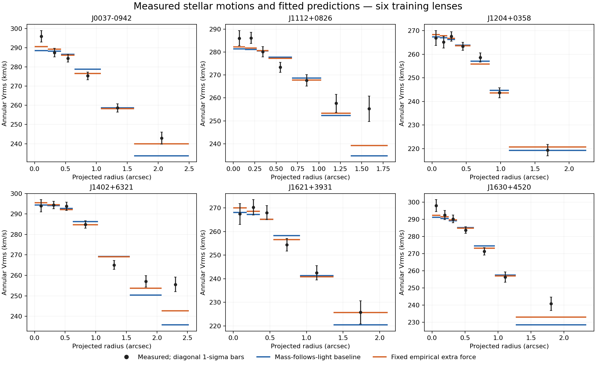

# Wider tangential-orbit bounds: checking the baseline fairly

## Outcome

Allowing beta down to -2 instead of -0.5 removes all four earlier baseline boundary fits. The baseline summed radial chi-square decreases from 170.60 to 152.04; the extra-force total remains 85.87. The extra-force model has a smaller radial discrepancy in five of six galaxies, not all six: the baseline now fits J1204+0358 better.

The lens-angle RMS fractional discrepancy is 13.30% for the baseline and 11.60% for the extra-force branch. These remain descriptive training comparisons, with considerable residuals and no independent stellar-mass or physical companion-source validation. The extra-force advantage is reduced by relaxing the arbitrary boundary but is not removed within this restricted model family.

| Galaxy | Baseline fitted beta | Baseline radial chi-square | Extra-force radial chi-square | Extra-force lens-angle ratio |
|---|---:|---:|---:|---:|
| J0037-0942 | -0.703 | 24.68 | 7.30 | 1.028 |
| J1112+0826 | -0.648 | 47.87 | 33.42 | 0.834 |
| J1204+0358 | -1.016 | 4.49 | 7.17 | 1.032 |
| J1402+6321 | -0.251 | 46.22 | 24.15 | 1.044 |
| J1621+3931 | -0.802 | 5.33 | 3.42 | 0.866 |
| J1630+4520 | -0.089 | 23.45 | 10.40 | 0.823 |

## Controlled change

The common beta range is now [-2,0.45], with starts at -1.5,-0.5,0,0.3 for both force models. All final beta values lie inside these bounds. All six fixed published stellar profiles, covariance matrices, annuli, PSF values, mass bounds, distances, metric assumptions and physical extra-source cutoffs are unchanged. Lens angles are predicted only after fitting the radial kinematics; they do not choose beta.

This is an explicitly motivated diagnostic after seeing earlier boundary failures, not a newly preregistered or untouched model-selection test. The previous fits and failures remain archived. Widening a parameter range and finding an interior optimum does not prove uniqueness, establish an orbital distribution from first principles or calibrate a confidence interval.

## Visual comparison

Black points show the measured radial V_rms. Error bars use covariance diagonal standard deviations for display only; fitting uses the full released within-galaxy covariance. Horizontal colored segments are model predictions averaged over the annulus, not predictions evaluated at the plotted midpoint. Blue is the freely normalized mass-following-light baseline; orange adds the frozen empirical force. Each panel has its own vertical scale. Several outer-bin discrepancies remain clearly visible.

The chart was rendered and visually inspected for labels, legends, bins and data visibility. It is a scientific comparison of exposed training observations, not a simulated success illustration.

## Formula provenance and numerical limits

No physical formula changes in this run. We use the known constant-anisotropy Jeans relation, beta=1-(sigma_theta^2+sigma_phi^2)/(2 sigma_r^2), the existing spherical Abel inverse of the image profiles, and the same conditional extra-force and equal-potential lensing equations. More negative beta permits stronger tangential relative to radial velocity dispersion. These choices describe stellar motions; they do not derive photon conversion or capture.

The radial, angular and Abel quadrature resolutions are doubled at each fitted solution. Maximum relative V_rms change remains below 4.25e-5. All optimizer starts and fixed-parameter refinement results are retained. Integration convergence does not address the physical approximation of spherical, constant-beta systems or prove a nonnegative stable phase-space distribution.

## What remains before a credible joint explanation

The current empirical extra-force shape offers a partial improvement in this six-galaxy training exercise, but does not reproduce every measured radial profile or lens angle. Model and data-systematic uncertainties need to be propagated; a broader orbital/shape model requires independent justification. Ordinary stellar masses still need independent population constraints, and companion deposits must be predicted from a source and capture rule rather than inferred from the gravity being explained.

No reserved validation/test score is opened and none of the six scientific objectives is complete. J1538+5817 remains missing detailed profiles, and J0330-0020 remains excluded by its release flag. Reproduce with run.py followed by plot.py in this directory. The earlier component-model numerical checks remain applicable; this run adds actual fitted-parameter refinement for the wider orbit domain.
