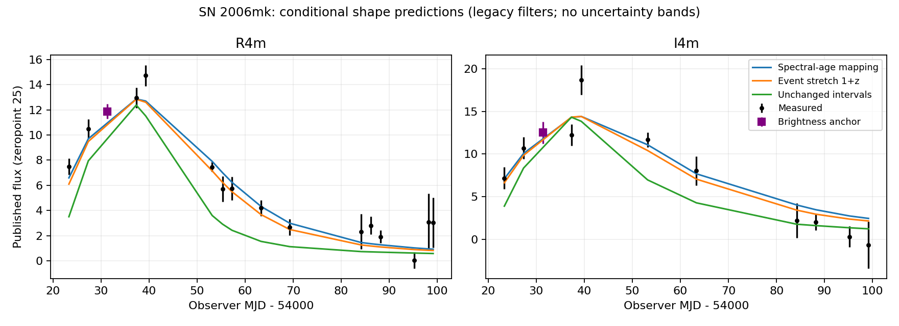

# SN 2006mk: conditional light-curve shape extension

The previous two-epoch pilot is extended to every photometric measurement within the common source support of the three tested time maps. Of 72 input measurements, 27 qualify: one anchor per band and 25 unanchored predictions. All 45 unsupported observations remain explicitly listed in results.json; no early/late spectral extrapolation is invented. This is not a model for the complete 72-point record.

Each band is anchored once at the photometric measurement nearest the first spectrum. That removes absolute luminosity and cross-band normalization as tests. The relative temporal shape remains predicted from the fixed empirical Hsiao history. No individual point, event width, source phase or filter is optimized to the photometric series.

## Results

| Time map | R: conditional chi-square (15 points) | I: conditional chi-square (10 points) | Sum |
| --- | ---: | ---: | ---: |
| Spectral-age mapping | 22.19 | 18.26 | 40.46 |
| Event stretch 1+z | 20.20 | 16.74 | 36.93 |
| Unchanged intervals | 166.01 | 44.04 | 210.05 |

The spectral-age map uses the previously estimated span 20.1 source days over 32.073696 observer days. The 1+z map uses 1.4754, and the unchanged map uses 1. The starting spectral phase is -3.4 in every case. Phase calculations use the actual photometric dates, including their offsets from the spectral midpoint.

The stretched histories remain closer to these data than unchanged intervals under this fixed source and legacy response. The agreement is imperfect. These chi-square values are descriptive conditional scores, not calibrated hypothesis-test statistics: source diversity, spectral-age uncertainty, passband error, dust, shared measurement covariance and cross-band covariance are omitted. Summing two band scores assumes independence apart from each explicitly modeled anchor. No p-values, sigma significance or parameter posteriors are inferred.

## Covariance and formula provenance

If the source predicts temporal ratio r_i relative to anchor a, the prediction is r_i F_a and residual is F_i-r_i F_a. For independent original flux errors, the residual covariance is C_ij=delta_ij sigma_i^2+r_i r_j sigma_a^2. This known error-propagation formula retains the common anchor uncertainty; the anchor itself is not scored as an independent fitted success. The real data can have additional correlations.

The score is residual^T C^(-1) residual. Direct matrix solution agrees with the independent rank-one inverse formula to 1e-8 in all six band/case calculations. Source hashes and exact template-node checks are inherited from the previous audits. A repeated complete calculation reproduces results.json byte for byte. These checks verify computation, not physical correctness.

## Scope and next work

This extension tests temporal shapes at measured redshift. It does not predict that redshift from an independent distance, determine absolute brightness, identify companion conversion, derive the arrival-time map, or solve any deposition/gravity goal. Neither fitting an empirical source nor matching its time scale explains the underlying cause.

The correct release response and a source-population/error model are still needed for a calibrated joint likelihood. The 45 observations outside common source support must eventually enter through a justified early/late-time or baseline model. All six original research objectives remain open.

Inputs: [source pilot](../sn2006mk-source-pilot/report.md), [photometry](../sn2006mk-joint-photometry/report.md), [spectral pair](../spectral-real-pair/report.md).
