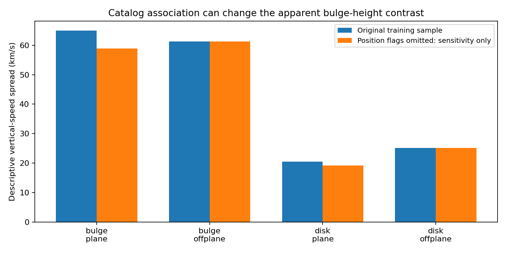

# Bulge comparison: positional-association sensitivity

**The current apparent bulge height contrast is sensitive to suspect catalog associations.** All 140 training matches flagged above 0.5 arcsec by the bounded-epoch screen remain above that threshold when checked against their actual 2MASS observing dates. This is evidence that the position issue is real under the tested astrometric approximation, not proof that every flagged match is wrong.

The observational records agree with the APOGEE coordinates exactly at their stored precision. The issue is therefore not an accidental coordinate change in our prepared join. An individual association still needs photometry, crowding, proper-motion uncertainty and possible multiplicity review. The largest reported 2MASS positional error major axis among the flagged objects is 0.61 arcsec; a fixed 0.5-arcsec threshold is deliberately a review criterion, not a statistical rejection level.

## Why this matters to the gravity hypothesis

The hypothesis proposes extra gravity from deposited companion energy. A mismatched motion can imitate that extra gravity. More subtly, if such matches are common in the crowded plane beneath the bulge but rare above it, they can imitate a height-dependent gravity pattern. We must resolve this before claiming that the pattern reveals where companions deposit.

The table uses the existing training chemistry and approximate distance/motion reconstruction. Speed spreads are descriptive population standard deviations of those reconstructed mean velocities, not intrinsic dispersions, force measurements or uncertainty-corrected likelihood results. The threshold was applied to positions, not chosen to minimize velocity scatter.

| Training region | Stars | Position flags >0.5 arcsec | Original vertical-speed spread (km/s) | Spread if flagged stars are omitted (km/s) |
|---|---:|---:|---:|---:|
| bulge plane | 299 | 54 | 64.97 | 58.83 |
| bulge offplane | 577 | 0 | 61.29 | 61.29 |
| disk plane | 4425 | 28 | 20.56 | 19.21 |
| disk offplane | 11214 | 3 | 25.13 | 25.13 |

The bulge-plane versus off-plane vertical-spread difference changes from approximately +3.68 to -2.46 km/s in this sensitivity experiment. The comparison also mixes different locations and stellar populations. Neither sign identifies a gravity law. No deletion is adopted: the original catalog, distance estimates, roles and earlier scores remain intact. The flagged stars are retained as a separate review list.

Only four of the 54 flagged bulge-plane stars had the previous distance/parallax interval-disagreement flag. The association screen therefore addresses a different issue; it does not resolve all the distance-prior problems. At the same time, an unflagged association is not certified correct, since coincident or blended wrong matches can pass a position screen.

## Known mathematics and assumptions

This uses established constant-proper-motion geometry and constrained least squares, not a new companion formula. Let d be the tangent-plane offset from Gaia to the older position in arcsec and m the proper-motion vector in arcsec/year. The best time offset is

`dt = clip((d dot m)/(m dot m), earliest_epoch - 2016, latest_epoch - 2016)`

and the minimum residual is `|d - dt*m|`. Zero proper motion is handled separately. A spherical-coordinate propagation checks the tangent approximation. We use the full survey interval from 7 June 1997 through 15 February 2001, with the next midnight as an inclusive upper bound. This deliberately permits both hemispheres' full range. APOGEE identifiers that do not encode a 2MASS designation are not assigned this epoch rule and remain unassessed by it.

Of 77,927 training rows, 77,819 have applicable 2MASS identifiers and 108 do not. The 0.5-arcsec screen flags 140 applicable rows, including 35 missed by the previous unlimited-epoch criterion. Allowing arbitrary centuries can falsely reconcile offset positions with measured motion. All 140 exact designation queries returned one record each; their actual-epoch separations range upward from 0.542 arcsec.

Annual parallax, perspective acceleration, nonlinear orbital motion, individual position/proper-motion covariance and probabilistic background-source density are not fitted. These omissions prevent turning residuals into mismatch probabilities. The comparison also does not estimate a complete mismatch rate: the epoch downloads target only the preselected 140 flags.

## Reproduction and next decision

Run `run.py`, `fetch_epochs.py`, `confirm.py`, and `report.py` in that order using the existing local caches. `run.py` checks boundary/interior/zero-motion fixtures, a 1,000-star independent grid comparison and spherical propagation. Input hashes, query text and downloaded-file hashes are recorded. The small exact-epoch responses are archived under `inputs/`; the full training screen stays in the ignored data cache. No validation or test outcome is evaluated here.

The next fit must represent suspect associations and distance-input routes explicitly, or declare a independently specified reliable subset with its selection limitations. Simply dropping the flags and calling the remainder a clean bulge sample would not meet that requirement. The final Cepheid test remains unopened. This audit strengthens the reliability of the testing process; it does not strengthen the physical case for photon conversion by itself.

## Sources

- [2MASS processing documentation](https://irsa.ipac.caltech.edu/data/2MASS/docs/supplementary/final_pipeline/final_proc.html): actual survey date range.
- [2MASS point-source columns](https://irsa.ipac.caltech.edu/data/2MASS/docs/releases/allsky/doc/sec2_2a.html): positions, Julian observing dates and error ellipses.
- [IRSA TAP](https://irsa.ipac.caltech.edu/TAP): exact designation queries, retrieved 10 September 2026; see `download.json`.
- [Prior association audit](../stellar-orbit-support/association-report.md): original four examples and unlimited-epoch screen.
- [Orbital likelihood contract](../rotating-bar-orbits/likelihood-contract.md): unfinished common-potential inference and distance/selection requirements.
